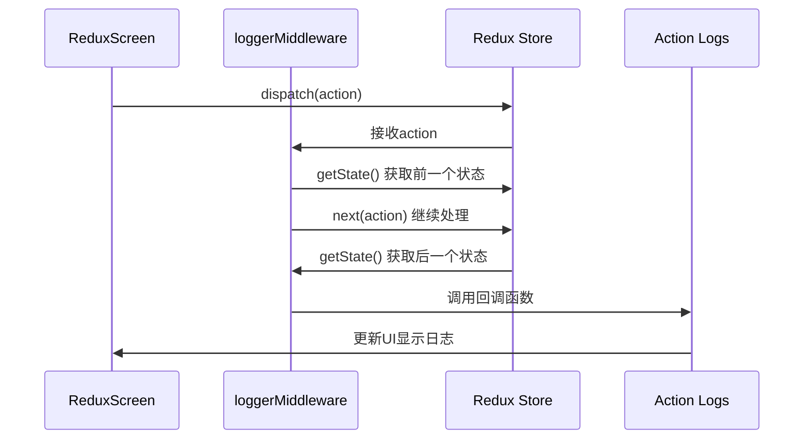
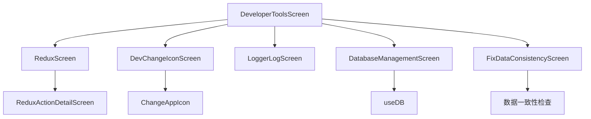

# 调试与性能优化

<cite>
**本文档引用的文件**  
- [logger.ts](file://App/app/logger/logger.ts)
- [logsDB.ts](file://App/app/logger/logsDB.ts)
- [types.ts](file://App/app/logger/types.ts)
- [LoggerLogScreen.tsx](file://App/app/screens/LoggerLogScreen.tsx)
- [logger.ts](file://App/app/redux/middlewares/logger.ts)
- [ReduxScreen.tsx](file://App/app/screens/ReduxScreen.tsx)
- [ReduxActionDetailScreen.tsx](file://App/app/screens/ReduxActionDetailScreen.tsx)
- [DevChangeIconScreen.tsx](file://App/app/screens/DevChangeIconScreen.tsx)
- [ChangeAppIcon.ts](file://App/app/modules/ChangeAppIcon.ts)
- [store.ts](file://App/app/redux/store.ts)
- [slice.ts](file://App/app/features/dev-tools/slice.ts)
- [useLogger.ts](file://App/app/hooks/useLogger.ts)
- [BenchmarkScreen.tsx](file://App/app/screens/dev-tools/BenchmarkScreen.tsx)
- [DatabaseManagementScreen.tsx](file://App/app/screens/DatabaseManagementScreen.tsx)
- [FixDataConsistencyScreen.tsx](file://App/app/screens/FixDataConsistencyScreen.tsx)
- [getGetData.ts](file://packages/data-storage-couchdb/lib/functions/getGetData.ts)
- [getGetDataCount.ts](file://packages/data-storage-couchdb/lib/functions/getGetDataCount.ts)
- [useDB.ts](file://App/app/db/hooks/useDB.ts)
</cite>

## 目录
1. [日志系统](#日志系统)
2. [Redux状态监控](#redux状态监控)
3. [开发者工具界面](#开发者工具界面)
4. [常见问题排查](#常见问题排查)
5. [性能优化技巧](#性能优化技巧)

## 日志系统

本项目内置了功能完善的日志系统，位于`@app/logger`模块中。该系统提供了结构化的日志记录功能，支持多种日志级别，包括`debug`、`info`、`log`、`success`、`warn`和`error`。日志系统不仅会输出到控制台，还会持久化存储到SQLite数据库中，便于后续分析和调试。

日志系统的核心是`logger`函数，它接受日志级别、消息和可选的元数据（如用户、模块、函数名、错误详情等）作为参数。当调用`logger`时，它会根据当前配置的日志级别决定是否记录该日志，并将日志信息插入到SQLite数据库中。日志数据库包含多个表，包括`logs`表存储日志记录，`config`表存储配置信息，以及`logs_level_to_log`表存储当前启用的日志级别。

开发者可以通过`LoggerLogScreen`界面来测试和验证日志功能。该界面提供了一个表单，允许输入消息和参数，并通过按钮触发不同级别的日志记录。这有助于验证日志系统是否正常工作，以及检查日志输出的格式和内容。

**Section sources**
- [logger.ts](file://App/app/logger/logger.ts#L1-L193)
- [logsDB.ts](file://App/app/logger/logsDB.ts#L1-L355)
- [types.ts](file://App/app/logger/types.ts#L1-L22)
- [LoggerLogScreen.tsx](file://App/app/screens/LoggerLogScreen.tsx#L1-L158)

## Redux状态监控

项目集成了Redux中间件来监控状态变化。`@app/redux/middlewares/logger`模块中的`loggerMiddleware`会拦截所有Redux action，并记录action触发前后的状态。该中间件维护了一个回调函数列表，每当有action被分发时，它会调用所有注册的回调函数，传递action、前一个状态和后一个状态作为参数。

`ReduxScreen`界面提供了对Redux状态的可视化监控。该界面显示了当前的全局状态，并允许开发者手动分发action。界面的核心功能是"Action Logs"部分，它会实时显示所有被分发的action及其对状态的影响。每个action日志项都包含action类型和详细信息，点击后可以跳转到`ReduxActionDetailScreen`查看更详细的比较，包括action本身、前一个状态、后一个状态以及状态差异。

`ReduxActionDetailScreen`使用`deep-object-diff`库来计算和显示状态变化的详细差异，这有助于开发者精确地理解某个action如何改变了应用状态。此外，`ReduxScreen`还提供了"Dispatch Action"功能，允许开发者输入JSON格式的action并立即分发，这对于测试和调试非常有用。

**Diagram sources**
- [logger.ts](file://App/app/redux/middlewares/logger.ts#L1-L34)
- [ReduxScreen.tsx](file://App/app/screens/ReduxScreen.tsx#L1-L235)
- [ReduxActionDetailScreen.tsx](file://App/app/screens/ReduxActionDetailScreen.tsx#L1-L74)

## 开发者工具界面

项目提供了多个开发者工具界面，位于`DeveloperToolsScreen`中。这些工具为开发者提供了强大的调试和诊断能力。

`ReduxScreen`如前所述，用于监控和操作Redux状态。`DevChangeIconScreen`允许开发者在运行时更改应用图标，这对于测试不同主题或环境非常有用。该功能通过`ChangeAppIcon`模块实现，该模块封装了`react-native-change-icon`库的调用，并处理了iOS平台的特定路径问题。

`DeveloperToolsScreen`作为入口，列出了所有可用的开发者工具，包括Redux监控、数据管理、PouchDB浏览器、SQLite浏览器、RFID模块测试等。这些工具按功能分组，便于开发者快速找到所需的调试功能。例如，"Data"部分提供了对应用数据模型的浏览和编辑功能，而"DB Sync"部分则用于配置和测试数据库同步。

**Diagram sources**
- [DeveloperToolsScreen.tsx](file://App/app/screens/DeveloperToolsScreen.tsx#L1-L245)
- [DevChangeIconScreen.tsx](file://App/app/screens/DevChangeIconScreen.tsx#L1-L88)
- [ChangeAppIcon.ts](file://App/app/modules/ChangeAppIcon.ts#L1-L33)
- [store.ts](file://App/app/redux/store.ts#L1-L124)
- [slice.ts](file://App/app/features/dev-tools/slice.ts#L1-L55)

## 常见问题排查

### 数据同步失败
当遇到数据同步失败时，首先应检查网络连接和服务器配置。可以通过`DBSyncScreen`验证服务器列表和配置。如果问题持续存在，应检查日志系统中的相关错误信息。使用`getGetData`和`getGetDataCount`函数时，确保查询条件和索引配置正确。有时需要重置数据库索引，这可以在`DatabaseManagementScreen`中完成。

### RFID读取异常
RFID读取问题通常与硬件连接或驱动程序有关。首先确认设备已正确连接并被系统识别。检查`RFIDUHFModuleScreen`中的日志输出，查看是否有底层通信错误。如果使用BLE连接，确保蓝牙已开启且设备在范围内。对于串口连接，检查波特率和数据位设置是否正确。

### UI渲染卡顿
UI卡顿通常由不必要的重新渲染引起。使用React DevTools检查组件树，识别哪些组件在状态未改变时仍被重新渲染。确保使用`useMemo`和`useCallback`来缓存计算结果和函数引用。对于列表渲染，使用`FlatList`并确保`keyExtractor`提供稳定的key。检查是否有昂贵的同步操作在渲染过程中执行。

**Section sources**
- [FixDataConsistencyScreen.tsx](file://App/app/screens/FixDataConsistencyScreen.tsx#L170-L575)
- [DatabaseManagementScreen.tsx](file://App/app/screens/DatabaseManagementScreen.tsx#L34-L75)
- [getGetData.ts](file://packages/data-storage-couchdb/lib/functions/getGetData.ts#L206-L305)
- [getGetDataCount.ts](file://packages/data-storage-couchdb/lib/functions/getGetDataCount.ts#L130-L177)

## 性能优化技巧

### 减少不必要的重新渲染
使用`React.memo`包装纯展示组件，避免在props未改变时重新渲染。对于函数组件，使用`useMemo`缓存计算密集型结果，使用`useCallback`缓存函数引用，防止子组件因函数引用改变而重新渲染。在Redux应用中，使用`useAppSelector`的第二个参数来优化选择器，避免浅比较导致的不必要更新。

### 优化数据库查询
数据库查询是性能瓶颈的常见来源。确保为常用查询条件创建适当的索引。在`getGetData`函数中，可以看到查询计划的生成和索引的自动创建。使用`explain`功能分析查询性能，识别全表扫描等低效操作。对于大量数据的查询，使用分页和懒加载，避免一次性加载过多数据。

### 管理内存使用
合理管理内存使用对于移动应用至关重要。使用`useDB`钩子时，确保在组件卸载时清理数据库监听器。对于大对象或缓存数据，实现适当的清理策略。使用`BenchmarkScreen`来测量关键操作的性能，识别内存泄漏或性能下降的模式。定期检查应用的内存占用，特别是在长时间运行后。

**Section sources**
- [useLogger.ts](file://App/app/hooks/useLogger.ts#L1-L29)
- [BenchmarkScreen.tsx](file://App/app/screens/dev-tools/BenchmarkScreen.tsx#L99-L140)
- [useDB.ts](file://App/app/db/hooks/useDB.ts#L1-L3)
- [getGetData.ts](file://packages/data-storage-couchdb/lib/functions/getGetData.ts#L206-L305)