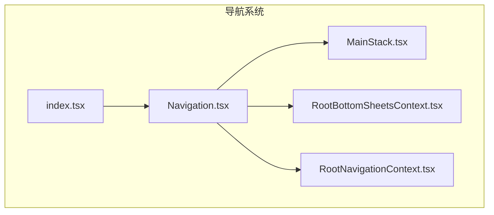
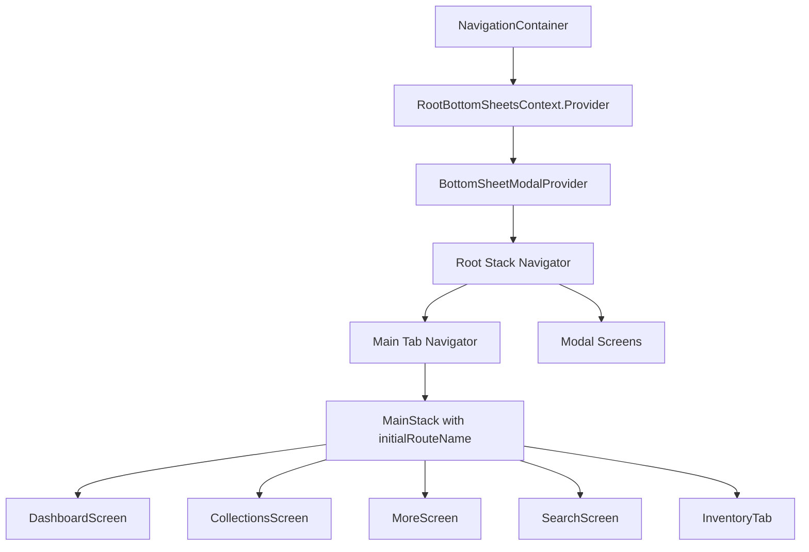
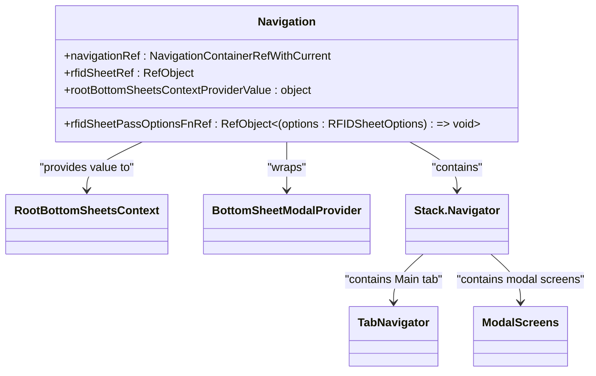
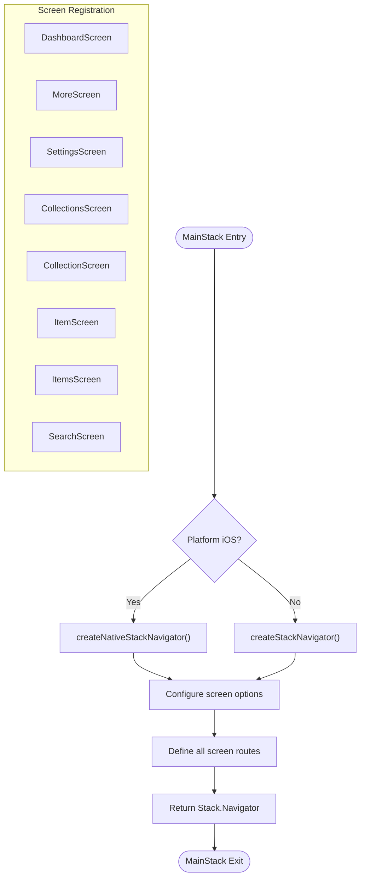
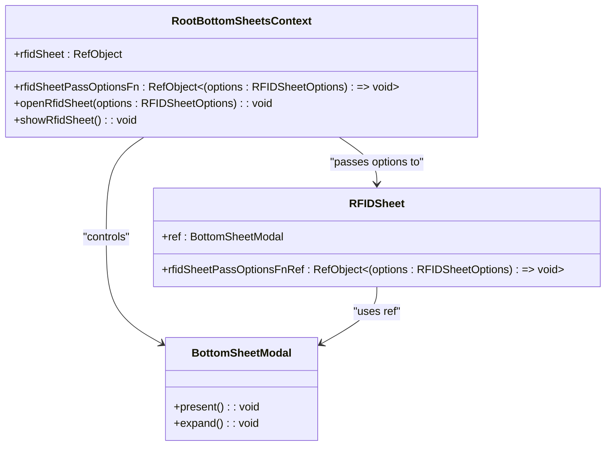
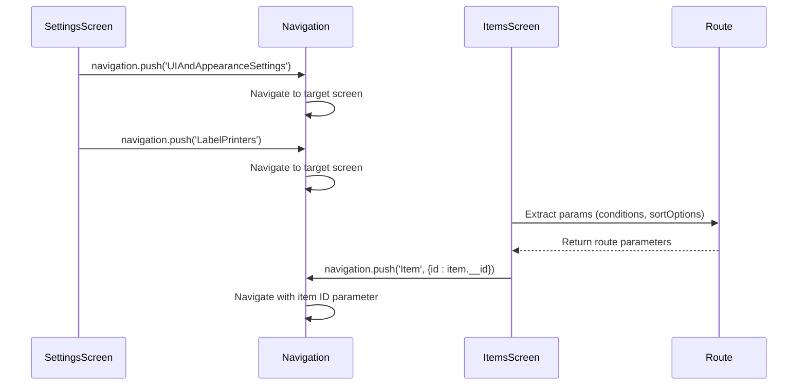

# 导航系统

<cite>
**本文档中引用的文件**  
- [Navigation.tsx](file://App/app/navigation/Navigation.tsx)
- [MainStack.tsx](file://App/app/navigation/MainStack.tsx)
- [RootBottomSheetsContext.tsx](file://App/app/navigation/RootBottomSheetsContext.tsx)
- [RootNavigationContext.tsx](file://App/app/navigation/RootNavigationContext.tsx)
- [SettingsScreen.tsx](file://App/app/screens/SettingsScreen.tsx)
- [ItemsScreen.tsx](file://App/app/features/inventory/screens/ItemsScreen.tsx)
- [index.tsx](file://App/app/navigation/index.tsx)
</cite>

## 目录
1. [简介](#简介)
2. [项目结构](#项目结构)
3. [核心组件](#核心组件)
4. [架构概述](#架构概述)
5. [详细组件分析](#详细组件分析)
6. [依赖分析](#依赖分析)
7. [性能考虑](#性能考虑)
8. [故障排除指南](#故障排除指南)
9. [结论](#结论)

## 简介
本文档全面介绍了基于 react-navigation 库实现的导航系统。文档详细解释了 Navigation.tsx 中导航容器的配置和 RootBottomSheetsContext 对底部工作表的支持，描述了 MainStack.tsx 中定义的堆栈导航结构，包括各个屏幕的注册方式和路由参数传递机制。同时说明了模态屏幕（如 ModalScreen）和底部工作表（BottomSheet）的实现模式及其在用户体验中的作用。结合 ItemsScreen 和 SettingsScreen 等实际页面，展示了导航跳转、参数传递和返回处理的代码示例，并讨论了导航状态管理和深链接配置。

## 项目结构
导航系统位于 App/app/navigation 目录下，包含多个核心文件，共同构建了应用的导航架构。该系统采用分层设计，将根导航容器、堆栈导航器、底部工作表上下文和根导航上下文分离，实现了清晰的关注点分离。



**图源**
- [Navigation.tsx](file://App/app/navigation/Navigation.tsx)
- [MainStack.tsx](file://App/app/navigation/MainStack.tsx)
- [RootBottomSheetsContext.tsx](file://App/app/navigation/RootBottomSheetsContext.tsx)
- [RootNavigationContext.tsx](file://App/app/navigation/RootNavigationContext.tsx)
- [index.tsx](file://App/app/navigation/index.tsx)

**章节源**
- [Navigation.tsx](file://App/app/navigation/Navigation.tsx)
- [MainStack.tsx](file://App/app/navigation/MainStack.tsx)

## 核心组件
导航系统的核心组件包括 Navigation.tsx 中的根导航容器、MainStack.tsx 中的堆栈导航器、RootBottomSheetsContext.tsx 中的底部工作表上下文以及 RootNavigationContext.tsx 中的根导航上下文。这些组件协同工作，为应用提供了完整的导航功能。

**章节源**
- [Navigation.tsx](file://App/app/navigation/Navigation.tsx#L1-L1023)
- [MainStack.tsx](file://App/app/navigation/MainStack.tsx#L1-L361)
- [RootBottomSheetsContext.tsx](file://App/app/navigation/RootBottomSheetsContext.tsx#L1-L26)
- [RootNavigationContext.tsx](file://App/app/navigation/RootNavigationContext.tsx#L1-L18)

## 架构概述
导航系统采用多层架构设计，以 Navigation.tsx 作为根容器，内部嵌套了堆栈导航器和底部工作表提供者。MainStack.tsx 定义了应用内部的堆栈导航结构，而 RootBottomSheetsContext 提供了对底部工作表的全局访问能力。



**图源**
- [Navigation.tsx](file://App/app/navigation/Navigation.tsx#L336-L508)
- [MainStack.tsx](file://App/app/navigation/MainStack.tsx#L237-L356)

## 详细组件分析

### Navigation.tsx 分析
Navigation.tsx 文件实现了应用的根导航容器，使用 NavigationContainer 包装整个导航系统，并配置了主题。它还集成了 BottomSheetModalProvider 来支持底部工作表，并定义了根堆栈导航器，其中包含主标签导航器和各种模态屏幕。



**图源**
- [Navigation.tsx](file://App/app/navigation/Navigation.tsx#L269-L508)

**章节源**
- [Navigation.tsx](file://App/app/navigation/Navigation.tsx#L1-L1023)

### MainStack.tsx 分析
MainStack.tsx 文件定义了应用内部的堆栈导航结构，使用 createNativeStackNavigator（iOS）或 createStackNavigator（Android）创建堆栈导航器。它注册了所有主要屏幕组件，并为不同平台配置了适当的屏幕选项。



**图源**
- [MainStack.tsx](file://App/app/navigation/MainStack.tsx#L190-L356)

**章节源**
- [MainStack.tsx](file://App/app/navigation/MainStack.tsx#L1-L361)

### RootBottomSheetsContext 分析
RootBottomSheetsContext 提供了一个 React 上下文，用于在应用的任何位置访问和控制 RFID 底部工作表。它封装了对底部工作表的引用和操作函数，实现了全局可访问的底部工作表功能。



**图源**
- [RootBottomSheetsContext.tsx](file://App/app/navigation/RootBottomSheetsContext.tsx#L7-L19)
- [Navigation.tsx](file://App/app/navigation/Navigation.tsx#L293-L318)

**章节源**
- [RootBottomSheetsContext.tsx](file://App/app/navigation/RootBottomSheetsContext.tsx#L1-L26)

### 实际页面导航分析
通过分析 SettingsScreen 和 ItemsScreen，可以了解导航系统的实际使用方式。SettingsScreen 展示了简单的导航跳转，而 ItemsScreen 展示了复杂的参数传递机制。



**图源**
- [SettingsScreen.tsx](file://App/app/screens/SettingsScreen.tsx#L13-L67)
- [ItemsScreen.tsx](file://App/app/features/inventory/screens/ItemsScreen.tsx#L32-L157)

**章节源**
- [SettingsScreen.tsx](file://App/app/screens/SettingsScreen.tsx#L1-L68)
- [ItemsScreen.tsx](file://App/app/features/inventory/screens/ItemsScreen.tsx#L1-L158)

## 依赖分析
导航系统依赖于多个第三方库和内部模块，形成了复杂的依赖关系网络。

```mermaid
graph TD
A[react-navigation] --> B[@react-navigation/native]
A --> C[@react-navigation/stack]
A --> D[@react-navigation/bottom-tabs]
B --> E[react-native-safe-area-context]
C --> F[@react-native-screens]
D --> G[@react-native-community/blur]
H[@gorhom/bottom-sheet] --> I[react-native-gesture-handler]
I --> J[react-native-reanimated]
K[Navigation.tsx] --> L[MainStack.tsx]
K --> M[RootBottomSheetsContext.tsx]
K --> N[RootNavigationContext.tsx]
O[MainStack.tsx] --> P[Screen Components]
Q[RootBottomSheetsContext.tsx] --> R[RFIDSheet]
```

**图源**
- [Navigation.tsx](file://App/app/navigation/Navigation.tsx#L1-L30)
- [MainStack.tsx](file://App/app/navigation/MainStack.tsx#L1-L8)
- [package.json](file://package.json)

**章节源**
- [Navigation.tsx](file://App/app/navigation/Navigation.tsx#L1-L1023)
- [MainStack.tsx](file://App/app/navigation/MainStack.tsx#L1-L361)

## 性能考虑
导航系统在性能方面进行了多项优化，包括使用 useMemo 缓存计算值、合理配置屏幕选项以减少重渲染，以及在 Android 上禁用模态手势以避免与 ScrollView 冲突。

**章节源**
- [Navigation.tsx](file://App/app/navigation/Navigation.tsx#L281-L291)
- [MainStack.tsx](file://App/app/navigation/MainStack.tsx#L220-L234)

## 故障排除指南
当遇到导航相关问题时，可以检查以下常见问题：确保 NavigationContainer 在应用根部正确渲染，验证屏幕名称是否与注册名称完全匹配，检查路由参数类型是否与定义的参数列表一致，以及确认底部工作表引用是否正确传递。

**章节源**
- [Navigation.tsx](file://App/app/navigation/Navigation.tsx#L336-L508)
- [MainStack.tsx](file://App/app/navigation/MainStack.tsx#L237-L356)

## 结论
本文档详细分析了基于 react-navigation 的导航系统实现。该系统采用分层架构设计，将根导航容器、堆栈导航器和上下文管理分离，实现了清晰的关注点分离。通过 RootBottomSheetsContext，系统提供了对底部工作表的全局访问能力，增强了用户体验。MainStack.tsx 定义了应用内部的导航结构，支持复杂的参数传递机制。整体设计考虑了性能优化和跨平台兼容性，为应用提供了稳定可靠的导航基础。