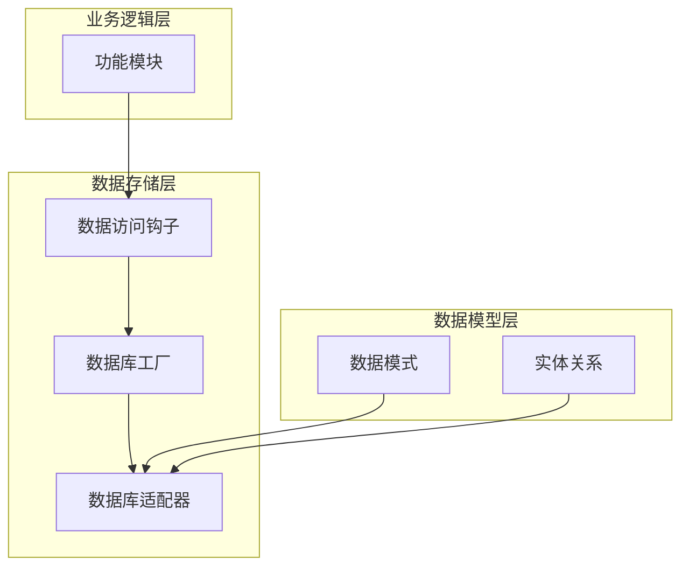
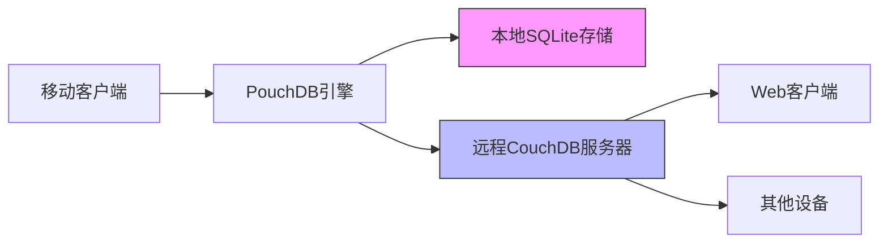
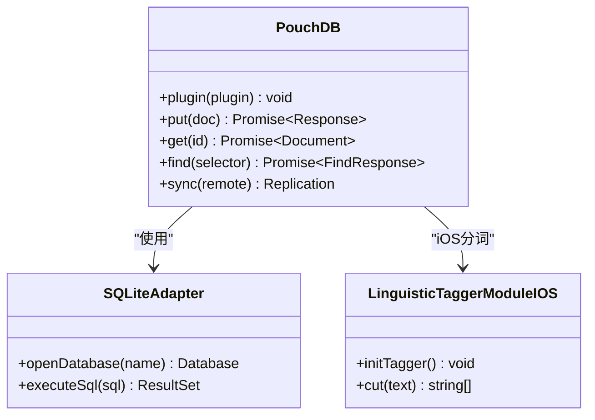
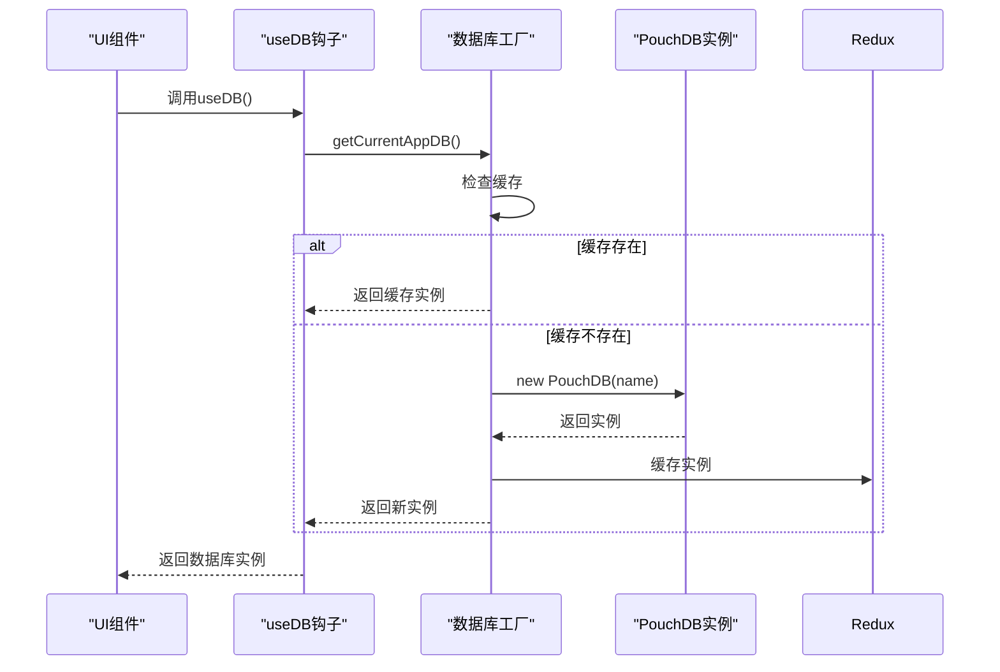
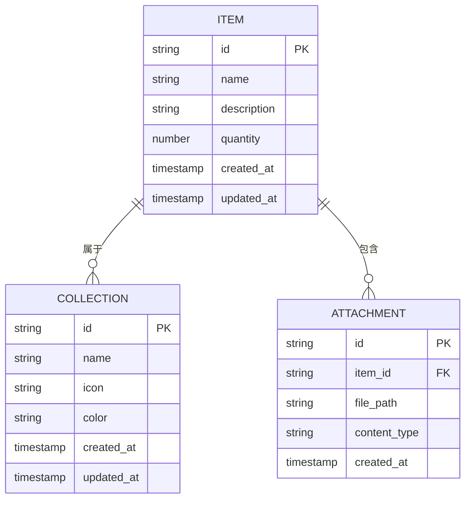
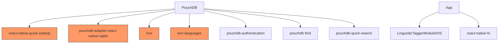

# 数据存储

<cite>
**本文档中引用的文件**  
- [index.ts](file://App/app/db/index.ts)
- [pouchdb.ts](file://App/app/db/pouchdb.ts)
- [sqlite.ts](file://App/app/db/sqlite.ts)
- [useDB.ts](file://App/app/db/hooks/useDB.ts)
- [app_db/index.ts](file://App/app/db/app_db/index.ts)
- [schema.ts](file://Data/lib/schema.ts)
- [relations.ts](file://Data/lib/relations.ts)
- [CouchDBData.ts](file://packages/data-storage-couchdb/lib/CouchDBData.ts)
- [getSaveDatum.ts](file://packages/data-storage-couchdb/lib/functions/getSaveDatum.ts)
- [getGetData.ts](file://packages/data-storage-couchdb/lib/functions/getGetData.ts)
- [couchdb-utils.ts](file://packages/data-storage-couchdb/lib/functions/couchdb-utils.ts)
- [DevDataMigrationScreen.tsx](file://App/app/screens/dev-tools/data/DevDataMigrationScreen.tsx)
</cite>

## 目录
1. [简介](#简介)
2. [项目结构](#项目结构)
3. [核心组件](#核心组件)
4. [架构概述](#架构概述)
5. [详细组件分析](#详细组件分析)
6. [依赖分析](#依赖分析)
7. [性能考虑](#性能考虑)
8. [故障排除指南](#故障排除指南)
9. [结论](#结论)

## 简介
本文档详细阐述了库存管理应用的数据存储层实现，重点分析PouchDB和SQLite两种数据库适配器的机制。文档解释了数据库工厂模式的设计原理，如何根据环境选择合适的适配器，以及PouchDB与CouchDB服务器的同步机制。同时，文档还深入探讨了SQLite本地数据库的初始化流程、查询性能优化策略，以及数据模型的定义方式、实体关系和索引设计。

## 项目结构
项目采用分层架构设计，将数据存储相关的代码组织在`App/app/db`目录下。该目录包含PouchDB和SQLite适配器的具体实现，以及数据库工厂模式的封装。数据模型定义位于`Data/lib`目录下，通过`schema.ts`和`relations.ts`文件管理实体结构和关系。应用通过`useDB`钩子函数访问数据库实例，实现了数据访问的抽象化。

**图表来源**  
- [index.ts](file://App/app/db/index.ts)
- [schema.ts](file://Data/lib/schema.ts)

**章节来源**  
- [index.ts](file://App/app/db/index.ts)
- [schema.ts](file://Data/lib/schema.ts)

## 核心组件
数据存储层的核心组件包括PouchDB适配器、SQLite适配器、数据库工厂模式和数据访问钩子。PouchDB适配器基于React Native SQLite实现了跨平台的本地数据库存储，同时支持与远程CouchDB服务器的双向同步。SQLite适配器提供了对本地SQLite数据库文件的直接操作能力，包括数据库文件的枚举和删除功能。数据库工厂模式通过`getPouchDBDatabase`函数创建和管理数据库实例，而数据访问钩子`useDB`则为上层组件提供了便捷的数据访问接口。

**章节来源**  
- [pouchdb.ts](file://App/app/db/pouchdb.ts)
- [sqlite.ts](file://App/app/db/sqlite.ts)
- [useDB.ts](file://App/app/db/hooks/useDB.ts)

## 架构概述
系统的数据存储架构采用混合存储策略，结合了PouchDB的同步能力和SQLite的本地性能优势。PouchDB作为主要的数据库引擎，通过React Native SQLite适配器在本地存储数据，同时能够与远程CouchDB服务器进行数据同步。这种架构既保证了离线使用的可靠性，又实现了多设备间的数据一致性。数据访问层通过Redux状态管理缓存数据库实例，避免了重复创建数据库连接的开销。

**图表来源**  
- [pouchdb.ts](file://App/app/db/pouchdb.ts)
- [CouchDBData.ts](file://packages/data-storage-couchdb/lib/CouchDBData.ts)

## 详细组件分析

### PouchDB适配器分析
PouchDB适配器是数据存储层的核心，它基于`pouchdb-adapter-react-native-sqlite`实现了React Native环境下的本地存储。适配器在初始化时会加载多个PouchDB插件，包括认证、查询和全文搜索功能。特别的是，适配器针对iOS平台集成了LinguisticTaggerModuleIOS进行中文分词，提升了中文搜索的准确性。

**图表来源**  
- [pouchdb.ts](file://App/app/db/pouchdb.ts)
- [couchdb-utils.ts](file://packages/data-storage-couchdb/lib/functions/couchdb-utils.ts)

### 数据库工厂模式分析
数据库工厂模式通过`getPouchDBDatabase`函数实现，该函数封装了数据库实例的创建过程。工厂模式的主要优势在于它能够统一管理数据库的配置和初始化过程，确保所有数据库实例都使用相同的适配器和插件配置。这种设计模式提高了代码的可维护性，使得数据库配置的修改只需要在单一位置进行。

**图表来源**  
- [app_db/index.ts](file://App/app/db/app_db/index.ts)
- [useDB.ts](file://App/app/db/hooks/useDB.ts)

### 数据模型定义分析
数据模型通过`schema.ts`和`relations.ts`文件定义，采用TypeScript接口描述实体的结构和约束。每个数据类型都有对应的Zod验证模式，确保数据的完整性和一致性。实体关系通过外键和引用定义，支持复杂的数据查询和关联操作。索引设计基于查询模式自动生成，优化了常见查询的性能。

**图表来源**  
- [schema.ts](file://Data/lib/schema.ts)
- [relations.ts](file://Data/lib/relations.ts)

## 依赖分析
数据存储层依赖于多个第三方库和本地模块。PouchDB依赖于`react-native-quick-websql`提供SQLite支持，`pouchdb-adapter-react-native-sqlite`作为适配器，以及`lunr`和`lunr-languages`提供全文搜索功能。本地依赖包括`LinguisticTaggerModuleIOS`用于iOS平台的中文分词，`react-native-fs`用于文件系统操作。这些依赖关系通过npm包管理和React Native的原生模块系统进行集成。

**图表来源**  
- [pouchdb.ts](file://App/app/db/pouchdb.ts)
- [sqlite.ts](file://App/app/db/sqlite.ts)

**章节来源**  
- [pouchdb.ts](file://App/app/db/pouchdb.ts)
- [sqlite.ts](file://App/app/db/sqlite.ts)

## 性能考虑
数据存储层在性能方面进行了多项优化。首先，通过Redux状态管理缓存数据库实例，避免了重复创建数据库连接的开销。其次，查询操作使用PouchDB的`find`方法配合索引，确保查询效率。对于大数据量的同步操作，系统实现了分页和增量同步机制，减少内存占用和网络传输。此外，中文搜索通过预处理和分词优化，提高了搜索响应速度。

## 故障排除指南
当遇到数据库相关问题时，可以按照以下步骤进行排查：首先检查数据库文件是否存在且可访问，使用`getSqliteDbNames`函数列出所有数据库文件。其次，验证PouchDB实例是否正确初始化，检查控制台日志中的错误信息。对于同步问题，确认网络连接和认证信息是否正确。在开发环境中，可以使用`DevDataMigrationScreen`进行数据库迁移和数据一致性检查。

**章节来源**  
- [sqlite.ts](file://App/app/db/sqlite.ts)
- [DevDataMigrationScreen.tsx](file://App/app/screens/dev-tools/data/DevDataMigrationScreen.tsx)

## 结论
本库存管理应用的数据存储层设计合理，结合了PouchDB的同步能力和SQLite的本地性能优势。通过数据库工厂模式和数据访问钩子，实现了数据访问的抽象化和复用。数据模型定义清晰，支持复杂的查询和关联操作。整体架构既保证了离线使用的可靠性，又实现了多设备间的数据一致性，为应用的稳定运行提供了坚实的基础。