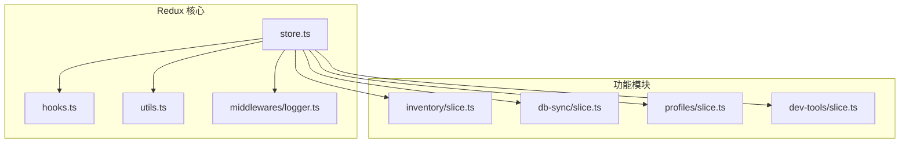
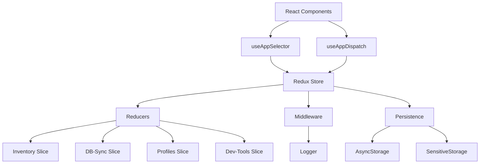
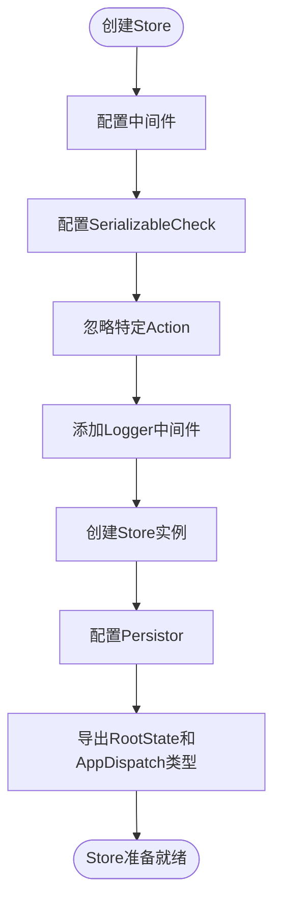
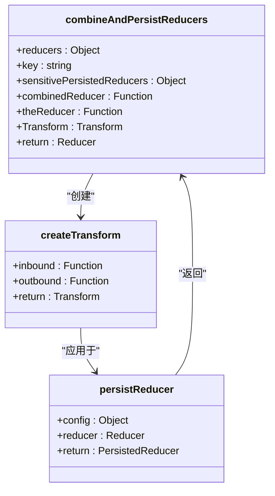
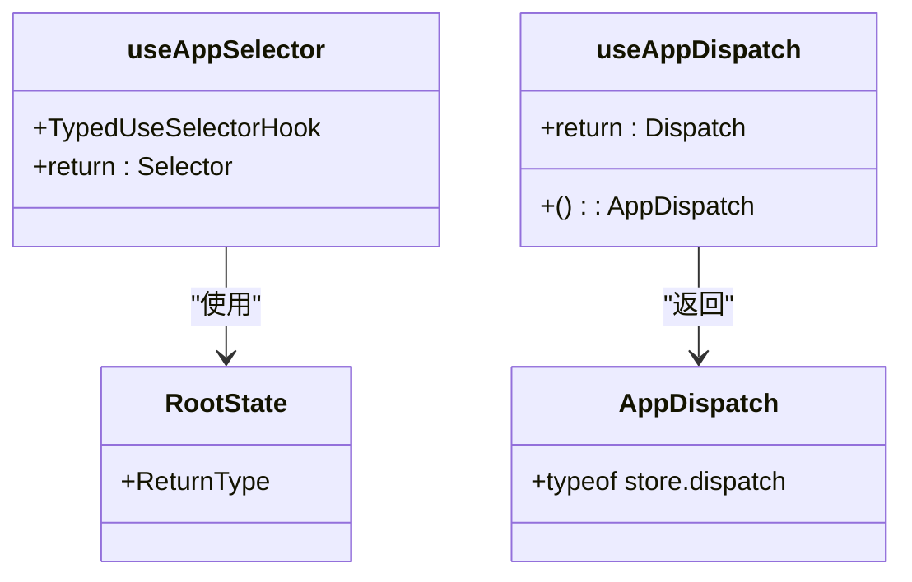
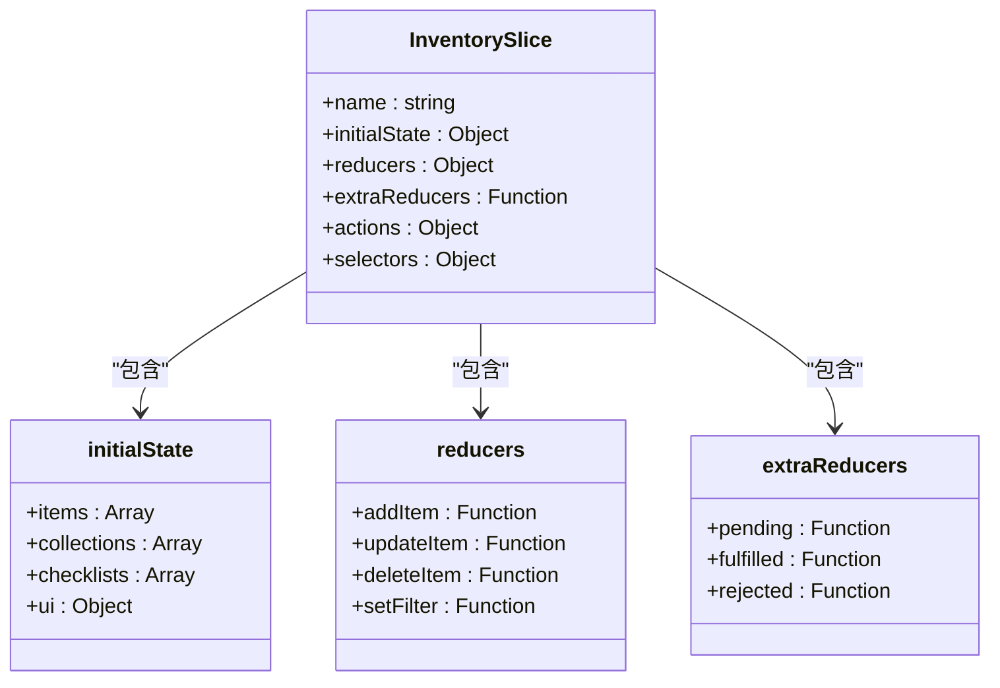
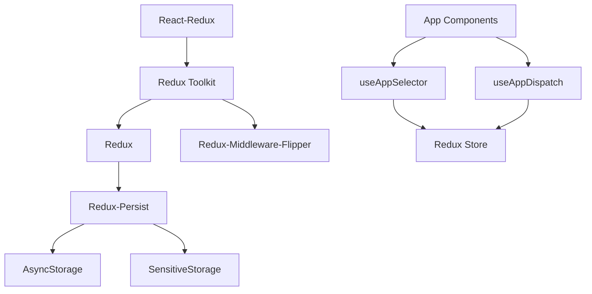

# 状态管理

<cite>
**本文档中引用的文件**  
- [store.ts](file://App/app/redux/store.ts)
- [hooks.ts](file://App/app/redux/hooks.ts)
- [utils.ts](file://App/app/redux/utils.ts)
- [slice.ts](file://App/app/features/inventory/slice.ts)
- [slice.ts](file://App/app/features/db-sync/slice.ts)
- [slice.ts](file://App/app/features/profiles/slice.ts)
- [logger.ts](file://App/app/redux/middlewares/logger.ts)
</cite>

## 目录
1. [简介](#简介)
2. [项目结构](#项目结构)
3. [核心组件](#核心组件)
4. [架构概述](#架构概述)
5. [详细组件分析](#详细组件分析)
6. [依赖分析](#依赖分析)
7. [性能考虑](#性能考虑)
8. [故障排除指南](#故障排除指南)
9. [结论](#结论)

## 简介
本文档详细介绍了本项目中基于Redux Toolkit的状态管理实现。文档涵盖了store的配置、中间件集成、持久化设置、slice结构、自定义Hook封装以及实际功能模块中的状态管理应用。通过深入分析代码实现，为开发者提供全面的状态管理指导。

## 项目结构
项目中的状态管理相关文件组织在`App/app/redux`目录下，采用模块化设计，将核心逻辑与功能模块分离。

**Diagram sources**
- [store.ts](file://App/app/redux/store.ts#L1-L124)
- [inventory/slice.ts](file://App/app/features/inventory/slice.ts)
- [db-sync/slice.ts](file://App/app/features/db-sync/slice.ts)

## 核心组件
本项目的核心状态管理组件包括store配置、持久化机制、自定义Hook封装和模块化slice设计。这些组件共同构成了一个可扩展、可维护的状态管理架构。

**Section sources**
- [store.ts](file://App/app/redux/store.ts#L1-L124)
- [hooks.ts](file://App/app/redux/hooks.ts#L1-L8)
- [utils.ts](file://App/app/redux/utils.ts#L1-L375)

## 架构概述
本项目采用Redux Toolkit作为状态管理解决方案，结合redux-persist实现状态持久化，并通过模块化设计组织各个功能域的状态逻辑。

**Diagram sources**
- [store.ts](file://App/app/redux/store.ts#L84-L112)
- [hooks.ts](file://App/app/redux/hooks.ts#L6-L7)
- [utils.ts](file://App/app/redux/utils.ts#L110-L251)

## 详细组件分析

### Store配置分析
Store的配置采用了标准的Redux Toolkit模式，同时集成了持久化和日志记录功能。

**Diagram sources**
- [store.ts](file://App/app/redux/store.ts#L84-L112)
- [store.ts](file://App/app/redux/store.ts#L117-L118)

### 持久化机制分析
持久化机制通过`combineAndPersistReducers`工具函数实现，支持普通存储和敏感数据存储。

**Diagram sources**
- [utils.ts](file://App/app/redux/utils.ts#L110-L251)
- [utils.ts](file://App/app/redux/utils.ts#L205-L250)

### 自定义Hook分析
自定义Hook封装了标准的Redux Hook，提供了类型安全的使用方式。

**Diagram sources**
- [hooks.ts](file://App/app/redux/hooks.ts#L1-L8)
- [store.ts](file://App/app/redux/store.ts#L117-L118)

### Slice模块分析
Slice模块采用标准的Redux Toolkit模式，每个功能域都有独立的slice文件。

#### Inventory Slice结构

**Diagram sources**
- [slice.ts](file://App/app/features/inventory/slice.ts)
- [slice.ts](file://App/app/features/db-sync/slice.ts)

## 依赖分析
状态管理系统的依赖关系清晰，核心组件与功能模块之间通过明确的接口进行通信。

**Diagram sources**
- [store.ts](file://App/app/redux/store.ts#L1-L2)
- [utils.ts](file://App/app/redux/utils.ts#L14-L15)
- [hooks.ts](file://App/app/redux/hooks.ts#L1)

## 性能考虑
本项目在状态管理方面采取了多项性能优化措施：

1. **选择性持久化**：通过`serializableCheck`配置，忽略特定的action和路径，减少序列化开销
2. **智能合并**：使用`autoMergeDeep`策略，只在必要时进行状态合并
3. **缓存过滤**：通过`filterOutCacheFromState`函数过滤掉缓存数据，减少持久化数据量
4. **分模块加载**：将状态逻辑按功能域拆分，避免单一庞大的reducer

这些优化措施确保了状态管理在大型应用中的高效运行。

## 故障排除指南
### 常见问题及解决方案

**问题1：状态未正确持久化**
- 检查`serializableCheck`配置中的`ignoredActions`是否包含必要的action类型
- 确认reducer是否实现了`dehydrate`和`rehydrate`方法
- 检查存储配置的`key`是否唯一

**问题2：敏感数据未加密存储**
- 确认reducer是否实现了`dehydrateSensitive`和`rehydrateSensitive`方法
- 检查`sensitiveStorage`配置是否正确
- 验证`SENSITIVE_STORAGE_CONFIG`中的`keychainService`和`sharedPreferencesName`

**问题3：类型错误**
- 确保`RootState`和`AppDispatch`类型从store正确导出
- 检查自定义Hook的类型定义是否正确
- 验证slice中action和selector的类型一致性

**问题4：状态合并问题**
- 检查`autoMergeDeep`策略是否正确处理嵌套对象
- 确认`deepMerge`函数是否正确处理各种数据类型
- 验证`isPlainEnoughObject`判断条件是否满足需求

**Section sources**
- [store.ts](file://App/app/redux/store.ts#L87-L95)
- [utils.ts](file://App/app/redux/utils.ts#L59-L104)
- [utils.ts](file://App/app/redux/utils.ts#L367-L374)

## 结论
本项目的状态管理架构基于Redux Toolkit构建，具有良好的可扩展性和可维护性。通过模块化设计、类型安全的API和完善的持久化机制，为复杂的应用状态管理提供了可靠的解决方案。建议新功能开发时遵循现有的slice模式，保持架构的一致性。