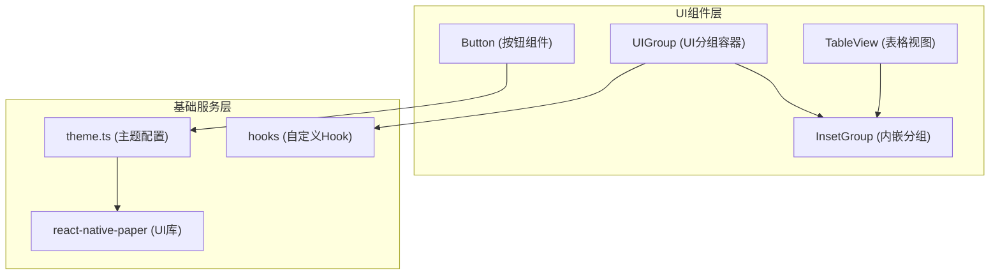
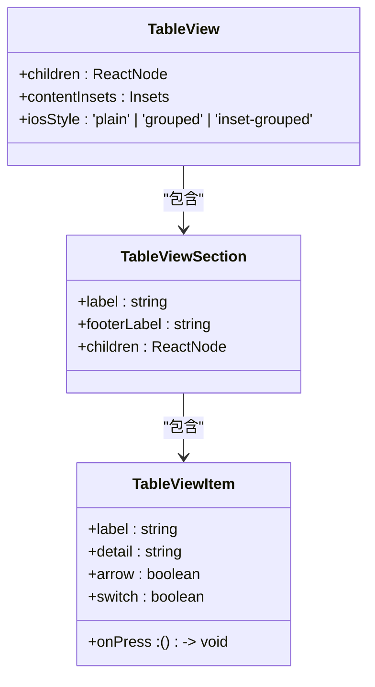
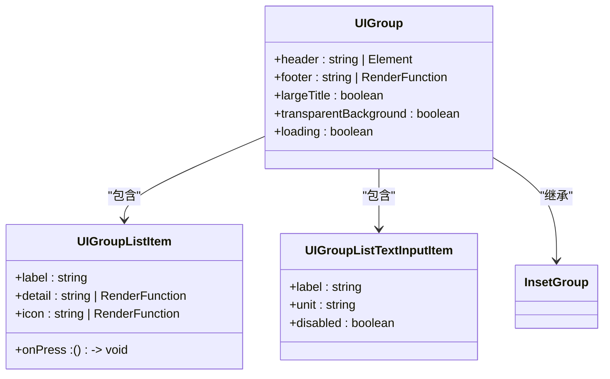

# 组件架构

<cite>
**本文档中引用的文件**  
- [theme.ts](file://App/app/theme.ts)
- [App.tsx](file://App/app/App.tsx)
- [Button.tsx](file://App/app/components/Button/Button.tsx)
- [TableView.tsx](file://App/app/components/TableView/TableView.tsx)
- [UIGroup.tsx](file://App/app/components/UIGroup/UIGroup.tsx)
- [types.ts](file://App/app/components/UIGroup/types.ts)
- [hooks.ts](file://App/app/components/UIGroup/hooks.ts)
</cite>

## 目录
1. [项目结构](#项目结构)
2. [主题系统设计](#主题系统设计)
3. [核心UI组件分析](#核心ui组件分析)
4. [组件分层与响应式设计](#组件分层与响应式设计)
5. [可访问性与测试策略](#可访问性与测试策略)
6. [性能优化建议](#性能优化建议)

## 项目结构

该项目采用模块化组件架构，将UI组件集中存放在`App/app/components`目录下。主要组件包括Button、TableView、UIGroup等可复用元素，每个组件都有独立的`.tsx`实现文件和配套的stories测试文件。项目使用React Native结合react-native-paper库实现Material Design风格的UI，并通过自定义主题系统支持深色/浅色模式切换。



**图示来源**  
- [theme.ts](file://App/app/theme.ts)
- [Button.tsx](file://App/app/components/Button/Button.tsx)
- [TableView.tsx](file://App/app/components/TableView/TableView.tsx)
- [UIGroup.tsx](file://App/app/components/UIGroup/UIGroup.tsx)

**本节来源**  
- [App.tsx](file://App/app/App.tsx)
- [package.json](file://App/package.json)

## 主题系统设计

主题系统基于`react-native-paper`的MD3（Material Design 3）规范构建，通过`theme.ts`文件定义了深色和浅色两种主题配置。系统使用TypeScript的`as const`确保主题配置的不可变性，并通过扩展`MD3DarkTheme`和`MD3LightTheme`基础主题来保持设计一致性。

主题配置包含颜色、圆角等设计参数，支持通过`useIsDarkMode` Hook检测系统偏好，并在应用启动时动态切换主题。颜色系统利用`color`库进行色彩计算和透明度调整，确保在不同背景下的可读性。

```typescript
// 主题结构示例
const baseTheme = {
  version: 3,
} as const;

export const lightTheme = {
  ...MD3LightTheme,
  ...baseTheme,
  colors: {
    ...MD3LightTheme.colors,
  },
} as const;
```

**本节来源**  
- [theme.ts](file://App/app/theme.ts)
- [App.tsx](file://App/app/App.tsx)
- [useIsDarkMode.ts](file://App/app/hooks/useIsDarkMode.ts)

## 核心UI组件分析

### Button组件

Button组件封装了平台差异，为iOS和Android提供一致的API但不同的视觉表现。在iOS上使用`TouchableHighlight`实现原生风格的按钮，Android上则基于`react-native-paper`的Button组件。支持多种模式（contained、elevated、text等），并通过`children`属性支持自定义渲染函数，传递颜色和样式配置。

组件Props设计采用类型扩展模式，继承自`PaperButton`的同时添加自定义属性，确保类型安全和API一致性。支持通过`title`属性快速创建文本按钮，也支持完全自定义的内容渲染。

**本节来源**  
- [Button.tsx](file://App/app/components/Button/Button.tsx)
- [useColors.ts](file://App/app/hooks/useColors.ts)

### TableView组件

TableView组件实现了跨平台的表格视图，iOS端使用原生风格的`TableViewIOS`组件，Android端则基于`react-native-paper`的List组件构建。采用声明式API设计，通过`TableView.Section`和`TableView.Item`组件构建层级结构。

组件支持多种样式：plain（普通）、grouped（分组）、inset-grouped（内嵌分组），并自动处理分隔线、内边距等细节。支持丰富的单元格类型，包括带开关、详情文本、图标和箭头指示器的项目，满足各种列表场景需求。



**图示来源**  
- [TableView.tsx](file://App/app/components/TableView/TableView.tsx)

**本节来源**  
- [TableView.tsx](file://App/app/components/TableView/TableView.tsx)
- [TableViewIOS.tsx](file://App/app/components/TableView/TableViewIOS.tsx)

### UIGroup组件

UIGroup是高级UI容器组件，用于组织相关UI元素，提供一致的视觉分组和间距。基于`InsetGroup`构建，支持标题、页脚、加载状态和占位符等复杂功能。采用复合组件模式，导出多个子组件如`UIGroup.ListItem`、`UIGroup.ListTextInputItem`等，形成完整的UI套件。

组件通过`useStyles` Hook管理样式，结合`useColors`获取动态颜色值，确保主题一致性。支持通过`headerRight`属性在标题右侧添加操作按钮，通过`asSectionHeader`等属性控制显示模式，灵活性高。



**图示来源**  
- [UIGroup.tsx](file://App/app/components/UIGroup/UIGroup.tsx)
- [types.ts](file://App/app/components/UIGroup/types.ts)

**本节来源**  
- [UIGroup.tsx](file://App/app/components/UIGroup/UIGroup.tsx)
- [types.ts](file://App/app/components/UIGroup/types.ts)
- [hooks.ts](file://App/app/components/UIGroup/hooks.ts)

## 组件分层与响应式设计

项目采用清晰的组件分层架构：
- **展示组件（Presentational Components）**：如Button、List.Item等，负责UI渲染，不包含业务逻辑
- **容器组件（Container Components）**：如屏幕级组件，负责数据获取和状态管理
- **复合组件（Composite Components）**：如UIGroup，组合多个基础组件形成高级UI块

响应式设计通过平台检测（`Platform.OS`）实现，组件根据运行平台选择最优的UI实现。样式系统使用React Native的StyleSheet创建平台特定样式，并通过弹性布局（flexbox）适应不同屏幕尺寸。安全区域（safe area）通过`react-native-safe-area-context`处理，确保在各种设备上的正确显示。

**本节来源**  
- [Button.tsx](file://App/app/components/Button/Button.tsx)
- [TableView.tsx](file://App/app/components/TableView/TableView.tsx)
- [UIGroup.tsx](file://App/app/components/UIGroup/UIGroup.tsx)
- [exposedSafeAreaInsets.tsx](file://App/app/utils/exposedSafeAreaInsets.tsx)

## 可访问性与测试策略

所有核心组件都考虑了可访问性需求：
- 使用语义化的组件名称和结构
- 确保足够的颜色对比度
- 支持屏幕阅读器通过`accessibilityLabel`等属性
- 触摸目标大小符合WCAG标准

测试策略包括：
- **Storybook集成**：每个组件都有`.stories.tsx`文件，用于视觉测试和文档化
- **单元测试**：使用Jest测试组件逻辑
- **快照测试**：确保UI变更的可追踪性
- **手动测试**：通过StorybookUI进行交互式测试

组件设计支持可预测的props API，便于编写测试用例。复杂的交互逻辑（如开关状态变化）通过回调函数暴露，便于测试验证。

**本节来源**  
- [Button.stories.tsx](file://App/app/components/Button/Button.stories.tsx)
- [TableView.stories.tsx](file://App/app/components/TableView/TableView.stories.tsx)
- [UIGroup.stories.tsx](file://App/app/components/UIGroup/UIGroup.stories.tsx)
- [jest.config.js](file://App/jest.config.js)

## 性能优化建议

1. **避免不必要的重渲染**：使用`useMemo`和`useCallback`缓存计算结果和函数引用
2. **优化列表性能**：对于长列表，考虑使用`FlatList`替代静态渲染
3. **懒加载复杂组件**：对不立即需要的组件使用`React.lazy`
4. **减少样式计算**：使用预定义的StyleSheet而非内联样式对象
5. **合理使用主题**：避免在渲染函数中重复创建主题对象

当前组件架构已考虑性能因素，如UIGroup中的`useMemo`样式缓存，但仍有优化空间，特别是在处理大量数据列表时。

**本节来源**  
- [hooks.ts](file://App/app/components/UIGroup/hooks.ts)
- [commonStyles.ts](file://App/app/utils/commonStyles.ts)
- [Button.tsx](file://App/app/components/Button/Button.tsx)