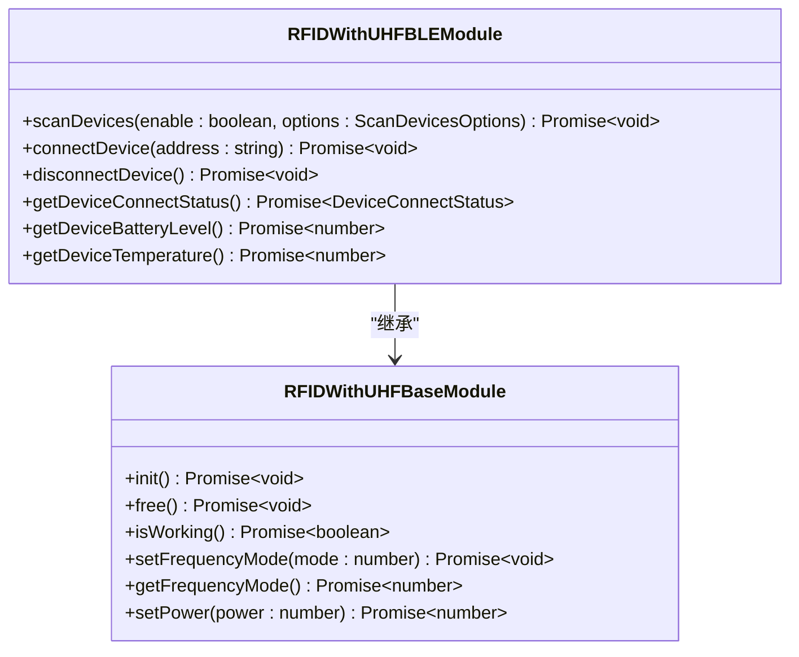
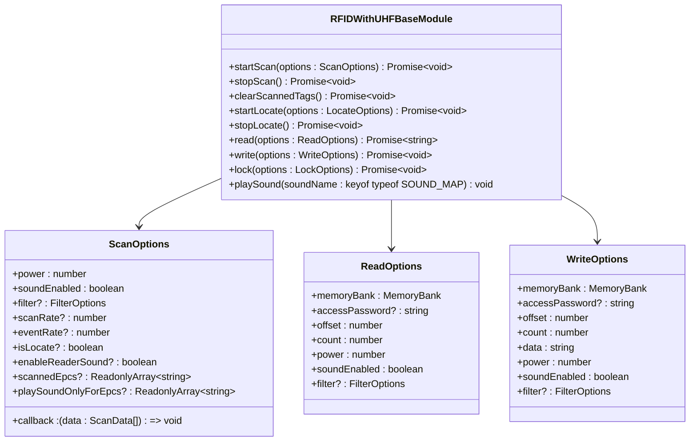
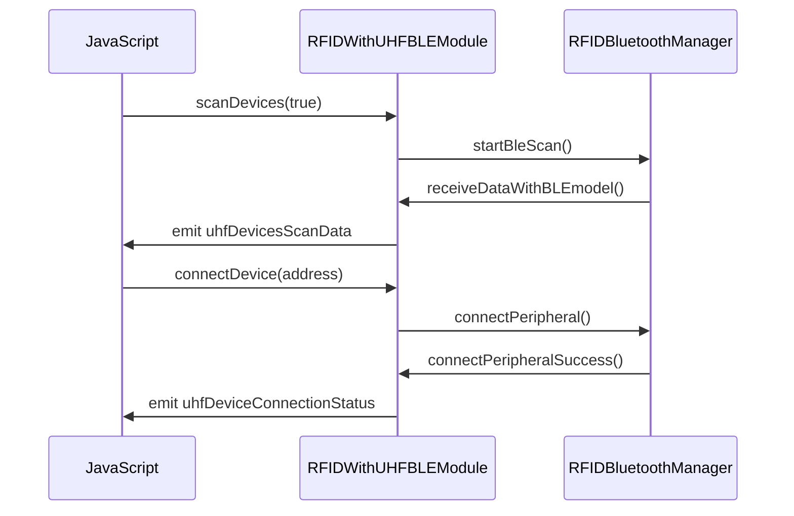
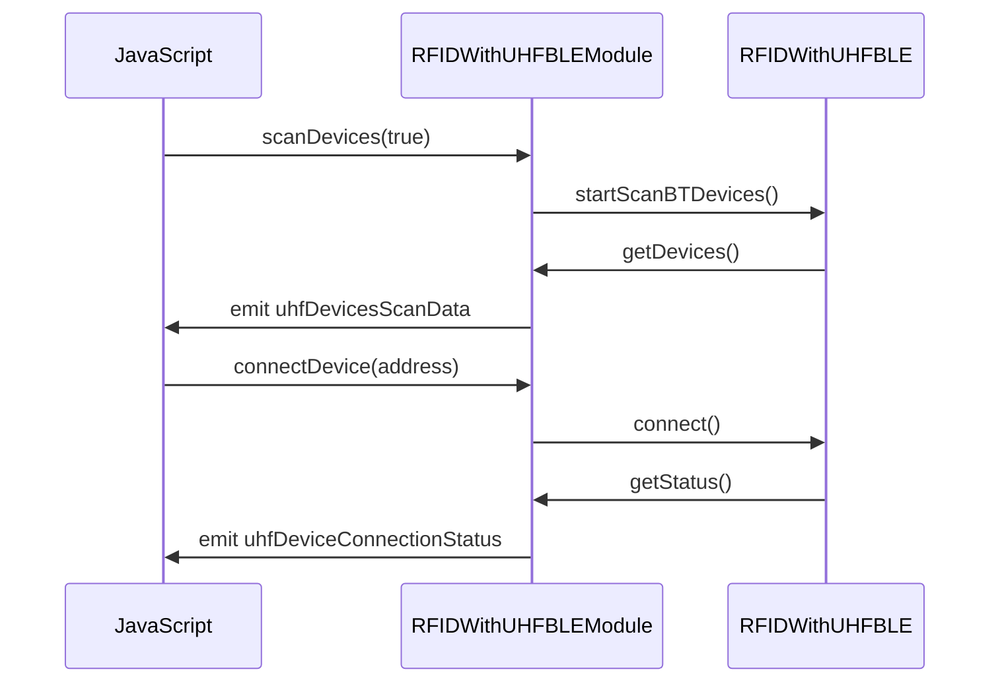

# 支持的RFID设备

<cite>
**本文档中引用的文件**   
- [RFIDWithUHFBLEModule.ts](file://App/app/modules/RFIDWithUHFBLEModule.ts)
- [RFIDWithUHFBaseModule.ts](file://App/app/modules/RFIDWithUHFBaseModule.ts)
- [RFIDWithUHFUARTModule.ts](file://App/app/modules/RFIDWithUHFUARTModule.ts)
- [RCTRFIDWithUHFBLEModule.h](file://App/ios/ReactNativeModules/RFID/Chainway/RCTRFIDWithUHFBLEModule.h)
- [RCTRFIDWithUHFBLEModule.m](file://App/ios/ReactNativeModules/RFID/Chainway/RCTRFIDWithUHFBLEModule.m)
- [RFIDBluetoothManager.h](file://App/ios/Libraries/RFID/Chainway/RFIDBluetoothManager.h)
- [RFIDBluetoothManager.m](file://App/ios/Libraries/RFID/Chainway/RFIDBluetoothManager.m)
- [RFIDWithUHFBLEModule.java](file://App/android/app/src/main/java/vg/zeta/app/inventory/RFIDWithUHFBLEModule.java)
- [chainway-r5.md](file://Inventory-Docs/rfid/supported-rfid-devices/chainway-r5.md)
</cite>

## 目录
1. [简介](#简介)
2. [支持的设备](#支持的设备)
3. [功能特性](#功能特性)
4. [平台差异](#平台差异)
5. [使用注意事项](#使用注意事项)

## 简介

该库存管理应用支持通过蓝牙连接的UHF RFID读写器设备，主要用于资产盘点、标签读取和写入等操作。系统通过原生模块封装了底层RFID硬件的通信协议，为上层应用提供统一的API接口。

**文档来源**
- [RFIDWithUHFBLEModule.ts](file://App/app/modules/RFIDWithUHFBLEModule.ts#L1-L100)
- [RFIDWithUHFBaseModule.ts](file://App/app/modules/RFIDWithUHFBaseModule.ts#L1-L462)

## 支持的设备

目前系统主要支持Chainway品牌的UHF RFID设备，特别是通过蓝牙连接的型号。

### Chainway R5

Chainway R5是一款便携式UHF RFID读写器，通过蓝牙与移动设备连接。该设备支持EPC Gen2协议，可用于远距离RFID标签的读取和写入操作。

**文档来源**
- [chainway-r5.md](file://Inventory-Docs/rfid/supported-rfid-devices/chainway-r5.md#L1-L13)

## 功能特性

系统提供了完整的RFID操作功能集，包括设备管理、标签扫描、数据读写等。

### 设备管理功能

- **设备扫描**: 扫描附近可用的RFID设备
- **连接管理**: 连接和断开RFID设备
- **状态查询**: 获取设备连接状态、电池电量和温度



**代码来源**
- [RFIDWithUHFBLEModule.ts](file://App/app/modules/RFIDWithUHFBLEModule.ts#L37-L76)
- [RFIDWithUHFBaseModule.ts](file://App/app/modules/RFIDWithUHFBaseModule.ts#L112-L143)

### 标签操作功能

- **标签扫描**: 持续扫描并获取周围的RFID标签
- **定位功能**: 通过信号强度定位特定标签
- **数据读取**: 从标签的指定内存区读取数据
- **数据写入**: 向标签的指定内存区写入数据
- **标签锁定**: 锁定标签的特定内存区



**代码来源**
- [RFIDWithUHFBaseModule.ts](file://App/app/modules/RFIDWithUHFBaseModule.ts#L147-L256)

## 平台差异

系统在iOS和Android平台上对RFID功能的实现有所不同，主要体现在事件通信机制和部分功能实现上。

### iOS实现

在iOS平台上，系统使用`RCTEventEmitter`作为事件通信机制，通过原生模块向JavaScript层发送事件。



**代码来源**
- [RCTRFIDWithUHFBLEModule.h](file://App/ios/ReactNativeModules/RFID/Chainway/RCTRFIDWithUHFBLEModule.h#L1-L45)
- [RCTRFIDWithUHFBLEModule.m](file://App/ios/ReactNativeModules/RFID/Chainway/RCTRFIDWithUHFBLEModule.m#L1-L846)
- [RFIDBluetoothManager.h](file://App/ios/Libraries/RFID/Chainway/RFIDBluetoothManager.h#L1-L350)
- [RFIDBluetoothManager.m](file://App/ios/Libraries/RFID/Chainway/RFIDBluetoothManager.m#L1-L800)

### Android实现

在Android平台上，系统使用`DeviceEventEmitter`作为事件通信机制，并通过第三方库`com.rscja.deviceapi`与RFID硬件通信。



**代码来源**
- [RFIDWithUHFBLEModule.java](file://App/android/app/src/main/java/vg/zeta/app/inventory/RFIDWithUHFBLEModule.java#L1-L778)

## 使用注意事项

### iOS设备配对注意事项

在iOS设备上使用Chainway R5时，如果需要与其他设备配对，可能需要手动在系统设置中"忘记"该设备，以防止其自动连接到当前iOS设备。

```mermaid
flowchart TD
A[开始使用RFID设备] --> B{设备已配对?}
B --> |是| C[在iOS设置中找到设备]
C --> D[点击"忘记此设备"]
D --> E[与其他设备配对]
B --> |否| F[正常配对使用]
```

**文档来源**
- [chainway-r5.md](file://Inventory-Docs/rfid/supported-rfid-devices/chainway-r5.md#L5-L9)

### 权限要求

- **Android**: 需要`ACCESS_FINE_LOCATION`权限，因为蓝牙扫描可能用于获取用户位置信息
- **iOS**: 需要蓝牙权限和位置权限

**代码来源**
- [RFIDWithUHFBLEModule.ts](file://App/app/modules/RFIDWithUHFBLEModule.ts#L57-L58)