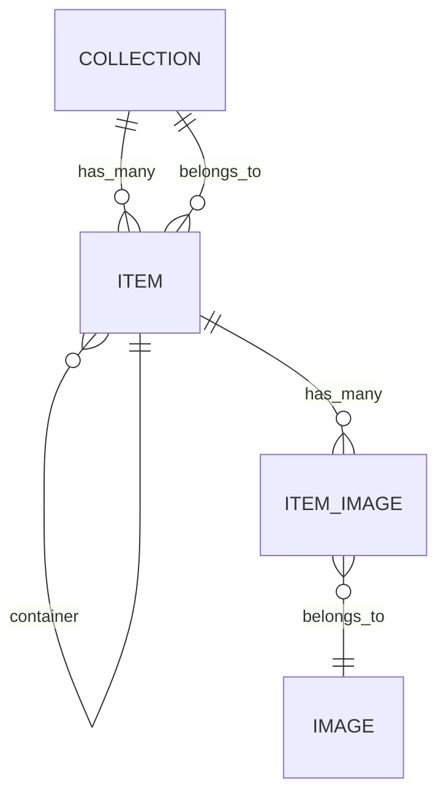
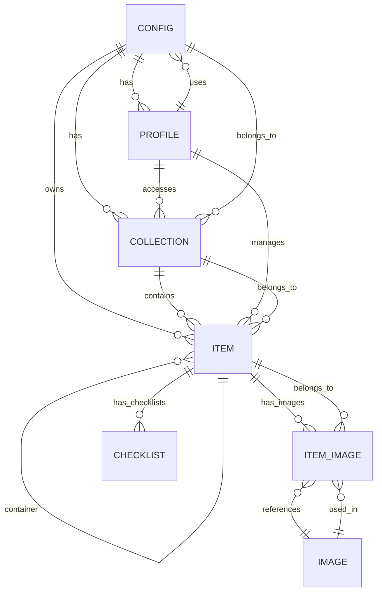

# 数据库设计

<cite>
**本文档中引用的文件**  
- [schema.ts](file://Data/lib/schema.ts)
- [relations.ts](file://Data/lib/relations.ts)
- [generated-schema.ts](file://Data/lib/generated-schema.ts)
- [schema.json](file://Data/lib/schema.json)
- [views.ts](file://packages/data-storage-couchdb/lib/views.ts)
- [types.ts](file://Data/lib/types.ts)
- [pouchdb.ts](file://App/app/db/pouchdb.ts)
- [useData.ts](file://App/app/data/hooks/useData.ts)
</cite>

## 目录
1. [简介](#简介)
2. [核心数据模型](#核心数据模型)
3. [实体关系](#实体关系)
4. [数据库视图设计](#数据库视图设计)
5. [ER图](#er图)
6. [数据生命周期与同步策略](#数据生命周期与同步策略)

## 简介

本数据库设计文档详细描述了库存管理应用的核心数据模型。系统基于PouchDB/CouchDB技术栈，采用文档型数据库存储结构，支持离线同步和跨设备数据一致性。核心实体包括物品(Item)、集合(Collection)、配置(Config)和用户档案(Profile)，通过预定义的视图(Views)实现高效查询。

数据库设计遵循以下原则：
- **类型安全**：使用Zod库定义数据模式，确保数据结构的完整性和有效性
- **可扩展性**：通过`additionalProperties: true`支持未来字段扩展
- **性能优化**：利用CouchDB的MapReduce视图进行聚合查询
- **关系管理**：通过外键和关系定义实现实体间关联

**Section sources**
- [schema.ts](file://Data/lib/schema.ts#L1-L100)
- [generated-schema.ts](file://Data/lib/generated-schema.ts#L1-L133)

## 核心数据模型

### 物品 (Item)

物品实体是系统的核心，代表库存中的具体物品。支持多种类型，包括容器、通用容器、带部件的物品和消耗品。

| 字段名 | 数据类型 | 约束条件 | 说明 |
|-------|--------|--------|------|
| name | string | 必填，最小长度1 | 物品名称 |
| collection_id | string | 必填 | 所属集合ID |
| item_type | enum | 可选 | 物品类型：container, generic_container, item_with_parts, consumable |
| icon_name | string | 可选 | 图标名称 |
| icon_color | string | 可选 | 图标颜色 |
| item_reference_number | string | 可选，正则`^[0-9]*$` | 物品参考编号 |
| serial | integer | 可选，≥0 | 序列号 |
| individual_asset_reference | string | 可选 | 个体资产参考 |
| rfid_tag_epc_memory_bank_contents | string | 可选，正则`^[A-F0-9]+$` | RFID标签EPC内存内容 |
| actual_rfid_tag_epc_memory_bank_contents | string | 可选，正则`^[A-F0-9]+$` | 实际RFID标签EPC内存内容 |
| purchase_price_x1000 | number | 可选 | 采购价格（乘以1000存储） |
| purchase_price_currency | string | 可选 | 采购货币 |
| consumable_stock_quantity | number | 可选 | 消耗品库存数量 |
| consumable_min_stock_level | number | 可选 | 消耗品最低库存水平 |
| expiry_date | number | 可选 | 过期日期（时间戳） |
| _expire_soon_at | number | 可选 | 即将过期时间点 |
| config_uuid | string | 必填 | 配置UUID |

**Section sources**
- [generated-schema.ts](file://Data/lib/generated-schema.ts#L33-L93)
- [schema.json](file://Data/lib/schema.json#L53-L114)

### 集合 (Collection)

集合实体用于组织和分类物品，类似于文件夹的概念。

| 字段名 | 数据类型 | 约束条件 | 说明 |
|-------|--------|--------|------|
| name | string | 必填，最小长度1 | 集合名称 |
| collection_reference_number | string | 必填，正则`^[0-9]{2,4}$` | 集合参考编号（2-4位数字） |
| icon_name | string | 可选 | 图标名称 |
| icon_color | string | 可选 | 图标颜色 |
| item_default_icon_name | string | 可选 | 物品默认图标名称 |
| items_order | array | 可选 | 物品排序数组 |
| config_uuid | string | 必填 | 配置UUID |

**Section sources**
- [generated-schema.ts](file://Data/lib/generated-schema.ts#L21-L32)
- [schema.json](file://Data/lib/schema.json#L28-L52)

### 配置 (Config)

配置实体存储应用的全局设置和RFID相关配置。

| 字段名 | 数据类型 | 约束条件 | 说明 |
|-------|--------|--------|------|
| uuid | string | 必填 | 配置UUID |
| rfid_tag_company_prefix | string | 必填，正则`^[0-9]{6,12}$` | RFID标签公司前缀（6-12位数字） |
| rfid_tag_individual_asset_reference_prefix | string | 必填，正则`^[1-9][0-9]*$` | RFID个体资产参考前缀 |
| rfid_tag_access_password | string | 必填，正则`^[a-f0-9]{8}$` | RFID标签访问密码 |
| default_use_mixed_rfid_tag_access_password | boolean | 可选 | 是否默认使用混合RFID访问密码 |
| rfid_tag_access_password_encoding | string | 必填，正则`^[a-f0-9]{8}$` | RFID标签访问密码编码 |
| collections_order | array | 必填 | 集合排序数组 |

**Section sources**
- [generated-schema.ts](file://Data/lib/generated-schema.ts#L5-L20)
- [schema.json](file://Data/lib/schema.json#L4-L27)

### 图像 (Image)

图像实体存储与物品关联的图片信息。

| 字段名 | 数据类型 | 约束条件 | 说明 |
|-------|--------|--------|------|
| filename | string | 可选 | 文件名 |
| size | number | 可选 | 文件大小（字节） |
| image_1440_digest | string | 可选 | 1440px图像的摘要 |
| _item_ids | array | 可选 | 关联的物品ID数组 |
| _item_collection_ids | array | 可选 | 关联的集合ID数组 |

**Section sources**
- [generated-schema.ts](file://Data/lib/generated-schema.ts#L105-L113)
- [schema.json](file://Data/lib/schema.json#L140-L151)

### 物品图像关联 (Item_Image)

关联实体用于建立物品与图像的多对多关系。

| 字段名 | 数据类型 | 约束条件 | 说明 |
|-------|--------|--------|------|
| item_id | string | 必填 | 物品ID |
| image_id | string | 必填 | 图像ID |
| order | integer | 可选 | 排序序号 |
| _item_collection_id | string | 可选 | 物品所属集合ID |

**Section sources**
- [generated-schema.ts](file://Data/lib/generated-schema.ts#L97-L104)
- [schema.json](file://Data/lib/schema.json#L129-L139)

## 实体关系

实体间关系在`relations.ts`文件中明确定义，采用`belongs_to`和`has_many`两种关系类型。



**Diagram sources**
- [relations.ts](file://Data/lib/relations.ts#L20-L43)

### 集合与物品关系

集合与物品之间存在一对多关系：

```typescript
collection: {
  has_many: { 
    items: { 
      type_name: 'item', 
      foreign_key: 'collection_id' 
    } 
  },
}
```

- **关系类型**：一对多 (has_many)
- **外键**：`item.collection_id` 指向 `collection.id`
- **级联操作**：删除集合时，其包含的所有物品将被删除

**Section sources**
- [relations.ts](file://Data/lib/relations.ts#L21-L23)

### 物品自引用关系

物品实体支持容器-内容物的层次结构：

```typescript
item: {
  belongs_to: {
    container: { 
      type_name: 'item', 
      foreign_key: 'container_id' 
    },
  },
  has_many: {
    contents: { 
      type_name: 'item', 
      foreign_key: 'container_id' 
    },
  },
}
```

- **父子关系**：通过`container_id`字段建立
- **关系对称性**：`container`关系与`contents`关系互为反向
- **层次限制**：支持无限层级嵌套

**Section sources**
- [relations.ts](file://Data/lib/relations.ts#L24-L36)

### 物品与图像关系

物品与图像通过中间表`item_image`建立多对多关系：

```typescript
item: {
  has_many: {
    item_images: {
      type_name: 'item_image',
      foreign_key: 'item_id',
    },
  },
}
```

- **连接实体**：`item_image`作为连接表
- **排序支持**：`item_image.order`字段支持图像排序
- **反向索引**：`image._item_ids`提供反向查询优化

**Section sources**
- [relations.ts](file://Data/lib/relations.ts#L37-L41)

## 数据库视图设计

系统利用CouchDB的MapReduce视图实现高效聚合查询，所有视图以`01_inv_app`为前缀。

### 视图列表

| 视图名称 | 版本 | 聚合类型 | 用途 |
|--------|-----|--------|------|
| out_of_stock_items_count | 1 | _count | 统计缺货物品数量 |
| low_stock_items_count | 1 | _count | 统计低库存物品数量 |
| expired_items | 1 | 无 | 查询过期物品 |
| rfid_untagged_items_count | 1 | _count | 统计未标记RFID的物品数量 |
| purchase_price_sums | 1 | 自定义 | 按货币汇总采购价格 |

**Section sources**
- [views.ts](file://packages/data-storage-couchdb/lib/views.ts#L16-L572)

### 缺货物品视图

```javascript
function (doc) {
  if (
    doc.type === 'item' &&
    doc.data.item_type === 'consumable' &&
    typeof doc.data.consumable_stock_quantity === 'number' &&
    doc.data.consumable_stock_quantity <= 0 &&
    !doc.data.consumable_will_not_restock
  ) {
    emit([doc.data.collection_id, doc._id], { _id: doc._id });
  }
}
```

- **索引键**：`[collection_id, item_id]`
- **过滤条件**：消耗品且库存≤0且会补货
- **查询优化**：支持按集合分组查询

**Section sources**
- [views.ts](file://packages/data-storage-couchdb/lib/views.ts#L96-L110)

### 即将过期物品视图

```javascript
function (doc) {
  if (
    doc.type === 'item' &&
    typeof doc.data._expire_soon_at === 'number' &&
    (doc.data.item_type !== 'consumable' || 
     (typeof doc.data.consumable_stock_quantity === 'number' && 
      doc.data.consumable_stock_quantity > 0))
  ) {
    emit(doc.data._expire_soon_at, { _id: doc._id });
  }
}
```

- **索引键**：`_expire_soon_at`（时间戳）
- **业务逻辑**：考虑库存状态的过期预警
- **性能优势**：O(log n)时间复杂度的时间范围查询

**Section sources**
- [views.ts](file://packages/data-storage-couchdb/lib/views.ts#L209-L221)

### 采购价格汇总视图

```javascript
function (doc) {
  if (
    doc.type === 'item' &&
    doc.data.purchase_price_currency &&
    typeof doc.data.purchase_price_x1000 === 'number'
  ) {
    emit(
      doc.data.purchase_price_currency,
      doc.data.purchase_price_x1000 * (doc.data.item_type === 'consumable' ? 
        (typeof doc.data.consumable_stock_quantity === 'number' ? 
          doc.data.consumable_stock_quantity : 1) : 1)
    );
  }
}
```

- **复合计算**：考虑消耗品库存数量的加权价格
- **自定义聚合**：支持多货币分别汇总
- **数据精度**：使用x1000存储避免浮点数精度问题

**Section sources**
- [views.ts](file://packages/data-storage-couchdb/lib/views.ts#L515-L534)

## ER图



**Diagram sources**
- [schema.json](file://Data/lib/schema.json#L1-L198)
- [relations.ts](file://Data/lib/relations.ts#L20-L43)

## 数据生命周期与同步策略

### 数据生命周期

系统中的每个文档都包含元数据字段，用于跟踪数据状态：

| 元数据字段 | 类型 | 说明 |
|----------|-----|------|
| __type | string | 数据类型 |
| __id | string | 文档ID |
| __rev | string | 文档修订版本 |
| __deleted | boolean | 软删除标记 |
| __created_at | number | 创建时间戳 |
| __updated_at | number | 更新时间戳 |

这些元数据支持：
- **版本控制**：通过`__rev`实现乐观锁
- **软删除**：通过`__deleted`标记而非物理删除
- **审计追踪**：通过时间戳记录生命周期

**Section sources**
- [types.ts](file://Data/lib/types.ts#L10-L18)

### 同步策略

系统采用PouchDB作为本地数据库，支持与远程CouchDB服务器同步：

```typescript
PouchDB.plugin(require('pouchdb-authentication'));
PouchDB.plugin(require('pouchdb-find'));
PouchDB.plugin(require('pouchdb-quick-search'));
PouchDB.plugin(SQLiteAdapter);
```

同步特性包括：
- **双向同步**：本地与远程数据自动同步
- **离线优先**：支持完全离线操作
- **冲突解决**：基于修订版本的冲突检测
- **选择性同步**：通过过滤函数实现数据分片

**Section sources**
- [pouchdb.ts](file://App/app/db/pouchdb.ts#L81-L84)

### 数据验证与完整性

系统通过多层机制确保数据完整性：

1. **模式验证**：使用Zod库在运行时验证数据结构
2. **关系完整性**：通过`getRelated`函数确保外键引用有效
3. **业务规则**：在`saveDatum`操作中执行业务逻辑验证
4. **历史记录**：通过`DataHistory`跟踪所有数据变更

这种分层验证策略确保了即使在分布式环境中也能维持数据一致性。

**Section sources**
- [schema.ts](file://Data/lib/schema.ts#L2-L100)
- [types.ts](file://Data/lib/types.ts#L126-L164)