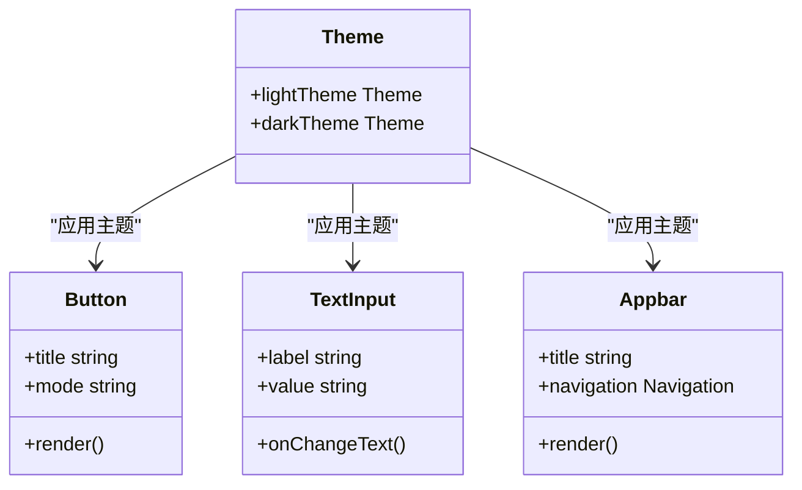
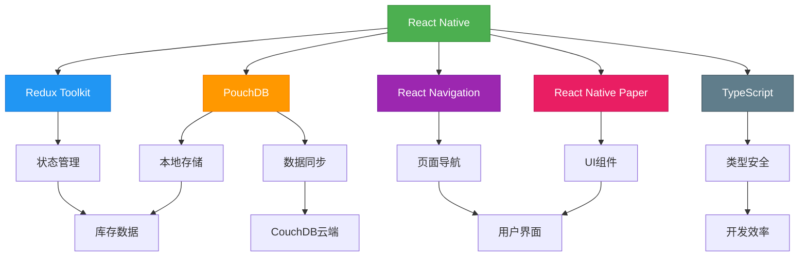

# 技术选型

<cite>
**本文档引用的文件**   
- [package.json](file://App/package.json)
- [tsconfig.json](file://App/tsconfig.json)
- [store.ts](file://App/app/redux/store.ts)
- [pouchdb.ts](file://App/app/db/pouchdb.ts)
- [Navigation.tsx](file://App/app/navigation/Navigation.tsx)
- [MainStack.tsx](file://App/app/navigation/MainStack.tsx)
- [theme.ts](file://App/app/theme.ts)
- [Button.tsx](file://App/app/components/Button/Button.tsx)
</cite>

## 目录
1. [引言](#引言)
2. [核心技术栈分析](#核心技术栈分析)
3. [React Native跨平台框架选型](#react-native跨平台框架选型)
4. [Redux Toolkit状态管理](#redux-toolkit状态管理)
5. [PouchDB本地数据库与离线同步](#pouchdb本地数据库与离线同步)
6. [React Navigation页面导航](#react-navigation页面导航)
7. [React Native Paper UI组件库](#react-native-paper-ui组件库)
8. [TypeScript类型系统应用](#typescript类型系统应用)
9. [技术栈集成关系图](#技术栈集成关系图)
10. [技术选型对比与优势总结](#技术选型对比与优势总结)

## 引言

Inventory项目是一个功能丰富的库存管理应用，需要支持离线操作、数据同步、复杂状态管理和跨平台部署。本技术选型文档系统性地阐述了项目采用的关键技术栈及其选择理由，包括React Native作为跨平台框架、Redux Toolkit用于状态管理、PouchDB作为本地数据库并支持与CouchDB同步的离线优先策略、react-navigation实现灵活的页面导航，以及react-native-paper提供Material Design风格的UI组件库。同时，文档详细说明了TypeScript在项目中的应用，包括类型定义、接口设计和类型安全带来的开发效率提升。

**Section sources**
- [package.json](file://App/package.json)

## 核心技术栈分析

Inventory项目的技术栈选择充分考虑了库存管理应用的特殊需求，包括离线操作能力、数据同步机制、复杂状态管理以及跨平台用户体验一致性。通过分析项目依赖和代码结构，可以清晰地看到技术选型的完整体系。

从package.json文件可以看出，项目采用了现代化的JavaScript技术栈，以React Native为核心框架，结合Redux Toolkit进行状态管理，PouchDB实现本地数据存储和同步，react-navigation处理页面导航，react-native-paper提供UI组件，并全面使用TypeScript确保类型安全。

**Section sources**
- [package.json](file://App/package.json)

## React Native跨平台框架选型

React Native被选为Inventory项目的核心跨平台框架，主要基于以下几个关键优势：

1. **跨平台一致性**：React Native允许使用相同的代码库同时开发iOS和Android应用，大大提高了开发效率和维护性。项目中的导航组件（Navigation.tsx）和UI组件（如Button.tsx）都通过Platform.OS判断来实现平台特定的样式和行为，确保了在不同平台上的最佳用户体验。

2. **原生性能**：React Native通过桥接机制与原生组件通信，提供了接近原生应用的性能表现。项目中使用了多个原生模块，如@gorhom/bottom-sheet用于底部弹出层，@react-native-community/blur提供模糊效果，这些都增强了应用的交互体验。

3. **丰富的生态系统**：React Native拥有庞大的第三方库生态系统，项目中使用的@react-navigation、react-native-paper、pouchdb等都是成熟的社区解决方案，降低了开发风险。

4. **热重载和开发工具**：React Native支持热重载，极大地提高了开发效率。项目中还集成了Storybook用于UI组件的开发和测试，进一步提升了开发体验。

**Section sources**
- [package.json](file://App/package.json)
- [Navigation.tsx](file://App/app/navigation/Navigation.tsx)
- [Button.tsx](file://App/app/components/Button/Button.tsx)

## Redux Toolkit状态管理

Redux Toolkit被选为Inventory项目的状态管理解决方案，主要优势体现在以下几个方面：

### 简化Reducer编写

Redux Toolkit通过createSlice API极大地简化了reducer的编写。项目中的store.ts文件显示，通过configureStore创建了全局store，并集成了redux-persist实现状态持久化。这种配置方式避免了传统Redux中繁琐的boilerplate代码。

### 内置Immutable更新逻辑

Redux Toolkit内置了immer库，允许使用"可变"语法编写不可变更新，大大降低了状态更新的复杂性。在store.ts中，reducers被组合并通过combineAndPersistReducers函数进行持久化处理，确保了状态的一致性和可预测性。

### 中间件集成

项目在store配置中集成了自定义logger中间件，用于调试状态变化。同时，通过redux-persist实现了状态的持久化存储，确保应用重启后能恢复之前的状态。

### 类型安全

结合TypeScript，Redux Toolkit提供了完整的类型推断，使得action、reducer和selector的类型安全得到了保障。store.ts中定义的RootState和AppDispatch类型使得状态访问和分发action时具有完整的类型检查。

**Section sources**
- [store.ts](file://App/app/redux/store.ts)
- [utils.ts](file://App/app/redux/utils.ts)

## PouchDB本地数据库与离线同步

PouchDB被选为Inventory项目的本地数据库解决方案，实现了离线优先的数据管理策略，主要优势包括：

### 离线优先架构

PouchDB作为客户端数据库，允许应用在离线状态下正常运行。项目中的pouchdb.ts文件显示，PouchDB被配置为使用react-native-sqlite作为适配器，确保了数据在设备本地的可靠存储。

### 与CouchDB同步

PouchDB天然支持与CouchDB的双向同步，实现了数据的云端备份和多设备同步。项目通过pouchdb-authentication、pouchdb-find等插件扩展了PouchDB的功能，支持用户认证和复杂查询。

### 全文搜索支持

项目集成了lunr和lunr-languages库，为PouchDB提供了多语言全文搜索能力。pouchdb.ts中特别处理了iOS和Android平台的中文分词差异，通过LinguisticTaggerModuleIOS实现iOS平台的中文语言分析，确保了搜索功能的准确性。

### 插件化架构

PouchDB的插件化设计使得功能扩展非常灵活。项目中使用了pouchdb-quick-search插件实现快速搜索，pouchdb-adapter-react-native-sqlite确保了SQLite数据库的兼容性。

**Section sources**
- [pouchdb.ts](file://App/app/db/pouchdb.ts)
- [index.ts](file://App/app/db/index.ts)

## React Navigation页面导航

React Navigation被选为Inventory项目的页面导航解决方案，主要优势体现在：

### 灵活的导航结构

项目实现了复杂的导航结构，包括底部标签导航（Tab Navigator）和堆栈导航（Stack Navigator）。Navigation.tsx文件显示，通过createBottomTabNavigator和createStackNavigator创建了多层级的导航体系。

### 平台差异化体验

导航组件针对iOS和Android平台提供了差异化的用户体验。在iOS上使用原生风格的导航栏和标签栏，在Android上则采用Material Design风格，确保了各平台的原生体验。

### 模态窗口支持

项目通过堆栈导航器实现了多种模态窗口，如日期选择器、图标选择器、数据保存窗口等。RootStackParamList类型定义了所有导航参数的类型，确保了导航过程的类型安全。

### 深度链接处理

Navigation.tsx中实现了深度链接处理逻辑，允许通过URL直接打开应用内的特定页面，支持了profile切换和配置匹配等高级功能。

**Section sources**
- [Navigation.tsx](file://App/app/navigation/Navigation.tsx)
- [MainStack.tsx](file://App/app/navigation/MainStack.tsx)

## React Native Paper UI组件库

React Native Paper被选为Inventory项目的UI组件库，主要基于以下优势：

### Material Design一致性

React Native Paper完整实现了Material Design规范，确保了应用在Android平台上的原生体验。项目中的theme.ts文件显示，通过MD3LightTheme和MD3DarkTheme提供了现代化的深色和浅色主题。

### 跨平台适配

虽然基于Material Design，但React Native Paper提供了良好的跨平台适配能力。项目中的Button组件展示了如何根据Platform.OS选择不同的实现方式，在iOS上使用原生风格，在Android上使用Material Design风格。

### 组件丰富性

React Native Paper提供了丰富的UI组件，包括按钮、文本输入、卡片、列表等。项目中直接使用或封装了这些组件，如TextInput、Appbar等，确保了UI的一致性和可维护性。

### 主题定制

项目通过theme.ts文件扩展了默认主题，允许自定义颜色、圆角等设计属性，满足了品牌个性化的需求。

**Diagram sources**
- [theme.ts](file://App/app/theme.ts)
- [Button.tsx](file://App/app/components/Button/Button.tsx)
- [TextInput.tsx](file://App/app/components/TextInput/TextInput.tsx)
- [Appbar.tsx](file://App/app/components/Appbar/Appbar.tsx)

**Section sources**
- [theme.ts](file://App/app/theme.ts)
- [Button.tsx](file://App/app/components/Button/Button.tsx)

## TypeScript类型系统应用

TypeScript在Inventory项目中得到了全面应用，显著提升了开发效率和代码质量：

### 类型定义

项目通过zod库定义了完整的数据模式（schema.ts），并在TypeScript中生成相应的类型定义。Data/lib/schema.ts文件显示，通过z.infer自动生成类型，确保了数据结构的类型安全。

### 接口设计

项目采用了模块化的接口设计，将数据类型、关系定义、验证规则等分离管理。Data/lib/relations.ts中定义了复杂的数据关系类型，支持类型安全的关联查询。

### 类型安全优势

TypeScript的类型检查在编译时捕获了大量潜在错误，减少了运行时异常。项目中的utils/DeepReadonly.ts实现了深度只读类型，防止意外的状态修改。

### 开发效率提升

通过类型推断和自动补全，开发者可以更快地理解和使用API。Navigation.tsx中的RootStackParamList和MainStack.tsx中的StackParamList提供了完整的导航参数类型，避免了运行时错误。

**Section sources**
- [tsconfig.json](file://App/tsconfig.json)
- [schema.ts](file://Data/lib/schema.ts)
- [relations.ts](file://Data/lib/relations.ts)
- [DeepReadonly.ts](file://App/app/utils/DeepReadonly.ts)

## 技术栈集成关系图

**Diagram sources**
- [package.json](file://App/package.json)
- [store.ts](file://App/app/redux/store.ts)
- [pouchdb.ts](file://App/app/db/pouchdb.ts)
- [Navigation.tsx](file://App/app/navigation/Navigation.tsx)
- [theme.ts](file://App/app/theme.ts)

## 技术选型对比与优势总结

Inventory项目的技术选型经过了深思熟虑的对比和评估，相比其他可选方案具有明显优势：

### 与其他跨平台框架对比

相比Flutter和Ionic，React Native具有更大的开发者社区和更丰富的第三方库支持。项目中使用的特定原生模块（如RFID读取）更容易通过React Native桥接实现。

### 与Redux替代方案对比

相比MobX或Context API，Redux Toolkit提供了更可预测的状态管理，特别适合库存管理这种需要复杂状态逻辑的应用。时间旅行调试和中间件支持也增强了开发和调试体验。

### 与本地数据库对比

相比SQLite直接操作或Realm，PouchDB提供了更高级的抽象和内置的同步功能。离线优先的设计理念完美契合库存管理应用在仓库等网络不稳定环境下的使用需求。

### 与UI框架对比

相比原生组件或自定义UI库，React Native Paper提供了完整的Material Design实现，减少了UI开发的工作量，同时保证了专业级的视觉效果。

综上所述，Inventory项目的技术选型充分考虑了应用需求、开发效率、维护成本和用户体验，构建了一个稳定、高效、可扩展的技术架构。

**Section sources**
- [package.json](file://App/package.json)
- [store.ts](file://App/app/redux/store.ts)
- [pouchdb.ts](file://App/app/db/pouchdb.ts)
- [Navigation.tsx](file://App/app/navigation/Navigation.tsx)
- [theme.ts](file://App/app/theme.ts)