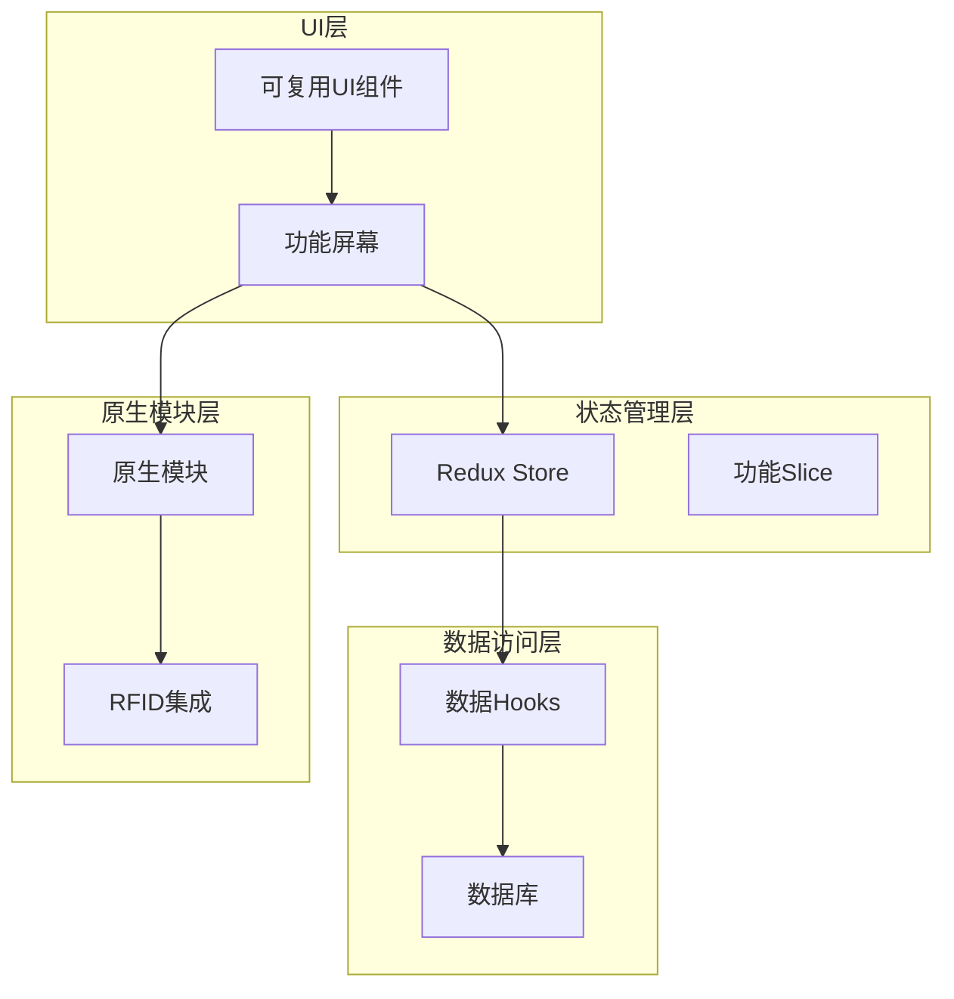
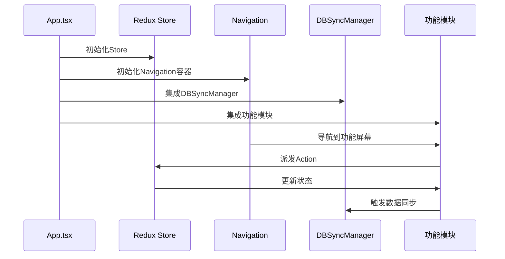
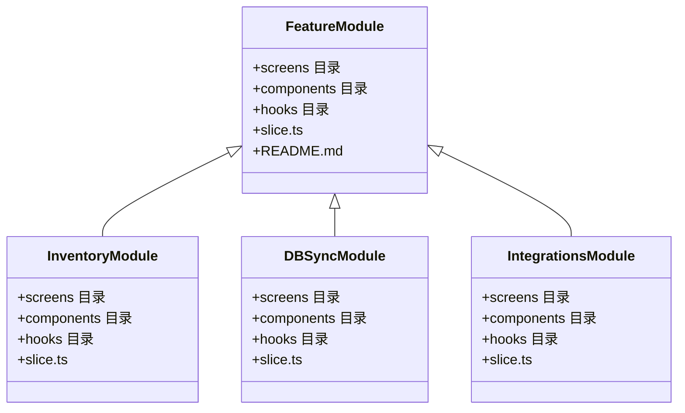
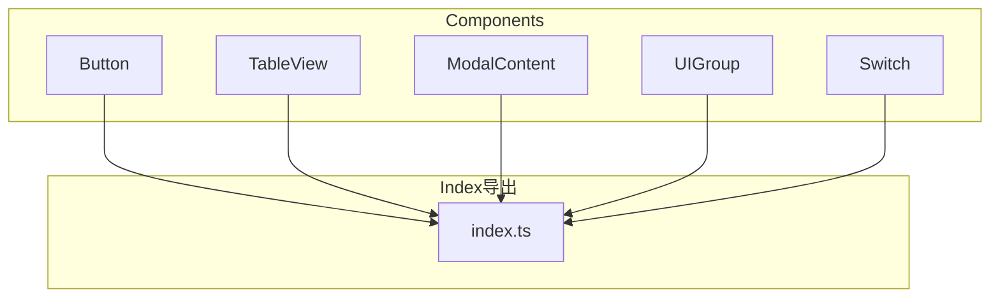
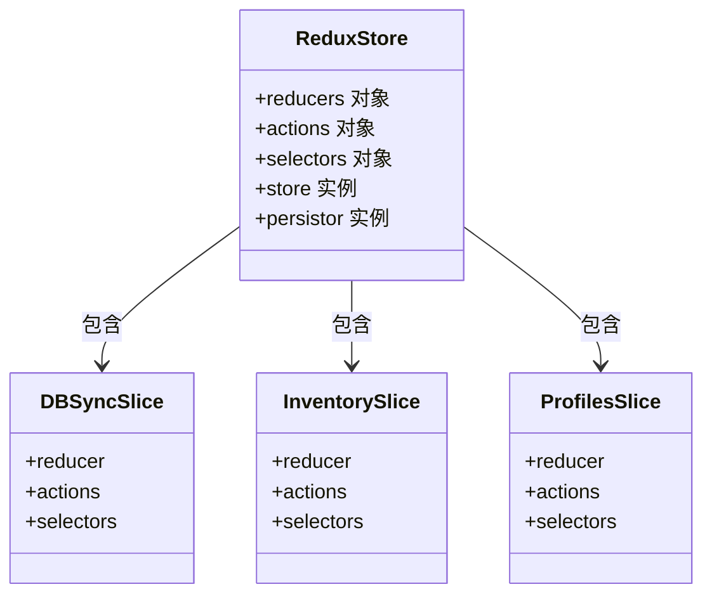
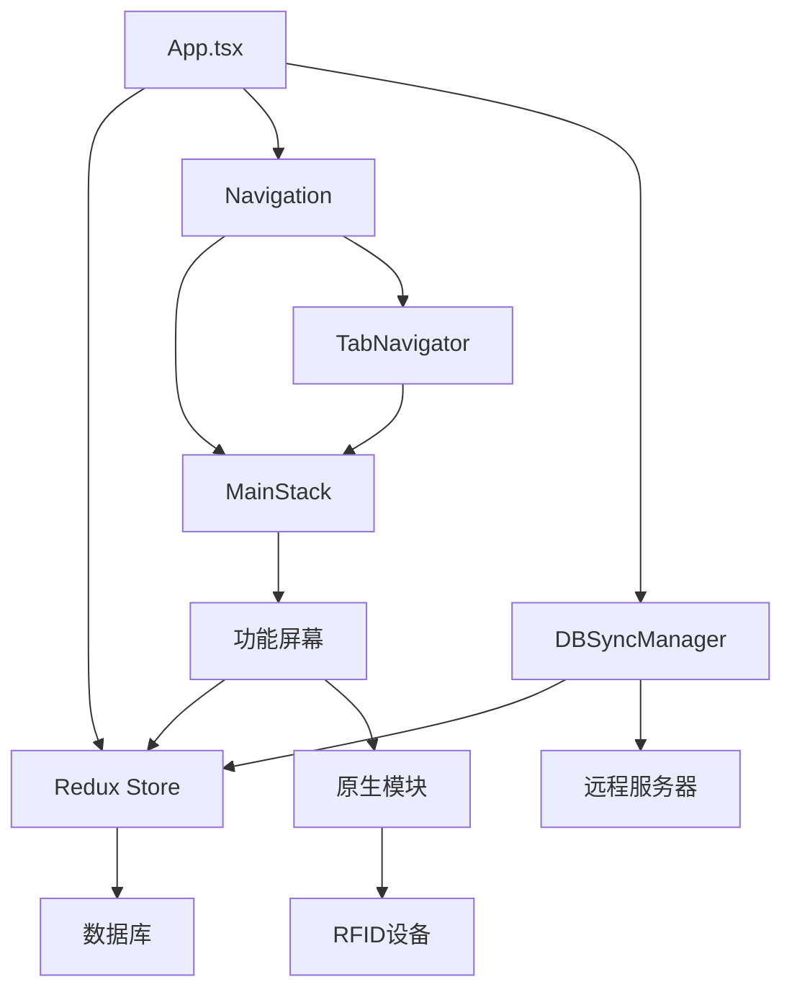

# 整体架构

<cite>
**本文档中引用的文件**  
- [App.tsx](file://App/app/App.tsx)
- [store.ts](file://App/app/redux/store.ts)
- [Navigation.tsx](file://App/app/navigation/Navigation.tsx)
- [MainStack.tsx](file://App/app/navigation/MainStack.tsx)
- [slice.ts](file://App/app/features/db-sync/slice.ts)
- [slice.ts](file://App/app/features/inventory/slice.ts)
- [index.ts](file://App/app/db/index.ts)
- [RFIDWithUHFBLEModule.ts](file://App/app/modules/RFIDWithUHFBLEModule.ts)
- [components](file://App/app/components)
- [features](file://App/app/features)
</cite>

## 目录
1. [简介](#简介)
2. [项目结构](#项目结构)
3. [核心组件](#核心组件)
4. [架构概述](#架构概述)
5. [详细组件分析](#详细组件分析)
6. [依赖分析](#依赖分析)
7. [性能考虑](#性能考虑)
8. [故障排除指南](#故障排除指南)
9. [结论](#结论)

## 简介
Inventory应用是一个基于React Native的跨平台移动应用，采用分层架构设计，包含前端UI层、状态管理层、数据访问层和原生模块层。应用采用模块化功能组织模式，通过Redux进行全局状态管理，并使用PouchDB作为本地数据库。应用支持RFID读取器集成、数据同步、标签打印等高级功能。

## 项目结构
Inventory应用的项目结构遵循功能驱动的模块化设计原则，主要分为以下几个核心目录：

- **components**: 包含可复用的UI组件，如Button、TableView、ModalContent等，通过index.ts统一导出
- **features**: 按业务功能划分的独立模块，如inventory、db-sync、integrations等
- **redux**: Redux状态管理相关代码，包括store、slices和selectors
- **navigation**: 应用导航逻辑，包括堆栈导航器和底部标签导航器
- **db**: 数据库访问层，封装PouchDB和SQLite操作
- **modules**: 原生模块封装，如RFID读取器集成
- **hooks**: 自定义React Hooks，用于共享逻辑

这种结构实现了关注点分离，提高了代码的可维护性和可扩展性。

**Diagram sources**
- [App/app/components](file://App/app/components)
- [App/app/features](file://App/app/features)
- [App/app/redux](file://App/app/redux)
- [App/app/db](file://App/app/db)
- [App/app/modules](file://App/app/modules)

**Section sources**
- [App/app](file://App/app)

## 核心组件
Inventory应用的核心组件包括：

- **App.tsx**: 应用根组件，负责初始化Redux Store和Navigation容器
- **Redux Store**: 全局状态管理，使用Redux Toolkit创建
- **Navigation系统**: 基于React Navigation的导航架构
- **DB Sync Manager**: 数据同步管理器，处理与远程服务器的数据同步
- **RFID模块**: RFID读取器集成，支持BLE连接

这些核心组件协同工作，构成了应用的基础架构。

**Section sources**
- [App.tsx](file://App/app/App.tsx)
- [store.ts](file://App/app/redux/store.ts)
- [Navigation.tsx](file://App/app/navigation/Navigation.tsx)
- [DBSyncManager](file://App/app/features/db-sync/DBSyncManager)
- [RFIDWithUHFBLEModule.ts](file://App/app/modules/RFIDWithUHFBLEModule.ts)

## 架构概述
Inventory应用采用分层架构设计，各层职责明确，耦合度低。应用启动时，从App.tsx根组件开始，依次初始化Redux Store、Navigation容器和各种功能模块。

**Diagram sources**
- [App.tsx](file://App/app/App.tsx)
- [store.ts](file://App/app/redux/store.ts)
- [Navigation.tsx](file://App/app/navigation/Navigation.tsx)
- [DBSyncManager](file://App/app/features/db-sync/DBSyncManager)

## 详细组件分析

### 功能模块分析
Inventory应用采用模块化设计，每个功能模块（如inventory、db-sync、integrations）都是独立的，包含自身的screens、components、hooks和Redux slice。

**Diagram sources**
- [App/app/features/inventory](file://App/app/features/inventory)
- [App/app/features/db-sync](file://App/app/features/db-sync)
- [App/app/features/integrations](file://App/app/features/integrations)

**Section sources**
- [App/app/features](file://App/app/features)

### 组件复用架构
components目录提供可复用的UI组件，通过index.ts统一导出，实现了组件的集中管理和复用。

**Diagram sources**
- [App/app/components](file://App/app/components)

### 状态管理分析
应用使用Redux Toolkit进行状态管理，store.ts文件中定义了全局状态结构和reducer组合逻辑。

**Diagram sources**
- [store.ts](file://App/app/redux/store.ts)
- [slice.ts](file://App/app/features/db-sync/slice.ts)
- [slice.ts](file://App/app/features/inventory/slice.ts)
- [slice.ts](file://App/app/features/profiles/slice.ts)

**Section sources**
- [store.ts](file://App/app/redux/store.ts)

## 依赖分析
Inventory应用的依赖关系清晰，各层之间通过明确的接口进行通信。

**Diagram sources**
- [App.tsx](file://App/app/App.tsx)
- [Navigation.tsx](file://App/app/navigation/Navigation.tsx)
- [MainStack.tsx](file://App/app/navigation/MainStack.tsx)
- [db/index.ts](file://App/app/db/index.ts)

**Section sources**
- [App/app](file://App/app)

## 性能考虑
Inventory应用在性能方面做了多项优化：

1. 使用Redux Persist进行状态持久化，减少启动时的数据加载时间
2. 采用PouchDB作为本地数据库，支持离线操作和数据同步
3. 使用React.memo和useCallback优化组件渲染性能
4. 实现数据分页和懒加载，减少内存占用
5. 使用原生模块处理RFID读取等高性能需求操作

这些优化措施确保了应用在各种设备上都能流畅运行。

## 故障排除指南
当遇到应用问题时，可以按照以下步骤进行排查：

1. 检查Redux DevTools中的action和state变化
2. 查看应用日志，定位错误信息
3. 检查数据库连接状态和数据同步情况
4. 验证原生模块（如RFID）的连接状态
5. 检查网络连接和服务器状态

应用内置了详细的日志系统和开发者工具，便于问题诊断和调试。

**Section sources**
- [logger](file://App/app/logger)
- [screens/DeveloperToolsScreen.tsx](file://App/app/screens/DeveloperToolsScreen.tsx)

## 结论
Inventory应用采用现代化的React Native架构，通过分层设计和模块化组织，实现了高内聚、低耦合的代码结构。应用的状态管理、数据访问和UI呈现分离清晰，便于维护和扩展。通过Redux Toolkit和PouchDB等现代技术栈，应用在性能和用户体验方面表现出色。整体架构设计合理，为未来的功能扩展奠定了良好的基础。