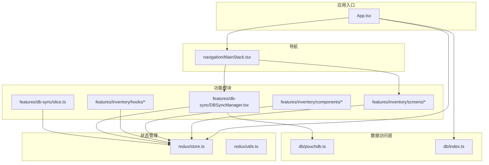
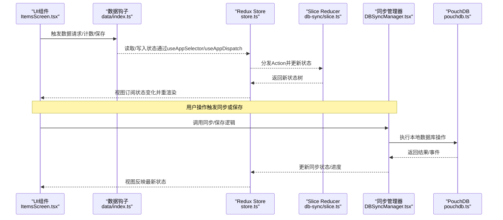
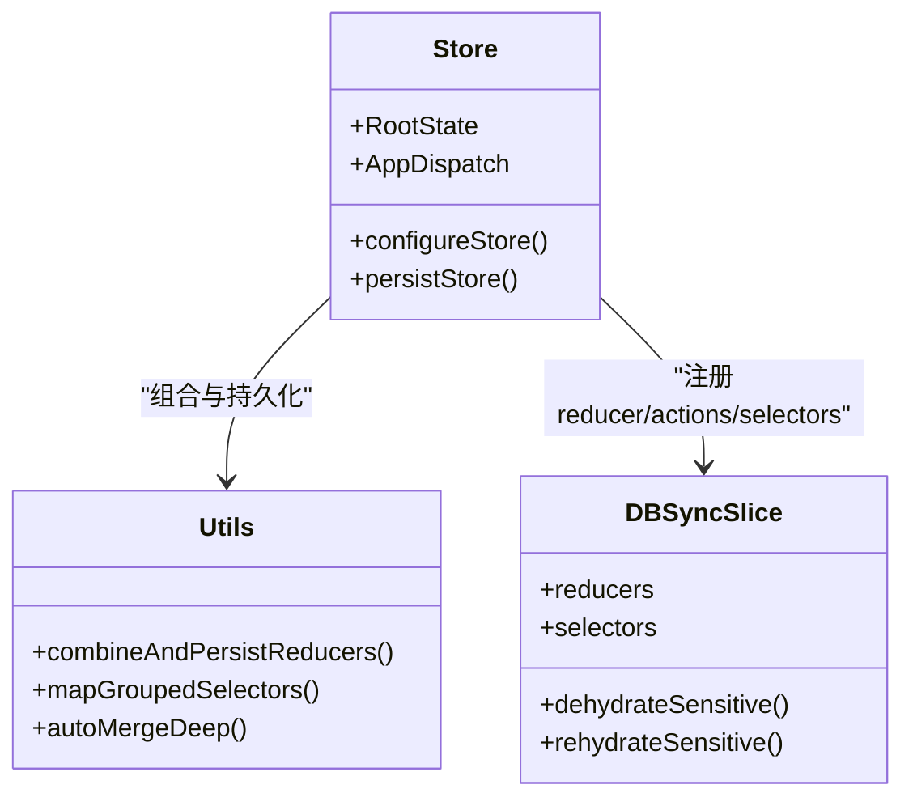
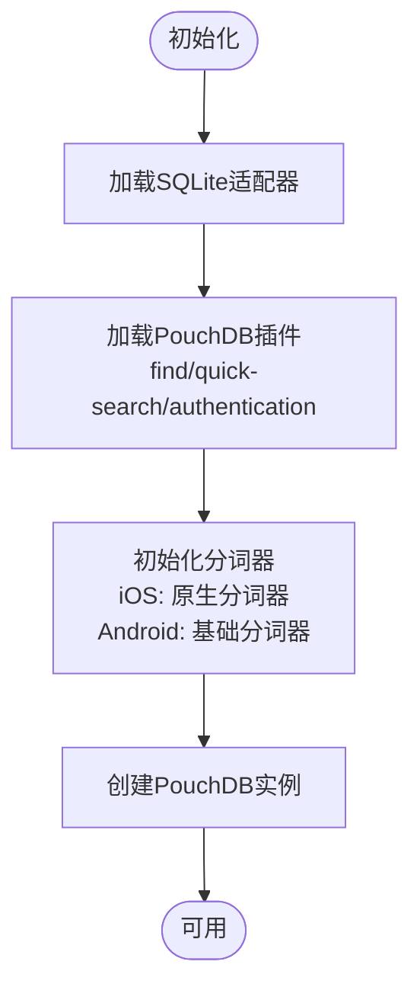
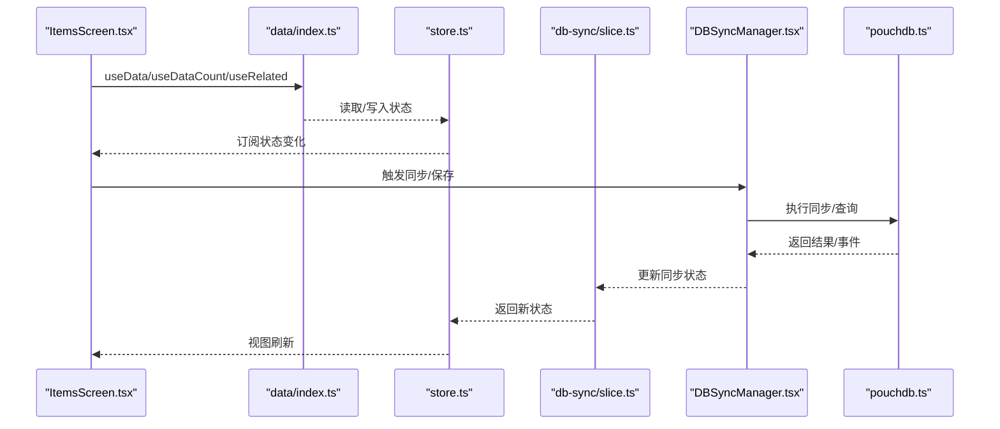
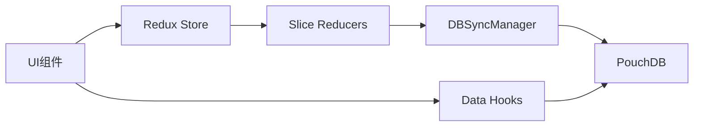

# 架构设计

<cite>
**本文引用的文件**
- [App.tsx](file://App/app/App.tsx)
- [store.ts](file://App/app/redux/store.ts)
- [utils.ts](file://App/app/redux/utils.ts)
- [pouchdb.ts](file://App/app/db/pouchdb.ts)
- [index.ts](file://App/app/db/index.ts)
- [DBSyncManager.tsx](file://App/app/features/db-sync/DBSyncManager.tsx)
- [slice.ts](file://App/app/features/db-sync/slice.ts)
- [ItemsScreen.tsx](file://App/app/features/inventory/screens/ItemsScreen.tsx)
- [ItemListItem.tsx](file://App/app/features/inventory/components/ItemListItem.tsx)
- [index.ts](file://App/app/data/index.ts)
- [MainStack.tsx](file://App/app/navigation/MainStack.tsx)
- [useCheckItems.tsx](file://App/app/features/inventory/hooks/useCheckItems.tsx)
</cite>

## 目录
1. [引言](#引言)
2. [项目结构](#项目结构)
3. [核心组件](#核心组件)
4. [架构总览](#架构总览)
5. [详细组件分析](#详细组件分析)
6. [依赖关系分析](#依赖关系分析)
7. [性能考量](#性能考量)
8. [故障排查指南](#故障排查指南)
9. [结论](#结论)
10. [附录](#附录)

## 引言
本架构文档面向Inventory应用，聚焦于其模块化功能组织（features/）、可复用UI组件层（components/）、全局状态管理（redux/）与数据访问层（db/）的整体设计。文档重点阐释React Native、Redux Toolkit与PouchDB之间的数据流闭环：用户交互如何通过UI组件触发Action，经由Reducer更新Store状态，最终导致视图重新渲染，并将数据持久化到本地数据库；同时说明功能模块（features）的结构与职责划分，以及使用PouchDB作为本地数据库并支持与远程CouchDB同步的设计优势。

## 项目结构
应用采用“按领域分层 + 按功能模块拆分”的组织方式：
- features：按业务域划分，如inventory、db-sync、integrations等，每个域内再细分为screens、components、hooks、slice.ts等子目录，形成高内聚低耦合的功能单元。
- components：可复用UI组件库，提供跨域共享的基础控件与布局。
- redux：集中式状态管理，包含store配置、中间件、工具函数与类型定义。
- db：数据库抽象与初始化，封装PouchDB适配器、搜索插件与平台差异处理。
- data：数据访问层，提供统一的数据查询、计数、保存、关联查询等钩子与工具。
- navigation：路由栈定义，承载页面跳转与参数传递。
- 其他：日志、主题、模块桥接、脚本等支撑性模块。

图表来源
- [App.tsx](file://App/app/App.tsx#L1-L120)
- [store.ts](file://App/app/redux/store.ts#L1-L124)
- [utils.ts](file://App/app/redux/utils.ts#L1-L120)
- [pouchdb.ts](file://App/app/db/pouchdb.ts#L1-L102)
- [index.ts](file://App/app/db/index.ts#L1-L3)
- [DBSyncManager.tsx](file://App/app/features/db-sync/DBSyncManager.tsx#L1-L120)
- [slice.ts](file://App/app/features/db-sync/slice.ts#L1-L120)
- [MainStack.tsx](file://App/app/navigation/MainStack.tsx#L1-L120)

章节来源
- [App.tsx](file://App/app/App.tsx#L1-L120)
- [store.ts](file://App/app/redux/store.ts#L1-L124)
- [utils.ts](file://App/app/redux/utils.ts#L1-L120)
- [pouchdb.ts](file://App/app/db/pouchdb.ts#L1-L102)
- [index.ts](file://App/app/db/index.ts#L1-L3)
- [MainStack.tsx](file://App/app/navigation/MainStack.tsx#L1-L120)

## 核心组件
- 应用入口与启动门禁：App.tsx负责Provider、PersistGate、主题与导航装配，并在应用就绪后初始化数据库与默认配置。
- Redux Store与持久化：store.ts集中注册各slice reducer与actions/selectors，结合utils.ts提供的组合与持久化策略，实现状态的序列化、敏感信息分离存储与自动合并。
- 数据库与搜索：pouchdb.ts封装PouchDB初始化、SQLite适配器、全文检索插件与多语言分词器，屏蔽平台差异。
- 同步管理器：DBSyncManager.tsx基于PouchDB双向同步，按服务器配置进行增量/批量同步，并通过slice.ts维护同步状态与进度。
- 功能模块：inventory域提供清单、集合、物品等屏幕与组件；db-sync域提供服务器配置与同步状态展示；hooks提供业务逻辑复用。

章节来源
- [App.tsx](file://App/app/App.tsx#L1-L120)
- [store.ts](file://App/app/redux/store.ts#L1-L124)
- [utils.ts](file://App/app/redux/utils.ts#L1-L120)
- [pouchdb.ts](file://App/app/db/pouchdb.ts#L1-L102)
- [DBSyncManager.tsx](file://App/app/features/db-sync/DBSyncManager.tsx#L1-L120)
- [slice.ts](file://App/app/features/db-sync/slice.ts#L1-L120)

## 架构总览
下图展示了从用户交互到本地数据库持久化的端到端数据流，以及Redux与PouchDB的协同机制。

图表来源
- [ItemsScreen.tsx](file://App/app/features/inventory/screens/ItemsScreen.tsx#L1-L120)
- [index.ts](file://App/app/data/index.ts#L1-L41)
- [store.ts](file://App/app/redux/store.ts#L1-L124)
- [slice.ts](file://App/app/features/db-sync/slice.ts#L1-L120)
- [DBSyncManager.tsx](file://App/app/features/db-sync/DBSyncManager.tsx#L1-L200)
- [pouchdb.ts](file://App/app/db/pouchdb.ts#L1-L102)

## 详细组件分析

### Redux状态管理与持久化
- 组合与持久化：combineAndPersistReducers在utils.ts中实现，对每个slice的reducer提供自定义dehydrate/rehydrate钩子，支持普通状态与敏感状态分别持久化；通过AsyncStorage与敏感存储（keychain/sharedPreferences）实现安全持久化。
- 中间件与调试：store.ts配置logger中间件与serializable检查，避免非序列化动作影响持久化；暴露RootState与AppDispatch类型以增强类型安全。
- 状态选择器：store.ts聚合各slice的selectors，通过mapGroupedSelectors为根状态映射slice内的选择器，便于在组件中直接使用。

图表来源
- [store.ts](file://App/app/redux/store.ts#L1-L124)
- [utils.ts](file://App/app/redux/utils.ts#L1-L200)
- [slice.ts](file://App/app/features/db-sync/slice.ts#L1-L120)

章节来源
- [store.ts](file://App/app/redux/store.ts#L1-L124)
- [utils.ts](file://App/app/redux/utils.ts#L1-L200)
- [slice.ts](file://App/app/features/db-sync/slice.ts#L1-L120)

### 数据访问层与PouchDB集成
- 平台适配与插件：pouchdb.ts在React Native环境下加载SQLite适配器与全文检索插件，iOS上集成原生分词器，Android提供降级方案；初始化时注入lunr多语言支持。
- 数据库实例：提供getPouchDBDatabase工厂方法，返回带SQLite适配器的PouchDB实例，供上层模块使用。
- 导出接口：db/index.ts导出useDB与PouchDB，统一对外暴露数据库能力。

图表来源
- [pouchdb.ts](file://App/app/db/pouchdb.ts#L1-L102)
- [index.ts](file://App/app/db/index.ts#L1-L3)

章节来源
- [pouchdb.ts](file://App/app/db/pouchdb.ts#L1-L102)
- [index.ts](file://App/app/db/index.ts#L1-L3)

### 功能模块：库存与同步
- inventory域：ItemsScreen.tsx通过data/index.ts提供的useData/useDataCount/useRelated等钩子，实现列表渲染、排序与分页；ItemListItem.tsx负责单条目渲染与图片加载，体现数据驱动的UI更新。
- db-sync域：DBSyncManager.tsx负责网络状态监听、认证连接、过滤器部署与双向同步流程控制；slice.ts维护服务器配置、状态与进度，支持批量与增量同步。

图表来源
- [ItemsScreen.tsx](file://App/app/features/inventory/screens/ItemsScreen.tsx#L1-L158)
- [index.ts](file://App/app/data/index.ts#L1-L41)
- [store.ts](file://App/app/redux/store.ts#L1-L124)
- [slice.ts](file://App/app/features/db-sync/slice.ts#L1-L200)
- [DBSyncManager.tsx](file://App/app/features/db-sync/DBSyncManager.tsx#L1-L200)
- [pouchdb.ts](file://App/app/db/pouchdb.ts#L1-L102)

章节来源
- [ItemsScreen.tsx](file://App/app/features/inventory/screens/ItemsScreen.tsx#L1-L158)
- [ItemListItem.tsx](file://App/app/features/inventory/components/ItemListItem.tsx#L1-L120)
- [index.ts](file://App/app/data/index.ts#L1-L41)
- [DBSyncManager.tsx](file://App/app/features/db-sync/DBSyncManager.tsx#L1-L200)
- [slice.ts](file://App/app/features/db-sync/slice.ts#L1-L200)

### 导航与页面组织
- MainStack.tsx集中声明所有页面路由与参数类型，覆盖库存、同步、设置、开发工具等页面，确保类型安全与一致的导航体验。
- 页面通过@react-navigation/stack在不同平台采用原生堆栈或通用堆栈，提供iOS风格的大标题与过渡动画。

章节来源
- [MainStack.tsx](file://App/app/navigation/MainStack.tsx#L1-L200)

### 业务逻辑复用：RFID盘点
- useCheckItems.tsx通过底部弹窗与RFID扫描能力，结合数据库查询与子项递归收集，完成批量盘点与结果统计，体现hooks在复杂业务中的复用价值。

章节来源
- [useCheckItems.tsx](file://App/app/features/inventory/hooks/useCheckItems.tsx#L1-L120)

## 依赖关系分析
- 组件到状态：UI组件通过Redux hooks订阅状态，当状态变化时触发重渲染；数据访问层通过钩子与数据库交互，间接影响状态。
- 状态到数据库：db-sync域通过DBSyncManager与PouchDB交互，更新同步状态；inventory域通过data钩子读取/保存数据，最终落盘至本地数据库。
- 外部依赖：PouchDB、Redux Toolkit、react-native-quick-websql、lunr多语言分词器、NetInfo网络状态监听等。

图表来源
- [store.ts](file://App/app/redux/store.ts#L1-L124)
- [DBSyncManager.tsx](file://App/app/features/db-sync/DBSyncManager.tsx#L1-L120)
- [pouchdb.ts](file://App/app/db/pouchdb.ts#L1-L102)
- [index.ts](file://App/app/data/index.ts#L1-L41)

章节来源
- [store.ts](file://App/app/redux/store.ts#L1-L124)
- [DBSyncManager.tsx](file://App/app/features/db-sync/DBSyncManager.tsx#L1-L120)
- [pouchdb.ts](file://App/app/db/pouchdb.ts#L1-L102)
- [index.ts](file://App/app/data/index.ts#L1-L41)

## 性能考量
- 列表渲染优化：ItemsScreen使用虚拟化列表与分页，减少一次性渲染开销；ItemListItem按优先级延迟加载缩略图，避免阻塞主线程。
- 状态持久化策略：通过combineAndPersistReducers对普通状态与敏感状态分别持久化，降低序列化成本；自动合并策略避免不必要的覆盖。
- 同步批处理：DBSyncManager采用批量大小与批次限制，配合增量同步与过滤器，减少网络与CPU占用。
- 平台适配：iOS原生分词器与Android基础分词器的差异化处理，兼顾性能与准确性。

## 故障排查指南
- 同步失败诊断：DBSyncManager在连接失败时记录HTTP错误与会话信息，并根据错误码映射到“离线/错误”状态；建议检查服务器URI、凭据与网络连通性。
- 状态未持久化：若发现重启后状态丢失，检查AsyncStorage与敏感存储配置；确认reducer是否实现dehydrate/dehydrateSensitive。
- 列表空白或加载缓慢：检查useData/useDataCount参数与索引；确认PouchDB查询条件与过滤器是否正确部署。
- 图片加载异常：确认缩略图附件存在且内容类型正确；检查LPJQ优先级调度与加载时机。

章节来源
- [DBSyncManager.tsx](file://App/app/features/db-sync/DBSyncManager.tsx#L120-L260)
- [utils.ts](file://App/app/redux/utils.ts#L1-L120)
- [ItemsScreen.tsx](file://App/app/features/inventory/screens/ItemsScreen.tsx#L1-L120)
- [ItemListItem.tsx](file://App/app/features/inventory/components/ItemListItem.tsx#L1-L120)

## 结论
Inventory应用通过清晰的模块化组织与分层设计，实现了UI、状态、数据与数据库的解耦协作。Redux Toolkit提供简洁的状态建模，PouchDB提供可靠的本地持久化与跨端同步能力。功能模块以screens/components/hooks/slice的规范组织，既保证了可扩展性，也提升了可维护性。通过批量同步、过滤器与优先级调度等手段，系统在性能与用户体验之间取得平衡。

## 附录
- 功能模块组织规范
  - screens：页面级组件，负责路由参数解析与页面行为编排。
  - components：可复用UI组件，遵循单一职责与可组合原则。
  - hooks：业务逻辑复用，封装复杂流程（如RFID盘点）。
  - slice.ts：定义状态结构、Action与Reducer，提供选择器与持久化钩子。
- 设计优势
  - 可复用UI组件提升一致性与开发效率。
  - Redux集中式状态便于调试与追踪。
  - PouchDB本地数据库+远程同步满足离线与多端一致性需求。
  - 模块化功能域便于团队协作与迭代演进。