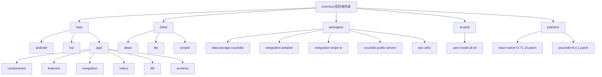
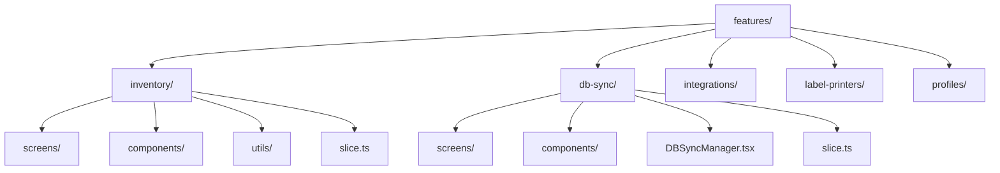

# 目录结构

<cite>
**本文档中引用的文件**  
- [App/app.json](file://App/app.json)
- [package.json](file://package.json)
- [Data/package.json](file://Data/package.json)
- [packages/data-storage-couchdb/package.json](file://packages/data-storage-couchdb/package.json)
- [packages/integration-airtable/package.json](file://packages/integration-airtable/package.json)
- [App/app/App.tsx](file://App/app/App.tsx)
- [App/app/navigation/MainStack.tsx](file://App/app/navigation/MainStack.tsx)
- [App/app/redux/store.ts](file://App/app/redux/store.ts)
- [App/app/db/index.ts](file://App/app/db/index.ts)
- [App/patches/react-native+0.71.10.patch](file://App/patches/react-native+0.71.10.patch)
- [App/app/features/inventory/slice.ts](file://App/app/features/inventory/slice.ts)
- [App/app/data/schema.ts](file://App/app/data/schema.ts)
- [App/app/components/Button/Button.tsx](file://App/app/components/Button/Button.tsx)
- [scripts/yarn-install-all.sh](file://scripts/yarn-install-all.sh)
</cite>

## 目录结构

Inventory项目采用模块化和分层的目录结构，旨在提高代码的可维护性、可扩展性和团队协作效率。项目根目录下包含多个主要目录，每个目录都有明确的职责和组织原则。以下是对项目目录结构的详细分析。

**Diagram sources**  
- [App/app.json](file://App/app.json)
- [package.json](file://package.json)

**Section sources**  
- [App/app.json](file://App/app.json)
- [package.json](file://package.json)

## 核心目录职责

Inventory项目的目录结构经过精心设计，每个主要目录都有明确的职责范围，确保代码的组织清晰、职责分离。

### App/ 目录

App/ 目录是项目的核心，包含主应用程序的所有代码，包括Android和iOS的原生代码以及React Native应用代码。该目录是应用的主要入口点，负责协调所有功能模块的运行。

**Section sources**  
- [App/app.json](file://App/app.json)
- [App/app/App.tsx](file://App/app/App.tsx)

### Data/ 目录

Data/ 目录存放数据相关的工具和共享数据模型，为整个应用提供统一的数据访问接口和数据结构定义。该目录包含数据模式(schema)、类型定义、验证逻辑和数据处理工具，确保数据的一致性和完整性。

**Section sources**  
- [Data/package.json](file://Data/package.json)
- [App/app/data/schema.ts](file://App/app/data/schema.ts)

### packages/ 目录

packages/ 目录包含可复用的独立包，这些包可以被主应用或其他项目独立使用。每个包都是一个独立的npm包，具有自己的package.json和依赖管理，实现了高内聚、低耦合的设计原则。

**Section sources**  
- [packages/data-storage-couchdb/package.json](file://packages/data-storage-couchdb/package.json)
- [packages/integration-airtable/package.json](file://packages/integration-airtable/package.json)

### scripts/ 目录

scripts/ 目录存放构建和自动化脚本，用于简化开发流程、自动化常见任务和确保开发环境的一致性。这些脚本通常在package.json的postinstall钩子中调用，确保项目在安装依赖后自动完成必要的配置。

**Section sources**  
- [scripts/yarn-install-all.sh](file://scripts/yarn-install-all.sh)

### patches/ 目录

patches/ 目录存放通过patch-package工具生成的补丁文件，用于解决第三方依赖包的问题。当需要修改第三方库的代码但无法直接提交PR或等待官方更新时，可以通过创建补丁文件来应用自定义修改。

**Section sources**  
- [App/patches/react-native+0.71.10.patch](file://App/patches/react-native+0.71.10.patch)

## App/app 目录内部组织

App/app 目录是React Native应用代码的核心，采用功能驱动的组织方式，将代码按职责和功能进行划分。

### components/ 目录

components/ 目录提供可复用的UI组件，这些组件是无状态的，仅负责UI的呈现。组件按功能或类型组织为子目录，如Button、TextInput、TableView等，每个组件通常包含.tsx文件、stories.tsx文件和index.ts文件。

**Section sources**  
- [App/app/components/Button/Button.tsx](file://App/app/components/Button/Button.tsx)

### features/ 目录

features/ 目录按业务功能组织模块，每个功能模块都是一个独立的单元，包含该功能所需的所有代码。每个功能模块通常包含screens/、components/、hooks/、slice.ts等子目录和文件，实现了功能的高内聚。

**Diagram sources**  
- [App/app/features/inventory/slice.ts](file://App/app/features/inventory/slice.ts)
- [App/app/features/db-sync/slice.ts](file://App/app/features/db-sync/slice.ts)

**Section sources**  
- [App/app/features/inventory/slice.ts](file://App/app/features/inventory/slice.ts)
- [App/app/features/db-sync/slice.ts](file://App/app/features/db-sync/slice.ts)

### navigation/ 目录

navigation/ 目录管理页面导航，使用React Navigation库实现应用的路由和导航逻辑。该目录包含导航栈的定义、屏幕的注册以及导航相关的上下文和工具。

**Section sources**  
- [App/app/navigation/MainStack.tsx](file://App/app/navigation/MainStack.tsx)

### redux/ 目录

redux/ 目录处理全局状态管理，使用Redux Toolkit来管理应用的状态。该目录包含store的配置、中间件、工具函数以及全局状态的选择器和动作。

**Section sources**  
- [App/app/redux/store.ts](file://App/app/redux/store.ts)

### db/ 目录

db/ 目录封装数据库访问，提供统一的数据库接口和工具函数。该目录使用PouchDB作为本地数据库解决方案，支持离线数据存储和同步。

**Section sources**  
- [App/app/db/index.ts](file://App/app/db/index.ts)

### screens/ 目录

screens/ 目录存放特定页面的组件，每个屏幕组件通常对应应用中的一个主要视图。屏幕组件负责协调UI组件、业务逻辑和数据访问，是用户交互的主要入口点。

**Section sources**  
- [App/app/navigation/MainStack.tsx](file://App/app/navigation/MainStack.tsx)