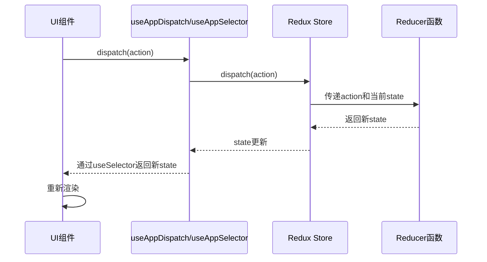
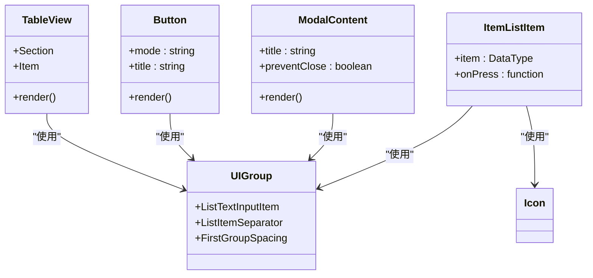
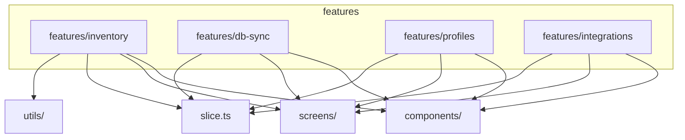
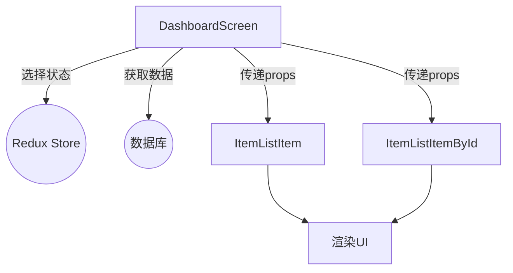

# 设计模式

<cite>
**本文档中引用的文件**  
- [store.ts](file://App/app/redux/store.ts)
- [hooks.ts](file://App/app/redux/hooks.ts)
- [slice.ts](file://App/app/features/inventory/slice.ts)
- [counter/slice.ts](file://App/app/features/counter/slice.ts)
- [counters/slice.ts](file://App/app/features/counters/slice.ts)
- [utils.ts](file://App/app/redux/utils.ts)
- [TableView.tsx](file://App/app/components/TableView/TableView.tsx)
- [Button.tsx](file://App/app/components/Button/Button.tsx)
- [ModalContent.tsx](file://App/app/components/ModalContent.tsx)
- [DashboardScreen.tsx](file://App/app/features/inventory/screens/DashboardScreen.tsx)
- [ItemsScreen.tsx](file://App/app/features/inventory/screens/ItemsScreen.tsx)
- [SaveItemScreen.tsx](file://App/app/features/inventory/screens/SaveItemScreen.tsx)
- [ItemListItem.tsx](file://App/app/features/inventory/components/ItemListItem.tsx)
- [ReduxScreen.tsx](file://App/app/screens/ReduxScreen.tsx)
- [ReduxActionDetailScreen.tsx](file://App/app/screens/ReduxActionDetailScreen.tsx)
- [README.tsx](file://App/app/components/_README/README.tsx)
</cite>

## 目录
1. [简介](#简介)
2. [Redux状态管理模式](#redux状态管理模式)
3. [组件化设计模式](#组件化设计模式)
4. [功能模块化模式](#功能模块化模式)
5. [容器组件与展示组件分离模式](#容器组件与展示组件分离模式)
6. [设计模式的综合优势](#设计模式的综合优势)

## 简介
Inventory项目采用了一系列先进的设计模式来构建一个可维护、可测试且易于团队协作的React Native应用。本设计模式文档深入分析了项目中的核心架构，包括基于Redux Toolkit的全局状态管理、高度可复用的UI组件化设计、按功能划分的模块化结构，以及容器组件与展示组件的职责分离。这些模式共同确保了代码的高内聚、低耦合，极大地提升了开发效率和代码质量。

## Redux状态管理模式

Inventory项目采用Redux Toolkit作为核心状态管理解决方案，通过`Action`、`Reducer`和`Store`的协作机制实现可预测的状态变更。项目在`App/app/redux`目录下构建了一个高度模块化和可扩展的Redux架构。

核心`store.ts`文件通过`configureStore`创建了全局Store，并利用`combineAndPersistReducers`工具函数将来自不同功能模块（如`profiles`、`devTools`）的Reducer组合在一起，实现了状态的持久化。每个功能模块（如`inventory`、`counter`）都定义了独立的Slice，包含其自身的`initialState`、`reducers`和`selectors`。例如，`inventory/slice.ts`定义了`addRecentViewedItemId`和`clearRecentViewedItemId`等Action，这些Action被集中导出到根Store的`actions`对象中，供全局调用。

为了简化状态访问，项目创建了`useAppSelector`和`useAppDispatch`两个自定义Hook。`hooks.ts`文件通过`useSelector`和`useDispatch`的类型化版本，为开发者提供了类型安全的API，避免了直接使用原生Hook可能导致的类型错误，从而提升了开发体验和代码健壮性。

**Diagram sources**
- [store.ts](file://App/app/redux/store.ts)
- [hooks.ts](file://App/app/redux/hooks.ts)
- [slice.ts](file://App/app/features/inventory/slice.ts)

**Section sources**
- [store.ts](file://App/app/redux/store.ts#L1-L124)
- [hooks.ts](file://App/app/redux/hooks.ts#L1-L8)
- [slice.ts](file://App/app/features/inventory/slice.ts#L1-L53)

## 组件化设计模式

项目遵循严格的组件化设计原则，将UI分解为一系列独立、可复用且可测试的组件。这些组件被组织在`App/app/components`目录下，根据其抽象级别分为逻辑组件、元素组件和组合组件。

`TableView`组件是一个典型的平台自适应组件，它封装了iOS原生`UITableView`和Android上`react-native-paper`的`List`组件，为开发者提供了一致的API。`Button`组件则根据平台（iOS/Android）应用不同的样式和交互逻辑，确保了跨平台的原生体验。`ModalContent`组件作为模态框的容器，负责处理键盘避让和自动对焦等复杂逻辑，而其内部的子组件则专注于内容展示。

这种设计模式使得`ItemListItem`等复杂UI可以由`UIGroup.ListItem`、`Icon`等基础组件灵活组合而成，极大地提高了UI构建的效率和一致性。

**Diagram sources**
- [TableView.tsx](file://App/app/components/TableView/TableView.tsx)
- [Button.tsx](file://App/app/components/Button/Button.tsx)
- [ModalContent.tsx](file://App/app/components/ModalContent.tsx)
- [UIGroup/index.ts](file://App/app/components/UIGroup/index.ts)

**Section sources**
- [TableView.tsx](file://App/app/components/TableView/TableView.tsx#L1-L347)
- [Button.tsx](file://App/app/components/Button/Button.tsx#L1-L195)
- [README.tsx](file://App/app/components/_README/README.tsx#L1-L40)

## 功能模块化模式

项目采用功能模块化（Feature Sliced Architecture）模式，将代码按业务功能组织在`App/app/features`目录下。每个功能模块（如`inventory`、`db-sync`、`profiles`）都是一个独立的单元，包含其自身的`components`、`screens`、`slice.ts`（状态管理）和`utils`。

以`inventory`模块为例，其`screens`目录包含了`DashboardScreen`、`ItemsScreen`和`SaveItemScreen`等页面组件，而`components`目录则存放了`ItemListItem`、`ChecklistItem`等可复用的UI组件。该模块的状态逻辑完全封装在`slice.ts`文件中，与其它模块解耦。这种高内聚、低耦合的设计使得团队可以并行开发不同的功能模块，而不会产生代码冲突，同时也极大地简化了单元测试和代码维护。

**Diagram sources**
- [DashboardScreen.tsx](file://App/app/features/inventory/screens/DashboardScreen.tsx)
- [ItemsScreen.tsx](file://App/app/features/inventory/screens/ItemsScreen.tsx)
- [SaveItemScreen.tsx](file://App/app/features/inventory/screens/SaveItemScreen.tsx)

**Section sources**
- [DashboardScreen.tsx](file://App/app/features/inventory/screens/DashboardScreen.tsx#L1-L514)
- [ItemsScreen.tsx](file://App/app/features/inventory/screens/ItemsScreen.tsx#L1-L158)
- [SaveItemScreen.tsx](file://App/app/features/inventory/screens/SaveItemScreen.tsx#L1-L800)

## 容器组件与展示组件分离模式

项目严格遵循容器组件（Smart Component）与展示组件（Dumb Component）分离的设计模式。容器组件位于`screens`目录，负责连接Redux状态、处理业务逻辑和数据获取；而展示组件位于`components`目录，仅关注UI的渲染和用户交互。

`DashboardScreen`是一个典型的容器组件，它使用`useAppSelector`从Redux Store中选择`recentViewedItemIds`等状态，并使用`useData` Hook从数据库获取`itemsCount`等数据。然后，它将这些数据作为`props`传递给`ItemListItemById`等展示组件。`ItemListItem`作为一个展示组件，其`render`函数是纯粹的，仅根据传入的`item`和`onPress`等`props`来决定如何渲染，不直接访问任何全局状态或执行数据获取操作。这种分离使得展示组件高度可复用和可测试，因为它们的输出完全由输入`props`决定。

**Diagram sources**
- [DashboardScreen.tsx](file://App/app/features/inventory/screens/DashboardScreen.tsx)
- [ItemListItem.tsx](file://App/app/features/inventory/components/ItemListItem.tsx)

**Section sources**
- [DashboardScreen.tsx](file://App/app/features/inventory/screens/DashboardScreen.tsx#L1-L514)
- [ItemListItem.tsx](file://App/app/features/inventory/components/ItemListItem.tsx#L1-L560)

## 设计模式的综合优势

Inventory项目所采用的这一系列设计模式共同构建了一个健壮、可扩展的应用架构。Redux状态管理模式确保了应用状态的单一数据源和可预测性，`useAppSelector`和`useAppDispatch`的封装极大地提升了开发效率。组件化设计模式通过创建可复用的UI原子，保证了界面的一致性并减少了重复代码。功能模块化模式实现了代码的高内聚和低耦合，使得大型团队可以高效协作。最后，容器与展示组件的分离模式清晰地划分了关注点，使得业务逻辑和UI表现层相互独立，从而显著提升了代码的可维护性和可测试性。这些模式的综合应用，为Inventory项目提供了一个坚实的技术基础。