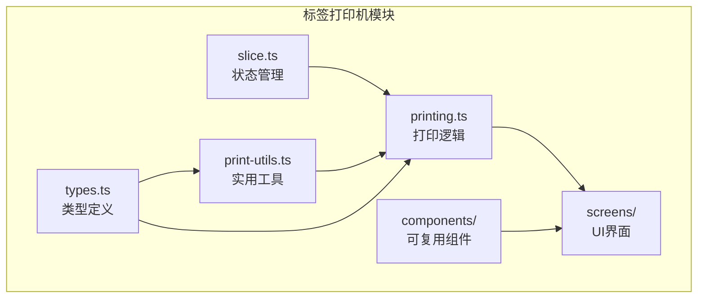
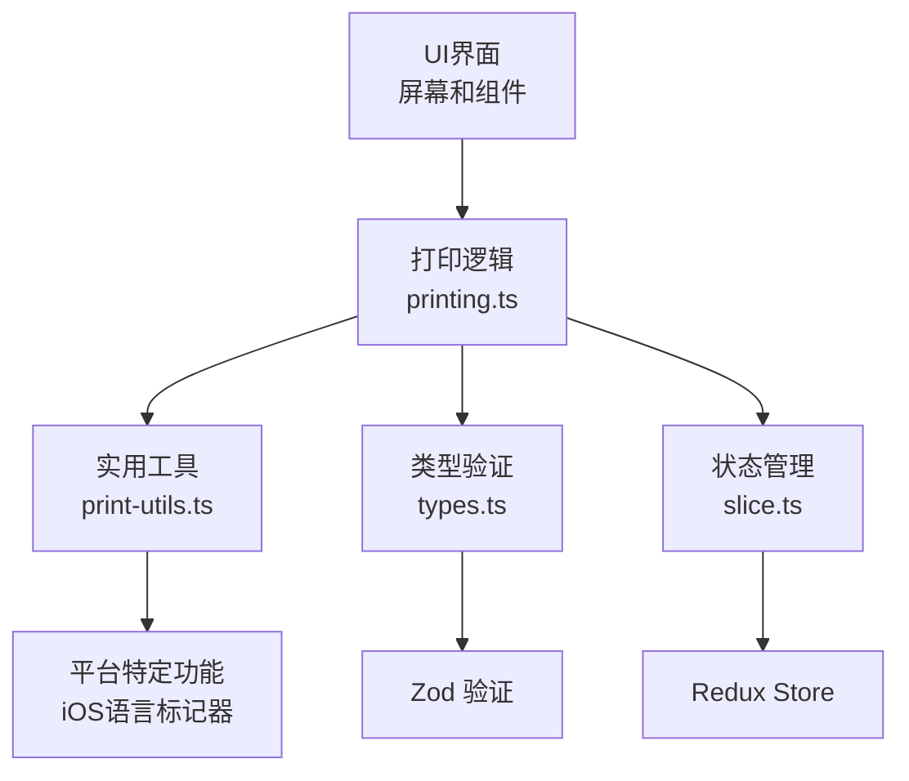
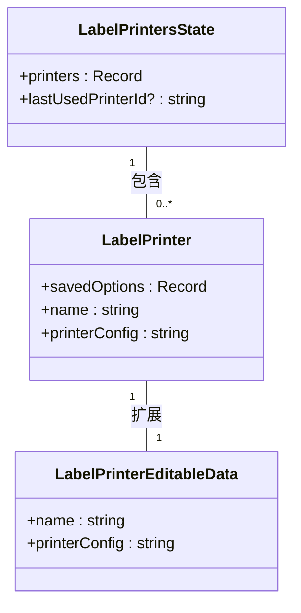
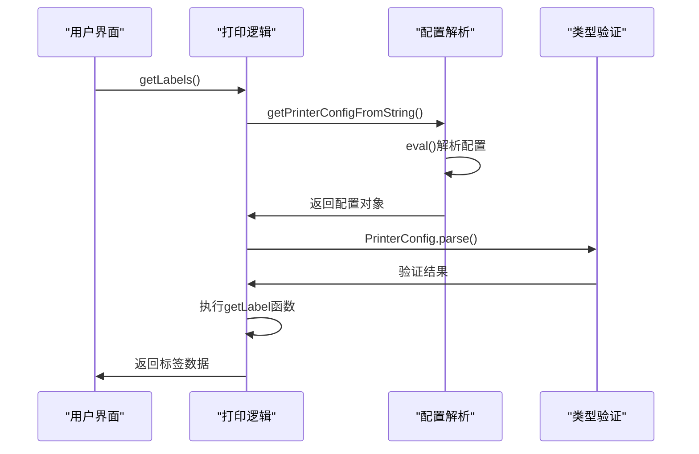
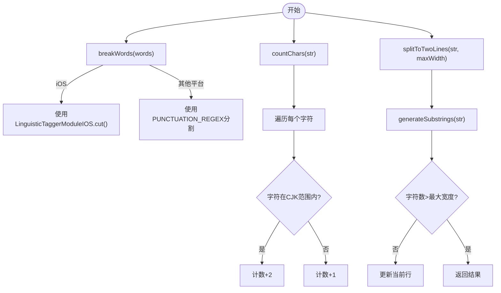
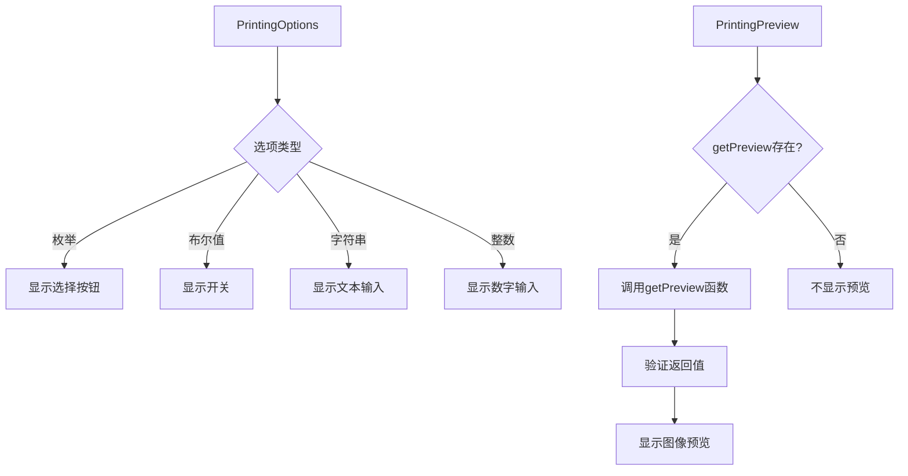
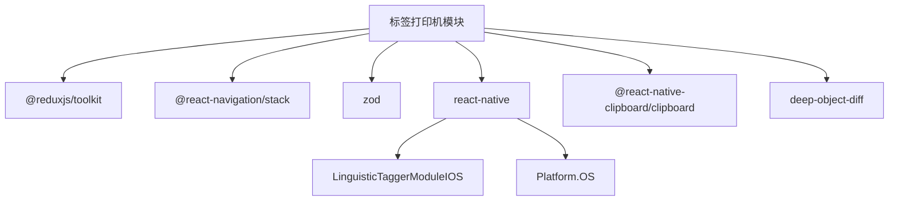

# 标签打印机集成

<cite>
**本文档中引用的文件**  
- [slice.ts](file://App/app/features/label-printers/slice.ts)
- [printing.ts](file://App/app/features/label-printers/printing.ts)
- [print-utils.ts](file://App/app/features/label-printers/print-utils.ts)
- [types.ts](file://App/app/features/label-printers/types.ts)
- [LabelPrintersScreen.tsx](file://App/app/features/label-printers/screens/LabelPrintersScreen.tsx)
- [NewOrEditLabelPrinterModalScreen.tsx](file://App/app/features/label-printers/screens/NewOrEditLabelPrinterModalScreen.tsx)
- [PrintLabelModalScreen.tsx](file://App/app/features/label-printers/screens/PrintLabelModalScreen.tsx)
- [TestPrinterConfigModalScreen.tsx](file://App/app/features/label-printers/screens/TestPrinterConfigModalScreen.tsx)
- [PrintingOptions.tsx](file://App/app/features/label-printers/components/PrintingOptions.tsx)
- [PrintingPreview.tsx](file://App/app/features/label-printers/components/PrintingPreview.tsx)
- [print-utils.test.ts](file://App/app/features/label-printers/print-utils.test.ts)
- [README.md](file://Inventory-Docs/app/label-printer-integration/README.md)
- [label-live.md](file://Inventory-Docs/app/label-printer-integration/label-live.md)
</cite>

## 目录
1. [简介](#简介)
2. [项目结构](#项目结构)
3. [核心组件](#核心组件)
4. [架构概述](#架构概述)
5. [详细组件分析](#详细组件分析)
6. [依赖分析](#依赖分析)
7. [性能考虑](#性能考虑)
8. [故障排除指南](#故障排除指南)
9. [结论](#结论)

## 简介
标签打印机集成模块为库存管理应用提供了与外部标签打印机连接和通信的功能。该系统允许用户配置打印机、定义打印模板，并将库存项目信息打印到物理标签上。通过灵活的配置系统，用户可以集成各种类型的标签打印机，实现自动化打印流程。

## 项目结构
标签打印机集成功能位于 `App/app/features/label-printers` 目录下，采用模块化设计，包含状态管理、打印逻辑、UI组件和屏幕界面。该功能与应用的Redux状态管理系统深度集成，确保打印机配置和状态在应用生命周期内持久化。

**图表来源**  
- [slice.ts](file://App/app/features/label-printers/slice.ts)
- [printing.ts](file://App/app/features/label-printers/printing.ts)
- [print-utils.ts](file://App/app/features/label-printers/print-utils.ts)
- [types.ts](file://App/app/features/label-printers/types.ts)

**本节来源**  
- [App/app/features/label-printers](file://App/app/features/label-printers)

## 核心组件
标签打印机集成系统由多个核心组件构成，包括状态管理(slice)、打印逻辑核心(printing)、实用工具函数(print-utils)和类型定义(types)。这些组件协同工作，提供完整的标签打印功能。系统通过Redux管理打印机配置和状态，支持添加、编辑和删除多个打印机配置。

**本节来源**  
- [slice.ts](file://App/app/features/label-printers/slice.ts)
- [printing.ts](file://App/app/features/label-printers/printing.ts)
- [print-utils.ts](file://App/app/features/label-printers/print-utils.ts)
- [types.ts](file://App/app/features/label-printers/types.ts)

## 架构概述
标签打印机集成采用分层架构设计，从底层的类型定义到上层的UI界面，各层职责分明。类型系统使用Zod进行运行时类型验证，确保配置数据的完整性和正确性。打印逻辑层处理标签数据生成和打印请求，而UI层提供用户友好的配置界面和打印预览功能。

**图表来源**  
- [printing.ts](file://App/app/features/label-printers/printing.ts)
- [print-utils.ts](file://App/app/features/label-printers/print-utils.ts)
- [types.ts](file://App/app/features/label-printers/types.ts)
- [slice.ts](file://App/app/features/label-printers/slice.ts)

## 详细组件分析

### 状态管理分析
标签打印机的状态管理基于Redux Toolkit实现，维护打印机配置、最后使用的打印机ID以及打印机的保存选项。系统支持添加、更新、删除打印机以及设置最后使用的打印机等操作。

**图表来源**  
- [slice.ts](file://App/app/features/label-printers/slice.ts#L14-L34)

**本节来源**  
- [slice.ts](file://App/app/features/label-printers/slice.ts)

### 打印逻辑分析
打印逻辑组件负责解析打印机配置、生成标签数据和执行打印操作。系统使用eval函数从字符串解析打印机配置对象，并通过Zod验证其结构正确性。打印过程支持中止信号，允许用户取消正在进行的打印任务。

**图表来源**  
- [printing.ts](file://App/app/features/label-printers/printing.ts#L8-L36)
- [types.ts](file://App/app/features/label-printers/types.ts#L41-L47)

**本节来源**  
- [printing.ts](file://App/app/features/label-printers/printing.ts)
- [types.ts](file://App/app/features/label-printers/types.ts)

### 实用工具分析
实用工具模块提供了一系列用于文本处理和布局计算的函数，特别针对多语言环境进行了优化。包括字符计数、单词分割和两行分割等功能，确保标签文本在不同语言环境下正确显示。

**图表来源**  
- [print-utils.ts](file://App/app/features/label-printers/print-utils.ts#L17-L139)

**本节来源**  
- [print-utils.ts](file://App/app/features/label-printers/print-utils.ts)

### UI组件分析
UI组件层提供了可复用的打印选项和预览组件，支持动态生成基于打印机配置的用户界面。系统根据配置中的选项类型（枚举、布尔值、字符串、整数）自动渲染相应的输入控件。

**图表来源**  
- [PrintingOptions.tsx](file://App/app/features/label-printers/components/PrintingOptions.tsx)
- [PrintingPreview.tsx](file://App/app/features/label-printers/components/PrintingPreview.tsx)

**本节来源**  
- [PrintingOptions.tsx](file://App/app/features/label-printers/components/PrintingOptions.tsx)
- [PrintingPreview.tsx](file://App/app/features/label-printers/components/PrintingPreview.tsx)

## 依赖分析
标签打印机集成模块依赖于多个核心系统组件，包括Redux状态管理、React Navigation导航系统和平台特定的原生模块。系统通过模块化设计降低了耦合度，同时保持了功能的完整性和可扩展性。

**图表来源**  
- [slice.ts](file://App/app/features/label-printers/slice.ts#L1-L5)
- [printing.ts](file://App/app/features/label-printers/printing.ts#L1-L6)
- [print-utils.ts](file://App/app/features/label-printers/print-utils.ts#L1-L15)

**本节来源**  
- [slice.ts](file://App/app/features/label-printers/slice.ts)
- [printing.ts](file://App/app/features/label-printers/printing.ts)
- [print-utils.ts](file://App/app/features/label-printers/print-utils.ts)

## 性能考虑
标签打印机集成在性能方面进行了多项优化。文本处理函数针对多语言环境进行了优化，特别是CJK字符的处理。系统采用延迟加载策略，在界面初始化后延迟100毫秒再加载数据，避免界面卡顿。打印操作支持中止信号，允许用户取消耗时较长的打印任务。

## 故障排除指南
当遇到标签打印机集成问题时，可以按照以下步骤进行排查：首先检查打印机配置的语法是否正确，确保JSON格式有效；其次验证getLabel和print函数的实现是否符合预期；然后检查网络连接是否正常，特别是对于网络打印机；最后查看应用日志获取详细的错误信息。系统提供了配置测试功能，可以在不实际打印的情况下验证配置的正确性。

**本节来源**  
- [NewOrEditLabelPrinterModalScreen.tsx](file://App/app/features/label-printers/screens/NewOrEditLabelPrinterModalScreen.tsx)
- [TestPrinterConfigModalScreen.tsx](file://App/app/features/label-printers/screens/TestPrinterConfigModalScreen.tsx)

## 结论
标签打印机集成模块为库存管理应用提供了强大而灵活的打印功能。通过可配置的JSON格式和JavaScript函数，系统能够适应各种类型的标签打印机和打印需求。模块化的设计使得功能易于维护和扩展，而详细的错误处理和用户友好的界面确保了良好的用户体验。该集成方案为库存管理流程的自动化提供了坚实的基础。