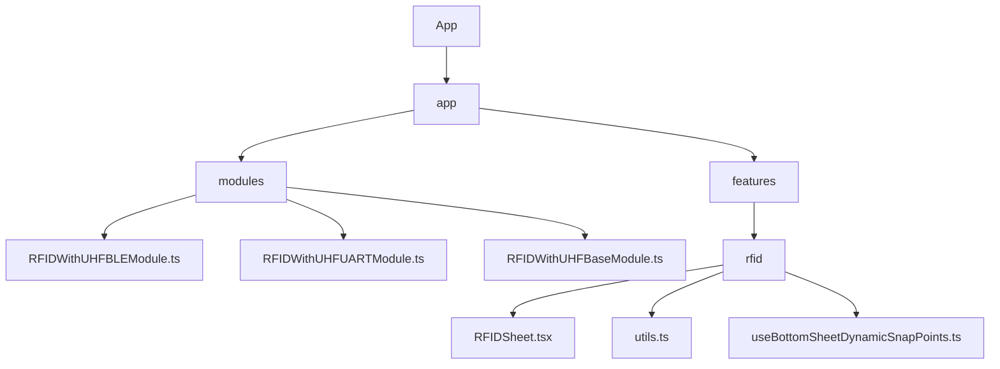
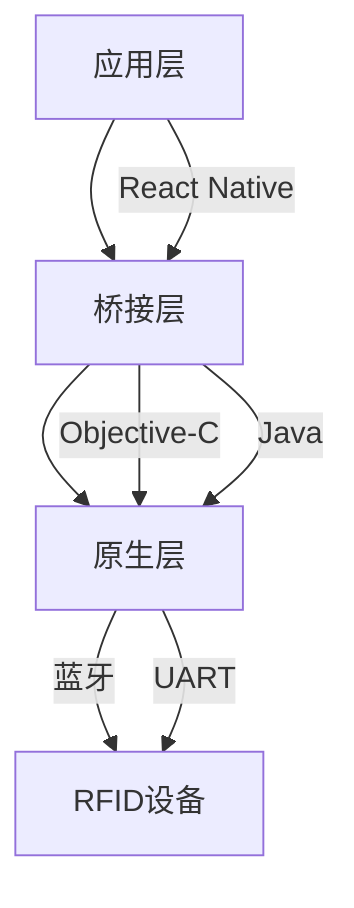
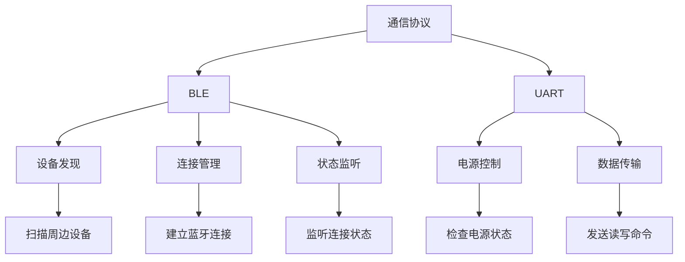
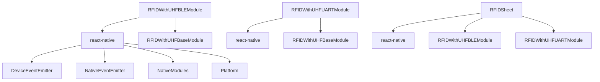

# RFID硬件集成

<cite>
**本文档引用的文件**   
- [RFIDWithUHFBLEModule.ts](file://App/app/modules/RFIDWithUHFBLEModule.ts)
- [RFIDWithUHFUARTModule.ts](file://App/app/modules/RFIDWithUHFUARTModule.ts)
- [RFIDWithUHFBaseModule.ts](file://App/app/modules/RFIDWithUHFBaseModule.ts)
- [RFIDSheet.tsx](file://App/app/features/rfid/RFIDSheet.tsx)
- [utils.ts](file://App/app/features/rfid/utils.ts)
- [RCTRFIDWithUHFBLEModule.h](file://App/ios/ReactNativeModules/RFID/Chainway/RCTRFIDWithUHFBLEModule.h)
- [RCTRFIDWithUHFBLEModule.m](file://App/ios/ReactNativeModules/RFID/Chainway/RCTRFIDWithUHFBLEModule.m)
- [BLEModel.h](file://App/ios/Libraries/RFID/Chainway/BLEModel.h)
- [BLEModel.m](file://App/ios/Libraries/RFID/Chainway/BLEModel.m)
- [AndroidManifest.xml](file://App/android/app/src/main/AndroidManifest.xml)
</cite>

## 目录
1. [简介](#简介)
2. [项目结构](#项目结构)
3. [核心组件](#核心组件)
4. [架构概述](#架构概述)
5. [详细组件分析](#详细组件分析)
6. [依赖分析](#依赖分析)
7. [性能考虑](#性能考虑)
8. [故障排除指南](#故障排除指南)
9. [结论](#结论)

## 简介
本文档详细介绍了RFID硬件集成的技术实现，重点分析了RFIDWithUHFBLEModule.ts和RFIDWithUHFUARTModule.ts两个原生模块的实现机制。文档涵盖了通过React Native桥接与原生代码通信的详细过程，包括蓝牙(BLE)和UART两种通信协议的配置参数、连接建立过程和数据传输格式。同时提供了Android和iOS平台原生代码（Java和Objective-C）的实现细节，包括权限配置、设备发现、连接管理和数据解析。为开发者提供了集成指南，说明如何在应用中注册和调用这些原生模块，处理平台特定的配置要求，以及调试硬件通信问题的方法。

## 项目结构
本项目采用模块化设计，将RFID功能相关的代码组织在特定的目录结构中。核心的RFID模块位于`App/app/modules/`目录下，包括RFIDWithUHFBLEModule.ts、RFIDWithUHFUARTModule.ts和RFIDWithUHFBaseModule.ts三个主要文件。RFID功能的用户界面组件位于`App/app/features/rfid/`目录下，其中RFIDSheet.tsx是主要的UI组件。



**图源**
- [RFIDWithUHFBLEModule.ts](file://App/app/modules/RFIDWithUHFBLEModule.ts)
- [RFIDWithUHFUARTModule.ts](file://App/app/modules/RFIDWithUHFUARTModule.ts)
- [RFIDWithUHFBaseModule.ts](file://App/app/modules/RFIDWithUHFBaseModule.ts)
- [RFIDSheet.tsx](file://App/app/features/rfid/RFIDSheet.tsx)

**本节来源**
- [RFIDWithUHFBLEModule.ts](file://App/app/modules/RFIDWithUHFBLEModule.ts)
- [RFIDWithUHFUARTModule.ts](file://App/app/modules/RFIDWithUHFUARTModule.ts)
- [RFIDWithUHFBaseModule.ts](file://App/app/modules/RFIDWithUHFBaseModule.ts)
- [RFIDSheet.tsx](file://App/app/features/rfid/RFIDSheet.tsx)

## 核心组件
RFID硬件集成的核心组件包括三个TypeScript模块：RFIDWithUHFBLEModule.ts、RFIDWithUHFUARTModule.ts和RFIDWithUHFBaseModule.ts。这些模块通过React Native的原生桥接机制与平台特定的原生代码通信，实现了对RFID设备的控制和数据读写功能。

RFIDWithUHFBaseModule.ts定义了所有RFID操作的通用接口和数据结构，包括扫描、读取、写入和锁定等操作。RFIDWithUHFBLEModule.ts和RFIDWithUHFUARTModule.ts分别实现了通过蓝牙和UART接口与RFID设备通信的具体逻辑。

**本节来源**
- [RFIDWithUHFBLEModule.ts](file://App/app/modules/RFIDWithUHFBLEModule.ts#L1-L100)
- [RFIDWithUHFUARTModule.ts](file://App/app/modules/RFIDWithUHFUARTModule.ts#L1-L15)
- [RFIDWithUHFBaseModule.ts](file://App/app/modules/RFIDWithUHFBaseModule.ts#L1-L462)

## 架构概述
RFID硬件集成的架构采用分层设计，从上到下分为应用层、桥接层和原生层。应用层使用TypeScript编写，通过React Native的模块系统调用桥接层提供的接口。桥接层负责将JavaScript调用转换为平台特定的原生调用。原生层包含平台特定的实现代码，直接与硬件设备通信。



**图源**
- [RFIDWithUHFBLEModule.ts](file://App/app/modules/RFIDWithUHFBLEModule.ts)
- [RFIDWithUHFUARTModule.ts](file://App/app/modules/RFIDWithUHFUARTModule.ts)
- [RCTRFIDWithUHFBLEModule.h](file://App/ios/ReactNativeModules/RFID/Chainway/RCTRFIDWithUHFBLEModule.h)
- [RCTRFIDWithUHFBLEModule.m](file://App/ios/ReactNativeModules/RFID/Chainway/RCTRFIDWithUHFBLEModule.m)

## 详细组件分析

### RFIDWithUHFBLEModule分析
RFIDWithUHFBLEModule.ts实现了通过蓝牙低功耗(BLE)协议与RFID设备通信的功能。该模块继承了RFIDWithUHFBaseModule中的通用功能，并添加了蓝牙特有的设备发现、连接和状态监听功能。

```mermaid
classDiagram
class RFIDWithUHFBLEModule {
+scanDevices(enable : boolean, options : ScanDevicesOptions) : Promise<void>
+addDeviceConnectStatusListener(callback : (payload : DeviceConnectStatusPayload) => void) : EmitterSubscription
+connectDevice(address : string) : Promise<void>
+disconnectDevice() : Promise<void>
+getDeviceConnectStatus() : Promise<DeviceConnectStatus>
+getDeviceBatteryLevel() : Promise<number>
+getDeviceTemperature() : Promise<number>
+triggerBeep(s : number) : Promise<number>
}
class RFIDWithUHFBaseModule {
+init() : Promise<void>
+free() : Promise<void>
+isWorking() : Promise<boolean>
+setFrequencyMode(mode : number) : Promise<void>
+getFrequencyMode() : Promise<number>
+setPower(power : number) : Promise<number>
+startScan(options : ScanOptions) : Promise<void>
+stopScan() : Promise<void>
+clearScannedTags() : Promise<void>
+startLocate(options : LocateOptions) : Promise<void>
+stopLocate() : Promise<void>
+read(options : ReadOptions) : Promise<string>
+write(options : WriteOptions) : Promise<void>
+lock(options : LockOptions) : Promise<void>
+playSound(soundName : keyof typeof SOUND_MAP) : void
+writeEpcAndLock(epc : string, newAccessPassword : string, options : { power : number, oldAccessPassword? : string, reportStatus? : (status : string) => void, filter? : FilterOptions, soundEnabled : boolean }) : Promise<void>
+resetEpcAndUnlock(oldAccessPassword : string, options : { power : number, reportStatus? : (status : string) => void, filter? : FilterOptions, soundEnabled : boolean }) : Promise<void>
}
RFIDWithUHFBLEModule --> RFIDWithUHFBaseModule : "继承"
```

**图源**
- [RFIDWithUHFBLEModule.ts](file://App/app/modules/RFIDWithUHFBLEModule.ts#L1-L100)
- [RFIDWithUHFBaseModule.ts](file://App/app/modules/RFIDWithUHFBaseModule.ts#L1-L462)

### RFIDWithUHFUARTModule分析
RFIDWithUHFUARTModule.ts实现了通过UART接口与内置RFID设备通信的功能。该模块相对简单，主要提供了电源状态检查功能，依赖于RFIDWithUHFBaseModule中的通用操作。

```mermaid
classDiagram
class RFIDWithUHFUARTModule {
+isPowerOn() : Promise<boolean>
}
class RFIDWithUHFBaseModule {
+init() : Promise<void>
+free() : Promise<void>
+isWorking() : Promise<boolean>
+setFrequencyMode(mode : number) : Promise<void>
+getFrequencyMode() : Promise<number>
+setPower(power : number) : Promise<number>
+startScan(options : ScanOptions) : Promise<void>
+stopScan() : Promise<void>
+clearScannedTags() : Promise<void>
+startLocate(options : LocateOptions) : Promise<void>
+stopLocate() : Promise<void>
+read(options : ReadOptions) : Promise<string>
+write(options : WriteOptions) : Promise<void>
+lock(options : LockOptions) : Promise<void>
+playSound(soundName : keyof typeof SOUND_MAP) : void
+writeEpcAndLock(epc : string, newAccessPassword : string, options : { power : number, oldAccessPassword? : string, reportStatus? : (status : string) => void, filter? : FilterOptions, soundEnabled : boolean }) : Promise<void>
+resetEpcAndUnlock(oldAccessPassword : string, options : { power : number, reportStatus? : (status : string) => void, filter? : FilterOptions, soundEnabled : boolean }) : Promise<void>
}
RFIDWithUHFUARTModule --> RFIDWithUHFBaseModule : "继承"
```

**图源**
- [RFIDWithUHFUARTModule.ts](file://App/app/modules/RFIDWithUHFUARTModule.ts#L1-L15)
- [RFIDWithUHFBaseModule.ts](file://App/app/modules/RFIDWithUHFBaseModule.ts#L1-L462)

### 通信协议分析
RFID硬件集成支持两种通信协议：蓝牙低功耗(BLE)和UART。BLE协议用于与外部RFID设备通信，而UART协议用于与内置RFID设备通信。



**图源**
- [RFIDWithUHFBLEModule.ts](file://App/app/modules/RFIDWithUHFBLEModule.ts)
- [RFIDWithUHFUARTModule.ts](file://App/app/modules/RFIDWithUHFUARTModule.ts)

**本节来源**
- [RFIDWithUHFBLEModule.ts](file://App/app/modules/RFIDWithUHFBLEModule.ts#L1-L100)
- [RFIDWithUHFUARTModule.ts](file://App/app/modules/RFIDWithUHFUARTModule.ts#L1-L15)

## 依赖分析
RFID硬件集成模块依赖于多个React Native核心模块和第三方库。这些依赖关系确保了模块能够正常工作并与原生代码进行通信。



**图源**
- [package.json](file://package.json)
- [RFIDWithUHFBLEModule.ts](file://App/app/modules/RFIDWithUHFBLEModule.ts)
- [RFIDWithUHFUARTModule.ts](file://App/app/modules/RFIDWithUHFUARTModule.ts)
- [RFIDSheet.tsx](file://App/app/features/rfid/RFIDSheet.tsx)

**本节来源**
- [package.json](file://package.json)
- [RFIDWithUHFBLEModule.ts](file://App/app/modules/RFIDWithUHFBLEModule.ts)
- [RFIDWithUHFUARTModule.ts](file://App/app/modules/RFIDWithUHFUARTModule.ts)

## 性能考虑
RFID硬件集成在设计时考虑了多个性能因素，包括通信效率、资源管理和用户体验。通过优化扫描频率、事件处理和内存使用，确保了应用的流畅运行。

在BLE通信中，模块使用了合理的扫描间隔和事件速率，避免了过度消耗设备电池。在数据处理方面，采用了事件驱动的架构，减少了不必要的轮询操作。对于UI响应性，使用了异步操作和状态管理，确保了用户界面的流畅性。

**本节来源**
- [RFIDWithUHFBLEModule.ts](file://App/app/modules/RFIDWithUHFBLEModule.ts)
- [RFIDWithUHFBaseModule.ts](file://App/app/modules/RFIDWithUHFBaseModule.ts)
- [RFIDSheet.tsx](file://App/app/features/rfid/RFIDSheet.tsx)

## 故障排除指南
在集成和使用RFID硬件时，可能会遇到各种问题。本节提供了一些常见的故障排除方法。

对于BLE连接问题，首先检查设备的蓝牙权限是否已授予，特别是在Android 11及以下版本中，需要`ACCESS_FINE_LOCATION`权限才能进行蓝牙扫描。其次，确认目标RFID设备处于可发现状态，并且在有效范围内。

对于数据读写失败，检查RFID标签的访问密码是否正确，以及操作权限是否足够。某些操作可能需要特定的密码才能执行。此外，确保RFID设备的电源充足，低电量可能导致通信不稳定。

**本节来源**
- [RFIDWithUHFBLEModule.ts](file://App/app/modules/RFIDWithUHFBLEModule.ts)
- [RFIDWithUHFBaseModule.ts](file://App/app/modules/RFIDWithUHFBaseModule.ts)
- [RFIDSheet.tsx](file://App/app/features/rfid/RFIDSheet.tsx)

## 结论
RFID硬件集成模块提供了一套完整的解决方案，用于在移动应用中集成RFID功能。通过清晰的分层架构和模块化设计，使得集成过程更加简单和可靠。BLE和UART两种通信协议的支持，使得该解决方案能够适应不同的硬件配置和使用场景。

开发者可以基于本文档提供的信息，快速集成RFID功能到自己的应用中，并根据具体需求进行定制和优化。随着RFID技术的不断发展，该集成方案也为未来的功能扩展提供了良好的基础。