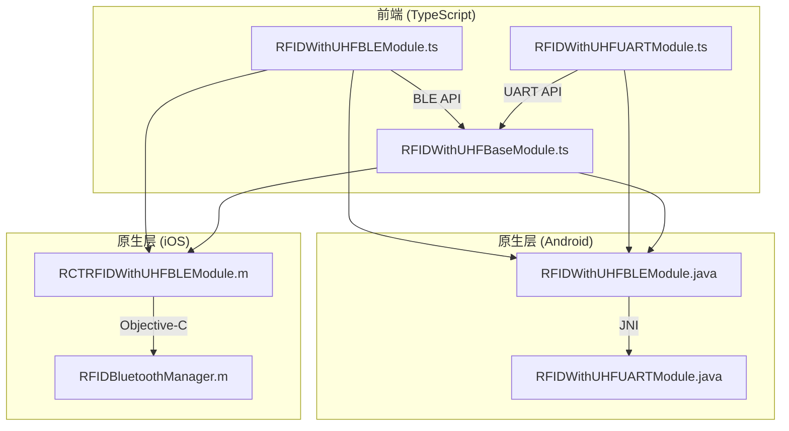
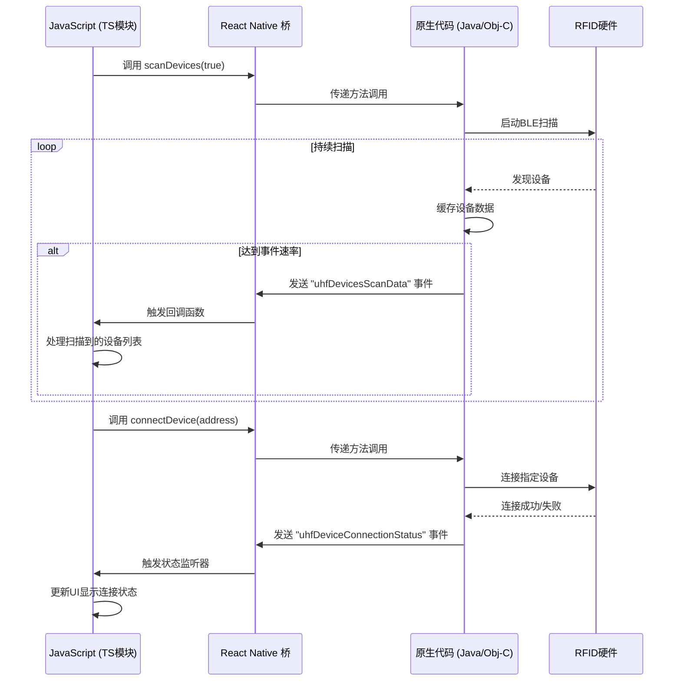
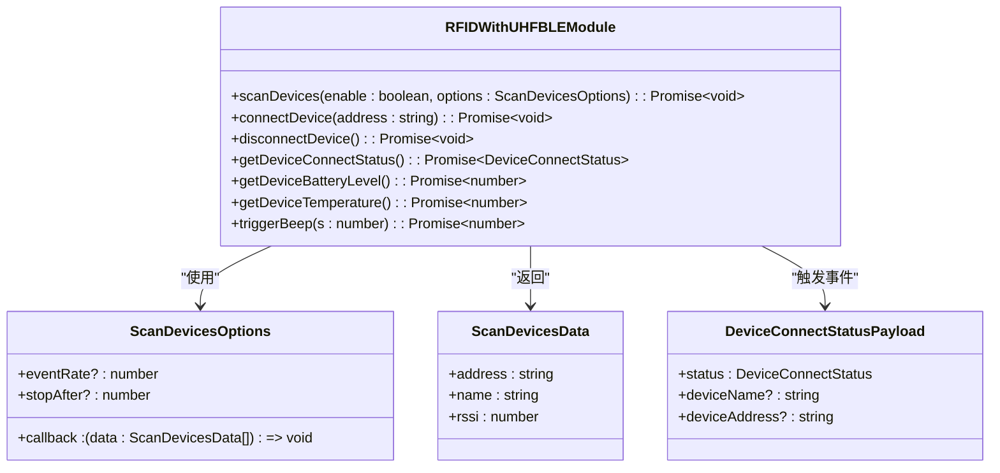
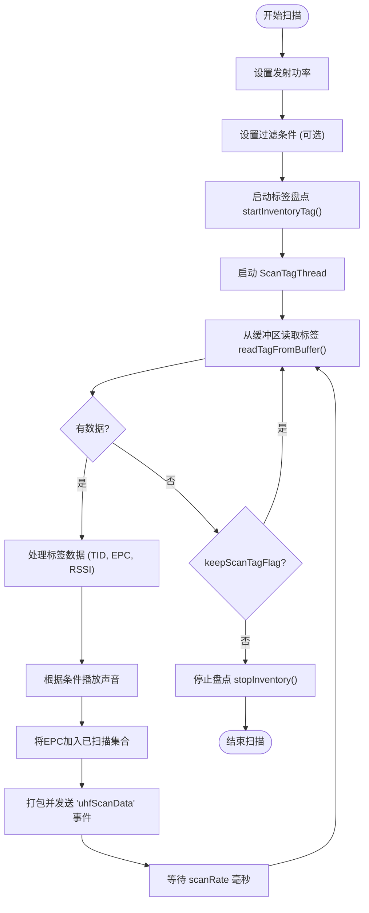
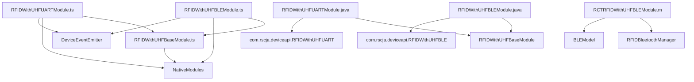

# RFID通信协议

<cite>
**本文档引用文件**  
- [RFIDWithUHFBLEModule.ts](file://App/app/modules/RFIDWithUHFBLEModule.ts)
- [RFIDWithUHFUARTModule.ts](file://App/app/modules/RFIDWithUHFUARTModule.ts)
- [RFIDWithUHFBaseModule.ts](file://App/app/modules/RFIDWithUHFBaseModule.ts)
- [RFIDWithUHFBLEModule.java](file://App/android/app/src/main/java/vg/zeta/app/inventory/RFIDWithUHFBLEModule.java)
- [RFIDWithUHFUARTModule.java](file://App/android/app/src/main/java/vg/zeta/app/inventory/RFIDWithUHFUARTModule.java)
- [RCTRFIDWithUHFBLEModule.m](file://App/ios/ReactNativeModules/RFID/Chainway/RCTRFIDWithUHFBLEModule.m)
- [RCTRFIDWithUHFBLEModule.h](file://App/ios/ReactNativeModules/RFID/Chainway/RCTRFIDWithUHFBLEModule.h)
</cite>

## 目录
1. [引言](#引言)
2. [项目结构](#项目结构)
3. [核心组件](#核心组件)
4. [架构概述](#架构概述)
5. [详细组件分析](#详细组件分析)
6. [依赖分析](#依赖分析)
7. [性能考虑](#性能考虑)
8. [故障排除指南](#故障排除指南)
9. [结论](#结论)

## 引言
本文档详细阐述了RFID通信协议的技术实现，重点分析了蓝牙低功耗（BLE）和UART串行通信两种方式在RFID硬件集成中的应用。文档深入解析了`RFIDWithUHFBLEModule.ts`中BLE通信的实现机制，包括设备扫描、连接建立、服务发现和数据读写流程；同时解释了`RFIDWithUHFUARTModule.ts`中UART通信的配置参数、波特率设置和数据帧格式。文档还对比了两种协议的性能特点、适用场景和功耗特性，提供了完整的错误处理机制，并为开发者提供了协议选择建议和性能优化指南。

## 项目结构
RFID通信功能的实现主要分布在App模块的特定目录中。核心的通信逻辑由三个主要的TypeScript模块构成：`RFIDWithUHFBLEModule.ts`负责蓝牙低功耗通信，`RFIDWithUHFUARTModule.ts`负责UART串行通信，而`RFIDWithUHFBaseModule.ts`则提供了两者共享的基础功能和数据结构。这些模块通过React Native的原生接口（NativeModules）与底层的原生代码进行交互。

在Android平台，原生实现位于`App/android/app/src/main/java/vg/zeta/app/inventory/`目录下，对应的Java类为`RFIDWithUHFBLEModule.java`和`RFIDWithUHFUARTModule.java`。在iOS平台，原生实现位于`App/ios/ReactNativeModules/RFID/Chainway/`目录下，由`RCTRFIDWithUHFBLEModule.m`和`RCTRFIDWithUHFBLEModule.h`文件构成。这种分层架构确保了上层应用逻辑的统一性，同时允许针对不同平台进行优化的底层实现。

**图源**  
- [RFIDWithUHFBLEModule.ts](file://App/app/modules/RFIDWithUHFBLEModule.ts)
- [RFIDWithUHFUARTModule.ts](file://App/app/modules/RFIDWithUHFUARTModule.ts)
- [RFIDWithUHFBaseModule.ts](file://App/app/modules/RFIDWithUHFBaseModule.ts)
- [RFIDWithUHFBLEModule.java](file://App/android/app/src/main/java/vg/zeta/app/inventory/RFIDWithUHFBLEModule.java)
- [RFIDWithUHFUARTModule.java](file://App/android/app/src/main/java/vg/zeta/app/inventory/RFIDWithUHFUARTModule.java)
- [RCTRFIDWithUHFBLEModule.m](file://App/ios/ReactNativeModules/RFID/Chainway/RCTRFIDWithUHFBLEModule.m)

**章节源**  
- [RFIDWithUHFBLEModule.ts](file://App/app/modules/RFIDWithUHFBLEModule.ts)
- [RFIDWithUHFUARTModule.ts](file://App/app/modules/RFIDWithUHFUARTModule.ts)
- [RFIDWithUHFBaseModule.ts](file://App/app/modules/RFIDWithUHFBaseModule.ts)

## 核心组件
本系统的核心组件围绕RFID读写器的通信控制展开。`RFIDWithUHFBLEModule`和`RFIDWithUHFUARTModule`是两个主要的通信模块，它们都继承了`RFIDWithUHFBaseModule`提供的通用功能。`RFIDWithUHFBaseModule`定义了内存库（Memory Bank）、过滤选项（Filter Options）、扫描选项（Scan Options）等关键数据结构和常量，如`MEMORY_BANK_MAP`和`SOUND_MAP`，为上层应用提供了统一的操作接口。

`RFIDWithUHFBLEModule`在基础功能之上，扩展了与BLE设备交互的特定方法，如`scanDevices`用于扫描附近的BLE设备，`connectDevice`和`disconnectDevice`用于管理设备连接，以及`getDeviceConnectStatus`、`getDeviceBatteryLevel`等用于获取设备状态。`RFIDWithUHFUARTModule`则相对简化，主要提供了`isPowerOn`等用于检查设备电源状态的方法，其核心的扫描和读写功能通过继承自基类的方法实现。

**章节源**  
- [RFIDWithUHFBLEModule.ts](file://App/app/modules/RFIDWithUHFBLEModule.ts#L37-L97)
- [RFIDWithUHFUARTModule.ts](file://App/app/modules/RFIDWithUHFUARTModule.ts#L6-L12)
- [RFIDWithUHFBaseModule.ts](file://App/app/modules/RFIDWithUHFBaseModule.ts#L112-L459)

## 架构概述
整个RFID通信系统的架构遵循分层设计原则。最上层是TypeScript模块，为React Native应用提供清晰、易用的JavaScript API。中间层是React Native的原生桥接（Native Bridge），它负责在JavaScript线程和原生线程之间传递消息和数据。最底层是平台特定的原生代码（Android的Java和iOS的Objective-C），直接与硬件或硬件驱动库（如`com.rscja.deviceapi.RFIDWithUHFBLE`）进行交互。

事件驱动是该架构的关键。当底层硬件产生数据（如扫描到新的RFID标签）或状态发生变化（如设备连接状态改变）时，原生代码会通过`DeviceEventEmitter`（Android）或`RCTEventEmitter`（iOS）向JavaScript层发送事件。JavaScript层通过`addListener`订阅这些事件，从而实现异步、非阻塞的通信。

**图源**  
- [RFIDWithUHFBLEModule.ts](file://App/app/modules/RFIDWithUHFBLEModule.ts#L41-L61)
- [RFIDWithUHFBLEModule.java](file://App/android/app/src/main/java/vg/zeta/app/inventory/RFIDWithUHFBLEModule.java#L124-L150)
- [RCTRFIDWithUHFBLEModule.m](file://App/ios/ReactNativeModules/RFID/Chainway/RCTRFIDWithUHFBLEModule.m#L47-L76)

## 详细组件分析

### BLE通信模块分析
`RFIDWithUHFBLEModule`是实现蓝牙低功耗通信的核心。它通过封装原生的BLE API，为上层应用提供了简化的接口。

#### 设备扫描与连接
设备扫描通过`scanDevices`方法实现。该方法接收一个布尔值`enable`来控制扫描的开启和关闭，以及一个`ScanDevicesOptions`对象，其中包含回调函数和事件速率等参数。在Android实现中，它调用`uhfReader.startScanBTDevices`并传入一个`ScanBTCallback`，该回调会持续接收扫描到的设备信息，并根据`eventRate`将一批设备数据打包后通过`DeviceEventManagerModule`发送到JavaScript层。在iOS实现中，它调用`[RFIDBluetoothManager shareManager] startBleScan`来启动扫描。

连接过程由`connectDevice`方法处理。它接收一个设备地址（`address`），并调用原生方法建立连接。连接状态的变化通过`addDeviceConnectStatusListener`监听，原生代码会根据`ConnectionStatusCallback`的状态变化（CONNECTED, CONNECTING, DISCONNECTED）发送相应的事件。

**图源**  
- [RFIDWithUHFBLEModule.ts](file://App/app/modules/RFIDWithUHFBLEModule.ts#L37-L97)
- [RFIDWithUHFBLEModule.java](file://App/android/app/src/main/java/vg/zeta/app/inventory/RFIDWithUHFBLEModule.java#L108-L156)

#### 数据读写与高级功能
数据读写功能（`read`, `write`, `lock`）以及标签定位（`startLocate`）等功能都继承自`RFIDWithUHFBaseModule`。这些方法的调用流程与扫描和连接类似：JavaScript调用 -> 原生桥接 -> 原生代码执行 -> （可选）结果返回或事件触发。

一个值得注意的高级功能是`writeEpcAndLock`，它将写入EPC、设置访问密码和锁定标签三个操作封装成一个原子性流程，确保了标签写入的安全性。该方法在内部按顺序调用`write`和`lock`，并处理了可能的错误，提供了`reportStatus`回调来通知上层操作进度。

**章节源**  
- [RFIDWithUHFBLEModule.ts](file://App/app/modules/RFIDWithUHFBLEModule.ts)
- [RFIDWithUHFBaseModule.ts](file://App/app/modules/RFIDWithUHFBaseModule.ts)
- [RFIDWithUHFBLEModule.java](file://App/android/app/src/main/java/vg/zeta/app/inventory/RFIDWithUHFBLEModule.java)

### UART通信模块分析
`RFIDWithUHFUARTModule`模块负责通过UART（通用异步收发传输器）与RFID读写器通信。与BLE模块相比，它的接口更为简单，目前主要提供了`isPowerOn`方法来检查设备的电源状态。

其核心的扫描和读写功能同样继承自`RFIDWithUHFBaseModule`。在Android实现中，`RFIDWithUHFUARTModule.java`的结构与`RFIDWithUHFBLEModule.java`高度相似，共享了`ScanTagThread`等内部类，这表明两种通信方式在数据处理逻辑上是统一的，区别主要在于物理层的连接和初始化。

**图源**  
- [RFIDWithUHFUARTModule.java](file://App/android/app/src/main/java/vg/zeta/app/inventory/RFIDWithUHFUARTModule.java#L183-L247)
- [RFIDWithUHFBLEModule.java](file://App/android/app/src/main/java/vg/zeta/app/inventory/RFIDWithUHFBLEModule.java#L346-L413)

**章节源**  
- [RFIDWithUHFUARTModule.ts](file://App/app/modules/RFIDWithUHFUARTModule.ts)
- [RFIDWithUHFUARTModule.java](file://App/android/app/src/main/java/vg/zeta/app/inventory/RFIDWithUHFUARTModule.java)

## 依赖分析
RFID模块的依赖关系清晰地体现了其分层架构。`RFIDWithUHFBLEModule`和`RFIDWithUHFUARTModule`都直接依赖于`RFIDWithUHFBaseModule`，以复用其定义的数据结构和基础操作。同时，它们都依赖于React Native的核心模块，如`NativeModules`和`DeviceEventEmitter`，以实现与原生层的通信。

在原生层，Android的`RFIDWithUHFBLEModule.java`和`RFIDWithUHFUARTModule.java`都依赖于第三方库`com.rscja.deviceapi`中的`RFIDWithUHFBLE`和`RFIDWithUHFUART`类，这些类封装了与具体硬件通信的底层细节。iOS的`RCTRFIDWithUHFBLEModule.m`则依赖于`RFIDBluetoothManager`和`BLEModel`等内部Objective-C类。

**图源**  
- [RFIDWithUHFBLEModule.ts](file://App/app/modules/RFIDWithUHFBLEModule.ts#L1-L10)
- [RFIDWithUHFUARTModule.ts](file://App/app/modules/RFIDWithUHFUARTModule.ts#L1-L4)
- [RFIDWithUHFBaseModule.ts](file://App/app/modules/RFIDWithUHFBaseModule.ts#L1-L5)

**章节源**  
- [RFIDWithUHFBLEModule.ts](file://App/app/modules/RFIDWithUHFBLEModule.ts)
- [RFIDWithUHFUARTModule.ts](file://App/app/modules/RFIDWithUHFUARTModule.ts)
- [RFIDWithUHFBaseModule.ts](file://App/app/modules/RFIDWithUHFBaseModule.ts)

## 性能考虑
BLE和UART通信在性能上各有特点。BLE通信的优点是无线连接，便于移动设备集成，但其连接建立过程相对较慢，且持续扫描会显著增加功耗。代码中通过`eventRate`参数控制事件发送频率，避免了过于频繁的JS线程调用，有助于提升性能。

UART通信通常通过有线连接（如USB转串口），其数据传输速率稳定且延迟低，功耗也相对较低，因为它不需要维持无线连接。然而，它牺牲了移动性。在实现上，两种通信方式都使用了后台线程（如`ScanTagThread`）来处理数据读取，避免阻塞主线程，保证了应用的流畅性。

对于电池供电的设备，建议在不使用时及时调用`stopScan`和`disconnectDevice`来释放资源，以延长电池寿命。同时，合理设置`scanRate`和`eventRate`可以在数据实时性和性能消耗之间取得平衡。

## 故障排除指南
系统内置了完善的错误处理机制。所有异步操作均返回`Promise`，开发者应使用`try-catch`或`.catch()`来捕获和处理错误。

*   **连接超时/失败**：在调用`connectDevice`时可能发生。应检查设备是否已开启、电量是否充足、距离是否过远。代码中`connectDevice`的实现包含了重试逻辑（先断开再连接）。
*   **数据校验失败**：在读写操作中，如果返回的数据为空或校验失败，原生代码会`reject` Promise。这通常由信号干扰、标签距离过远或访问密码错误导致。
*   **设备意外断开**：通过监听`uhfDeviceConnectionStatus`事件，应用可以及时感知设备断开，并提示用户重新连接。
*   **操作失败**：如`setPower`、`startInventoryTag`等方法返回`false`，表明底层硬件操作失败。应检查硬件状态或重启设备。

日志是排查问题的重要工具。Android代码中使用`Log.i(TAG, ...)`，iOS代码中使用`NSLog(...)`，这些日志可以帮助定位问题发生的代码位置。

**章节源**  
- [RFIDWithUHFBLEModule.java](file://App/android/app/src/main/java/vg/zeta/app/inventory/RFIDWithUHFBLEModule.java#L67-L75)
- [RFIDWithUHFBLEModule.java](file://App/android/app/src/main/java/vg/zeta/app/inventory/RFIDWithUHFBLEModule.java#L597-L604)
- [RCTRFIDWithUHFBLEModule.m](file://App/ios/ReactNativeModules/RFID/Chainway/RCTRFIDWithUHFBLEModule.m#L25-L31)

## 结论
本文档详细分析了库存管理应用中的RFID通信协议实现。系统通过`RFIDWithUHFBLEModule`和`RFIDWithUHFUARTModule`两个模块，分别支持蓝牙低功耗和UART两种通信方式，为不同的硬件集成场景提供了灵活性。其分层架构和事件驱动模型确保了代码的可维护性和应用的响应性。

对于开发者，建议根据具体需求选择通信协议：追求移动性和便捷性时选择BLE；追求稳定性和低功耗时选择UART。在使用时，应妥善处理Promise的错误，并利用提供的状态监听器构建健壮的用户界面。通过遵循本文档的指导，可以有效地集成和管理RFID硬件，实现高效的库存盘点功能。