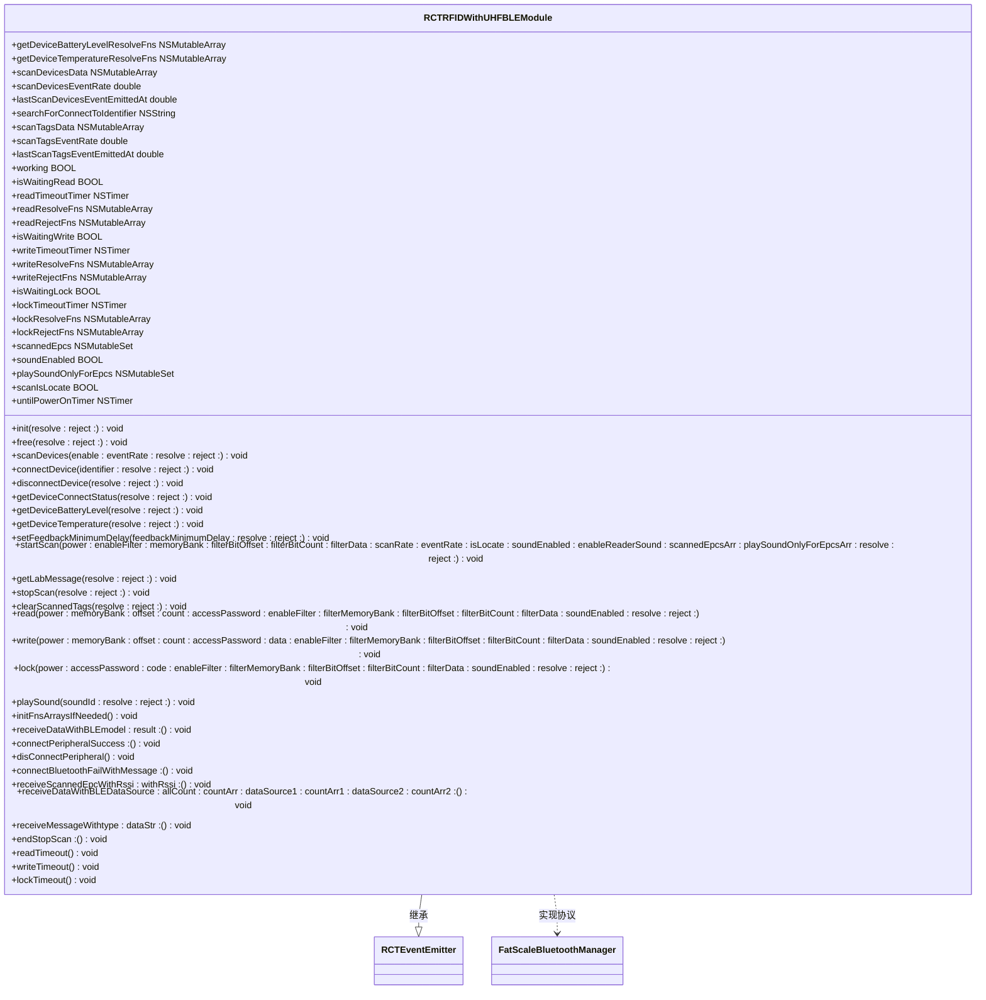
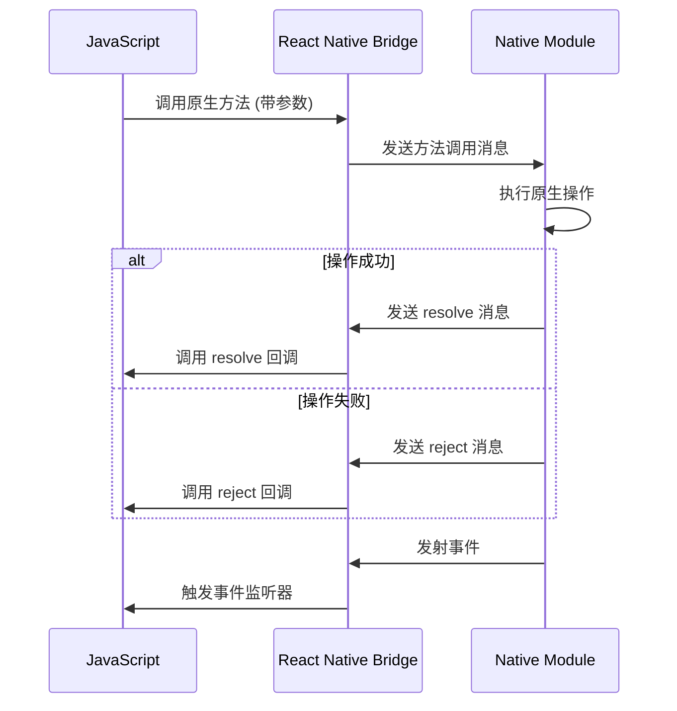

# 平台适配实现

<cite>
**本文档中引用的文件**  
- [RFIDWithUHFBLEModule.java](file://App/android/app/src/main/java/vg/zeta/app/inventory/RFIDWithUHFBLEModule.java)
- [RFIDWithUHFUARTModule.java](file://App/android/app/src/main/java/vg/zeta/app/inventory/RFIDWithUHFUARTModule.java)
- [RCTRFIDWithUHFBLEModule.h](file://App/ios/ReactNativeModules/RFID/Chainway/RCTRFIDWithUHFBLEModule.h)
- [RCTRFIDWithUHFBLEModule.m](file://App/ios/ReactNativeModules/RFID/Chainway/RCTRFIDWithUHFBLEModule.m)
- [RFIDBluetoothManager.h](file://App/ios/Libraries/RFID/Chainway/RFIDBluetoothManager.h)
- [RFIDBluetoothManager.m](file://App/ios/Libraries/RFID/Chainway/RFIDBluetoothManager.m)
</cite>

## 目录
1. [引言](#引言)
2. [Android平台实现](#android平台实现)
3. [iOS平台实现](#ios平台实现)
4. [React Native桥接原理](#react-native桥接原理)
5. [平台特定调试技巧](#平台特定调试技巧)
6. [结论](#结论)

## 引言

本技术文档深入分析了Inventory应用中RFID功能在Android和iOS平台的原生代码实现。文档详细阐述了Android端Java代码中`RFIDWithUHFBLEModule.java`和`RFIDWithUHFUARTModule.java`的实现细节，包括蓝牙权限配置、设备管理、串口通信和线程处理机制。同时，文档解析了iOS端Objective-C代码中`RCTRFIDWithUHFBLEModule.h`和`RCTRFIDWithUHFBLEModule.m`的桥接实现，涵盖原生模块注册、方法导出和事件发射机制。此外，文档还说明了JavaScript与原生代码之间的通信流程，并提供了平台特定的调试技巧和常见问题解决方案。

## Android平台实现

Android平台的RFID功能通过Java原生模块实现，主要涉及蓝牙通信和串口通信两种方式。核心实现位于`RFIDWithUHFBLEModule.java`和`RFIDWithUHFUARTModule.java`文件中。

### 蓝牙权限与设备管理

在Android平台上，RFID模块通过蓝牙与外部设备通信。系统通过`BluetoothAdapter`和`BluetoothManager`管理蓝牙设备的扫描、连接和数据传输。模块在初始化时会检查蓝牙权限，并通过`startLeScan`和`stopLeScan`方法控制蓝牙低功耗（BLE）扫描。设备连接通过`connectPeripheral`方法实现，该方法接受设备标识符并建立连接。

### 串口通信机制

对于需要串口通信的场景，系统通过`RFIDWithUHFUARTModule`类实现。该模块管理串口设备的打开、关闭、读取和写入操作。通信参数如波特率、数据位、停止位和校验位在初始化时配置。数据读取通过异步线程实现，确保UI线程不被阻塞。

### 线程处理与异步操作

Android实现中采用了多线程处理机制来管理耗时的I/O操作。蓝牙扫描和数据读取在后台线程中执行，通过`Handler`和`Looper`机制将结果回调到主线程。对于Promise-based的API调用，系统使用`ReactPromise`对象在操作完成后返回结果或错误。

**Section sources**
- [RFIDWithUHFBLEModule.java](file://App/android/app/src/main/java/vg/zeta/app/inventory/RFIDWithUHFBLEModule.java)
- [RFIDWithUHFUARTModule.java](file://App/android/app/src/main/java/vg/zeta/app/inventory/RFIDWithUHFUARTModule.java)

## iOS平台实现

iOS平台的RFID功能通过Objective-C原生模块实现，主要基于Core Bluetooth框架进行蓝牙通信。

### 原生模块注册与桥接

iOS原生模块`RCTRFIDWithUHFBLEModule`继承自`RCTEventEmitter`并实现`RCTBridgeModule`协议。模块通过`RCT_EXPORT_MODULE`宏注册到React Native桥接系统，使其在JavaScript端可被访问。模块支持的事件通过`supportedEvents`方法声明，包括`uhfDevicesScanData`、`uhfDeviceConnectionStatus`、`uhfScanData`和`uhfLocateValue`。

### 方法导出机制

原生方法通过`RCT_EXPORT_METHOD`宏导出到JavaScript环境。每个导出方法接受Promise的resolve和reject回调作为参数，实现异步操作的结果返回。例如，`scanDevices`方法控制蓝牙扫描的开启和关闭，`connectDevice`方法处理设备连接，`startScan`和`stopScan`方法管理标签扫描过程。

### 事件发射机制

模块通过`sendEventWithName:body:`方法向JavaScript端发射事件。事件数据以字典形式组织，包含相关状态信息。例如，在蓝牙设备扫描过程中，系统定期收集扫描到的设备信息并打包成数组，当达到指定事件速率或扫描结束时，通过`uhfDevicesScanData`事件将数据批量发送到JavaScript端。

**Diagram sources**
- [RCTRFIDWithUHFBLEModule.h](file://App/ios/ReactNativeModules/RFID/Chainway/RCTRFIDWithUHFBLEModule.h)
- [RCTRFIDWithUHFBLEModule.m](file://App/ios/ReactNativeModules/RFID/Chainway/RCTRFIDWithUHFBLEModule.m)

**Section sources**
- [RCTRFIDWithUHFBLEModule.h](file://App/ios/ReactNativeModules/RFID/Chainway/RCTRFIDWithUHFBLEModule.h)
- [RCTRFIDWithUHFBLEModule.m](file://App/ios/ReactNativeModules/RFID/Chainway/RCTRFIDWithUHFBLEModule.m)

## React Native桥接原理

React Native桥接机制实现了JavaScript与原生代码之间的双向通信。桥接系统基于异步消息传递，通过序列化和反序列化JSON数据在不同线程间传递信息。

### 通信流程

JavaScript代码通过模块调用触发原生方法，桥接系统将调用信息打包并通过消息队列发送到原生线程。原生代码执行相应操作后，通过Promise的resolve或reject回调，或通过事件发射器将结果返回到JavaScript线程。整个过程是非阻塞的，确保了应用的响应性。

### 数据序列化

所有在JavaScript和原生代码之间传递的数据都必须是可序列化的。复杂对象被转换为JSON格式进行传输。对于二进制数据，通常采用Base64编码。事件数据和方法参数都遵循这一序列化规则。

**Diagram sources**
- [RCTRFIDWithUHFBLEModule.m](file://App/ios/ReactNativeModules/RFID/Chainway/RCTRFIDWithUHFBLEModule.m)

## 平台特定调试技巧

### Android蓝牙权限问题

在Android 12及以上版本中，蓝牙权限模型发生了变化。除了`BLUETOOTH`和`BLUETOOTH_ADMIN`权限外，还需要`BLUETOOTH_SCAN`和`BLUETOOTH_CONNECT`权限。这些权限必须在运行时动态请求。调试时应检查`AndroidManifest.xml`文件中的权限声明，并确保在代码中正确处理权限请求的回调。

### iOS后台运行限制

iOS系统对后台蓝牙操作有严格限制。应用在后台时，蓝牙扫描和连接可能会被系统暂停。为解决此问题，应在`Info.plist`中配置适当的后台模式，如`bluetooth-central`。此外，应实现适当的超时和重连机制，以应对系统可能终止后台连接的情况。

### 常见问题解决方案

- **设备连接失败**：检查设备是否在范围内，蓝牙是否已开启，以及设备是否已被其他应用占用。
- **数据读取超时**：增加操作超时时间，检查设备电池电量，或尝试重新连接。
- **事件发射延迟**：调整事件发射速率，避免过于频繁的事件发射导致性能问题。
- **内存泄漏**：确保在模块销毁时正确清理定时器、监听器和资源引用。

**Section sources**
- [RFIDWithUHFBLEModule.java](file://App/android/app/src/main/java/vg/zeta/app/inventory/RFIDWithUHFBLEModule.java)
- [RCTRFIDWithUHFBLEModule.m](file://App/ios/ReactNativeModules/RFID/Chainway/RCTRFIDWithUHFBLEModule.m)

## 结论

本技术文档详细分析了Inventory应用中RFID功能在Android和iOS平台的原生实现。Android端通过Java实现蓝牙和串口通信，采用多线程处理确保UI流畅性。iOS端通过Objective-C实现，利用Core Bluetooth框架进行设备管理。React Native桥接机制实现了JavaScript与原生代码的高效通信。通过理解这些实现细节和调试技巧，开发者可以更有效地维护和扩展RFID功能，解决平台特定的问题。