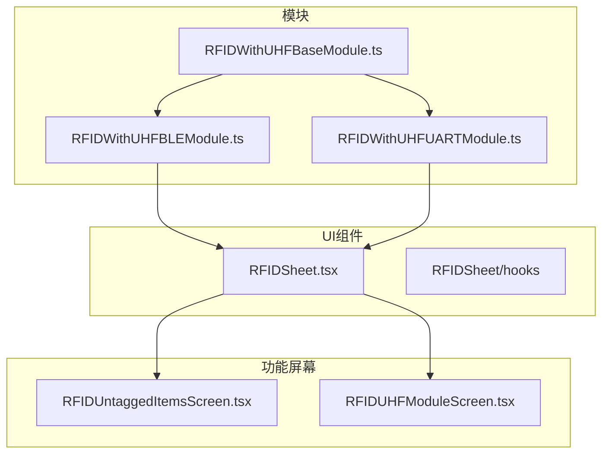
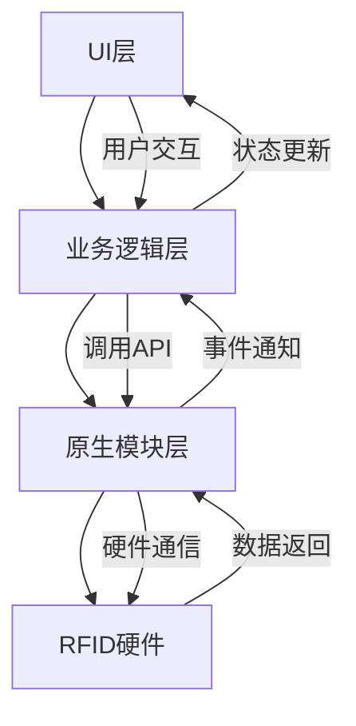
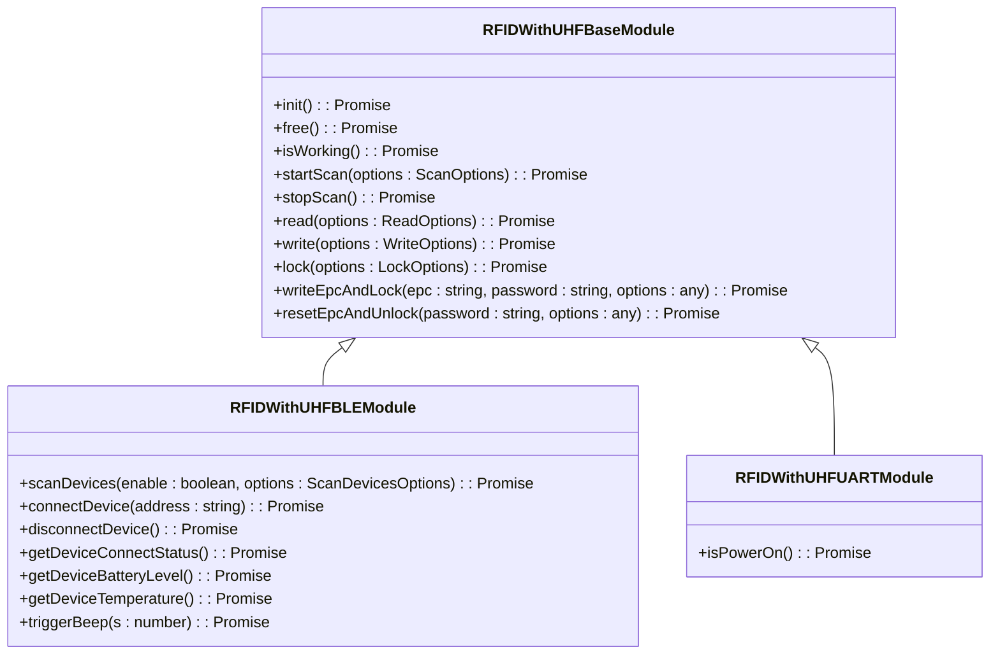
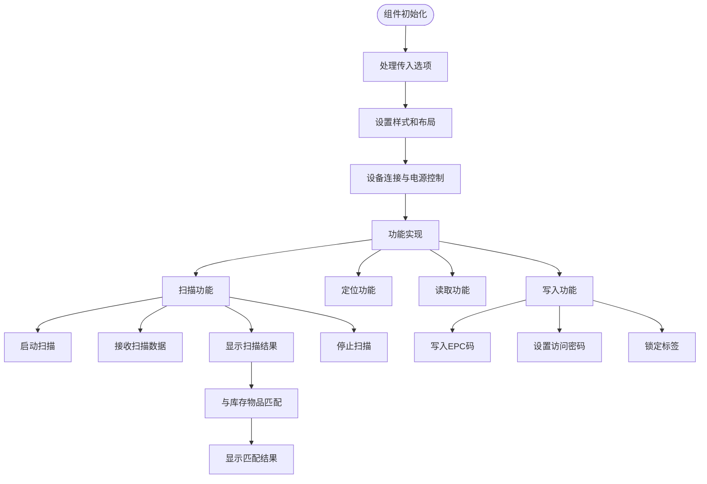
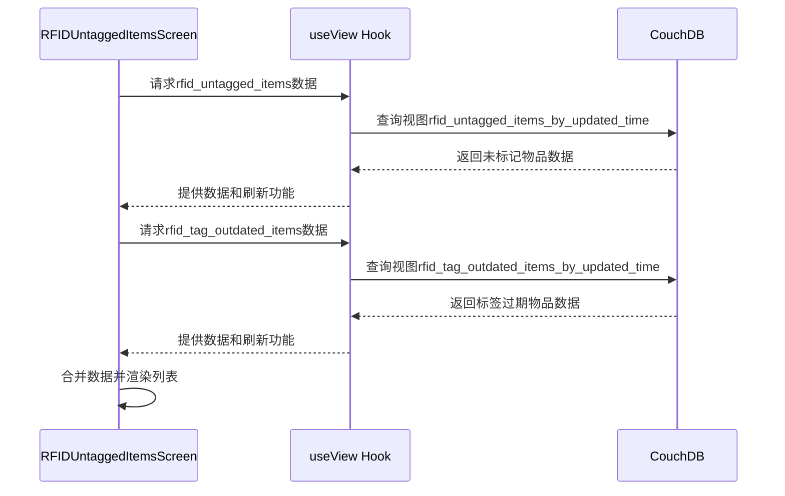

# RFID管理

<cite>
**本文档中引用的文件**  
- [RFIDWithUHFBLEModule.ts](file://App\app\modules\RFIDWithUHFBLEModule.ts)
- [RFIDWithUHFUARTModule.ts](file://App\app\modules\RFIDWithUHFUARTModule.ts)
- [RFIDWithUHFBaseModule.ts](file://App\app\modules\RFIDWithUHFBaseModule.ts)
- [RFIDSheet.tsx](file://App\app\features\rfid\RFIDSheet.tsx)
- [RFIDUntaggedItemsScreen.tsx](file://App\app\features\inventory\screens\RFIDUntaggedItemsScreen.tsx)
- [RFIDUHFModuleScreen.tsx](file://App\app\screens\RFIDUHFModuleScreen.tsx)
</cite>

## 目录
1. [简介](#简介)
2. [项目结构](#项目结构)
3. [核心组件](#核心组件)
4. [架构概述](#架构概述)
5. [详细组件分析](#详细组件分析)
6. [依赖分析](#依赖分析)
7. [性能考虑](#性能考虑)
8. [故障排除指南](#故障排除指南)
9. [结论](#结论)

## 简介
本文档详细介绍了库存管理应用中RFID管理功能的实现。文档涵盖了RFID硬件模块的集成方式，包括蓝牙（BLE）和UART两种通信协议的实现。详细描述了RFIDSheet组件的用户界面和交互逻辑，包括如何启动扫描、显示结果和处理标签数据。同时说明了应用如何将扫描到的EPC码与库存物品进行匹配。为开发者提供了调用原生模块API执行读取和写入操作的指南，并介绍了如何处理异步事件和错误情况。

## 项目结构
RFID管理功能分布在多个目录中，主要包含原生模块、UI组件和功能屏幕。原生模块位于`App\app\modules`目录下，UI组件位于`App\app\features\rfid`目录下，相关功能屏幕分布在`App\app\features\inventory\screens`和其他屏幕目录中。



**图源**  
- [RFIDWithUHFBLEModule.ts](file://App\app\modules\RFIDWithUHFBLEModule.ts)
- [RFIDWithUHFUARTModule.ts](file://App\app\modules\RFIDWithUHFUARTModule.ts)
- [RFIDSheet.tsx](file://App\app\features\rfid\RFIDSheet.tsx)
- [RFIDUntaggedItemsScreen.tsx](file://App\app\features\inventory\screens\RFIDUntaggedItemsScreen.tsx)
- [RFIDUHFModuleScreen.tsx](file://App\app\screens\RFIDUHFModuleScreen.tsx)

**章节源**  
- [RFIDWithUHFBLEModule.ts](file://App\app\modules\RFIDWithUHFBLEModule.ts)
- [RFIDWithUHFUARTModule.ts](file://App\app\modules\RFIDWithUHFUARTModule.ts)
- [RFIDSheet.tsx](file://App\app\features\rfid\RFIDSheet.tsx)

## 核心组件
RFID管理功能的核心组件包括三个模块文件和一个UI组件。`RFIDWithUHFBaseModule.ts`提供了RFID功能的基础实现，`RFIDWithUHFBLEModule.ts`和`RFIDWithUHFUARTModule.ts`分别实现了蓝牙和UART通信协议。`RFIDSheet.tsx`是主要的UI组件，负责处理用户交互和显示扫描结果。

**章节源**  
- [RFIDWithUHFBaseModule.ts](file://App\app\modules\RFIDWithUHFBaseModule.ts)
- [RFIDWithUHFBLEModule.ts](file://App\app\modules\RFIDWithUHFBLEModule.ts)
- [RFIDWithUHFUARTModule.ts](file://App\app\modules\RFIDWithUHFUARTModule.ts)
- [RFIDSheet.tsx](file://App\app\features\rfid\RFIDSheet.tsx)

## 架构概述
RFID管理功能采用分层架构，分为原生模块层、业务逻辑层和UI层。原生模块层直接与硬件通信，业务逻辑层处理RFID操作的逻辑，UI层负责用户交互和数据显示。



**图源**  
- [RFIDWithUHFBaseModule.ts](file://App\app\modules\RFIDWithUHFBaseModule.ts)
- [RFIDSheet.tsx](file://App\app\features\rfid\RFIDSheet.tsx)

## 详细组件分析

### RFID模块分析
RFID模块采用继承和组合的设计模式，`RFIDWithUHFBaseModule.ts`作为基类提供通用功能，`RFIDWithUHFBLEModule.ts`和`RFIDWithUHFUARTModule.ts`分别扩展基类以支持不同的通信协议。



**图源**  
- [RFIDWithUHFBaseModule.ts](file://App\app\modules\RFIDWithUHFBaseModule.ts)
- [RFIDWithUHFBLEModule.ts](file://App\app\modules\RFIDWithUHFBLEModule.ts)
- [RFIDWithUHFUARTModule.ts](file://App\app\modules\RFIDWithUHFUARTModule.ts)

### RFIDSheet组件分析
RFIDSheet组件是RFID功能的主要用户界面，支持扫描、定位、读取和写入等多种功能。组件通过ref传递选项，实现了灵活的功能配置。



**图源**  
- [RFIDSheet.tsx](file://App\app\features\rfid\RFIDSheet.tsx)

**章节源**  
- [RFIDSheet.tsx](file://App\app\features\rfid\RFIDSheet.tsx)

### RFIDUntaggedItemsScreen分析
RFIDUntaggedItemsScreen用于显示未标记和标签过期的物品，通过CouchDB视图获取相关数据并展示。



**图源**  
- [RFIDUntaggedItemsScreen.tsx](file://App\app\features\inventory\screens\RFIDUntaggedItemsScreen.tsx)

**章节源**  
- [RFIDUntaggedItemsScreen.tsx](file://App\app\features\inventory\screens\RFIDUntaggedItemsScreen.tsx)

## 依赖分析
RFID管理功能依赖于多个原生模块和第三方库。主要依赖包括React Native的原生模块系统、蓝牙通信库、以及UI组件库。

```mermaid
graph TD
A[RFIDWithUHFBLEModule] --> B[React Native NativeModules]
A --> C[DeviceEventEmitter]
A --> D[NativeEventEmitter]
E[RFIDWithUHFUARTModule] --> B
F[RFIDSheet] --> G[React Native Components]
F --> H[@gorhom/bottom-sheet]
F --> I[@react-native-community/slider]
F --> J[EPCUtils]
K[RFIDUntaggedItemsScreen] --> L[useView Hook]
K --> M[SectionList]
```

**图源**  
- [RFIDWithUHFBLEModule.ts](file://App\app\modules\RFIDWithUHFBLEModule.ts)
- [RFIDWithUHFUARTModule.ts](file://App\app\modules\RFIDWithUHFUARTModule.ts)
- [RFIDSheet.tsx](file://App\app\features\rfid\RFIDSheet.tsx)
- [RFIDUntaggedItemsScreen.tsx](file://App\app\features\inventory\screens\RFIDUntaggedItemsScreen.tsx)

**章节源**  
- [RFIDWithUHFBLEModule.ts](file://App\app\modules\RFIDWithUHFBLEModule.ts)
- [RFIDWithUHFUARTModule.ts](file://App\app\modules\RFIDWithUHFUARTModule.ts)
- [RFIDSheet.tsx](file://App\app\features\rfid\RFIDSheet.tsx)
- [RFIDUntaggedItemsScreen.tsx](file://App\app\features\inventory\screens\RFIDUntaggedItemsScreen.tsx)

## 性能考虑
RFID管理功能在性能方面有以下考虑：
- 使用`useMemo`和`useCallback`优化组件渲染
- 通过`initialNumToRender`限制初始渲染数量
- 使用`removeClippedSubviews`提高滚动性能
- 对扫描数据进行节流处理，避免频繁更新UI
- 使用持久化状态减少重复配置

## 故障排除指南
### 常见问题及解决方案
- **设备无法连接**：检查蓝牙权限是否开启，确保设备在范围内
- **扫描无响应**：检查设备电源状态，重新初始化模块
- **写入失败**：验证访问密码是否正确，检查标签是否已锁定
- **电池电量显示异常**：重新连接设备，等待几秒后再次查询

### 错误处理
RFID模块提供了完善的错误处理机制，所有异步操作都包含try-catch块，并通过Promise返回错误信息。UI层会显示相应的错误状态，帮助用户识别问题。

**章节源**  
- [RFIDWithUHFBaseModule.ts](file://App\app\modules\RFIDWithUHFBaseModule.ts)
- [RFIDSheet.tsx](file://App\app\features\rfid\RFIDSheet.tsx)

## 结论
RFID管理功能通过模块化设计实现了蓝牙和UART两种通信协议的支持，提供了完整的扫描、定位、读取和写入功能。UI组件设计灵活，支持多种使用场景。与库存系统的集成使得RFID技术能够有效提升库存管理效率。开发者可以基于现有的API轻松扩展功能，满足不同的业务需求。