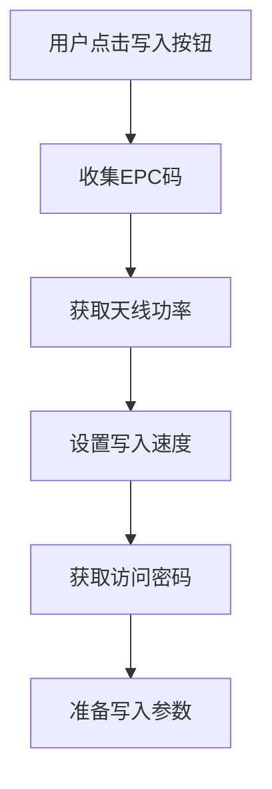
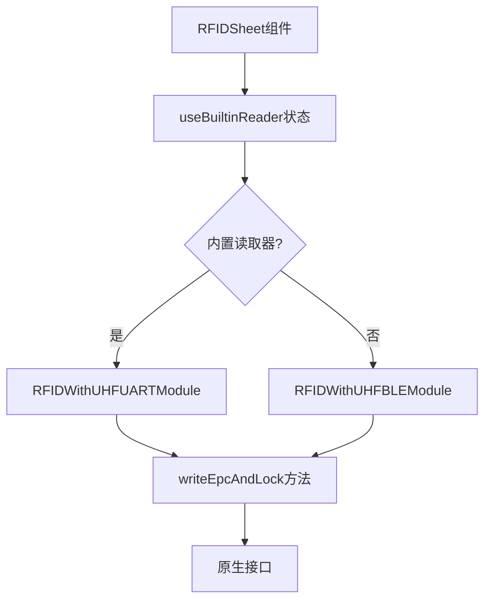
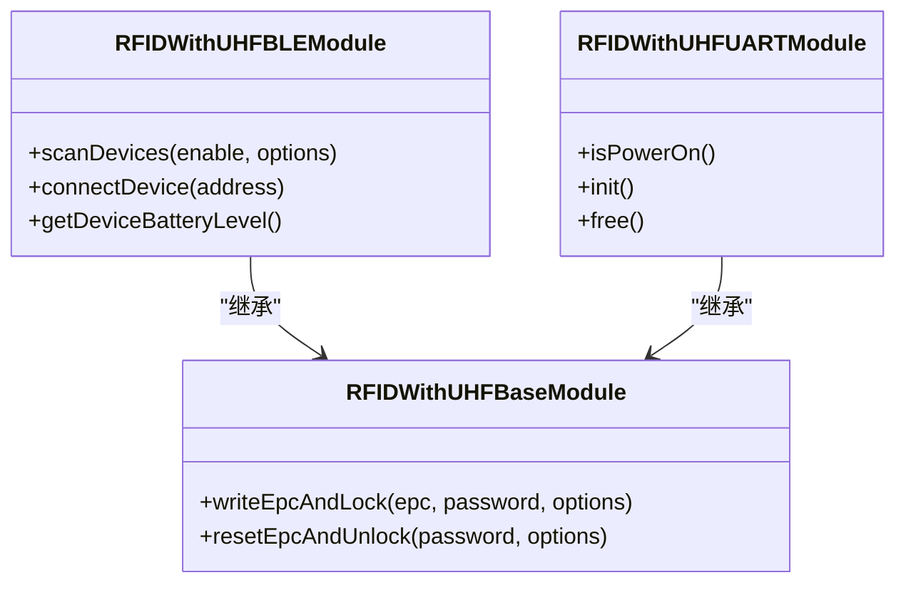
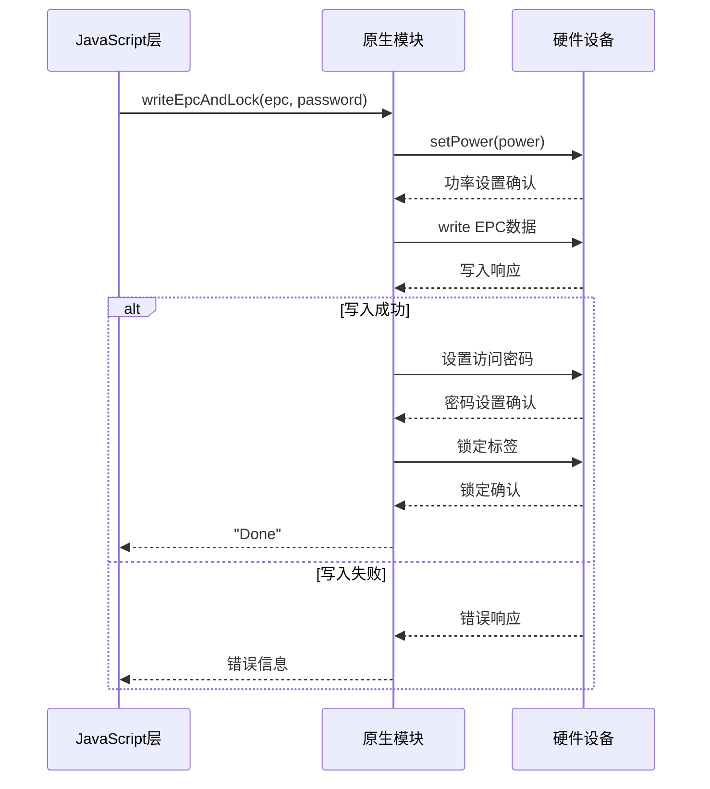
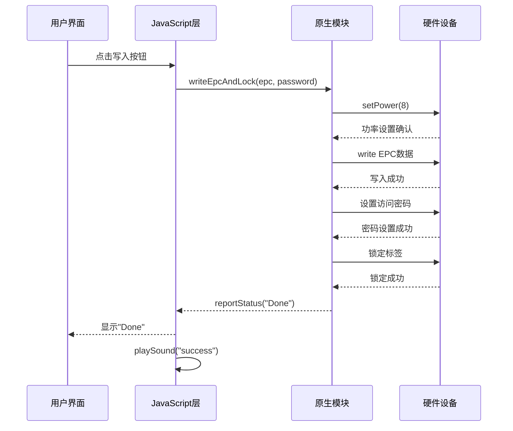
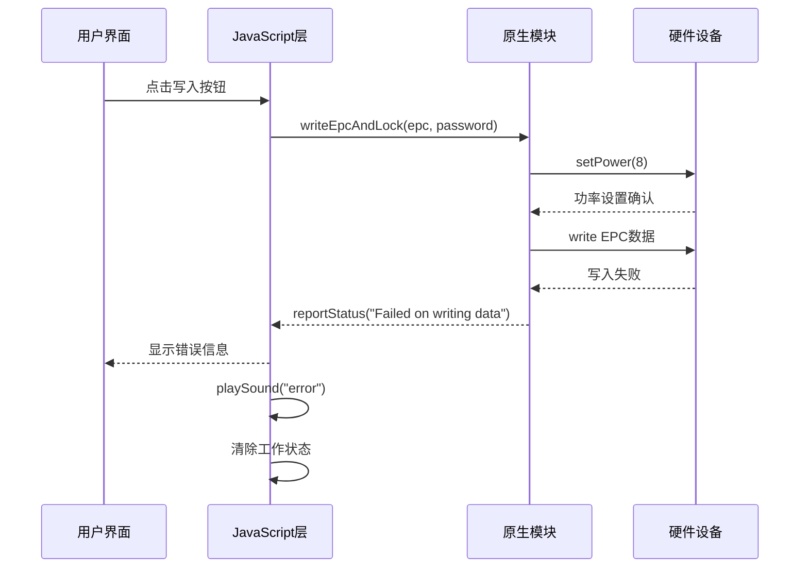

# 写入流程

<cite>
**本文档引用的文件**   
- [RFIDSheet.tsx](file://App/app/features/rfid/RFIDSheet.tsx)
- [RFIDWithUHFBLEModule.ts](file://App/app/modules/RFIDWithUHFBLEModule.ts)
- [RFIDWithUHFUARTModule.ts](file://App/app/modules/RFIDWithUHFUARTModule.ts)
- [RFIDWithUHFBaseModule.ts](file://App/app/modules/RFIDWithUHFBaseModule.ts)
- [RCTRFIDWithUHFBLEModule.m](file://App/ios/ReactNativeModules/RFID/Chainway/RCTRFIDWithUHFBLEModule.m)
- [RFIDBluetoothManager.m](file://App/ios/Libraries/RFID/Chainway/RFIDBluetoothManager.m)
- [RFIDWithUHFUARTModule.java](file://App/android/app/src/main/java/vg/zeta/app/inventory/RFIDWithUHFUARTModule.java)
- [RFIDWithUHFBLEModule.java](file://App/android/app/src/main/java/vg/zeta/app/inventory/RFIDWithUHFBLEModule.java)
</cite>

## 目录
1. [写入流程概述](#写入流程概述)
2. [用户界面与参数收集](#用户界面与参数收集)
3. [状态管理与参数传递](#状态管理与参数传递)
4. [原生模块指令封装](#原生模块指令封装)
5. [硬件指令发送与执行](#硬件指令发送与执行)
6. [进度反馈与结果处理](#进度反馈与结果处理)
7. [成功与失败场景时序图](#成功与失败场景时序图)

## 写入流程概述

RFID标签写入流程是一个从用户界面触发到硬件设备执行的完整过程。该流程始于`RFIDSheet.tsx`中的写入按钮，用户在此界面设置EPC码、天线功率和写入速度等参数。这些参数通过Redux状态管理传递到原生模块，根据设备连接类型（BLE或UART）选择相应的模块进行指令封装，并通过原生接口发送到硬件设备。整个过程包括写入进度的实时反馈、写入完成确认和结果回调处理。

**Section sources**
- [RFIDSheet.tsx](file://App/app/features/rfid/RFIDSheet.tsx)

## 用户界面与参数收集

在`RFIDSheet.tsx`文件中，用户界面通过`RFIDSheet`组件实现。当用户选择"write"功能时，系统会初始化写入参数。EPC码、天线功率和写入速度等参数通过组件状态进行管理。

EPC码的默认值来自系统配置中的`rfid_tag_company_prefix`和`rfid_tag_individual_asset_reference_prefix`，这些值在`useConfig`钩子中获取。天线功率根据连接类型自动设置：内置读取器使用28dBm，BLE设备使用20dBm。写入速度则固定为8。

用户还可以通过界面设置访问密码，系统提供了默认密码"00000000"作为后备选项。所有这些参数在用户点击写入按钮时被收集并准备传递到下一层。



**Diagram sources **
- [RFIDSheet.tsx](file://App/app/features/rfid/RFIDSheet.tsx#L736-L828)

**Section sources**
- [RFIDSheet.tsx](file://App/app/features/rfid/RFIDSheet.tsx#L736-L828)

## 状态管理与参数传递

参数收集完成后，通过Redux状态管理机制传递到原生模块。在`RFIDSheet.tsx`中，`RFIDModule`常量根据`useBuiltinReader`状态决定使用哪个模块：内置读取器使用`RFIDWithUHFUARTModule`，外部BLE设备使用`RFIDWithUHFBLEModule`。

写入操作通过`writeAndLock`函数触发，该函数调用`RFIDModule.writeEpcAndLock`方法。此方法接收EPC码、访问密码、功率设置等参数，并通过原生接口传递到设备。状态管理确保了参数在组件间的正确传递和同步。



**Diagram sources **
- [RFIDSheet.tsx](file://App/app/features/rfid/RFIDSheet.tsx#L430-L433)
- [RFIDSheet.tsx](file://App/app/features/rfid/RFIDSheet.tsx#L745-L828)

**Section sources**
- [RFIDSheet.tsx](file://App/app/features/rfid/RFIDSheet.tsx#L430-L433)
- [RFIDSheet.tsx](file://App/app/features/rfid/RFIDSheet.tsx#L745-L828)

## 原生模块指令封装

原生模块负责将JavaScript参数封装为设备可理解的指令。`RFIDWithUHFBaseModule.ts`定义了基础的写入操作，而`RFIDWithUHFBLEModule.ts`和`RFIDWithUHFUARTModule.ts`分别处理BLE和UART连接。

`writeEpcAndLock`方法在`RFIDWithUHFBaseModule.ts`中实现，它将写入过程分解为三个步骤：写入EPC数据、设置访问密码和锁定标签。每个步骤都有相应的状态反馈，通过`reportStatus`回调函数实时更新UI。

对于BLE连接，`RFIDWithUHFBLEModule.ts`扩展了基础功能，添加了设备连接状态监听和电池电量查询等特性。对于UART连接，`RFIDWithUHFUARTModule.ts`提供了直接的硬件访问接口。



**Diagram sources **
- [RFIDWithUHFBaseModule.ts](file://App/app/modules/RFIDWithUHFBaseModule.ts#L260-L348)
- [RFIDWithUHFBLEModule.ts](file://App/app/modules/RFIDWithUHFBLEModule.ts#L37-L97)
- [RFIDWithUHFUARTModule.ts](file://App/app/modules/RFIDWithUHFUARTModule.ts#L6-L12)

**Section sources**
- [RFIDWithUHFBaseModule.ts](file://App/app/modules/RFIDWithUHFBaseModule.ts#L260-L348)
- [RFIDWithUHFBLEModule.ts](file://App/app/modules/RFIDWithUHFBLEModule.ts#L37-L97)
- [RFIDWithUHFUARTModule.ts](file://App/app/modules/RFIDWithUHFUARTModule.ts#L6-L12)

## 硬件指令发送与执行

在iOS平台上，`RCTRFIDWithUHFBLEModule.m`和`RFIDBluetoothManager.m`负责与硬件设备通信。`writeLabelMessageWithPassword`方法将写入指令封装为蓝牙数据包，通过`sendDataToBle`函数发送到设备。

在Android平台上，`RFIDWithUHFBLEModule.java`和`RFIDWithUHFUARTModule.java`使用`com.rscja.deviceapi`库与设备通信。`writeData`方法直接调用原生API执行写入操作。

写入过程包括三个主要步骤：
1. 写入EPC数据到标签
2. 设置新的访问密码
3. 锁定标签防止进一步修改

每个步骤都有超时机制（1.1秒），如果在规定时间内未收到响应，系统会触发超时处理。



**Diagram sources **
- [RCTRFIDWithUHFBLEModule.m](file://App/ios/ReactNativeModules/RFID/Chainway/RCTRFIDWithUHFBLEModule.m#L409-L472)
- [RFIDBluetoothManager.m](file://App/ios/Libraries/RFID/Chainway/RFIDBluetoothManager.m#L401-L442)
- [RFIDWithUHFBLEModule.java](file://App/android/app/src/main/java/vg/zeta/app/inventory/RFIDWithUHFBLEModule.java#L609-L665)
- [RFIDWithUHFUARTModule.java](file://App/android/app/src/main/java/vg/zeta/app/inventory/RFIDWithUHFUARTModule.java#L440-L497)

**Section sources**
- [RCTRFIDWithUHFBLEModule.m](file://App/ios/ReactNativeModules/RFID/Chainway/RCTRFIDWithUHFBLEModule.m#L409-L472)
- [RFIDBluetoothManager.m](file://App/ios/Libraries/RFID/Chainway/RFIDBluetoothManager.m#L401-L442)
- [RFIDWithUHFBLEModule.java](file://App/android/app/src/main/java/vg/zeta/app/inventory/RFIDWithUHFBLEModule.java#L609-L665)
- [RFIDWithUHFUARTModule.java](file://App/android/app/src/main/java/vg/zeta/app/inventory/RFIDWithUHFUARTModule.java#L440-L497)

## 进度反馈与结果处理

写入过程中的进度反馈通过回调函数实现。在`RFIDSheet.tsx`中，`setWriteAndLockStatus`函数接收来自原生模块的状态更新，并实时显示在UI上。

写入过程的状态变化包括：
- "Writing data..." - 正在写入数据
- "Setting password..." - 正在设置密码
- "Locking tag..." - 正在锁定标签
- "Done" - 写入完成

如果操作成功，系统会播放成功音效并调用`afterWriteSuccessRef`回调函数。如果失败，会显示错误信息并播放错误音效。无论成功或失败，最后都会清除工作状态并重置状态计时器。

```mermaid
flowchart TD
A[开始写入] --> B[写入EPC数据]
B --> C{写入成功?}
C --> |是| D[设置访问密码]
C --> |否| E[显示错误信息]
D --> F{设置成功?}
F --> |是| G[锁定标签]
F --> |否| E
G --> H{锁定成功?}
H --> |是| I[显示"Done"]
H --> |否| E
I --> J[播放成功音效]
E --> K[播放错误音效]
```

**Diagram sources **
- [RFIDSheet.tsx](file://App/app/features/rfid/RFIDSheet.tsx#L756-L775)
- [RFIDWithUHFBaseModule.ts](file://App/app/modules/RFIDWithUHFBaseModule.ts#L277-L348)

**Section sources**
- [RFIDSheet.tsx](file://App/app/features/rfid/RFIDSheet.tsx#L756-L775)
- [RFIDWithUHFBaseModule.ts](file://App/app/modules/RFIDWithUHFBaseModule.ts#L277-L348)

## 成功与失败场景时序图

### 成功写入时序图



**Diagram sources **
- [RFIDSheet.tsx](file://App/app/features/rfid/RFIDSheet.tsx#L745-L828)
- [RFIDWithUHFBaseModule.ts](file://App/app/modules/RFIDWithUHFBaseModule.ts#L277-L348)

### 失败写入时序图



**Diagram sources **
- [RFIDSheet.tsx](file://App/app/features/rfid/RFIDSheet.tsx#L745-L828)
- [RFIDWithUHFBaseModule.ts](file://App/app/modules/RFIDWithUHFBaseModule.ts#L277-L348)

**Section sources**
- [RFIDSheet.tsx](file://App/app/features/rfid/RFIDSheet.tsx#L745-L828)
- [RFIDWithUHFBaseModule.ts](file://App/app/modules/RFIDWithUHFBaseModule.ts#L277-L348)