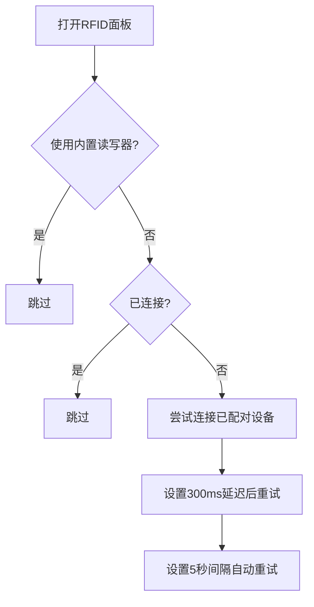
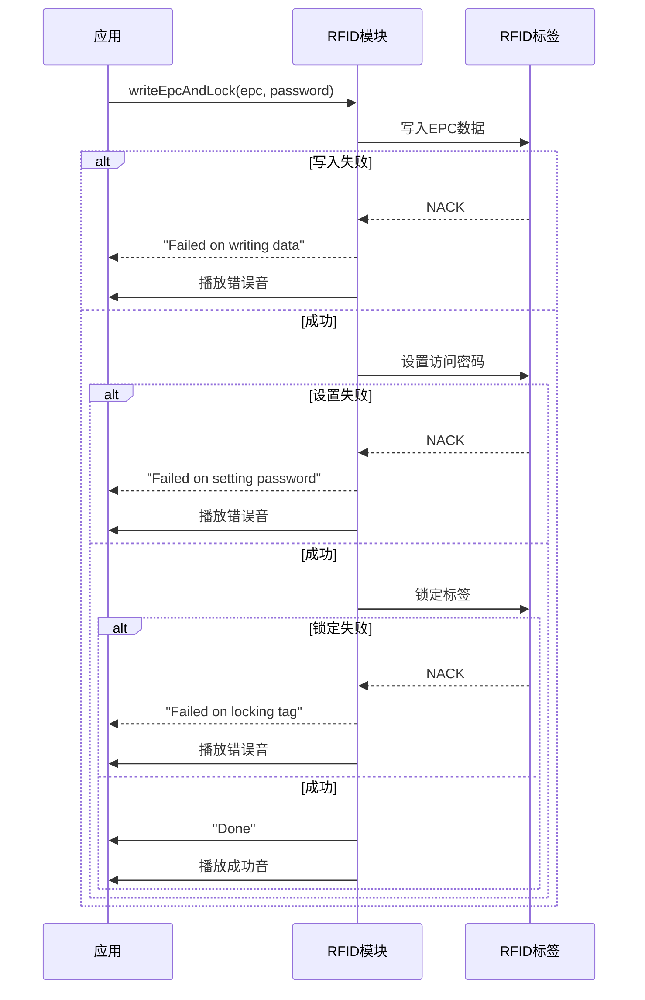
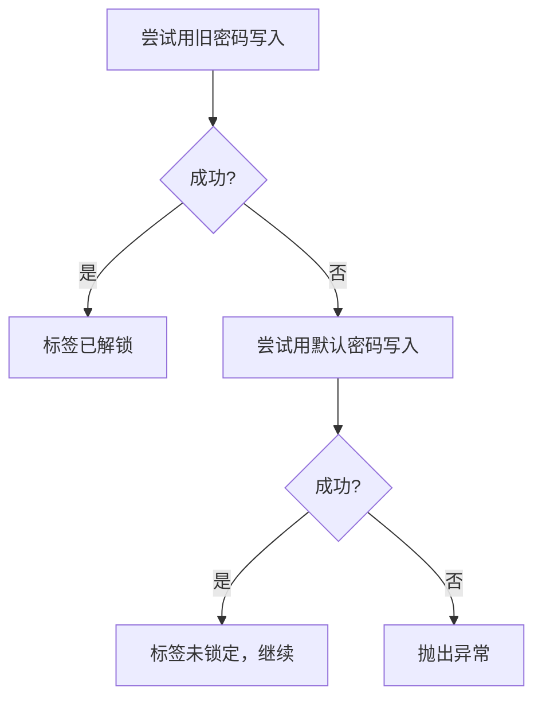
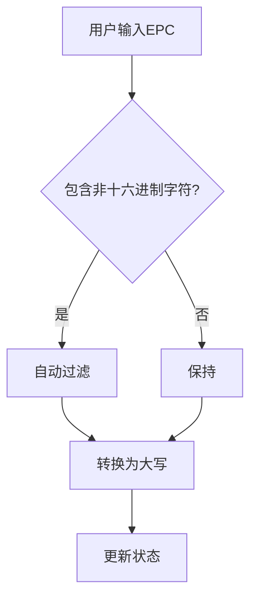
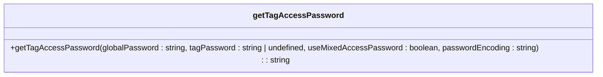
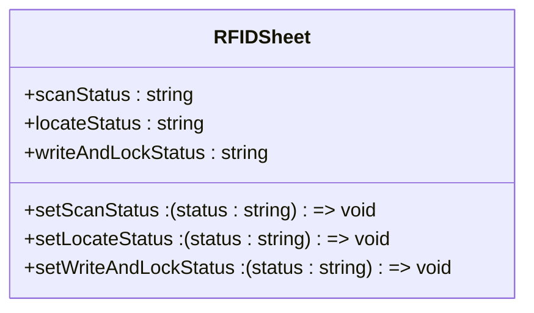
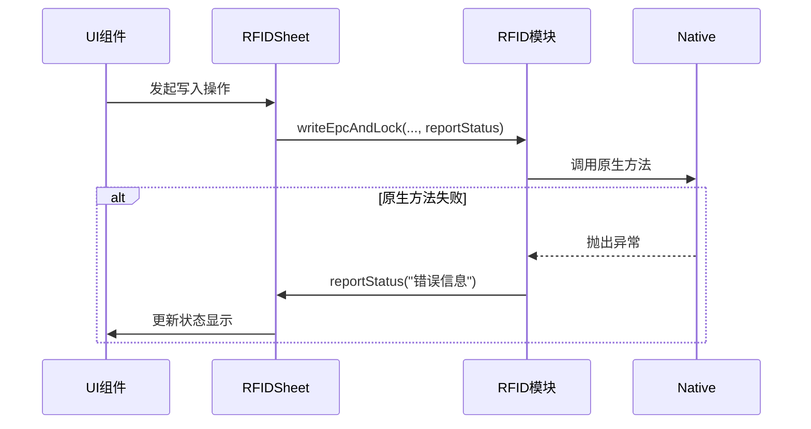
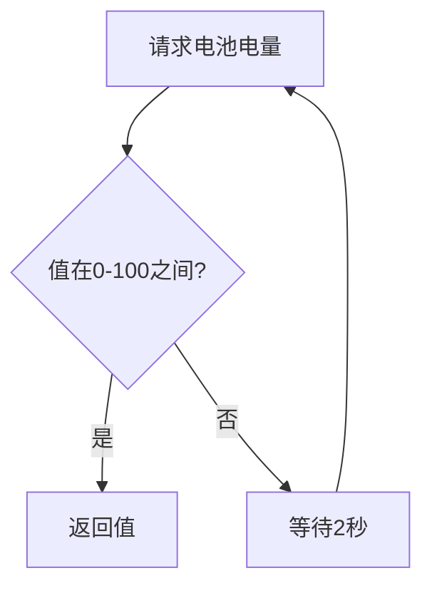
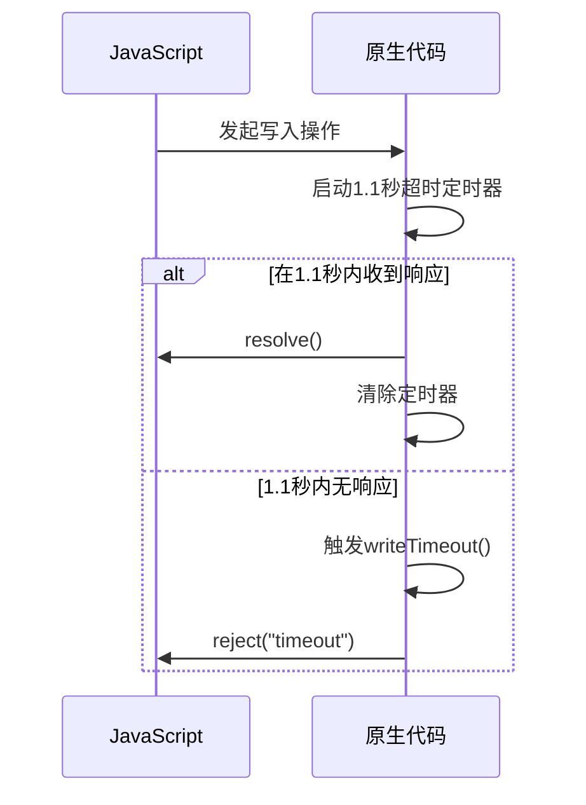
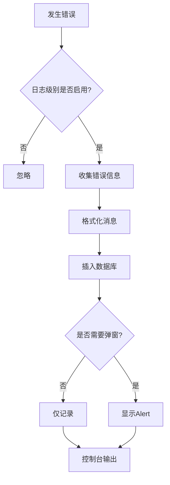

# 异常处理

<cite>
**本文档引用的文件**   
- [RFIDSheet.tsx](file://App/app/features/rfid/RFIDSheet.tsx)
- [RFIDWithUHFBaseModule.ts](file://App/app/modules/RFIDWithUHFBaseModule.ts)
- [RFIDWithUHFBLEModule.ts](file://App/app/modules/RFIDWithUHFBLEModule.ts)
- [RFIDWithUHFUARTModule.ts](file://App/app/modules/RFIDWithUHFUARTModule.ts)
- [logger.ts](file://App/app/logger/logger.ts)
- [utils.ts](file://App/app/features/rfid/utils.ts)
</cite>

## 目录
1. [引言](#引言)
2. [硬件连接异常处理](#硬件连接异常处理)
3. [标签响应异常处理](#标签响应异常处理)
4. [数据验证异常处理](#数据验证异常处理)
5. [错误码转换与用户提示](#错误码转换与用户提示)
6. [重试机制与超时处理](#重试机制与超时处理)
7. [错误日志记录](#错误日志记录)
8. [常见错误代码对照表](#常见错误代码对照表)
9. [最佳实践](#最佳实践)
10. [结论](#结论)

## 引言
本文档系统化地记录了RFID标签写入过程中的异常处理机制。RFID系统在实际应用中会遇到各种异常情况，包括硬件连接问题、标签响应问题和数据验证问题。本系统通过分层的异常处理策略，确保了操作的稳定性和用户体验的友好性。核心组件`RFIDSheet.tsx`负责捕获原生模块抛出的错误码，并将其转换为用户友好的提示信息。同时，系统实现了重试机制、超时处理和详细的错误日志记录，为问题排查和系统优化提供了坚实的基础。

**Section sources**
- [RFIDSheet.tsx](file://App/app/features/rfid/RFIDSheet.tsx)

## 硬件连接异常处理
硬件连接异常主要指RFID读写器设备的连接问题，包括内置读写器的电源状态和蓝牙读写器的连接状态。

### 内置读写器异常处理
对于内置读写器（UHF UART），系统通过`RFIDWithUHFUARTModule`模块进行管理。当应用打开RFID功能时，会调用`init()`方法初始化设备。如果设备最近被释放（`free()`），系统会强制等待5秒以确保硬件状态稳定，避免因频繁初始化导致的失败。
```mermaid
flowchart TD
A[打开RFID功能] --> B{设备最近被释放?}
B --> |是| C[等待5秒]
B --> |否| D[直接初始化]
C --> D
D --> E[调用init()方法]
E --> F{初始化成功?}
F --> |是| G[设置电源状态为开启]
F --> |否| H[尝试获取当前电源状态]
```

**Diagram sources**
- [RFIDSheet.tsx](file://App/app/features/rfid/RFIDSheet.tsx#L216-L238)

### 蓝牙读写器异常处理
对于蓝牙读写器（UHF BLE），系统通过`RFIDWithUHFBLEModule`模块进行管理。系统实现了自动重连机制，当RFID面板打开且未连接时，会每隔5秒尝试连接一次已配对的设备。


**Diagram sources**
- [RFIDSheet.tsx](file://App/app/features/rfid/RFIDSheet.tsx#L347-L365)

## 标签响应异常处理
标签响应异常是指在与RFID标签交互过程中，标签返回的非预期响应，如NACK、写保护、冲突等。

### 写入与锁定操作异常
`writeEpcAndLock`方法是处理标签写入的核心，它将写入EPC、设置访问密码和锁定标签三个步骤封装为一个原子操作。每个步骤都包含独立的异常处理，确保操作的原子性和可恢复性。


**Diagram sources**
- [RFIDWithUHFBaseModule.ts](file://App/app/modules/RFIDWithUHFBaseModule.ts#L277-L348)

### 解锁与重置操作异常
`resetEpcAndUnlock`方法用于解锁和重置标签。它包含一个智能的异常处理逻辑：当尝试用旧密码解锁失败时，会尝试使用默认密码（00000000）进行写入操作。如果成功，则说明标签未被锁定；如果失败，则真正抛出异常。


**Diagram sources**
- [RFIDWithUHFBaseModule.ts](file://App/app/modules/RFIDWithUHFBaseModule.ts#L384-L402)

## 数据验证异常处理
数据验证异常主要指写入数据的格式或内容不符合规范。

### EPC数据格式验证
在`RFIDSheet.tsx`中，对用户输入的EPC数据进行了严格的格式验证。输入框会自动过滤非十六进制字符，并强制转换为大写，确保数据的合法性。


**Diagram sources**
- [RFIDSheet.tsx](file://App/app/features/rfid/RFIDSheet.tsx#L1509-L1511)

### 访问密码验证
访问密码的验证逻辑在`utils.ts`中实现。系统支持混合访问密码模式，通过`getTagAccessPassword`函数根据全局密码、标签密码和编码规则生成最终的8位十六进制密码。


**Diagram sources**
- [utils.ts](file://App/app/features/rfid/utils.ts#L1-L27)

## 错误码转换与用户提示
系统通过`RFIDSheet.tsx`中的状态管理机制，将底层的错误码转换为用户友好的提示信息。

### 状态信息管理
`RFIDSheet`组件使用`useState`管理多种状态信息，如`scanStatus`、`locateStatus`和`writeAndLockStatus`。这些状态直接绑定到UI，向用户展示操作的实时进展和结果。


**Diagram sources**
- [RFIDSheet.tsx](file://App/app/features/rfid/RFIDSheet.tsx#L473-L474)

### 原生错误码捕获
在`RFIDWithUHFBaseModule.ts`中，所有原生模块的调用都包裹在`try-catch`块中。捕获到的错误会通过`reportStatus`回调函数传递给上层组件，实现错误信息的逐层传递。


**Diagram sources**
- [RFIDWithUHFBaseModule.ts](file://App/app/modules/RFIDWithUHFBaseModule.ts#L298-L301)

## 重试机制与超时处理
系统实现了多层次的重试和超时处理机制，以应对不稳定的硬件环境。

### 电池电量获取重试
在iOS平台上，获取蓝牙读写器的电池电量可能需要多次尝试。`getDeviceBatteryLevel`方法使用了一个循环，直到获取到有效的电量值（0-100之间）或超时。


**Diagram sources**
- [RFIDWithUHFBLEModule.ts](file://App/app/modules/RFIDWithUHFBLEModule.ts#L77-L87)

### 操作超时处理
在iOS原生代码中，为写入和锁定操作设置了1.1秒的超时定时器。如果在规定时间内未收到响应，系统会触发超时处理，清除待处理的Promise，并向JavaScript层返回超时错误。


**Diagram sources**
- [RCTRFIDWithUHFBLEModule.m](file://App/ios/ReactNativeModules/RFID/Chainway/RCTRFIDWithUHFBLEModule.m#L457-L464)

## 错误日志记录
系统使用内置的`logger`模块进行详细的错误日志记录。

### 日志记录流程
当发生错误时，`logger`模块会收集错误信息、堆栈跟踪和上下文数据，并将其存储到数据库中。同时，根据配置决定是否在控制台输出或弹出警告框。


**Diagram sources**
- [logger.ts](file://App/app/logger/logger.ts#L33-L142)

## 常见错误代码对照表
以下是系统中常见的错误代码及其含义。

| 错误类型 | 错误代码/信息 | 含义 | 处理策略 |
| :--- | :--- | :--- | :--- |
| **硬件连接** | "UHF reader init failed" | 内置读写器初始化失败 | 检查硬件连接，重启设备 |
| | "CONNECTING" | 蓝牙设备正在连接 | 等待连接完成或重试 |
| | "DISCONNECTED" | 蓝牙设备已断开 | 尝试重新连接 |
| **标签响应** | "Failed on writing data" | 写入EPC数据失败 | 检查标签是否损坏或距离过远 |
| | "Failed on setting password" | 设置访问密码失败 | 确认旧密码正确 |
| | "Failed on locking tag" | 锁定标签失败 | 确认密码正确，标签未被永久锁定 |
| | "operation timeout" | 操作超时 | 检查信号强度，重试操作 |
| **数据验证** | "iarPrefix has invalid format" | IAR前缀格式无效 | 检查输入的数字格式 |
| | "serial must be smaller than 9999" | 序列号超出范围 | 输入0-9999之间的数字 |

## 最佳实践
### 处理写保护标签
对于写保护标签，应首先尝试使用正确的访问密码进行解锁。如果无法解锁，则不应尝试写入操作，以免造成不必要的错误。系统在`resetEpcAndUnlock`方法中已经包含了对默认密码的尝试逻辑。

### 处理重复写入
系统通过`scannedTags`状态对象来跟踪已扫描的标签。在写入操作前，应检查目标EPC是否已在列表中，以避免对同一标签进行重复写入。

### 处理部分写入失败
由于`writeEpcAndLock`是一个多步骤操作，任何一个步骤失败都会导致整个操作失败。因此，系统设计为原子操作，不会出现部分写入成功的情况。如果操作失败，标签状态保持不变。

## 结论
本系统通过分层的异常处理机制，有效地管理了RFID标签写入过程中的各种异常。从硬件连接、标签响应到数据验证，每一层都有相应的处理策略。通过`RFIDSheet.tsx`作为中心枢纽，将底层的错误码转换为清晰的用户提示，并结合重试、超时和日志记录机制，构建了一个健壮、可靠的RFID操作环境。开发者应遵循文档中的最佳实践，以确保系统的稳定运行。