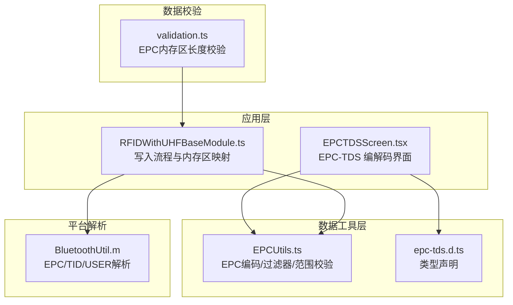
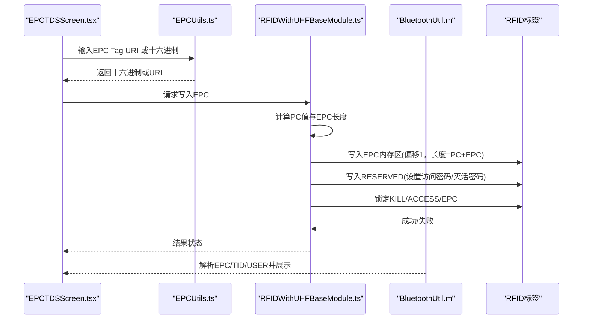
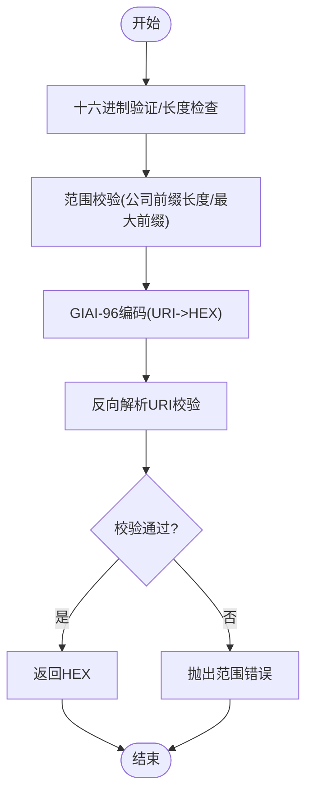
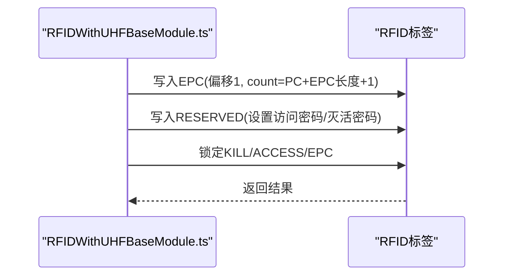
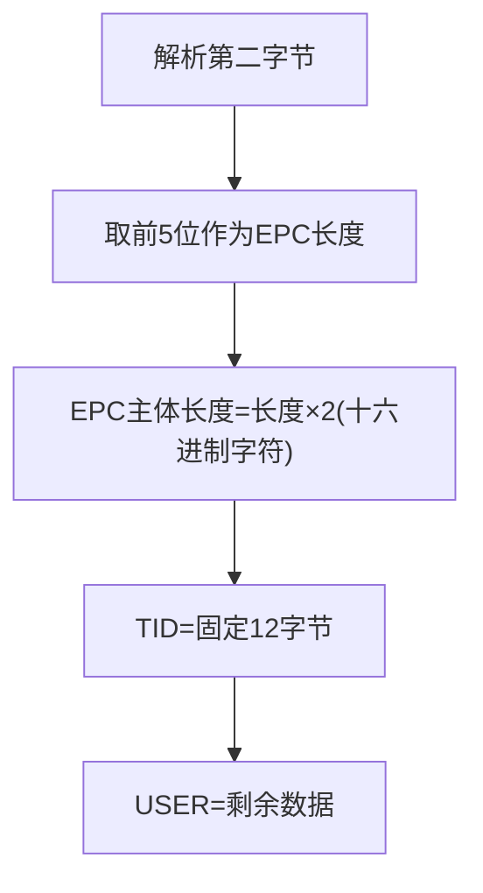
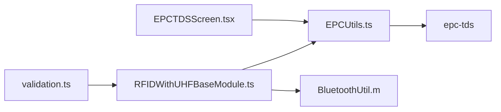

# 数据格式

<cite>
**本文引用的文件**
- [EPCUtils.ts](file://packages/epc-utils/lib/EPCUtils.ts)
- [EPCUtils.test.ts](file://packages/epc-utils/lib/EPCUtils.test.ts)
- [epc-tds.d.ts](file://packages/epc-utils/types/epc-tds.d.ts)
- [RFIDWithUHFBaseModule.ts](file://App/app/modules/RFIDWithUHFBaseModule.ts)
- [BluetoothUtil.m](file://App/ios/Libraries/RFID/Chainway/BluetoothUtil.m)
- [EPCTDSScreen.tsx](file://App/app/screens/EPCTDSScreen.tsx)
- [validation.ts](file://Data/lib/validation.ts)
</cite>

## 目录
1. [简介](#简介)
2. [项目结构](#项目结构)
3. [核心组件](#核心组件)
4. [架构总览](#架构总览)
5. [详细组件分析](#详细组件分析)
6. [依赖关系分析](#依赖关系分析)
7. [性能考量](#性能考量)
8. [故障排查指南](#故障排查指南)
9. [结论](#结论)
10. [附录](#附录)

## 简介
本文件聚焦于RFID标签写入的数据格式规范，系统性解析EPCUtils.ts中EPC码的格式化规则与二进制结构，覆盖以下关键点：
- 十六进制验证、长度检查与范围校验
- 不同内存区（TID、USER、RESERVED）的写入配置与访问密码、灭活密码的安全处理
- EPC、PC（数据长度字段）、CRC等字段的二进制结构与位操作实现
- 将用户输入的字符串转换为符合ISO18000-6C标准的二进制数据包
- 特殊格式SGTIN-96的编码规则与应用场景

## 项目结构
围绕“数据格式”主题，相关代码分布在如下模块：
- 数据工具层：packages/epc-utils 提供EPC编码/解码与过滤器生成逻辑
- 应用层读写：App/app/modules/RFIDWithUHFBaseModule 定义写入流程与内存区映射
- 平台解析：App/ios/Libraries/RFID/Chainway/BluetoothUtil.m 展示EPC/TID/USER解析的位长与偏移
- 校验与展示：Data/lib/validation.ts 对EPC内存区内容进行长度校验；App/app/screens/EPCTDSScreen.tsx 提供EPC-TDS交互界面

图表来源
- [EPCTDSScreen.tsx](file://App/app/screens/EPCTDSScreen.tsx#L1-L122)
- [RFIDWithUHFBaseModule.ts](file://App/app/modules/RFIDWithUHFBaseModule.ts#L1-L120)
- [EPCUtils.ts](file://packages/epc-utils/lib/EPCUtils.ts#L1-L120)
- [epc-tds.d.ts](file://packages/epc-utils/types/epc-tds.d.ts#L1-L8)
- [BluetoothUtil.m](file://App/ios/Libraries/RFID/Chainway/BluetoothUtil.m#L1460-L1540)
- [validation.ts](file://Data/lib/validation.ts#L286-L318)

章节来源
- [EPCUtils.ts](file://packages/epc-utils/lib/EPCUtils.ts#L1-L120)
- [RFIDWithUHFBaseModule.ts](file://App/app/modules/RFIDWithUHFBaseModule.ts#L1-L120)
- [EPCTDSScreen.tsx](file://App/app/screens/EPCTDSScreen.tsx#L1-L122)
- [BluetoothUtil.m](file://App/ios/Libraries/RFID/Chainway/BluetoothUtil.m#L1460-L1540)
- [validation.ts](file://Data/lib/validation.ts#L286-L318)

## 核心组件
- EPCUtils：提供GIAI-96编码、过滤器生成、范围校验与错误类型定义
- RFIDWithUHFBaseModule：封装读写锁操作、内存区映射、写入EPC时PC值与数据拼接
- epc-tds 类型声明：为第三方库提供最小类型支持
- BluetoothUtil.m：展示EPC/TID/USER解析的位长与偏移，辅助理解二进制布局
- EPCTDSScreen.tsx：提供EPC-TDS的可视化编解码入口
- validation.ts：对EPC内存区内容进行长度约束校验

章节来源
- [EPCUtils.ts](file://packages/epc-utils/lib/EPCUtils.ts#L1-L120)
- [RFIDWithUHFBaseModule.ts](file://App/app/modules/RFIDWithUHFBaseModule.ts#L1-L120)
- [epc-tds.d.ts](file://packages/epc-utils/types/epc-tds.d.ts#L1-L8)
- [EPCTDSScreen.tsx](file://App/app/screens/EPCTDSScreen.tsx#L1-L122)
- [BluetoothUtil.m](file://App/ios/Libraries/RFID/Chainway/BluetoothUtil.m#L1460-L1540)
- [validation.ts](file://Data/lib/validation.ts#L286-L318)

## 架构总览
下图展示了从用户输入到标签写入的关键路径，以及EPC内存区布局与安全控制要点：

图表来源
- [EPCTDSScreen.tsx](file://App/app/screens/EPCTDSScreen.tsx#L1-L122)
- [EPCUtils.ts](file://packages/epc-utils/lib/EPCUtils.ts#L120-L220)
- [RFIDWithUHFBaseModule.ts](file://App/app/modules/RFIDWithUHFBaseModule.ts#L260-L348)
- [BluetoothUtil.m](file://App/ios/Libraries/RFID/Chainway/BluetoothUtil.m#L1460-L1540)

## 详细组件分析

### EPCUtils：EPC码格式化与范围校验
- 十六进制验证与长度检查
  - 使用正则表达式确保输入仅包含数字字符，避免非法十六进制
  - 通过最大序列号限制与公司前缀长度映射，限定可编码范围
- 过滤器生成与公共前缀长度
  - 通过比较最小/最大样本的十六进制表示，推导出EPC的公共前缀长度，用于后续筛选
- GIAI-96编码与反向校验
  - 将“公司前缀.资产参考”映射为GIAI-96 URI，并转换为十六进制
  - 反向解析URI以校验是否越界或存在前置零问题，抛出范围错误
- 错误类型
  - IAREncodingError：个体资产参考编码参数非法
  - GiaiOutOfRangeError：GIAI-96数值越界

图表来源
- [EPCUtils.ts](file://packages/epc-utils/lib/EPCUtils.ts#L1-L120)
- [EPCUtils.ts](file://packages/epc-utils/lib/EPCUtils.ts#L120-L220)
- [EPCUtils.test.ts](file://packages/epc-utils/lib/EPCUtils.test.ts#L360-L456)

章节来源
- [EPCUtils.ts](file://packages/epc-utils/lib/EPCUtils.ts#L1-L120)
- [EPCUtils.ts](file://packages/epc-utils/lib/EPCUtils.ts#L120-L220)
- [EPCUtils.test.ts](file://packages/epc-utils/lib/EPCUtils.test.ts#L360-L456)

### 写入流程与内存区布局（EPC、TID、USER、RESERVED）
- 内存区映射
  - RESERVE=0, EPC=1, TID=2, USER=3
- 写入EPC
  - 在偏移1处写入PC值（数据长度字段）与EPC主体
  - PC值由预定义映射表选择，对应EPC长度的十六进制值
- 设置访问密码与灭活密码
  - 在RESERVED区写入访问密码与灭活密码（各4字节），通常写入两次以确保一致性
- 锁定策略
  - 锁定KILL、ACCESS与EPC区域，防止后续被修改
- 读取解析
  - iOS侧解析逻辑根据第二字节的位长信息确定EPC长度，再按顺序提取TID与USER

图表来源
- [RFIDWithUHFBaseModule.ts](file://App/app/modules/RFIDWithUHFBaseModule.ts#L260-L348)
- [RFIDWithUHFBaseModule.ts](file://App/app/modules/RFIDWithUHFBaseModule.ts#L349-L458)

章节来源
- [RFIDWithUHFBaseModule.ts](file://App/app/modules/RFIDWithUHFBaseModule.ts#L1-L120)
- [RFIDWithUHFBaseModule.ts](file://App/app/modules/RFIDWithUHFBaseModule.ts#L260-L348)
- [RFIDWithUHFBaseModule.ts](file://App/app/modules/RFIDWithUHFBaseModule.ts#L349-L458)
- [BluetoothUtil.m](file://App/ios/Libraries/RFID/Chainway/BluetoothUtil.m#L1460-L1540)

### 二进制结构与位操作（EPC、PC、CRC）
- EPC内存区布局（基于平台解析逻辑）
  - 第一字节：标签计数
  - 第二字节：EPC实际长度（按位解析头部5位）
  - EPC主体：长度为(第二字节指示长度)×2个十六进制字符
  - TID：固定长度12字节（紧随EPC之后）
  - USER：剩余部分为用户数据
- PC（数据长度字段）
  - 写入EPC时，PC值位于偏移1处，表示EPC主体的字长
  - PC值由预定义映射表选择，与EPC长度一一对应
- CRC
  - 仓库未直接实现CRC计算逻辑；通常由读写模块或底层硬件完成
  - 若需自定义CRC，请结合ISO18000-6C标准与具体芯片手册实现

图表来源
- [BluetoothUtil.m](file://App/ios/Libraries/RFID/Chainway/BluetoothUtil.m#L1460-L1540)

章节来源
- [BluetoothUtil.m](file://App/ios/Libraries/RFID/Chainway/BluetoothUtil.m#L1460-L1540)
- [RFIDWithUHFBaseModule.ts](file://App/app/modules/RFIDWithUHFBaseModule.ts#L88-L106)

### 安全处理：访问密码、灭活密码与锁定
- 访问密码
  - 写入RESERVED区，通常写入两次以确保一致性
- 灭活密码
  - 同样写入RESERVED区，用于KILL命令
- 锁定策略
  - 锁定KILL、ACCESS与EPC区域，防止后续被修改
- 默认密码与重置
  - 若默认密码无效，可尝试使用00000000进行重置流程

章节来源
- [RFIDWithUHFBaseModule.ts](file://App/app/modules/RFIDWithUHFBaseModule.ts#L314-L348)
- [RFIDWithUHFBaseModule.ts](file://App/app/modules/RFIDWithUHFBaseModule.ts#L370-L458)

### EPC-TDS与SGTIN-96的应用场景
- EPC-TDS
  - 支持从十六进制EPC解析为URI，或将URI编码为十六进制
  - EPCTDSScreen.tsx提供交互界面，便于调试与演示
- SGTIN-96
  - 仓库当前主要实现GIAI-96（资产参考）编码与校验
  - SGTIN-96属于另一类EPC格式，若需支持，请扩展编码器以适配相应分区与字段布局

章节来源
- [EPCTDSScreen.tsx](file://App/app/screens/EPCTDSScreen.tsx#L1-L122)
- [EPCUtils.ts](file://packages/epc-utils/lib/EPCUtils.ts#L120-L220)

## 依赖关系分析
- EPCUtils依赖epc-tds库进行GIAI-96的编码/解码与URI互转
- 应用层通过RFIDWithUHFBaseModule调用底层写入接口，完成EPC、TID、USER、RESERVED的写入
- iOS侧BluetoothUtil.m负责解析EPC/TID/USER，辅助理解二进制布局
- validation.ts对EPC内存区内容长度进行约束，确保写入数据符合预期

图表来源
- [EPCUtils.ts](file://packages/epc-utils/lib/EPCUtils.ts#L1-L120)
- [epc-tds.d.ts](file://packages/epc-utils/types/epc-tds.d.ts#L1-L8)
- [EPCTDSScreen.tsx](file://App/app/screens/EPCTDSScreen.tsx#L1-L122)
- [RFIDWithUHFBaseModule.ts](file://App/app/modules/RFIDWithUHFBaseModule.ts#L1-L120)
- [BluetoothUtil.m](file://App/ios/Libraries/RFID/Chainway/BluetoothUtil.m#L1460-L1540)
- [validation.ts](file://Data/lib/validation.ts#L286-L318)

章节来源
- [EPCUtils.ts](file://packages/epc-utils/lib/EPCUtils.ts#L1-L120)
- [epc-tds.d.ts](file://packages/epc-utils/types/epc-tds.d.ts#L1-L8)
- [EPCTDSScreen.tsx](file://App/app/screens/EPCTDSScreen.tsx#L1-L122)
- [RFIDWithUHFBaseModule.ts](file://App/app/modules/RFIDWithUHFBaseModule.ts#L1-L120)
- [BluetoothUtil.m](file://App/ios/Libraries/RFID/Chainway/BluetoothUtil.m#L1460-L1540)
- [validation.ts](file://Data/lib/validation.ts#L286-L318)

## 性能考量
- 编码/解码复杂度
  - EPCUtils的范围计算与过滤器生成为线性复杂度，受公司前缀长度与分区影响
- 写入性能
  - 写入EPC时，PC值与EPC长度直接决定count参数，建议预先计算避免重复运算
- 校验成本
  - 反向解析URI进行范围校验会引入额外开销，建议在批量写入时合并处理

[本节为通用指导，不直接分析具体文件]

## 故障排查指南
- 十六进制非法
  - 现象：写入失败或解析异常
  - 排查：确认输入仅含数字字符，长度满足平台要求
- 范围越界
  - 现象：抛出GiaiOutOfRangeError
  - 排查：检查公司前缀长度与资产参考数值是否超出映射上限
- 参数非法
  - 现象：抛出IAREncodingError
  - 排查：核对个体资产参考格式、集合/物品参考位数与序列号范围
- 密码错误
  - 现象：无法写入或锁定
  - 排查：确认访问密码/灭活密码正确；必要时使用默认密码重置后重新设置

章节来源
- [EPCUtils.test.ts](file://packages/epc-utils/lib/EPCUtils.test.ts#L360-L456)
- [RFIDWithUHFBaseModule.ts](file://App/app/modules/RFIDWithUHFBaseModule.ts#L370-L458)

## 结论
本文件系统梳理了RFID标签写入的数据格式规范，重点覆盖：
- EPCUtils的十六进制验证、长度检查与范围校验
- EPC、PC、CRC的二进制结构与位操作
- 不同内存区的写入配置与访问密码、灭活密码的安全处理
- EPC-TDS与SGTIN-96的应用场景与扩展方向

建议在生产环境中：
- 严格遵循公司前缀长度与分区映射，避免越界
- 在写入前进行充分的参数校验与范围检查
- 使用统一的PC值映射与过滤器生成策略，确保兼容性

[本节为总结性内容，不直接分析具体文件]

## 附录
- 示例路径
  - EPC编码/解码界面：[EPCTDSScreen.tsx](file://App/app/screens/EPCTDSScreen.tsx#L1-L122)
  - EPC写入流程：[RFIDWithUHFBaseModule.ts](file://App/app/modules/RFIDWithUHFBaseModule.ts#L260-L348)
  - 内存区解析：[BluetoothUtil.m](file://App/ios/Libraries/RFID/Chainway/BluetoothUtil.m#L1460-L1540)
  - EPC内存区长度校验：[validation.ts](file://Data/lib/validation.ts#L286-L318)