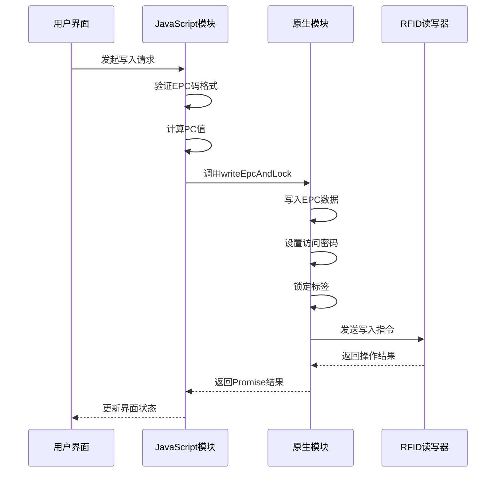
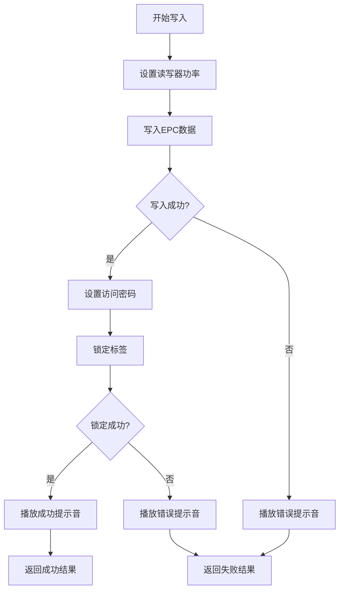
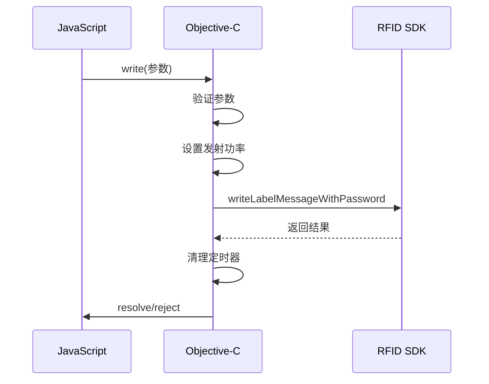
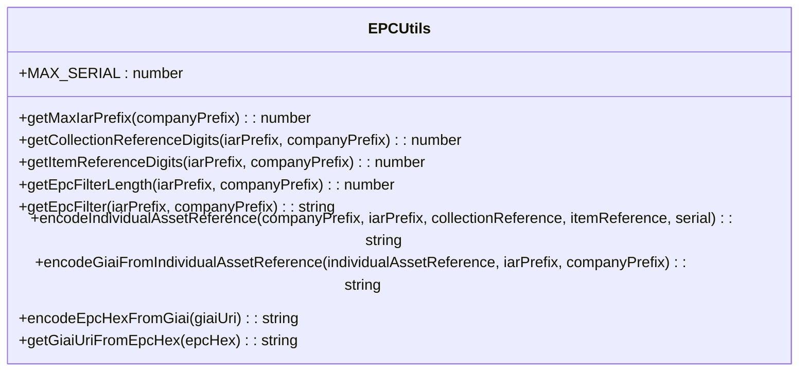
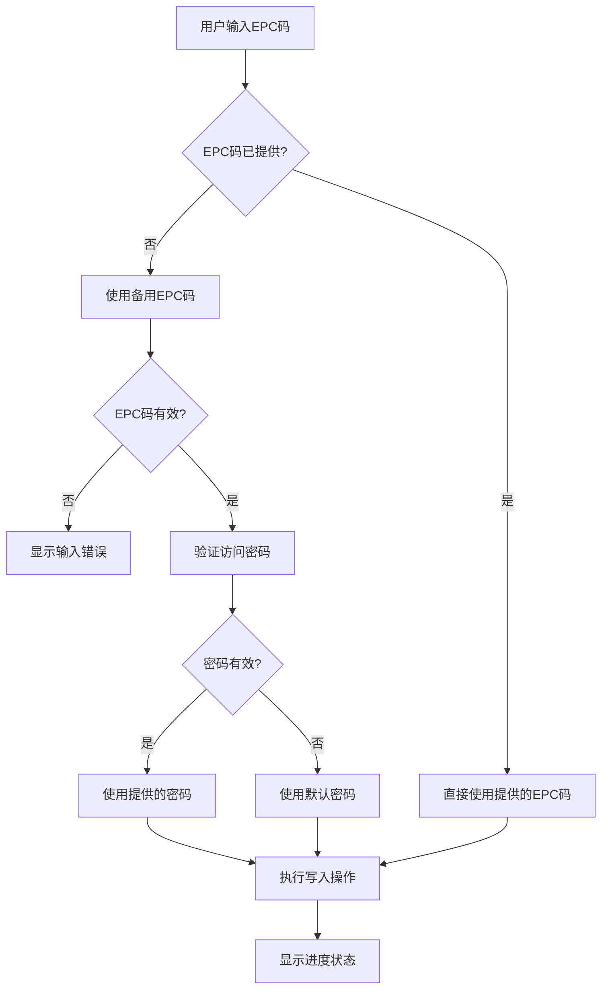

# 标签写入功能

<cite>
**本文档引用的文件**   
- [RFIDSheet.tsx](file://App/app/features/rfid/RFIDSheet.tsx)
- [RFIDWithUHFBLEModule.ts](file://App/app/modules/RFIDWithUHFBLEModule.ts)
- [RFIDWithUHFUARTModule.ts](file://App/app/modules/RFIDWithUHFUARTModule.ts)
- [RFIDWithUHFBaseModule.ts](file://App/app/modules/RFIDWithUHFBaseModule.ts)
- [EPCUtils.ts](file://Data/deps/epc-utils/EPCUtils.ts)
- [RFIDWithUHFBLEModule.java](file://App/android/app/src/main/java/vg/zeta/app/inventory/RFIDWithUHFBLEModule.java)
- [RFIDWithUHFUARTModule.java](file://App/android/app/src/main/java/vg/zeta/app/inventory/RFIDWithUHFUARTModule.java)
- [RCTRFIDWithUHFBLEModule.m](file://App/ios/ReactNativeModules/RFID/Chainway/RCTRFIDWithUHFBLEModule.m)
</cite>

## 目录
1. [简介](#简介)
2. [标签写入界面](#标签写入界面)
3. [原生模块实现](#原生模块实现)
4. [EPC数据处理](#epc数据处理)
5. [安全写入指南](#安全写入指南)
6. [性能优化建议](#性能优化建议)

## 简介
本文档详细说明了库存管理应用中的标签写入功能。该功能允许用户通过RFID读写器将数据写入RFID标签，并对标签进行锁定以防止未经授权的修改。文档涵盖了从用户界面到原生模块的完整技术实现，包括EPC码的验证、写入参数配置、进度反馈以及错误处理机制。

## 标签写入界面

RFIDSheet.tsx组件是标签写入功能的用户界面入口，它提供了一个底部弹出式表单，允许用户配置写入操作并查看进度反馈。

该组件通过RFIDSheetOptions类型定义了写入功能的配置选项，包括可选的EPC码、访问密码和成功回调函数。当功能模式设置为'write'时，界面会显示相应的写入配置字段。

用户界面包含以下主要元素：
- EPC码输入字段（十六进制格式）
- 访问密码输入字段（十六进制格式）
- 写入按钮，用于启动写入操作
- 进度状态显示，实时反馈写入过程
- 擦除按钮，用于重置和解锁已写入的标签

当用户输入EPC码时，界面会自动将其转换为GIAI URI格式进行显示，提高可读性。写入操作期间，界面会显示"Writing data..."、"Setting password..."和"Locking tag..."等状态信息，让用户了解当前操作阶段。

**Section sources**
- [RFIDSheet.tsx](file://App/app/features/rfid/RFIDSheet.tsx#L117-L1545)

## 原生模块实现

标签写入功能的原生实现分为两个模块：RFIDWithUHFBLEModule.ts用于蓝牙连接的外部读写器，RFIDWithUHFUARTModule.ts用于内置串口读写器。这两个模块都继承自RFIDWithUHFBaseModule.ts，共享相同的核心功能。

### 写入指令封装

writeEpcAndLock方法是核心的写入操作，它将EPC码写入标签、设置访问密码并锁定标签三个步骤封装为一个原子操作：

**Diagram sources **
- [RFIDWithUHFBaseModule.ts](file://App/app/modules/RFIDWithUHFBaseModule.ts#L260-L348)
- [RFIDSheet.tsx](file://App/app/features/rfid/RFIDSheet.tsx#L745-L828)

### 平台特定实现

#### Android实现
在Android平台上，RFIDWithUHFBLEModule.java和RFIDWithUHFUARTModule.java类实现了具体的RFID操作。这些类使用第三方库com.rscja.deviceapi来与RFID硬件通信。

写入操作的流程如下：
1. 设置读写器功率
2. 调用writeData方法写入EPC数据
3. 调用lockMem方法锁定标签内存区
4. 播放成功或失败的提示音

**Diagram sources **
- [RFIDWithUHFBLEModule.java](file://App/android/app/src/main/java/vg/zeta/app/inventory/RFIDWithUHFBLEModule.java#L609-L665)
- [RFIDWithUHFUARTModule.java](file://App/android/app/src/main/java/vg/zeta/app/inventory/RFIDWithUHFUARTModule.java#L440-L497)

#### iOS实现
在iOS平台上，RCTRFIDWithUHFBLEModule.m文件实现了Objective-C层面的原生模块。该实现通过RCT_EXPORT_METHOD宏导出JavaScript可调用的方法。

写入操作通过writeLabelMessageWithPassword方法实现，该方法会：
1. 设置发射功率
2. 调用底层SDK的写入方法
3. 设置超时定时器防止操作挂起
4. 处理成功和失败的回调

**Diagram sources **
- [RCTRFIDWithUHFBLEModule.m](file://App/ios/ReactNativeModules/RFID/Chainway/RCTRFIDWithUHFBLEModule.m#L409-L472)

## EPC数据处理

EPCUtils.ts模块负责处理EPC码的生成、验证和格式化，确保写入的数据符合GIAI-96标准。

### EPC码生成

EPCUtils提供了多种方法来生成和验证EPC码：

**Diagram sources **
- [EPCUtils.ts](file://Data/deps/epc-utils/EPCUtils.ts#L410-L438)

### 数据验证流程

当用户输入EPC码进行写入时，系统会执行以下验证流程：

**Diagram sources **
- [EPCUtils.ts](file://Data/deps/epc-utils/EPCUtils.ts#L141-L177)
- [RFIDSheet.tsx](file://App/app/features/rfid/RFIDSheet.tsx#L750-L753)

### 格式化与校验

EPCUtils在写入前会对数据进行格式化和校验：

1. **PC值计算**：根据EPC码长度确定PC值，确保标签能正确识别数据长度
2. **十六进制验证**：确保所有输入均为有效的十六进制字符
3. **长度验证**：检查EPC码和密码的长度是否符合标准
4. **范围验证**：确保公司前缀和项目参考号在有效范围内

这些验证确保了写入的数据既符合EPC标准，又能被读取设备正确识别。

**Section sources**
- [EPCUtils.ts](file://Data/deps/epc-utils/EPCUtils.ts#L1-L441)

## 安全写入指南

为确保标签写入操作的安全性和可靠性，开发者应遵循以下最佳实践：

### 防止重复写入
- 在写入前检查标签是否已包含数据
- 使用过滤器只写入空白或特定前缀的标签
- 实现写入确认机制，读取写入后的数据进行验证

### 处理写保护标签
- 在写入前尝试读取标签以确定其状态
- 对于已锁定的标签，先尝试解锁再写入
- 提供专门的解锁功能，允许用户重置标签

### 错误恢复机制
- 实现操作超时机制，防止界面无响应
- 提供详细的错误信息，帮助用户诊断问题
- 实现重试逻辑，对临时性错误自动重试
- 记录操作日志，便于问题追踪

```mermaid
stateDiagram-v2
[*] --> Idle
Idle --> Writing : 开始写入
Writing --> WritingData : 写入EPC数据
WritingData --> SettingPassword : 设置密码
SettingPassword --> Locking : 锁定标签
Locking --> Success : 操作成功
WritingData --> Error : 写入失败
SettingPassword --> Error : 设置密码失败
Locking --> Error : 锁定失败
Error --> Retry : 重试
Retry --> WritingData
Error --> Failed : 操作失败
Success --> Idle
Failed --> Idle
```

**Diagram sources **
- [RFIDWithUHFBaseModule.ts](file://App/app/modules/RFIDWithUHFBaseModule.ts#L277-L347)

## 性能优化建议

为提高标签写入功能的性能和用户体验，建议采取以下优化措施：

### 减少通信开销
- 批量处理多个标签写入操作
- 优化读写器功率设置，平衡性能和功耗
- 减少不必要的状态查询

### 提高响应速度
- 预加载读写器连接，减少启动延迟
- 使用异步操作避免界面卡顿
- 实现操作队列，合理调度并发请求

### 资源管理
- 及时释放读写器资源，避免占用
- 实现连接池管理外部读写器
- 优化内存使用，避免大对象长期持有

这些建议有助于创建高效、可靠的标签写入功能，提升整体用户体验。

**Section sources**
- [RFIDWithUHFBaseModule.ts](file://App/app/modules/RFIDWithUHFBaseModule.ts#L117-L130)
- [RFIDSheet.tsx](file://App/app/features/rfid/RFIDSheet.tsx#L216-L248)