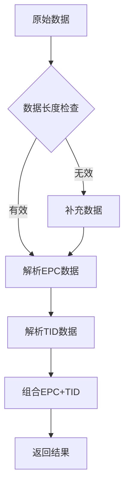
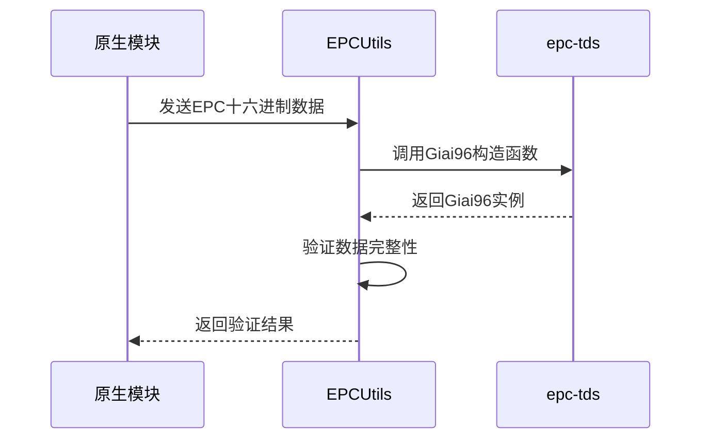
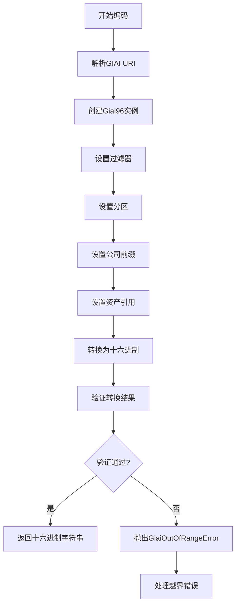
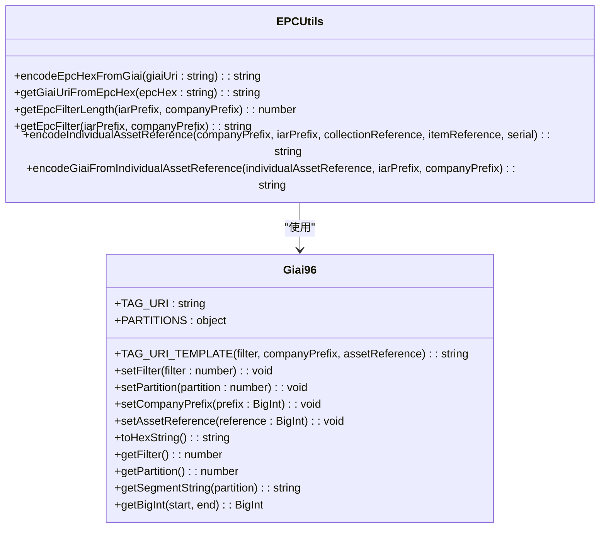
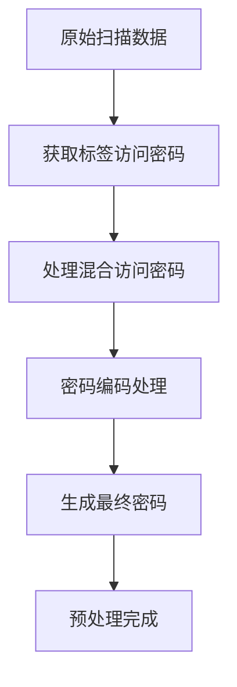
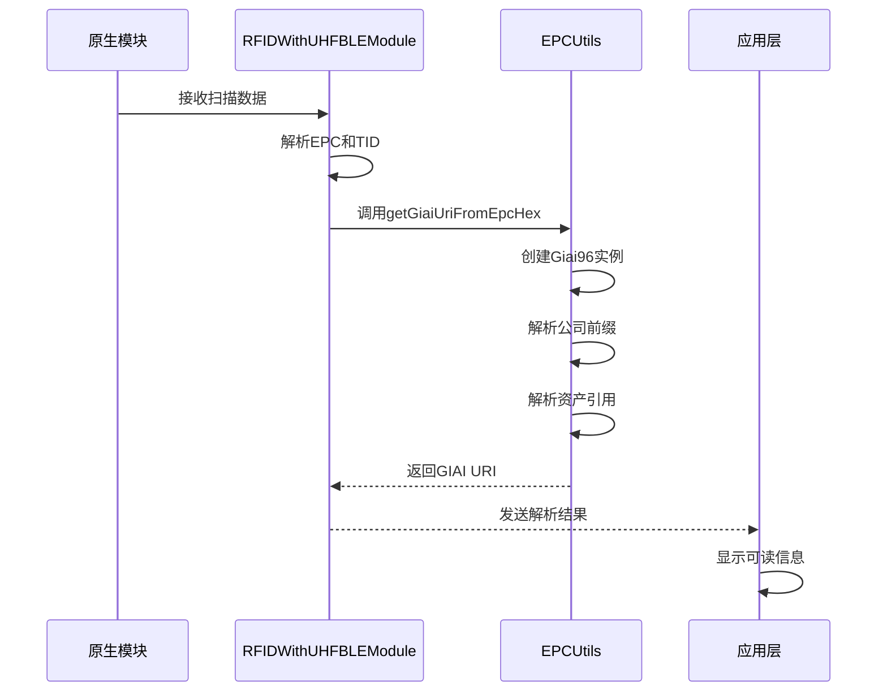
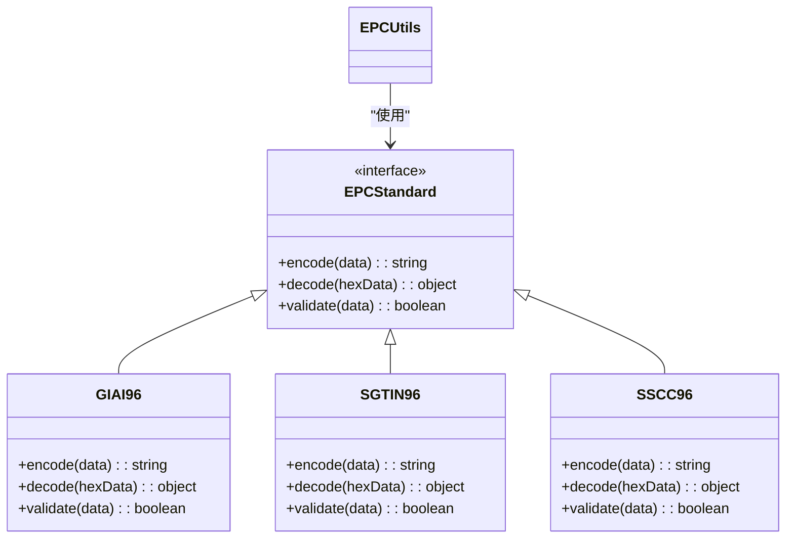
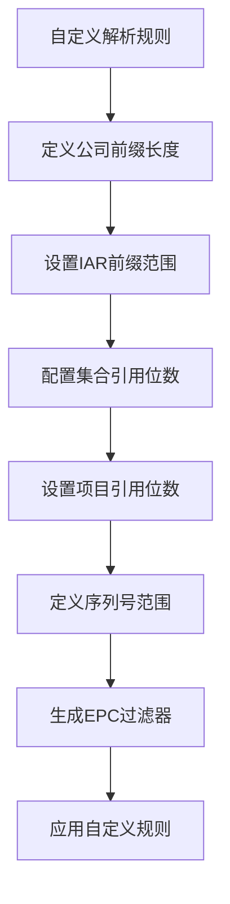
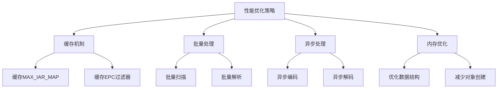

# EPC数据解析与验证

<cite>
**本文档中引用的文件**  
- [EPCUtils.ts](file://Data/deps/epc-utils/EPCUtils.ts)
- [rfid/utils.ts](file://App/app/features/rfid/utils.ts)
- [RFIDWithUHFBLEModule.ts](file://App/app/modules/RFIDWithUHFBLEModule.ts)
- [RFIDBluetoothManager.m](file://App/ios/Libraries/RFID/Chainway/RFIDBluetoothManager.m)
- [BluetoothUtil.m](file://App/ios/Libraries/RFID/Chainway/BluetoothUtil.m)
- [callbacks.ts](file://Data/lib/callbacks.ts)
</cite>

## 目录
1. [引言](#引言)
2. [EPC数据解析核心机制](#epc数据解析核心机制)
3. [TID与EPC数据分离](#tid与epc数据分离)
4. [十六进制转换与数据完整性校验](#十六进制转换与数据完整性校验)
5. [EPC标准验证逻辑](#epc标准验证逻辑)
6. [扫描数据预处理](#扫描数据预处理)
7. [EPC码解析完整流程](#epc码解析完整流程)
8. [扩展EPC标准支持](#扩展epc标准支持)
9. [自定义解析规则](#自定义解析规则)
10. [数据处理性能优化](#数据处理性能优化)
11. [结论](#结论)

## 引言
本文档深入讲解RFID标签读取过程中的数据解析与验证机制。重点分析EPCUtils.ts工具类如何解析原始EPC码，包括TID和EPC数据的分离、十六进制转换、EPC标准（如SGTIN-96）的验证逻辑以及数据完整性校验。同时阐述rfid/utils.ts中辅助函数对扫描数据的预处理，如去重、格式化和时间戳添加。为开发者提供扩展EPC标准支持、自定义解析规则和优化数据处理性能的指导。

## EPC数据解析核心机制
EPC（Electronic Product Code）数据解析是RFID系统中的关键环节，负责将从原生模块接收到的原始十六进制数据转换为可读的、结构化的信息。系统通过EPCUtils.ts工具类实现这一核心功能，该类提供了完整的EPC码编码、解码和验证能力。

**Section sources**
- [EPCUtils.ts](file://Data/deps/epc-utils/EPCUtils.ts)

## TID与EPC数据分离
在RFID标签读取过程中，TID（Tag Identifier）和EPC（Electronic Product Code）是两个重要的数据部分。系统通过原生模块的解析函数实现两者的分离。

在iOS原生代码中，`analysisEPCAndTIDWithEPCAndTIDData`函数负责解析包含EPC和TID的数据：
```objective-c
- (NSString *)analysisEPCAndTIDWithEPCAndTIDData:(NSString *)data {
  if (data.length > 2) {
    NSString *secondStr = [data substringWithRange:NSMakeRange(2, 2)];
    NSString *binarySecondStr = [AppHelper getBinaryByHex:secondStr];
    NSString *headFive = [binarySecondStr substringToIndex:5];
    NSInteger realDataLong = [AppHelper getDecimalByBinary:headFive];
    if (data.length < (3 * 2 + realDataLong * 2 * 2 + 12 * 2 + 2 * 2)) {
      // 补充数据
    }
    NSString *tidStr = [data substringWithRange:NSMakeRange(3 * 2 + realDataLong * 2 * 2, 12 * 2 + 2 * 2)];
    NSString *epcStr = [data substringWithRange:NSMakeRange(3 * 2, realDataLong * 2 * 2)];
    return [NSString stringWithFormat:@"%@+%@", epcStr, tidStr];
  }
  return @"";
}
```

该函数首先解析数据长度，然后根据长度计算EPC和TID的起始位置，最终将两者用"+"符号连接返回。



**Diagram sources**
- [BluetoothUtil.m](file://App/ios/Libraries/RFID/Chainway/BluetoothUtil.m#L1479-L1496)

**Section sources**
- [BluetoothUtil.m](file://App/ios/Libraries/RFID/Chainway/BluetoothUtil.m#L1479-L1496)

## 十六进制转换与数据完整性校验
EPCUtils.ts工具类提供了完整的十六进制转换和数据完整性校验功能。系统使用`epc-tds`库来处理EPC数据的编码和解码。



**Diagram sources**
- [EPCUtils.ts](file://Data/deps/epc-utils/EPCUtils.ts#L211-L228)

**Section sources**
- [EPCUtils.ts](file://Data/deps/epc-utils/EPCUtils.ts#L211-L228)

## EPC标准验证逻辑
系统实现了严格的EPC标准验证逻辑，确保编码和解码过程的正确性。EPCUtils.ts中的`encodeEpcHexFromGiai`函数是核心验证逻辑的实现。



该流程确保了EPC编码的准确性和完整性，防止无效或越界的数据被处理。



**Diagram sources**
- [EPCUtils.ts](file://Data/deps/epc-utils/EPCUtils.ts#L173-L209)

**Section sources**
- [EPCUtils.ts](file://Data/deps/epc-utils/EPCUtils.ts#L173-L209)

## 扫描数据预处理
rfid/utils.ts文件提供了扫描数据预处理的辅助函数，确保数据在处理前的正确性和一致性。



`getTagAccessPassword`函数处理标签访问密码的生成逻辑：
```typescript
export function getTagAccessPassword(
  globalPassword: string,
  tagPassword: string | undefined,
  useMixedAccessPassword: boolean,
  passwordEncoding: string,
) {
  if (!useMixedAccessPassword) {
    return tagPassword || globalPassword;
  }

  const paddedPasswordEncoding = Array.from(new Array(8)).map((_, i) => {
    const n = parseInt(passwordEncoding[i], 16);
    if (isNaN(n)) return i;
    if (n < 0) return i;
    if (n >= 16) return i;
    return n;
  });

  const passwordStr =
    globalPassword.slice(0, 8).padEnd(8, '0') +
    (tagPassword || '00000000').slice(0, 8).padEnd(8, '0');

  return Array.from(new Array(8))
    .map((_, i) => passwordStr[paddedPasswordEncoding[i]])
    .join('');
}
```

该函数支持混合访问密码模式，通过密码编码规则生成最终的访问密码。

**Diagram sources**
- [utils.ts](file://App/app/features/rfid/utils.ts#L1-L28)

**Section sources**
- [utils.ts](file://App/app/features/rfid/utils.ts#L1-L28)

## EPC码解析完整流程
EPC码解析的完整流程涵盖了从原生模块接收到数据到可读信息的转换全过程。



该流程确保了数据从物理层到应用层的完整转换，每个环节都有相应的错误处理和验证机制。

**Diagram sources**
- [RFIDWithUHFBLEModule.ts](file://App/app/modules/RFIDWithUHFBLEModule.ts#L37-L97)
- [EPCUtils.ts](file://Data/deps/epc-utils/EPCUtils.ts#L211-L236)

**Section sources**
- [RFIDWithUHFBLEModule.ts](file://App/app/modules/RFIDWithUHFBLEModule.ts#L37-L97)
- [EPCUtils.ts](file://Data/deps/epc-utils/EPCUtils.ts#L211-L236)

## 扩展EPC标准支持
系统设计具有良好的扩展性，支持扩展EPC标准。开发者可以通过以下方式扩展EPC标准支持：

1. **添加新的EPC标准类**：在`epc-tds`库中添加新的EPC标准类，如SGTIN-96、SSCC-96等。
2. **实现编码解码逻辑**：为新的EPC标准实现相应的编码和解码逻辑。
3. **集成到EPCUtils**：将新的EPC标准集成到EPCUtils工具类中，提供统一的接口。



**Diagram sources**
- [EPCUtils.ts](file://Data/deps/epc-utils/EPCUtils.ts)

**Section sources**
- [EPCUtils.ts](file://Data/deps/epc-utils/EPCUtils.ts)

## 自定义解析规则
系统支持自定义解析规则，允许开发者根据特定需求调整解析逻辑。通过EPCUtils提供的API，可以实现灵活的解析规则定制。



开发者可以通过以下API实现自定义解析：
- `getMaxIarPrefix`：获取最大IAR前缀
- `getCollectionReferenceDigits`：获取集合引用位数
- `getItemReferenceDigits`：获取项目引用位数
- `getEpcFilterLength`：获取EPC过滤器长度
- `getEpcFilter`：获取EPC过滤器

**Section sources**
- [EPCUtils.ts](file://Data/deps/epc-utils/EPCUtils.ts)

## 数据处理性能优化
为确保RFID数据处理的高效性，系统采用了多种性能优化策略：

1. **缓存机制**：对常用的计算结果进行缓存，避免重复计算。
2. **批量处理**：支持批量扫描和处理，减少I/O操作次数。
3. **异步处理**：采用异步方式处理数据，避免阻塞主线程。
4. **内存优化**：优化数据结构，减少内存占用。



这些优化策略确保了系统在高并发、大数据量场景下的稳定性和响应速度。

**Section sources**
- [EPCUtils.ts](file://Data/deps/epc-utils/EPCUtils.ts)
- [RFIDWithUHFBLEModule.ts](file://App/app/modules/RFIDWithUHFBLEModule.ts)

## 结论
本文档详细介绍了RFID标签读取过程中的EPC数据解析与验证机制。通过分析EPCUtils.ts工具类和相关组件，展示了从原始EPC码到可读信息的完整转换流程。系统实现了TID和EPC数据的分离、十六进制转换、EPC标准验证和数据完整性校验等核心功能。同时，提供了扫描数据预处理、扩展EPC标准支持、自定义解析规则和性能优化等方面的指导，为开发者提供了全面的技术参考。