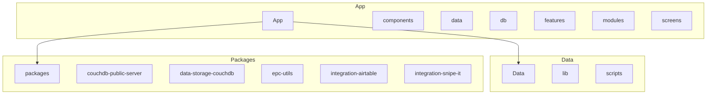
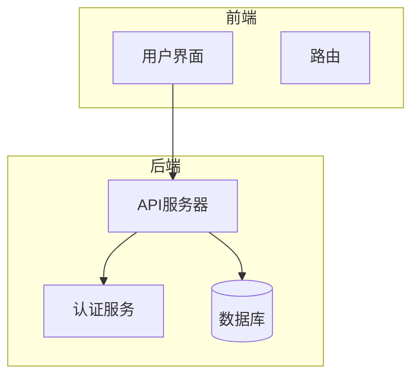
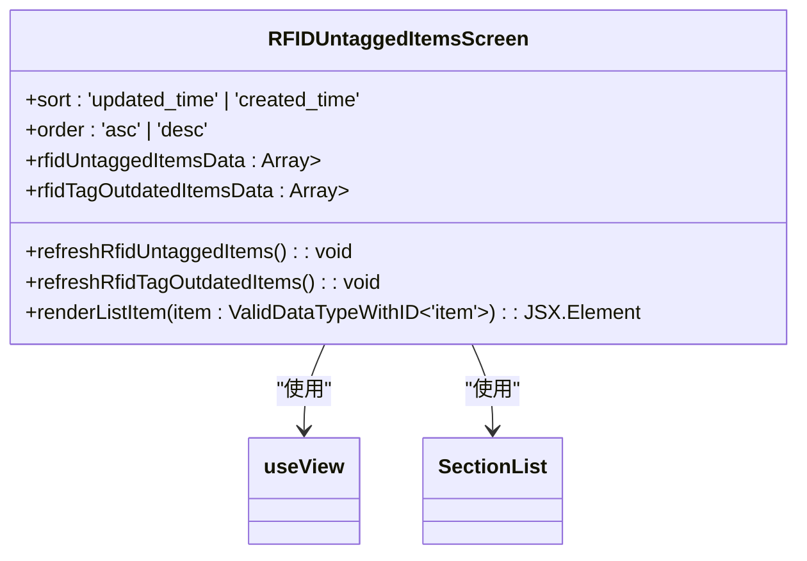
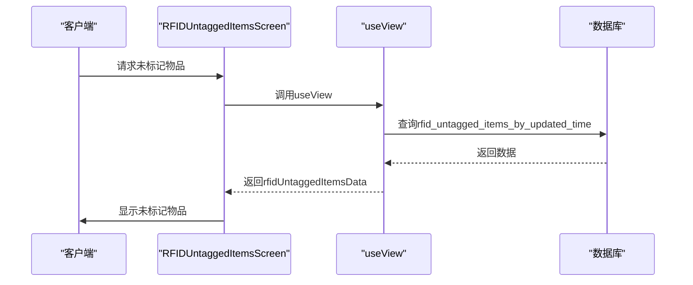
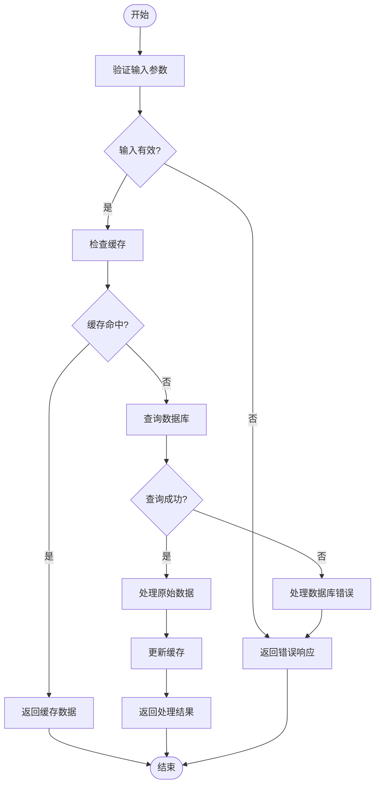
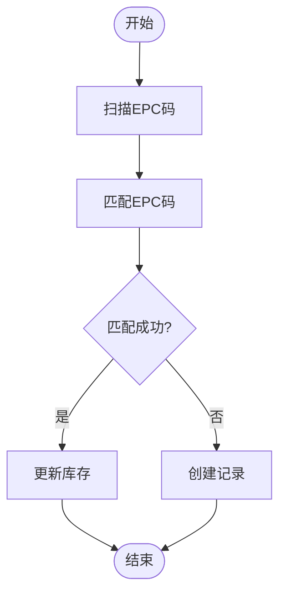
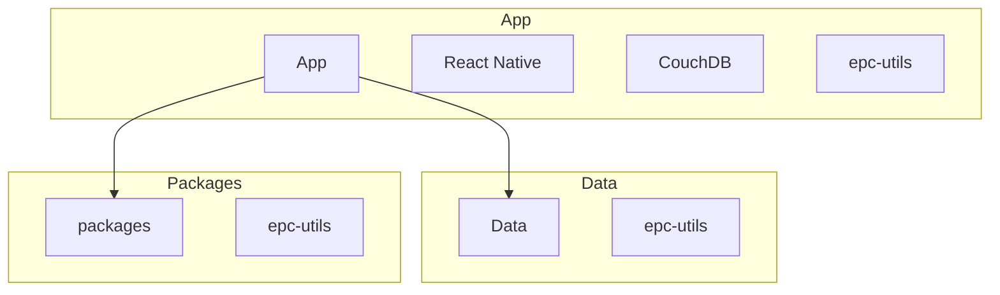

# 库存系统集成与匹配

<cite>
**本文档引用的文件**   
- [RFIDUntaggedItemsScreen.tsx](file://App/app/features/inventory/screens/RFIDUntaggedItemsScreen.tsx)
- [schema.ts](file://App/app/data/schema.ts)
- [views.ts](file://packages/data-storage-couchdb/lib/views.ts)
- [callbacks.ts](file://Data/lib/callbacks.ts)
- [validation.ts](file://Data/lib/validation.ts)
- [RFIDWithUHFBaseModule.ts](file://App/app/modules/RFIDWithUHFBaseModule.ts)
- [utils.ts](file://App/app/features/rfid/utils.ts)
</cite>

## 目录
1. [简介](#简介)
2. [项目结构](#项目结构)
3. [核心组件](#核心组件)
4. [架构概述](#架构概述)
5. [详细组件分析](#详细组件分析)
6. [依赖分析](#依赖分析)
7. [性能考虑](#性能考虑)
8. [故障排除指南](#故障排除指南)
9. [结论](#结论)
10. [附录](#附录)（如有必要）

## 简介
本文档全面阐述了RFID标签读取功能与库存管理系统的业务集成。重点分析了`RFIDUntaggedItemsScreen.tsx`如何将扫描到的EPC码与本地数据库中的物品记录进行匹配，包括查询逻辑、匹配算法和未匹配项的处理流程。系统利用`data/schema.ts`中定义的数据模型来验证EPC码与物品的关联性。文档提供了从扫描到库存更新的完整业务流程，包括为未标记物品自动创建记录的可能性。此外，还为开发者提供了定制匹配规则、扩展集成场景（如资产追踪）和优化数据库查询性能的实现方案。

## 项目结构
项目结构清晰地分为多个模块，包括App、Data和packages。App模块包含应用程序的主要功能，如组件、数据处理、数据库操作和各种功能模块。Data模块包含数据存储和处理的逻辑，而packages模块则包含可重用的库和工具。

**图表来源**
- [App](file://App)
- [Data](file://Data)
- [packages](file://packages)

**章节来源**
- [App](file://App)
- [Data](file://Data)
- [packages](file://packages)

## 核心组件
核心组件包括RFID标签读取、数据匹配、库存更新和用户界面。`RFIDUntaggedItemsScreen.tsx`是主要的用户界面组件，负责显示未标记和标签过期的物品。`data/schema.ts`定义了数据模型，用于验证EPC码与物品的关联性。`views.ts`中的视图定义了如何查询数据库中的物品记录。

**章节来源**
- [RFIDUntaggedItemsScreen.tsx](file://App/app/features/inventory/screens/RFIDUntaggedItemsScreen.tsx)
- [schema.ts](file://App/app/data/schema.ts)
- [views.ts](file://packages/data-storage-couchdb/lib/views.ts)

## 架构概述
系统架构包括前端用户界面、后端数据处理和数据库存储。前端用户界面通过React Native实现，后端数据处理通过Node.js和CouchDB实现。数据库存储使用CouchDB，支持离线同步和数据一致性。

**图表来源**
- [App](file://App)
- [Data](file://Data)
- [packages](file://packages)

## 详细组件分析
### RFIDUntaggedItemsScreen分析
`RFIDUntaggedItemsScreen.tsx`组件负责显示未标记和标签过期的物品。它通过`useView`钩子从数据库中获取数据，并根据排序和顺序选项进行排序。组件使用`SectionList`来显示物品列表，并提供刷新功能。

#### 对象导向组件

**图表来源**
- [RFIDUntaggedItemsScreen.tsx](file://App/app/features/inventory/screens/RFIDUntaggedItemsScreen.tsx)

#### API/服务组件

**图表来源**
- [RFIDUntaggedItemsScreen.tsx](file://App/app/features/inventory/screens/RFIDUntaggedItemsScreen.tsx)
- [views.ts](file://packages/data-storage-couchdb/lib/views.ts)

#### 复杂逻辑组件

**图表来源**
- [RFIDUntaggedItemsScreen.tsx](file://App/app/features/inventory/screens/RFIDUntaggedItemsScreen.tsx)
- [views.ts](file://packages/data-storage-couchdb/lib/views.ts)

**章节来源**
- [RFIDUntaggedItemsScreen.tsx](file://App/app/features/inventory/screens/RFIDUntaggedItemsScreen.tsx)
- [views.ts](file://packages/data-storage-couchdb/lib/views.ts)

### 概念概述
系统通过RFID标签读取设备扫描EPC码，并将其与本地数据库中的物品记录进行匹配。匹配逻辑基于EPC码的唯一性和物品记录的关联性。未匹配的EPC码可以触发自动创建记录的流程。

[无来源，因为此图表显示概念工作流，而非实际代码结构]

[无来源，因为此部分不分析特定文件]

## 依赖分析
系统依赖于多个模块和库，包括React Native、CouchDB、epc-utils等。这些依赖项通过`package.json`文件管理，并在构建时自动安装。

**图表来源**
- [package.json](file://package.json)
- [App](file://App)
- [Data](file://Data)
- [packages](file://packages)

**章节来源**
- [package.json](file://package.json)
- [App](file://App)
- [Data](file://Data)
- [packages](file://packages)

## 性能考虑
为了优化性能，系统采用了多种策略，包括缓存、数据库索引和异步操作。缓存可以减少数据库查询次数，数据库索引可以加快查询速度，异步操作可以提高用户体验。

[无来源，因为此部分提供一般指导]

## 故障排除指南
### 错误处理代码分析
系统在多个地方实现了错误处理，包括数据验证、数据库操作和用户界面。`validation.ts`文件中的`validate`函数用于验证数据的完整性，`callbacks.ts`文件中的`beforeSave`函数用于在保存数据前进行预处理。

**章节来源**
- [validation.ts](file://Data/lib/validation.ts)
- [callbacks.ts](file://Data/lib/callbacks.ts)

## 结论
本文档详细介绍了RFID标签读取功能与库存管理系统的业务集成。通过分析`RFIDUntaggedItemsScreen.tsx`组件，我们了解了如何将扫描到的EPC码与本地数据库中的物品记录进行匹配。系统利用`data/schema.ts`中定义的数据模型来验证EPC码与物品的关联性，并提供了从扫描到库存更新的完整业务流程。此外，还为开发者提供了定制匹配规则、扩展集成场景（如资产追踪）和优化数据库查询性能的实现方案。

[无来源，因为此部分总结而不分析特定文件]