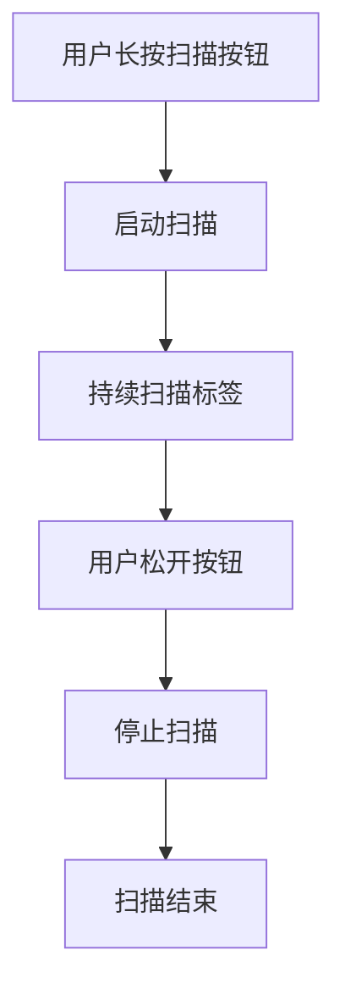
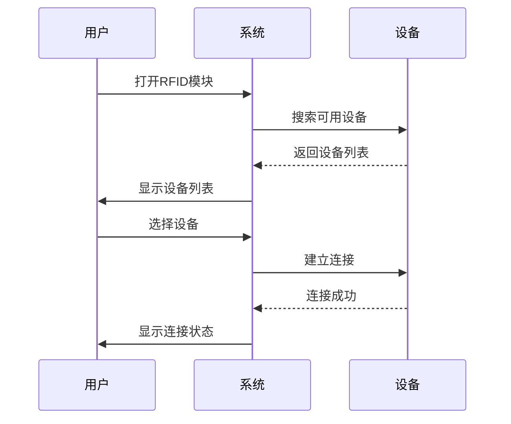
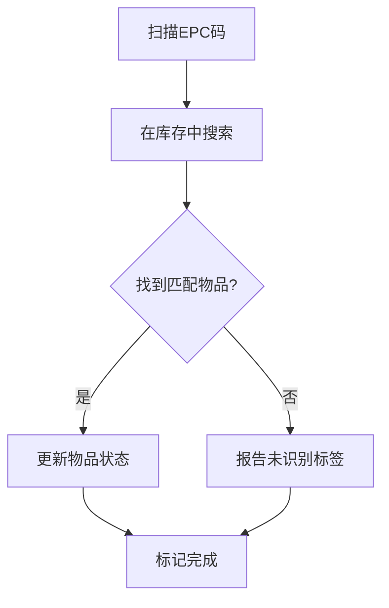
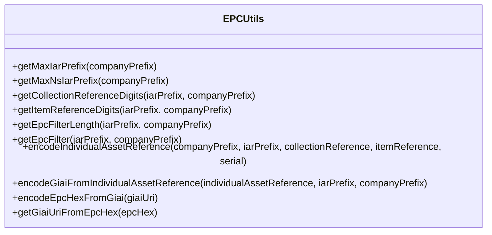
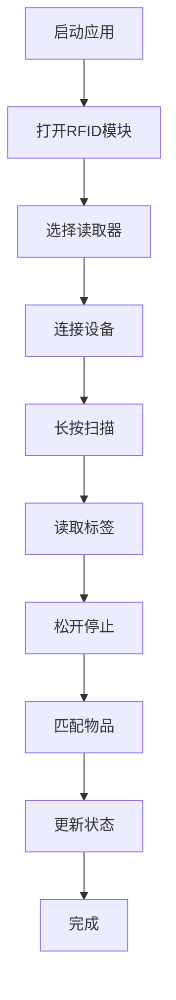

# 标签读取功能

<cite>
**本文档引用的文件**   
- [RFIDSheet.tsx](file://App\app\features\rfid\RFIDSheet.tsx)
- [RFIDUHFModuleScreen.tsx](file://App\app\screens\RFIDUHFModuleScreen.tsx)
- [RFIDUntaggedItemsScreen.tsx](file://App\app\features\inventory\screens\RFIDUntaggedItemsScreen.tsx)
- [EPCUtils.ts](file://Data\deps\epc-utils\EPCUtils.ts)
- [utils.ts](file://App\app\features\rfid\utils.ts)
</cite>

## 目录
1. [简介](#简介)
2. [UI设计与交互流程](#ui设计与交互流程)
3. [功能入口点导航逻辑](#功能入口点导航逻辑)
4. [扫描匹配逻辑](#扫描匹配逻辑)
5. [EPC码解析与验证](#epc码解析与验证)
6. [辅助函数处理](#辅助函数处理)
7. [用户工作流](#用户工作流)
8. [开发者指导](#开发者指导)
9. [结论](#结论)

## 简介
标签读取功能是库存管理系统中的核心模块，通过RFID技术实现对物品的快速识别和管理。该功能主要由RFIDSheet.tsx组件提供用户界面，通过RFIDUHFModuleScreen.tsx作为功能入口点，利用RFIDUntaggedItemsScreen.tsx进行扫描匹配，并通过EPCUtils.ts工具类处理EPC码的解析和验证。

**Section sources**
- [RFIDSheet.tsx](file://App\app\features\rfid\RFIDSheet.tsx#L1-L2336)
- [RFIDUHFModuleScreen.tsx](file://App\app\screens\RFIDUHFModuleScreen.tsx#L1-L1618)

## UI设计与交互流程
RFIDSheet.tsx组件提供了完整的标签读取用户界面，包含启动/停止扫描按钮、扫描结果列表和状态指示器等核心元素。

### 启动/停止扫描按钮
组件通过长按机制实现扫描控制，用户长按"Scan"按钮开始扫描，松开后自动停止。这种设计符合移动设备的操作习惯，避免了误操作。

**Diagram sources**
- [RFIDSheet.tsx](file://App\app\features\rfid\RFIDSheet.tsx#L869-L909)

### 扫描结果列表
扫描结果以列表形式展示，每个条目包含EPC码、信号强度等信息。列表支持自动滚动，确保最新扫描的标签始终可见。

### 状态指示器
状态指示器显示当前扫描状态、设备连接状态和电池电量等关键信息，帮助用户了解系统运行情况。

**Section sources**
- [RFIDSheet.tsx](file://App\app\features\rfid\RFIDSheet.tsx#L1229-L1412)

## 功能入口点导航逻辑
RFIDUHFModuleScreen.tsx作为标签读取功能的入口点，负责设备连接和配置管理。

### 设备类型选择
用户可以选择使用内置读取器或蓝牙读取器，系统根据选择初始化相应的模块。

### 设备连接管理
系统自动处理设备的搜索、连接和状态同步，确保读取器处于就绪状态。

**Diagram sources**
- [RFIDUHFModuleScreen.tsx](file://App\app\screens\RFIDUHFModuleScreen.tsx#L58-L273)

**Section sources**
- [RFIDUHFModuleScreen.tsx](file://App\app\screens\RFIDUHFModuleScreen.tsx#L1-L1618)

## 扫描匹配逻辑
RFIDUntaggedItemsScreen.tsx负责将扫描到的EPC码与库存系统中的物品进行匹配。

### 数据获取
通过useView钩子从数据库获取未标记和标签过期的物品列表。

### 匹配处理
系统将扫描到的EPC码与库存物品进行比对，识别出需要标记的物品。

**Diagram sources**
- [RFIDUntaggedItemsScreen.tsx](file://App\app\features\inventory\screens\RFIDUntaggedItemsScreen.tsx#L1-L255)

**Section sources**
- [RFIDUntaggedItemsScreen.tsx](file://App\app\features\inventory\screens\RFIDUntaggedItemsScreen.tsx#L1-L255)

## EPC码解析与验证
EPCUtils.ts工具类提供了EPC码的解析和验证功能。

### EPC码结构
EPC码遵循GIAI-96标准，包含公司前缀、资产引用等信息。

### 解析功能
提供从EPC十六进制到URI格式的转换，便于人类阅读。

### 验证功能
验证EPC码的格式和范围，确保数据有效性。

**Diagram sources**
- [EPCUtils.ts](file://Data\deps\epc-utils\EPCUtils.ts#L1-L441)

**Section sources**
- [EPCUtils.ts](file://Data\deps\epc-utils\EPCUtils.ts#L1-L441)

## 辅助函数处理
rfid/utils.ts中的辅助函数处理扫描数据和访问密码。

### 访问密码生成
根据全局密码和标签密码生成混合访问密码。

### 数据处理
提供各种工具函数支持RFID功能的实现。

**Section sources**
- [utils.ts](file://App\app\features\rfid\utils.ts#L1-L28)

## 用户工作流
从启动扫描到结果展示的完整用户工作流。

### 启动阶段
1. 打开RFID模块
2. 选择读取器类型
3. 连接读取设备

### 扫描阶段
1. 长按扫描按钮
2. 系统持续读取标签
3. 松开按钮停止扫描

### 结果展示
1. 显示扫描到的标签列表
2. 匹配库存物品
3. 更新物品状态

**Diagram sources**
- [RFIDSheet.tsx](file://App\app\features\rfid\RFIDSheet.tsx#L869-L909)
- [RFIDUHFModuleScreen.tsx](file://App\app\screens\RFIDUHFModuleScreen.tsx#L58-L273)

## 开发者指导
为开发者提供自定义扫描界面和数据处理逻辑的指导。

### 界面自定义
通过传递选项参数可以定制扫描界面的外观和行为。

### 数据处理
可以重写扫描结果的处理逻辑，实现特定的业务需求。

### 错误处理
建议实现完善的错误处理机制，确保系统稳定性。

**Section sources**
- [RFIDSheet.tsx](file://App\app\features\rfid\RFIDSheet.tsx#L75-L117)

## 结论
标签读取功能通过RFID技术实现了高效的物品管理，其模块化设计便于扩展和维护。系统提供了完整的用户界面和数据处理流程，为库存管理提供了可靠的技术支持。