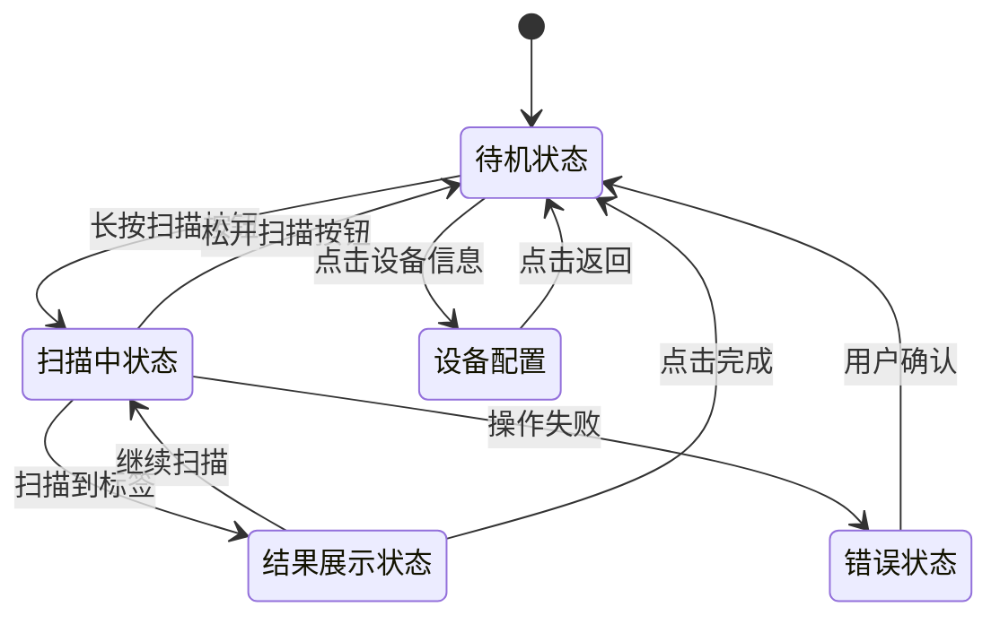

# 用户界面与交互流程

<cite>
**本文档引用的文件**   
- [RFIDSheet.tsx](file://App\app\features\rfid\RFIDSheet.tsx)
- [RFIDUHFModuleScreen.tsx](file://App\app\screens\RFIDUHFModuleScreen.tsx)
- [theme.ts](file://App\app\theme.ts)
- [RFIDWithUHFBLEModule.ts](file://App\app\modules\RFIDWithUHFBLEModule.ts)
- [RFIDWithUHFBaseModule.ts](file://App\app\modules\RFIDWithUHFBaseModule.ts)
</cite>

## 目录
1. [简介](#简介)
2. [RFIDUHFModuleScreen作为功能入口点](#rfiduhfmodulescreen作为功能入口点)
3. [RFIDSheet底部工作表布局](#rfidsheet底部工作表布局)
4. [界面状态转换](#界面状态转换)
5. [自定义UI组件与交互样式](#自定义ui组件与交互样式)
6. [与主题系统的一致性](#与主题系统的一致性)

## 简介
本文档详细描述了RFID标签读取功能的用户界面设计与交互流程。重点分析了RFIDSheet.tsx组件的底部工作表布局，包括扫描控制按钮、实时扫描结果显示区域、扫描状态指示器以及错误提示机制。同时，解释了RFIDUHFModuleScreen.tsx作为功能入口点的导航逻辑和初始界面展示。通过界面状态转换图展示了从待机到扫描中再到结果展示的全过程，并为开发者提供自定义UI组件、修改交互样式和添加新状态的实现指导。

**Section sources**
- [RFIDSheet.tsx](file://App\app\features\rfid\RFIDSheet.tsx#L1-L2336)
- [RFIDUHFModuleScreen.tsx](file://App\app\screens\RFIDUHFModuleScreen.tsx#L1-L1618)

## RFIDUHFModuleScreen作为功能入口点
RFIDUHFModuleScreen.tsx是RFID功能的主要入口点，负责初始化RFID模块、管理设备连接状态以及提供用户配置界面。该组件通过StackScreenProps接收导航参数，使用usePersistedState钩子持久化存储用户设置。

组件提供了设备类型选择功能，允许用户在内置读取器和蓝牙读取器之间切换。当选择内置读取器时，系统会自动调用RFIDWithUHFUARTModule进行初始化；当选择蓝牙读取器时，则使用RFIDWithUHFBLEModule管理设备连接。设备连接状态通过DeviceConnectStatusPayload对象进行跟踪，包括连接状态、设备名称和地址等信息。

该界面还提供了搜索和连接设备的功能，用户可以扫描附近的蓝牙设备并选择要连接的设备。连接成功后，系统会自动保存设备地址，以便下次快速连接。此外，还提供了设备状态查询功能，包括电池电量、温度等信息的获取。

**Section sources**
- [RFIDUHFModuleScreen.tsx](file://App\app\screens\RFIDUHFModuleScreen.tsx#L1-L1618)

## RFIDSheet底部工作表布局
RFIDSheet.tsx组件实现了底部工作表布局，作为RFID功能的主要交互界面。该工作表采用gorhom/bottom-sheet库实现，提供了流畅的滑动体验和灵活的布局控制。

### 扫描控制按钮
底部工作表包含主要的扫描控制按钮，其标签和行为根据当前功能模式动态变化：
- **扫描模式**：按钮显示为"Scan"，长按开始扫描，松开停止扫描
- **定位模式**：按钮显示为"Search"，长按开始定位，松开停止
- **写入模式**：按钮显示为"Write"，点击执行写入操作

按钮的交互通过onPressIn和onPressOut事件处理，实现了按住开始、松开停止的自然操作模式。按钮颜色根据功能模式变化，写入模式为红色，其他模式为黄色。

### 实时扫描结果显示区域
扫描结果显示区域位于工作表主体部分，采用动态布局：
- **空状态**：显示提示文字"Press and hold the Scan button to start scanning"
- **有结果状态**：以列表形式展示扫描到的标签，每个标签显示EPC码和相关信息
- **结果统计**：显示已扫描项目总数和唯一标签数量

当扫描到新标签时，列表会自动滚动到底部，确保最新结果可见。用户可以点击单个标签进行详细查看或操作。

### 扫描状态指示器
状态指示器位于底部控制栏，实时显示当前操作状态：
- **待机状态**：显示空白或"Slide up to access"
- **扫描中**：显示"Scanning..."
- **定位中**：显示"Signals broadcasting, move around to locate"
- **错误状态**：显示"Error: [具体错误信息]"

状态指示器的颜色和内容根据当前功能模式和操作状态动态更新，为用户提供清晰的反馈。

### 错误提示机制
系统通过多种方式处理和显示错误：
1. **状态栏显示**：在底部控制栏直接显示错误信息
2. **声音反馈**：操作失败时播放错误音效
3. **自动恢复**：某些错误会自动重试，如设备连接失败
4. **用户提示**：关键错误通过Alert.alert显示详细信息

错误信息包括设备连接问题、扫描失败、写入错误等，帮助用户快速定位和解决问题。

**Section sources**
- [RFIDSheet.tsx](file://App\app\features\rfid\RFIDSheet.tsx#L1-L2336)

## 界面状态转换
RFID功能的界面状态转换遵循清晰的流程，从待机到扫描中再到结果展示。



**Diagram sources**
- [RFIDSheet.tsx](file://App\app\features\rfid\RFIDSheet.tsx#L1-L2336)

## 自定义UI组件与交互样式
开发者可以通过以下方式自定义UI组件和交互样式：

### 自定义扫描结果显示
通过renderScannedItemsRef属性，开发者可以提供自定义的扫描结果渲染函数：
```typescript
const customRenderScannedItems: RenderScannedItemsFn = (items, options) => {
  // 自定义渲染逻辑
  return <CustomScannedItemsList items={items} />;
};
```

### 修改交互样式
可以通过覆盖样式属性来修改交互元素的外观：
- **按钮样式**：通过pressRetentionOffset调整按压区域
- **颜色主题**：根据功能模式动态设置按钮颜色
- **动画效果**：使用LayoutAnimation控制布局变化

### 添加新状态
通过扩展RFIDSheetOptions类型，可以添加新的功能模式：
```typescript
type CustomRFIDSheetOptions = RFIDSheetOptions & {
  functionality: 'custom';
  customParam?: string;
};
```

**Section sources**
- [RFIDSheet.tsx](file://App\app\features\rfid\RFIDSheet.tsx#L1-L2336)

## 与主题系统的一致性
RFID界面与应用的主题系统保持一致，确保视觉风格的统一。

### 颜色主题集成
组件通过useColors钩子获取当前主题颜色，包括：
- **背景色**：sheetBackgroundColor
- **文本色**：contentSecondaryTextColor
- **功能色**：green2, yellow2, orange2, red2, blue2

这些颜色根据深色/浅色模式自动调整，确保在不同环境下都有良好的可读性。

### 主题文件结构
主题系统定义在theme.ts文件中，采用Material Design 3规范：
```typescript
export const lightTheme = {
  ...MD3LightTheme,
  colors: {
    // 自定义颜色扩展
  },
};

export const darkTheme = {
  ...MD3DarkTheme,
  colors: {
    // 自定义颜色扩展
  },
};
```

### 样式继承
RFID组件继承了应用的全局样式，包括：
- **字体样式**：通过Text组件统一管理
- **间距规范**：使用commonStyles中的标准化间距
- **圆角大小**：遵循应用的整体设计语言

这种集成确保了RFID功能与其他界面元素在视觉上的一致性，提供统一的用户体验。

**Section sources**
- [theme.ts](file://App\app\theme.ts#L1-L29)
- [RFIDSheet.tsx](file://App\app\features\rfid\RFIDSheet.tsx#L1-L2336)