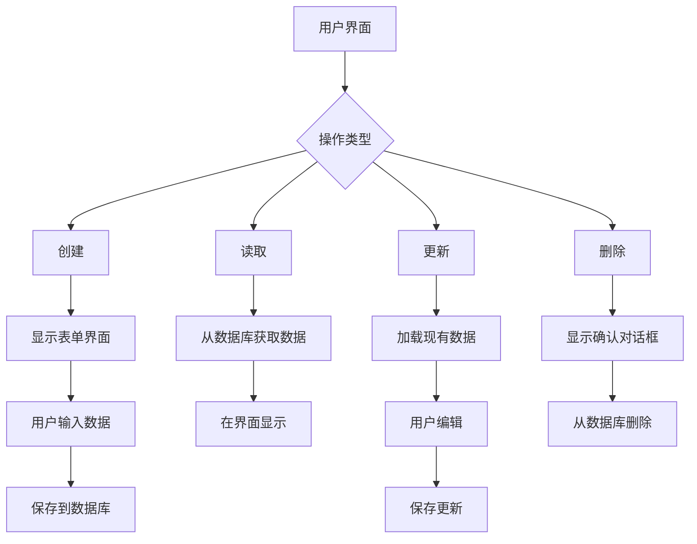
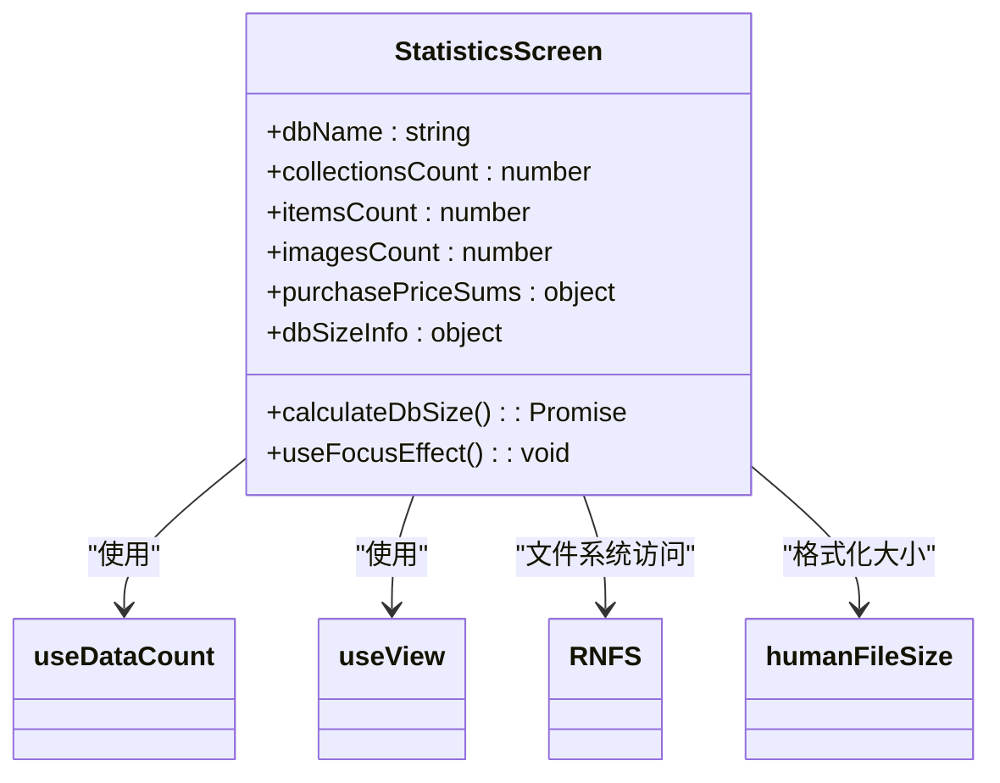
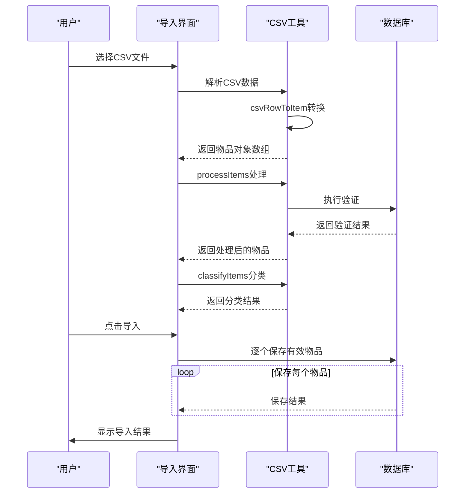
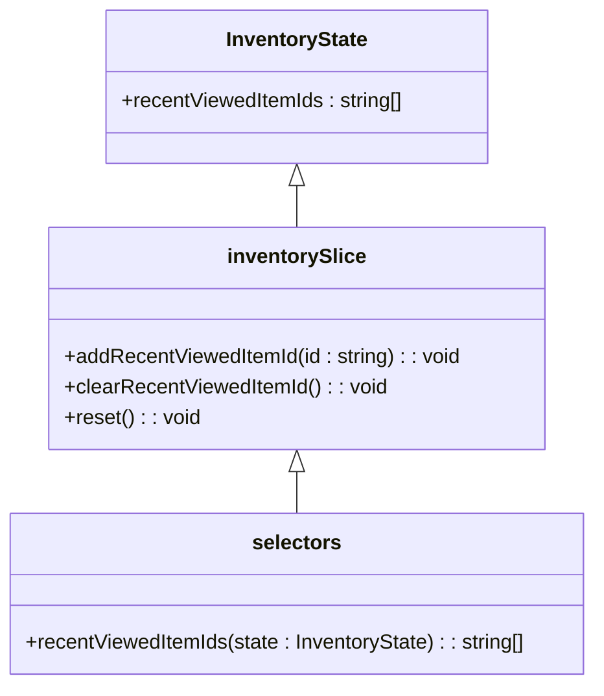

# 库存管理

<cite>
**本文档中引用的文件**  
- [slice.ts](file://App/app/features/inventory/slice.ts)
- [SearchOptionsScreen.tsx](file://App/app/features/inventory/screens/SearchOptionsScreen.tsx)
- [StatisticsScreen.tsx](file://App/app/features/inventory/screens/StatisticsScreen.tsx)
- [ImportItemsFromCsvScreen.tsx](file://App/app/features/inventory/screens/ImportItemsFromCsvScreen.tsx)
- [ExportItemsToCsvScreen.tsx](file://App/app/features/inventory/screens/ExportItemsToCsvScreen.tsx)
- [csv-import.ts](file://App/app/features/inventory/utils/csv-import.ts)
- [itemToCsvRow.ts](file://App/app/features/inventory/utils/itemToCsvRow.ts)
- [csvRowToItem.ts](file://App/app/features/inventory/utils/csvRowToItem.ts)
- [schema.ts](file://Data/lib/schema.ts)
- [SEARCH_OPTIONS.ts](file://App/app/features/inventory/consts/SEARCH_OPTIONS.ts)
- [SaveItemScreen.tsx](file://App/app/features/inventory/screens/SaveItemScreen.tsx)
- [ItemsScreen.tsx](file://App/app/features/inventory/screens/ItemsScreen.tsx)
- [CollectionsScreen.tsx](file://App/app/features/inventory/screens/CollectionsScreen.tsx)
- [getChildrenItemIds.ts](file://App/app/features/inventory/utils/getChildrenItemIds.ts)
</cite>

## 目录
1. [简介](#简介)
2. [数据模型](#数据模型)
3. [CRUD操作](#crud操作)
4. [搜索功能](#搜索功能)
5. [统计功能](#统计功能)
6. [CSV导入导出功能](#csv导入导出功能)
7. [Redux状态管理](#redux状态管理)
8. [结论](#结论)

## 简介

本项目是一个功能完整的库存管理系统，提供物品（Item）和集合（Collection）的全面管理功能。系统采用React Native构建，使用PouchDB作为本地数据库，通过Redux Toolkit进行状态管理。核心功能包括物品和集合的创建、读取、更新和删除（CRUD）操作，强大的搜索功能，详细的统计信息展示，以及CSV格式的导入导出功能。系统还支持RFID标签管理、容器层级结构和多种数据可视化。

**Section sources**
- [slice.ts](file://App/app/features/inventory/slice.ts#L1-L53)

## 数据模型

库存管理系统的核心数据模型由物品（Item）和集合（Collection）两种主要实体构成。这些数据模型定义了系统中存储和管理的数据结构、字段及其相互关系。

### 物品（Item）数据模型

物品是库存管理系统中的基本单位，代表具体的库存项目。每个物品都有一个唯一的ID，并包含丰富的属性信息。

**核心字段：**
- `__id`: 物品的唯一标识符
- `name`: 物品名称（必填）
- `collection_id`: 所属集合的ID，建立与集合的关系
- `icon_name` 和 `icon_color`: 用于可视化表示的图标名称和颜色
- `config_uuid`: 配置的唯一标识符，用于多配置环境
- `item_reference_number`: 项目参考编号，用于RFID标签生成
- `serial`: 序列号
- `model_name`: 型号名称
- `purchase_price_x1000`: 采购价格（以千分之一为单位存储）
- `purchase_price_currency`: 采购价格货币
- `notes`: 备注信息
- `__created_at` 和 `__updated_at`: 创建和更新时间戳

**特殊属性：**
- `_can_contain_items`: 布尔值，标识该物品是否可以作为容器
- `contents_order`: 子物品的显示顺序数组
- `consumable_stock_quantity`: 消耗品的库存数量
- `consumable_min_stock_level`: 消耗品的最低库存水平
- `consumable_will_not_restock`: 标识消耗品是否不再补货

### 集合（Collection）数据模型

集合用于对物品进行分类和组织，类似于文件夹的概念。

**核心字段：**
- `__id`: 集合的唯一标识符
- `name`: 集合名称
- `icon_name` 和 `icon_color`: 可视化表示的图标
- `config_uuid`: 配置的唯一标识符
- `collection_reference_number`: 集合参考编号，用于RFID标签生成
- `items_order`: 集合内物品的显示顺序数组
- `__created_at` 和 `__updated_at`: 创建和更新时间戳

### 关系与约束

物品和集合之间存在明确的关系和约束：

1. **层级关系**：每个物品必须属于一个集合，通过`collection_id`字段建立关联。
2. **容器关系**：物品可以作为其他物品的容器，通过`container_id`字段建立父子关系，形成多层级的容器结构。
3. **顺序约束**：集合和容器都支持自定义物品显示顺序，通过`items_order`和`contents_order`数组实现。
4. **唯一性约束**：每个物品和集合都有唯一的ID，确保数据的唯一性。
5. **数据完整性**：系统通过验证机制确保必填字段（如物品名称）不为空。

**Section sources**
- [schema.ts](file://Data/lib/schema.ts#L1-L100)
- [SaveItemScreen.tsx](file://App/app/features/inventory/screens/SaveItemScreen.tsx#L1-L800)

## CRUD操作

库存管理系统的CRUD（创建、读取、更新、删除）操作通过直观的用户界面和高效的后端实现来完成。

### 创建操作

创建新物品或集合通过专门的表单界面完成。用户点击"添加"按钮后，系统会导航到`SaveItemScreen`或`SaveCollectionScreen`，提供一个预填充默认值的表单。用户填写必要信息后，点击"保存"按钮，系统会生成唯一的ID并保存数据到数据库。

### 读取操作

读取操作主要通过列表界面实现。`ItemsScreen`和`CollectionsScreen`组件使用`useData`钩子从数据库获取数据，并以列表形式展示。系统支持分页（通过`UIGroupPaginator`）和排序功能，用户可以通过下拉刷新来更新数据。

### 更新操作

更新操作与创建操作共享相同的表单界面。当用户编辑现有物品或集合时，表单会预填充当前数据。系统通过`useDeepCompare`钩子检测数据变化，并在用户尝试离开未保存的页面时提示确认。

### 删除操作

删除操作通过确认对话框实现安全机制。在`CollectionsScreen`中，用户进入编辑模式后可以滑动删除集合。在`SaveItemScreen`中，有专门的删除按钮，点击后会弹出确认对话框，防止误操作。



**Diagram sources**
- [SaveItemScreen.tsx](file://App/app/features/inventory/screens/SaveItemScreen.tsx#L1-L800)
- [ItemsScreen.tsx](file://App/app/features/inventory/screens/ItemsScreen.tsx#L1-L158)
- [CollectionsScreen.tsx](file://App/app/features/inventory/screens/CollectionsScreen.tsx#L1-L228)

**Section sources**
- [SaveItemScreen.tsx](file://App/app/features/inventory/screens/SaveItemScreen.tsx#L1-L800)
- [ItemsScreen.tsx](file://App/app/features/inventory/screens/ItemsScreen.tsx#L1-L158)
- [CollectionsScreen.tsx](file://App/app/features/inventory/screens/CollectionsScreen.tsx#L1-L228)

## 搜索功能

搜索功能通过`SearchOptionsScreen`组件实现，提供了强大的搜索索引管理能力。

### 工作机制

搜索功能基于PouchDB的搜索插件实现，通过预定义的搜索选项来配置索引。系统为不同类型的搜索创建了专门的索引配置：

- **默认搜索**：搜索集合、物品和清单
- **仅物品搜索**：专门针对物品的搜索索引
- **容器物品搜索**：针对可作为容器的物品的搜索索引
- **集合特定搜索**：为每个集合创建独立的搜索索引

### 搜索选项

`SEARCH_OPTIONS.ts`文件定义了搜索的字段权重和过滤器：

```typescript
export const SEARCH_OPTIONS = {
  fields: {
    'data.name': 10,                    // 名称权重最高
    'data.individual_asset_reference': 8, // 资产参考编号
    'data.collection_reference_number': 8, // 集合参考编号
    'data.item_reference_number': 8,    // 项目参考编号
    'data.serial': 7,                   // 序列号
    'data.model_name': 8,               // 型号名称
    'data.epc_tag_uri': 7,              // EPC标签URI
    'data.notes': 2,                    // 备注权重较低
  },
  filter: function (doc: any) {
    return (
      doc.type === 'collection' ||
      doc.type === 'item' ||
      doc.type === 'checklist'
    );
  },
  language: ['zh', 'en'],
};
```

### 索引重置

`SearchOptionsScreen`提供"重置搜索索引"功能，这对于解决搜索问题非常有用。重置过程会：
1. 销毁现有的所有搜索索引
2. 为默认搜索、物品搜索、容器物品搜索和每个集合创建新的索引
3. 显示操作完成的提示

首次搜索在索引重建后可能会稍慢，因为系统需要时间建立新的索引。

**Section sources**
- [SearchOptionsScreen.tsx](file://App/app/features/inventory/screens/SearchOptionsScreen.tsx#L1-L131)
- [SEARCH_OPTIONS.ts](file://App/app/features/inventory/consts/SEARCH_OPTIONS.ts#L1-L69)

## 统计功能

统计功能通过`StatisticsScreen`组件实现，提供了全面的系统状态和数据统计信息。

### 指标计算方式

统计屏幕显示以下关键指标：

1. **数据库大小**：通过文件系统API读取数据库文件的实际大小
2. **视图大小**：计算所有视图索引文件的总大小
3. **搜索索引大小**：计算所有搜索索引文件的总大小
4. **数据计数**：统计集合、物品和图片的数量
5. **采购成本总计**：按货币分类计算所有物品的采购成本总和

### 数据可视化

统计信息以表格形式直观展示：

- **数据库信息**：显示数据库、视图和搜索索引的大小，使用`humanFileSize`函数将字节转换为可读的单位（KB、MB等）
- **数据计数**：显示各类数据实体的数量
- **采购成本**：按货币显示总采购成本，点击可导航到相应货币的物品列表

系统使用`LayoutAnimation`在数据加载完成后平滑地显示统计信息，提升用户体验。



**Diagram sources**
- [StatisticsScreen.tsx](file://App/app/features/inventory/screens/StatisticsScreen.tsx#L1-L203)

**Section sources**
- [StatisticsScreen.tsx](file://App/app/features/inventory/screens/StatisticsScreen.tsx#L1-L203)

## CSV导入导出功能

CSV导入导出功能通过`ImportItemsFromCsvScreen`和`ExportItemsToCsvScreen`两个组件实现，提供了灵活的数据交换能力。

### 导入功能

`ImportItemsFromCsvScreen`提供了完整的CSV导入流程：

1. **选择文件**：用户通过`DocumentPicker`选择CSV文件
2. **数据解析**：使用`csvRowToItem`工具函数将CSV行转换为物品对象
3. **数据处理**：通过`processItems`函数执行保存前回调和验证
4. **分类处理**：`classifyItems`函数将物品分为有效/无效、创建/更新三类
5. **执行导入**：将有效物品保存到数据库

导入过程提供详细的反馈：
- 显示加载的物品总数
- 列出有错误的物品及其错误信息
- 显示将要创建和更新的物品数量
- 提供导入结果的详细报告

### 导出功能

`ExportItemsToCsvScreen`支持多种导出选项：

1. **从集合导出**：导出指定集合中的所有物品
2. **从容器导出**：导出指定容器中的所有物品（包括嵌套容器）
3. **导出所有物品**：导出数据库中的所有物品

导出过程：
1. 根据选择的源获取物品数据
2. 使用`itemToCsvRow`工具函数将物品对象转换为CSV行
3. 生成CSV文件并使用`Share`组件分享

### 数据格式规范

CSV文件遵循以下格式规范：

**必填字段：**
- `Name`: 物品名称（必填，否则忽略该行）

**可选字段：**
- `Collection`: 所属集合名称
- `Container`: 所在容器名称
- `Icon Name`: 图标名称
- `Icon Color`: 图标颜色
- `Item Reference Number`: 项目参考编号
- `Serial`: 序列号
- `Model Name`: 型号名称
- `Purchase Price`: 采购价格
- `Purchase Price Currency`: 采购价格货币
- `Notes`: 备注

系统提供CSV模板下载功能，帮助用户了解正确的数据格式。



**Diagram sources**
- [ImportItemsFromCsvScreen.tsx](file://App/app/features/inventory/screens/ImportItemsFromCsvScreen.tsx#L1-L500)
- [ExportItemsToCsvScreen.tsx](file://App/app/features/inventory/screens/ExportItemsToCsvScreen.tsx#L1-L216)
- [csv-import.ts](file://App/app/features/inventory/utils/csv-import.ts#L1-L133)
- [itemToCsvRow.ts](file://App/app/features/inventory/utils/itemToCsvRow.ts#L1-L26)
- [csvRowToItem.ts](file://App/app/features/inventory/utils/csvRowToItem.ts#L1-L30)

**Section sources**
- [ImportItemsFromCsvScreen.tsx](file://App/app/features/inventory/screens/ImportItemsFromCsvScreen.tsx#L1-L500)
- [ExportItemsToCsvScreen.tsx](file://App/app/features/inventory/screens/ExportItemsToCsvScreen.tsx#L1-L216)
- [csv-import.ts](file://App/app/features/inventory/utils/csv-import.ts#L1-L133)

## Redux状态管理

Redux状态管理通过`inventorySlice.ts`文件实现，负责管理库存相关的应用状态。

### 状态结构

库存状态包含以下属性：
- `recentViewedItemIds`: 最近查看的物品ID数组，最多保存30个

### Reducer操作

`inventorySlice`定义了以下操作：
- `addRecentViewedItemId`: 添加最近查看的物品ID，如果已存在则移到数组开头，确保最新查看的物品排在前面
- `clearRecentViewedItemId`: 清空最近查看的物品列表
- `reset`: 重置状态到初始值

### 持久化

状态管理器实现了`dehydrate`和`rehydrate`方法，支持状态的序列化和反序列化，确保应用重启后能恢复之前的状态。

### 选择器

提供了`selectors`对象，方便从Redux store中提取特定状态：
- `recentViewedItemIds`: 获取最近查看的物品ID数组



**Diagram sources**
- [slice.ts](file://App/app/features/inventory/slice.ts#L1-L53)

**Section sources**
- [slice.ts](file://App/app/features/inventory/slice.ts#L1-L53)

## 结论

本库存管理系统提供了一套完整的解决方案，涵盖了物品和集合的全面管理。系统通过清晰的数据模型、直观的CRUD操作界面、强大的搜索功能、详细的统计信息和灵活的CSV导入导出能力，满足了现代库存管理的需求。Redux状态管理确保了应用状态的一致性和可预测性，而模块化的代码结构使得系统易于维护和扩展。整体设计注重用户体验，提供了流畅的操作流程和及时的反馈，是一个功能强大且易于使用的库存管理工具。