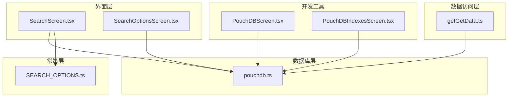
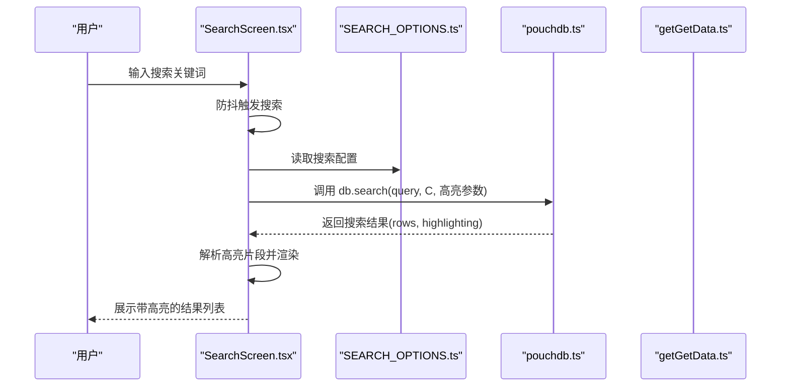
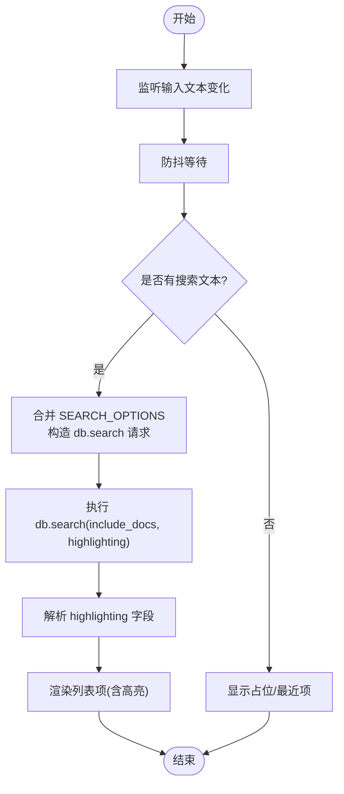
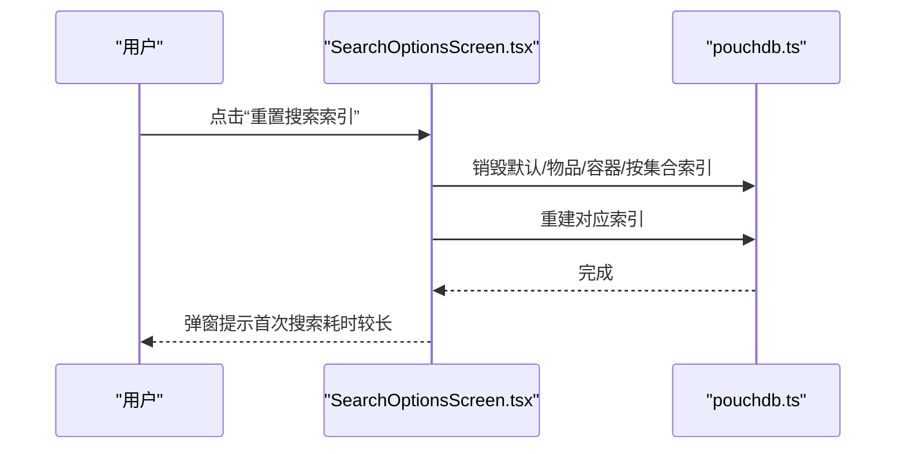
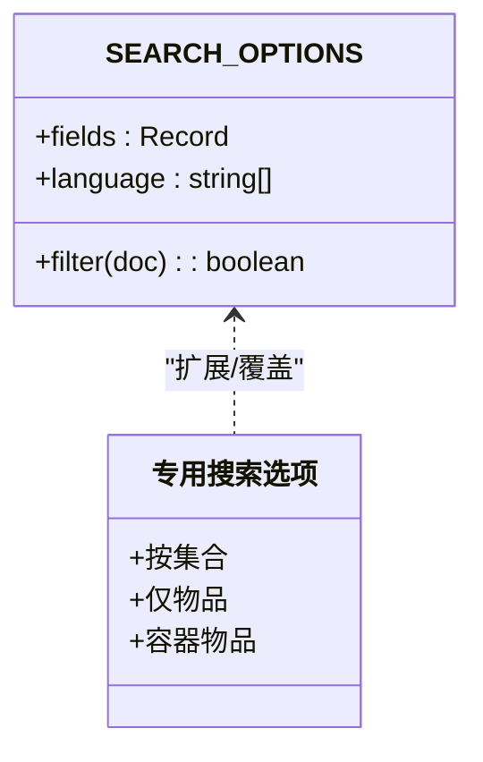
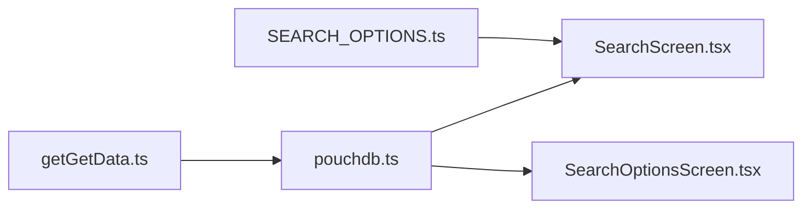

# 搜索功能

<cite>
**本文引用的文件列表**
- [SearchScreen.tsx](file://App/app/features/inventory/screens/SearchScreen.tsx)
- [SearchOptionsScreen.tsx](file://App/app/features/inventory/screens/SearchOptionsScreen.tsx)
- [SEARCH_OPTIONS.ts](file://App/app/features/inventory/consts/SEARCH_OPTIONS.ts)
- [pouchdb.ts](file://App/app/db/pouchdb.ts)
- [getGetData.ts](file://packages/data-storage-couchdb/lib/functions/getGetData.ts)
- [PouchDBScreen.tsx](file://App/app/screens/dev-tools/pouchdb/PouchDBScreen.tsx)
- [PouchDBIndexesScreen.tsx](file://App/app/screens/dev-tools/pouchdb/PouchDBIndexesScreen.tsx)
</cite>

## 目录
1. [简介](#简介)
2. [项目结构](#项目结构)
3. [核心组件](#核心组件)
4. [架构总览](#架构总览)
5. [详细组件分析](#详细组件分析)
6. [依赖关系分析](#依赖关系分析)
7. [性能考量](#性能考量)
8. [故障排查指南](#故障排查指南)
9. [结论](#结论)
10. [附录](#附录)

## 简介
本文件系统性梳理库存管理应用的搜索功能实现，覆盖以下关键点：
- 全文搜索与高亮：基于 PouchDB Quick Search 的全文检索，支持多语言分词与高亮片段生成。
- 字段过滤与条件组合：通过 SEARCH_OPTIONS 定义字段权重、过滤器与语言集合，支持按类型、集合等条件组合查询。
- 搜索界面与选项界面：SearchScreen 提供实时搜索与结果高亮；SearchOptionsScreen 支持重置搜索索引。
- 查询构建与索引策略：结合 PouchDB 的 search 接口与自定义索引创建逻辑，解释查询执行计划与性能优化路径。
- 复杂场景实践：多字段匹配、模糊搜索、按集合或容器类型筛选等。

## 项目结构
搜索相关的核心文件分布如下：
- 屏幕层：SearchScreen.tsx（搜索主界面）、SearchOptionsScreen.tsx（搜索选项与索引重置）
- 常量层：SEARCH_OPTIONS.ts（搜索字段权重、过滤器、语言配置）
- 数据库层：pouchdb.ts（PouchDB 初始化与插件加载）
- 数据访问层：getGetData.ts（通用查询构建与索引创建逻辑）
- 开发工具：PouchDBScreen.tsx、PouchDBIndexesScreen.tsx（索引与查询调试）

图表来源
- [SearchScreen.tsx](file://App/app/features/inventory/screens/SearchScreen.tsx#L1-L120)
- [SearchOptionsScreen.tsx](file://App/app/features/inventory/screens/SearchOptionsScreen.tsx#L1-L70)
- [SEARCH_OPTIONS.ts](file://App/app/features/inventory/consts/SEARCH_OPTIONS.ts#L1-L69)
- [pouchdb.ts](file://App/app/db/pouchdb.ts#L1-L102)
- [getGetData.ts](file://packages/data-storage-couchdb/lib/functions/getGetData.ts#L1-L120)
- [PouchDBScreen.tsx](file://App/app/screens/dev-tools/pouchdb/PouchDBScreen.tsx#L51-L127)
- [PouchDBIndexesScreen.tsx](file://App/app/screens/dev-tools/pouchdb/PouchDBIndexesScreen.tsx#L136-L266)

章节来源
- [SearchScreen.tsx](file://App/app/features/inventory/screens/SearchScreen.tsx#L1-L120)
- [SearchOptionsScreen.tsx](file://App/app/features/inventory/screens/SearchOptionsScreen.tsx#L1-L70)
- [SEARCH_OPTIONS.ts](file://App/app/features/inventory/consts/SEARCH_OPTIONS.ts#L1-L69)
- [pouchdb.ts](file://App/app/db/pouchdb.ts#L1-L102)
- [getGetData.ts](file://packages/data-storage-couchdb/lib/functions/getGetData.ts#L1-L120)
- [PouchDBScreen.tsx](file://App/app/screens/dev-tools/pouchdb/PouchDBScreen.tsx#L51-L127)
- [PouchDBIndexesScreen.tsx](file://App/app/screens/dev-tools/pouchdb/PouchDBIndexesScreen.tsx#L136-L266)

## 核心组件
- 搜索界面（SearchScreen.tsx）
  - 实时搜索：监听输入文本变化，使用防抖触发搜索请求。
  - 全文搜索：调用 db.search，传入 SEARCH_OPTIONS、高亮参数与分页限制。
  - 结果高亮：解析 r.highlighting，提取匹配片段并渲染加粗高亮文本。
  - 类型分支：分别处理 item 与 collection 的高亮字段过滤。
- 搜索选项界面（SearchOptionsScreen.tsx）
  - 重置索引：遍历默认与各类专用索引（按集合、仅物品、容器物品），逐个销毁并重建。
  - 反馈提示：重置完成后弹窗提示首次搜索可能需要更长时间重建索引。
- 搜索配置（SEARCH_OPTIONS.ts）
  - 字段权重：为不同字段设置权重，影响排序分数。
  - 过滤器：限定可被搜索的文档类型（如 item、collection、checklist）。
  - 语言：支持中英文多语言分词。
  - 专用索引：提供按集合、仅物品、容器物品等专用搜索选项工厂函数。
- 数据库初始化（pouchdb.ts）
  - 插件：加载 pouchdb-find、pouchdb-quick-search、react-native-sqlite 适配器。
  - 分词：iOS 使用原生分词器与 nodejiebaPolyfill，Android 使用基础分词器，均注入 lunr。
- 通用查询构建（getGetData.ts）
  - 条件选择器：支持数组 ID、无条件、按条件与排序等多场景。
  - 索引创建：自动检测并创建所需索引，支持 explain 调试。
  - 错误重试：在索引缺失时自动重试创建并查询。

章节来源
- [SearchScreen.tsx](file://App/app/features/inventory/screens/SearchScreen.tsx#L45-L120)
- [SearchOptionsScreen.tsx](file://App/app/features/inventory/screens/SearchOptionsScreen.tsx#L28-L70)
- [SEARCH_OPTIONS.ts](file://App/app/features/inventory/consts/SEARCH_OPTIONS.ts#L1-L69)
- [pouchdb.ts](file://App/app/db/pouchdb.ts#L1-L102)
- [getGetData.ts](file://packages/data-storage-couchdb/lib/functions/getGetData.ts#L47-L120)

## 架构总览
搜索系统采用“界面层 -> 配置层 -> 数据库层 -> 数据访问层”的分层设计，界面层负责用户交互与结果渲染，配置层提供搜索规则，数据库层承载全文检索与索引，数据访问层统一构建查询与索引。

图表来源
- [SearchScreen.tsx](file://App/app/features/inventory/screens/SearchScreen.tsx#L45-L120)
- [SEARCH_OPTIONS.ts](file://App/app/features/inventory/consts/SEARCH_OPTIONS.ts#L1-L69)
- [pouchdb.ts](file://App/app/db/pouchdb.ts#L1-L102)
- [getGetData.ts](file://packages/data-storage-couchdb/lib/functions/getGetData.ts#L173-L223)

## 详细组件分析

### 组件A：SearchScreen 搜索界面
- 用户交互设计
  - 搜索栏：支持聚焦/失焦动画、关闭动作、设置按钮跳转到搜索选项。
  - 首屏占位：未输入时显示最近查看与最近修改项，提升可用性。
  - 刷新控制：下拉刷新同步更新最近项与搜索结果。
- 查询构建与执行
  - 当存在搜索文本时，调用 db.search，传入：
    - query：用户输入
    - include_docs：返回文档
    - highlighting：启用高亮，预/后缀标记用于后续解析
    - skip/limit：分页控制
  - 将 SEARCH_OPTIONS 合并到搜索请求，确保字段权重与过滤器生效。
- 结果高亮与渲染
  - 对 item/collection 分别过滤高亮字段，避免非目标字段干扰。
  - 将高亮字符串解析为带加粗匹配片段的 UI 片段，首尾截断以增强可读性。
- 性能与体验
  - 防抖：300ms 延迟，减少频繁请求。
  - 布局动画：焦点切换与结果更新使用统一动画配置。

图表来源
- [SearchScreen.tsx](file://App/app/features/inventory/screens/SearchScreen.tsx#L45-L120)
- [SearchScreen.tsx](file://App/app/features/inventory/screens/SearchScreen.tsx#L120-L210)
- [SearchScreen.tsx](file://App/app/features/inventory/screens/SearchScreen.tsx#L210-L327)

章节来源
- [SearchScreen.tsx](file://App/app/features/inventory/screens/SearchScreen.tsx#L45-L120)
- [SearchScreen.tsx](file://App/app/features/inventory/screens/SearchScreen.tsx#L120-L210)
- [SearchScreen.tsx](file://App/app/features/inventory/screens/SearchScreen.tsx#L210-L327)

### 组件B：SearchOptionsScreen 搜索选项界面
- 功能设置
  - 重置搜索索引：依次销毁并重建默认索引、仅物品索引、容器物品索引以及按集合的专用索引。
  - 加载状态：重置过程中显示加载指示，防止重复操作。
  - 用户提示：重置完成后弹窗提示首次搜索需等待索引重建。
- 适用场景
  - 索引损坏或搜索结果异常时，通过重置索引恢复正确性。
  - 新增字段或调整权重后，重新构建索引以反映最新配置。

图表来源
- [SearchOptionsScreen.tsx](file://App/app/features/inventory/screens/SearchOptionsScreen.tsx#L28-L70)
- [pouchdb.ts](file://App/app/db/pouchdb.ts#L1-L102)

章节来源
- [SearchOptionsScreen.tsx](file://App/app/features/inventory/screens/SearchOptionsScreen.tsx#L28-L70)

### 组件C：SEARCH_OPTIONS 搜索条件定义
- 字段权重与过滤器
  - fields：为名称、参考号、序列号、标签 URI、备注等字段设置权重，权重越高，匹配得分越高。
  - filter：限定文档类型，确保只对 item、collection、checklist 进行全文搜索。
  - language：支持中英文多语言分词。
- 专用搜索选项
  - 按集合：仅搜索指定集合内的物品。
  - 仅物品：仅搜索物品类型。
  - 容器物品：仅搜索可作为容器的物品。
- 应用方式
  - 在 SearchScreen 中直接传入 SEARCH_OPTIONS。
  - 在 SearchOptionsScreen 中作为销毁/重建索引的依据。

图表来源
- [SEARCH_OPTIONS.ts](file://App/app/features/inventory/consts/SEARCH_OPTIONS.ts#L1-L69)

章节来源
- [SEARCH_OPTIONS.ts](file://App/app/features/inventory/consts/SEARCH_OPTIONS.ts#L1-L69)

### 组件D：PouchDB 初始化与全文搜索能力
- 插件加载
  - pouchdb-find：提供 find/explain 等查询能力。
  - pouchdb-quick-search：提供 search 接口，支持全文检索与高亮。
  - react-native-sqlite：适配器，使 PouchDB 在移动端使用 SQLite 存储。
- 分词与多语言
  - iOS/Android 分别注入 nodejiebaPolyfill，保证中文分词效果。
  - 通过 lunr-languages 支持多语言分词与拼写归一化。

章节来源
- [pouchdb.ts](file://App/app/db/pouchdb.ts#L1-L102)

### 组件E：通用查询构建与索引策略（getGetData.ts）
- 查询构建
  - 数组 ID：$in 选择器，skip/limit 控制分页。
  - 无条件/无排序：使用 type 索引，快速筛选。
  - 条件与排序：扁平化选择器，自动补全索引字段，满足 PouchDB 排序约束。
- 索引创建与调试
  - 自动检测并创建索引，支持 explain 输出查询计划。
  - 在索引缺失时进行有限次重试，提升健壮性。
- 性能建议
  - 优先使用复合索引覆盖常用查询字段。
  - 对高频排序字段，确保索引包含必要字段以避免回表。

章节来源
- [getGetData.ts](file://packages/data-storage-couchdb/lib/functions/getGetData.ts#L47-L120)
- [getGetData.ts](file://packages/data-storage-couchdb/lib/functions/getGetData.ts#L173-L223)
- [getGetData.ts](file://packages/data-storage-couchdb/lib/functions/getGetData.ts#L225-L297)

### 开发工具：PouchDBScreen 与 PouchDBIndexesScreen
- PouchDBScreen
  - 支持动态调整搜索字段权重与语言，自动重置索引并记录耗时。
  - 便于验证字段权重变化对搜索结果的影响。
- PouchDBIndexesScreen
  - 手动输入查询 JSON 并执行 find 或 explain，辅助定位索引问题。
  - 可直接创建自定义索引，验证索引字段与选择器的匹配度。

章节来源
- [PouchDBScreen.tsx](file://App/app/screens/dev-tools/pouchdb/PouchDBScreen.tsx#L51-L127)
- [PouchDBIndexesScreen.tsx](file://App/app/screens/dev-tools/pouchdb/PouchDBIndexesScreen.tsx#L136-L266)

## 依赖关系分析
- 搜索界面依赖 SEARCH_OPTIONS 提供字段权重与过滤器，依赖 pouchdb.ts 提供的 search 能力。
- 搜索选项界面依赖 pouchdb.ts 的 search 接口进行索引销毁与重建。
- getGetData.ts 为通用查询构建与索引策略提供底层支撑，间接服务于所有数据查询场景。

图表来源
- [SearchScreen.tsx](file://App/app/features/inventory/screens/SearchScreen.tsx#L45-L120)
- [SearchOptionsScreen.tsx](file://App/app/features/inventory/screens/SearchOptionsScreen.tsx#L28-L70)
- [SEARCH_OPTIONS.ts](file://App/app/features/inventory/consts/SEARCH_OPTIONS.ts#L1-L69)
- [pouchdb.ts](file://App/app/db/pouchdb.ts#L1-L102)
- [getGetData.ts](file://packages/data-storage-couchdb/lib/functions/getGetData.ts#L173-L223)

章节来源
- [SearchScreen.tsx](file://App/app/features/inventory/screens/SearchScreen.tsx#L45-L120)
- [SearchOptionsScreen.tsx](file://App/app/features/inventory/screens/SearchOptionsScreen.tsx#L28-L70)
- [SEARCH_OPTIONS.ts](file://App/app/features/inventory/consts/SEARCH_OPTIONS.ts#L1-L69)
- [pouchdb.ts](file://App/app/db/pouchdb.ts#L1-L102)
- [getGetData.ts](file://packages/data-storage-couchdb/lib/functions/getGetData.ts#L173-L223)

## 性能考量
- 索引策略
  - 为高频查询字段建立复合索引，覆盖 type 与常用过滤字段，减少回表。
  - 对排序字段，确保索引包含排序所需字段，避免额外排序开销。
- 查询优化
  - 使用 include_docs 与 highlighting 时注意网络与渲染开销，合理设置 limit。
  - 防抖与分页：SearchScreen 已内置防抖与 limit 控制，避免过度请求。
- 索引维护
  - 当字段权重或过滤器变更时，及时重置索引以保证命中率与准确性。
  - 使用 explain 观察查询计划，识别潜在的索引缺失或无效选择器。

[本节为通用指导，不直接分析具体文件]

## 故障排查指南
- 搜索结果为空
  - 检查 SEARCH_OPTIONS 的 filter 是否正确限定文档类型。
  - 确认索引已重建，或在 SearchOptionsScreen 中手动重置索引。
- 高亮不显示
  - 确认 db.search 请求启用了 highlighting，并设置了正确的前后缀标记。
  - 检查 SearchScreen 对 highlighting 的解析逻辑是否匹配后端标记。
- 首次搜索慢
  - 重置索引后首次构建索引会较慢，属正常现象。
- 排序异常
  - 若使用通用查询构建，确认排序字段已在索引中，遵循 PouchDB 排序约束。

章节来源
- [SearchOptionsScreen.tsx](file://App/app/features/inventory/screens/SearchOptionsScreen.tsx#L28-L70)
- [SearchScreen.tsx](file://App/app/features/inventory/screens/SearchScreen.tsx#L45-L120)
- [getGetData.ts](file://packages/data-storage-couchdb/lib/functions/getGetData.ts#L173-L223)

## 结论
该搜索系统通过 SEARCH_OPTIONS 定义清晰的字段权重与过滤规则，结合 PouchDB Quick Search 的全文检索与高亮能力，在 SearchScreen 中实现了流畅的用户体验。SearchOptionsScreen 提供了索引重置能力，配合 getGetData.ts 的索引自动创建与 explain 调试，能够有效保障查询性能与稳定性。对于复杂查询场景，建议优先优化索引结构与字段权重，并利用开发工具进行验证与调优。

[本节为总结性内容，不直接分析具体文件]

## 附录
- 代码示例路径（不展示具体代码内容）
  - 搜索请求与高亮解析：[SearchScreen.tsx](file://App/app/features/inventory/screens/SearchScreen.tsx#L45-L120)
  - 搜索配置定义与专用索引：[SEARCH_OPTIONS.ts](file://App/app/features/inventory/consts/SEARCH_OPTIONS.ts#L1-L69)
  - PouchDB 初始化与插件加载：[pouchdb.ts](file://App/app/db/pouchdb.ts#L1-L102)
  - 通用查询构建与索引策略：[getGetData.ts](file://packages/data-storage-couchdb/lib/functions/getGetData.ts#L173-L223)
  - 索引重置流程（搜索选项界面）：[SearchOptionsScreen.tsx](file://App/app/features/inventory/screens/SearchOptionsScreen.tsx#L28-L70)
  - 开发工具：索引与查询调试
    - [PouchDBScreen.tsx](file://App/app/screens/dev-tools/pouchdb/PouchDBScreen.tsx#L51-L127)
    - [PouchDBIndexesScreen.tsx](file://App/app/screens/dev-tools/pouchdb/PouchDBIndexesScreen.tsx#L136-L266)