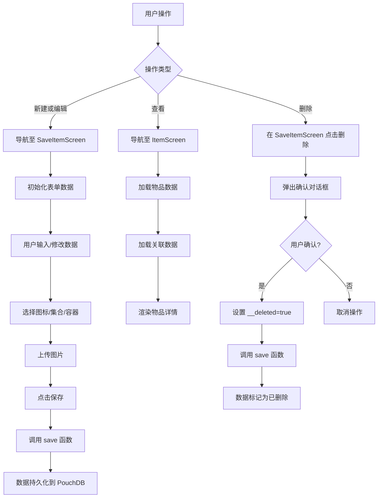
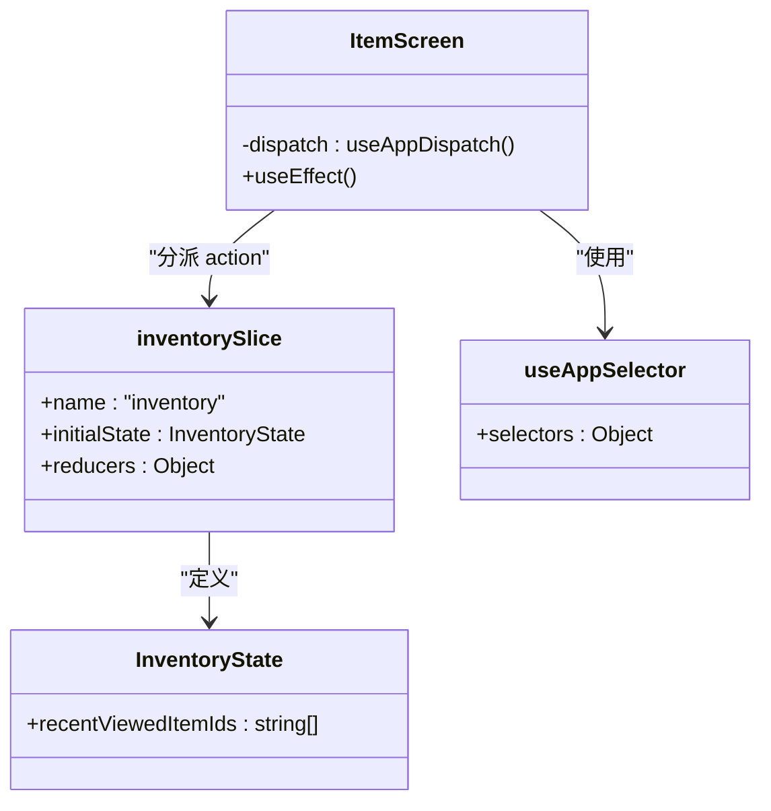
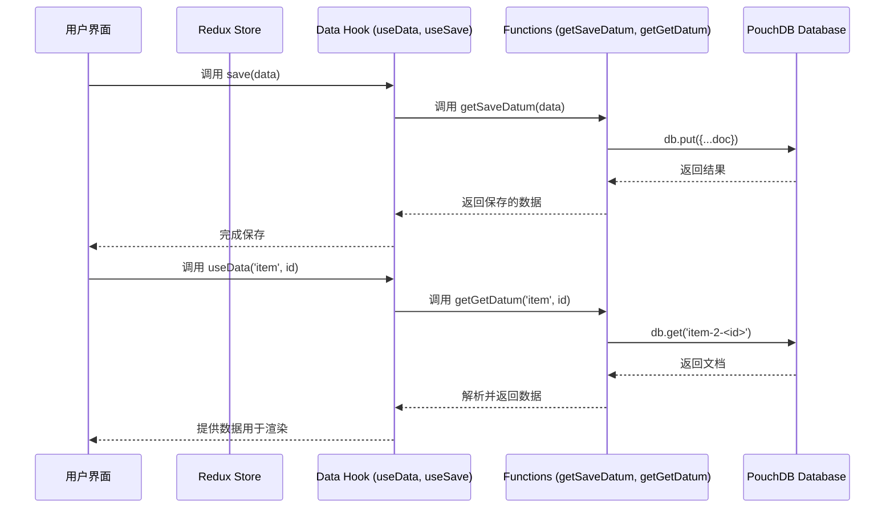

# 物品管理

<cite>
**本文档引用的文件**   
- [ItemScreen.tsx](file://App/App/features/inventory/screens/ItemScreen.tsx)
- [SaveItemScreen.tsx](file://App/App/features/inventory/screens/SaveItemScreen.tsx)
- [slice.ts](file://App/App/features/inventory/slice.ts)
- [schema.ts](file://Data/lib/schema.ts)
- [validation.ts](file://Data/lib/validation.ts)
- [pouchdb.ts](file://App/App/db/pouchdb.ts)
- [EditImagesUI.tsx](file://App/App/features/inventory/components/EditImagesUI.tsx)
- [ItemListItem.tsx](file://App/App/features/inventory/components/ItemListItem.tsx)
- [useSave.ts](file://App/App/data/hooks/useSave.ts)
</cite>

## 目录
1. [简介](#简介)
2. [物品数据模型](#物品数据模型)
3. [CRUD操作与用户界面流程](#crud操作与用户界面流程)
4. [物品详情页面 (ItemScreen)](#物品详情页面-itemscreen)
5. [Redux状态管理](#redux状态管理)
6. [PouchDB数据库持久化](#pouchdb数据库持久化)
7. [常见问题与解决方案](#常见问题与解决方案)
8. [结论](#结论)

## 简介
本项目是一个功能全面的库存管理应用，其核心功能围绕“物品”（Item）的管理展开。该应用提供了一套完整的创建、读取、更新和删除（CRUD）操作，允许用户高效地管理物理资产。系统采用现代化的前端架构，结合React Native、Redux Toolkit和PouchDB技术栈，实现了数据的本地持久化与状态管理。物品数据模型设计精良，包含名称、描述、数量、价格、图像和RFID标签等丰富属性，以满足复杂的库存跟踪需求。用户界面流程直观，通过`ItemScreen`和`SaveItemScreen`等组件，为用户提供流畅的交互体验。本技术文档将深入剖析这些核心功能的实现细节。

**Section sources**
- [ItemScreen.tsx](file://App/App/features/inventory/screens/ItemScreen.tsx#L72-L1548)
- [SaveItemScreen.tsx](file://App/App/features/inventory/screens/SaveItemScreen.tsx#L54-L1667)

## 物品数据模型
物品（Item）数据模型是整个库存系统的核心，其字段定义、数据类型和业务约束在`Data/lib/schema.ts`文件中通过Zod库进行严格定义。该模型确保了数据的完整性和一致性。

### 核心字段定义
物品数据模型包含以下关键属性：

| 字段名称 | 数据类型 | 业务约束 | 描述 |
| :--- | :--- | :--- | :--- |
| `name` | 字符串 | 必填 | 物品的名称，是用户识别物品的主要标识。 |
| `description` | 字符串 | 可选 | 物品的详细描述，用于补充说明。 |
| `icon_name` | 字符串 | 可选 | 用于表示物品的图标名称，通常来自Material Community Icons。默认值为`cube-outline`。 |
| `icon_color` | 字符串 | 可选 | 图标的颜色，用于视觉区分。默认值为`grey`。 |
| `item_type` | 枚举 | 可选 | 物品的类型，如`container`（容器）、`consumable`（消耗品）等，用于定义物品的行为。 |
| `collection_id` | 字符串 | 可选 | 外键，关联到所属的集合（Collection），实现物品的分类管理。 |

### 数量与价格字段
对于库存管理至关重要的数量和价格信息，模型提供了专门的字段：

| 字段名称 | 数据类型 | 业务约束 | 描述 |
| :--- | :--- | :--- | :--- |
| `consumable_stock_quantity` | 整数 | 可选 | 消耗品的当前库存数量。仅当`item_type`为`consumable`时有效。 |
| `consumable_min_stock_level` | 整数 | 可选 | 最低库存水平，低于此值将触发“库存不足”警告。 |
| `purchase_price` | 数字 | 可选 | 物品的采购价格。 |
| `purchase_price_currency` | 字符串 | 可选 | 采购价格的货币单位，如`USD`或`TWD`。 |

### 图像与RFID字段
系统支持多媒体和高级跟踪功能：

| 字段名称 | 数据类型 | 业务约束 | 描述 |
| :--- | :--- | :--- | :--- |
| `use_first_image_as_icon` | 布尔值 | 可选 | 决定是否使用第一张关联的图片作为物品的图标。 |
| `individual_asset_reference` | 字符串 | 可选 | 物品的个体资产参考号，用于生成RFID标签。 |
| `rfid_tag_epc_memory_bank_contents` | 字符串 | 可选 | RFID标签的EPC内存内容，用于无线识别。 |
| `actual_rfid_tag_epc_memory_bank_contents` | 字符串 | 可选 | 实际写入到RFID标签上的EPC内容，用于验证标签是否已正确写入。 |

**Section sources**
- [schema.ts](file://Data/lib/schema.ts#L1-L100)
- [csvRowToItem.ts](file://Data/lib/utils/csv/csvRowToItem.ts#L173-L215)
- [validation.ts](file://Data/lib/validation.ts#L357-L379)

## CRUD操作与用户界面流程
物品的CRUD操作通过一系列精心设计的用户界面（UI）组件实现，为用户提供直观的操作体验。

### 创建与编辑流程
创建和编辑物品的流程由`SaveItemScreen`组件统一处理。当用户点击“新建物品”或在物品详情页点击“编辑”时，会导航到此屏幕。

1.  **初始化**: 屏幕通过`initialData`参数接收初始数据。如果是新建物品，则生成一个随机ID；如果是编辑，则加载现有物品的全部数据。
2.  **表单输入**: 用户通过表单输入或修改物品的各个属性。关键交互包括：
    *   **图标选择**: 点击图标区域会导航到`SelectIcon`屏幕，允许用户从图标库中选择。
    *   **集合选择**: 点击“集合”字段会导航到`SelectCollection`模态框，用户可从现有集合中选择。
    *   **容器选择**: 点击“容器”字段会导航到`SelectItem`模态框，用户可选择一个物品作为当前物品的容器。
    *   **图像上传**: 通过`EditImagesUI`组件，用户可以从相册或相机添加图片。
3.  **保存**: 用户点击“保存”按钮后，`handleSave`函数被触发。该函数首先调用`useSave` hook保存物品元数据，然后调用`saveImagesFn`保存关联的图片，确保所有数据持久化。

### 查看与删除流程
查看和删除操作主要在`ItemScreen`和列表视图中进行。

1.  **查看**: `ItemScreen`组件通过`useData` hook加载指定ID的物品数据，并展示其所有属性。它还通过`useRelated` hook加载关联的集合、容器和图片。
2.  **删除**: 在`SaveItemScreen`中，用户点击“删除”按钮会触发`handleDeleteButtonPressed`函数，该函数会弹出确认对话框。确认后，会调用`save`函数，将物品的`__deleted`标志设置为`true`，实现软删除。



**Diagram sources **
- [SaveItemScreen.tsx](file://App/App/features/inventory/screens/SaveItemScreen.tsx#L54-L1667)
- [ItemScreen.tsx](file://App/App/features/inventory/screens/ItemScreen.tsx#L72-L1548)

**Section sources**
- [SaveItemScreen.tsx](file://App/App/features/inventory/screens/SaveItemScreen.tsx#L54-L1667)
- [ItemScreen.tsx](file://App/App/features/inventory/screens/ItemScreen.tsx#L72-L1548)

## 物品详情页面 (ItemScreen)
`ItemScreen`组件是展示单个物品详细信息的核心界面，其布局结构清晰，数据展示逻辑严谨。

### 布局结构
页面采用`ScreenContent`作为容器，内部由一个可刷新的`ScrollView`和多个`UIGroup`组件构成。主要布局分为以下几个部分：
1.  **顶部操作栏**: 显示物品名称，并提供“编辑”和“操作”按钮。
2.  **主信息区**: 一个`UIGroup`，包含物品的名称、ID、容器、集合等核心信息。名称行使用`TouchableWithoutFeedback`包裹，用于触发开发者模式。
3.  **内容列表区**: 如果该物品是一个容器，此区域会显示其包含的子物品列表，使用`ItemListItem`组件渲染。
4.  **图像展示区**: 使用`ImagesSliderBox`组件以轮播图的形式展示物品关联的所有图片。

### 数据展示逻辑
`ItemScreen`的数据展示逻辑依赖于多个自定义Hook：
*   **`useData('item', id)`**: 加载指定ID的物品主数据。
*   **`useRelated(data, 'collection')`**: 加载物品所属的集合数据。
*   **`useRelated(data, 'container')`**: 加载物品所在的容器数据。
*   **`useRelated(data, 'item_images')`**: 加载物品关联的所有图片记录。
*   **`useRelated(data, 'contents')`**: 加载该物品（作为容器时）包含的所有子物品。

这些Hook返回的数据被`useMemo`和`useCallback`优化，确保在数据更新时UI能高效地重新渲染。例如，`orderedContents`使用`useOrdered` Hook根据`contents_order`字段对子物品进行排序。

**Section sources**
- [ItemScreen.tsx](file://App/App/features/inventory/screens/ItemScreen.tsx#L72-L1548)
- [ItemListItem.tsx](file://App/App/features/inventory/components/ItemListItem.tsx#L32-L560)

## Redux状态管理
应用使用Redux Toolkit进行全局状态管理，`inventory`功能模块的Redux逻辑在`slice.ts`文件中定义。

### Slice结构
`inventorySlice`定义了与物品浏览历史相关的状态和操作：
*   **State**: `InventoryState`包含一个`recentViewedItemIds`数组，用于存储最近查看的物品ID。
*   **Reducers**:
    *   `addRecentViewedItemId`: 将一个物品ID添加到最近查看列表的开头，并确保列表长度不超过30。
    *   `clearRecentViewedItemId`: 清空最近查看列表。
    *   `reset`: 重置状态到初始值。
*   **Selectors**: `selectors.inventory.recentViewedItemIds`用于从全局状态中选择最近查看的物品ID列表。

### 在组件中的使用
在`ItemScreen`中，每当用户查看一个物品时，都会触发Redux action来更新浏览历史：
```typescript
const dispatch = useAppDispatch();
useEffect(() => {
  dispatch(actions.inventory.addRecentViewedItemId({ id }));
}, [dispatch, id]);
```
这行代码确保了用户的浏览行为被记录下来，为后续的“最近查看”功能提供数据支持。



**Diagram sources **
- [slice.ts](file://App/App/features/inventory/slice.ts#L1-L53)
- [ItemScreen.tsx](file://App/App/features/inventory/screens/ItemScreen.tsx#L300-L303)

**Section sources**
- [slice.ts](file://App/App/features/inventory/slice.ts#L1-L53)
- [ItemScreen.tsx](file://App/App/features/inventory/screens/ItemScreen.tsx#L300-L303)

## PouchDB数据库持久化
应用使用PouchDB作为本地数据库，实现数据的持久化存储和离线访问。

### 数据库初始化
`pouchdb.ts`文件负责PouchDB的初始化和配置。它引入了`pouchdb-adapter-react-native-sqlite`适配器，将数据存储在SQLite数据库中，确保了数据的可靠性和性能。

### 数据持久化交互
与PouchDB的交互并非直接进行，而是通过一层封装的函数库。`App/App/data/functions`目录下的函数（如`getSaveDatum`, `getGetDatum`, `getGetData`）是与数据库交互的主要入口。这些函数最终调用`data-storage-couchdb`包中的底层实现。

*   **保存数据**: `useSave` hook内部调用`getSaveDatum`函数。该函数接收一个数据对象，将其转换为PouchDB文档格式（如`_id`和`_rev`），然后调用`db.put()`或`db.insert()`方法将数据写入数据库。
*   **读取数据**: `useData`和`useRelated`等Hook使用`getGetDatum`和`getData`函数从数据库中查询数据。查询结果会经过验证，返回包含`__valid`标志的有效或无效数据对象。
*   **附件处理**: 图像等二进制文件作为附件（attachment）存储在PouchDB文档中。`getAttachAttachmentToDatum`和`getGetAttachmentFromDatum`函数分别用于上传和下载附件。



**Diagram sources **
- [pouchdb.ts](file://App/App/db/pouchdb.ts#L86-L93)
- [useSave.ts](file://App/App/data/hooks/useSave.ts#L1-L34)
- [functions/index.ts](file://App/App/data/functions/index.ts#L1-L103)

**Section sources**
- [pouchdb.ts](file://App/App/db/pouchdb.ts#L86-L93)
- [useSave.ts](file://App/App/data/hooks/useSave.ts#L1-L34)

## 常见问题与解决方案
在开发和使用过程中，可能会遇到一些常见问题，以下是针对数据验证和图像上传问题的解决方案。

### 数据验证失败
当用户输入的数据不符合`schema.ts`中定义的约束时，会触发数据验证失败。

*   **问题表现**: 在导入CSV文件或直接保存数据时，系统可能无法保存数据，或保存后数据被标记为无效（`__valid: false`）。
*   **解决方案**:
    1.  **检查必填字段**: 确保`name`等必填字段不为空。
    2.  **检查数据类型**: 确保数值字段（如价格、数量）输入的是有效数字。
    3.  **检查外键**: 确保`collection_id`或`container_id`引用的是数据库中真实存在的ID。
    4.  **查看验证错误**: 系统会返回`ValidationError`对象，其中包含详细的`__issues`数组，开发者应检查这些信息以定位具体问题。

### 图像上传错误
在使用`EditImagesUI`组件上传图片时，可能会遇到错误。

*   **问题表现**: 图片无法加载、上传失败或应用崩溃。
*   **解决方案**:
    1.  **检查权限**: 确保应用已获得访问设备相册或相机的权限。
    2.  **检查图片格式和大小**: 虽然系统会自动将图片缩放至1440像素，但过于巨大的原始文件可能导致内存问题。建议用户上传合理大小的图片。
    3.  **处理异步错误**: `EditImagesUI`组件中的`handleAddImages`函数使用了`try-catch`块来捕获错误，并通过`Alert.alert`向用户展示错误信息。开发者应确保所有异步操作都得到妥善处理。
    4.  **检查数据库连接**: 图像作为附件存储在PouchDB中，如果数据库连接失败，上传也会失败。确保`useDB` Hook正确返回了数据库实例。

**Section sources**
- [validation.ts](file://Data/lib/validation.ts#L348-L395)
- [EditImagesUI.tsx](file://App/App/features/inventory/components/EditImagesUI.tsx#L187-L212)

## 结论
本技术文档详细阐述了库存管理应用中物品管理功能的实现。从定义严谨的物品数据模型，到流畅的CRUD用户界面流程，再到基于Redux和PouchDB的高效状态管理与数据持久化，整个系统架构清晰、模块化程度高。`ItemScreen`和`SaveItemScreen`组件提供了优秀的用户体验，而`EditImagesUI`等可复用组件则体现了良好的代码设计。通过深入理解这些核心组件和技术栈的交互，开发者可以有效地维护、扩展和优化此功能，为用户提供一个强大且可靠的库存管理工具。