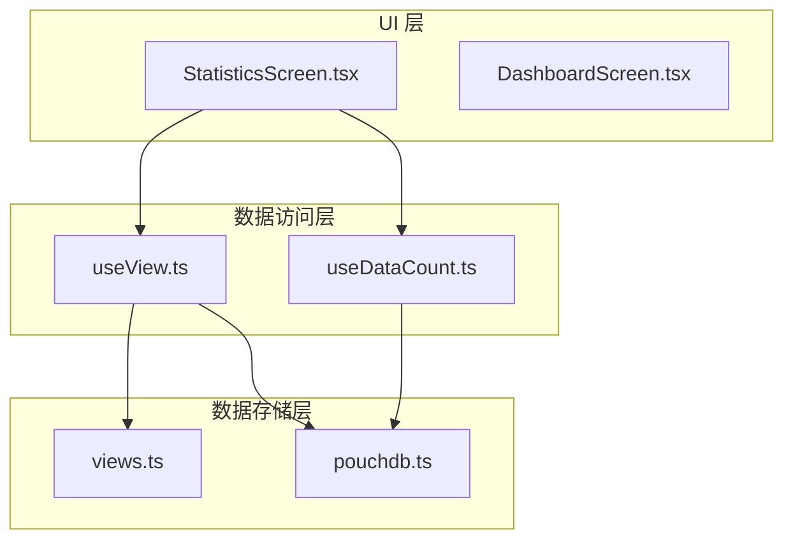
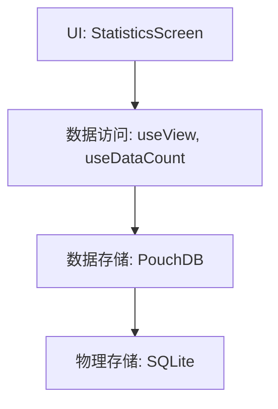
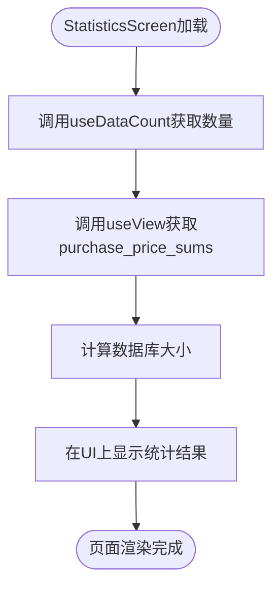
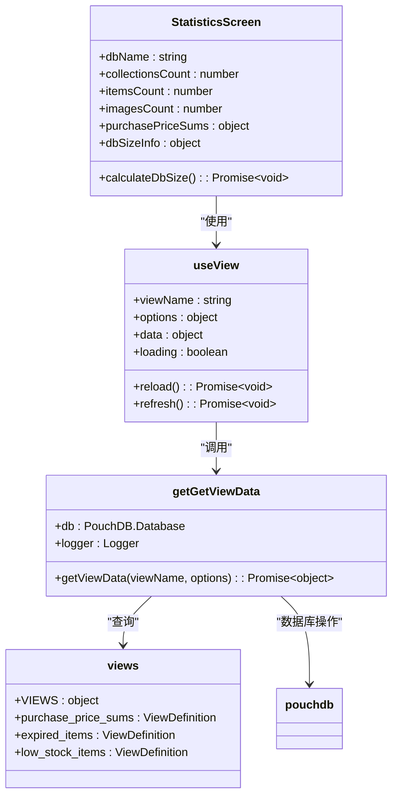
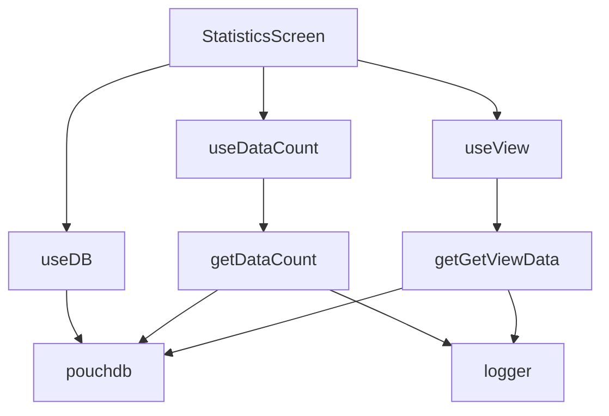

# 统计功能

<cite>
**本文档中引用的文件**  
- [StatisticsScreen.tsx](file://App/app/features/inventory/screens/StatisticsScreen.tsx)
- [views.ts](file://packages/data-storage-couchdb/lib/views.ts)
- [useView.ts](file://App/app/data/hooks/useView.ts)
- [getGetViewData.ts](file://packages/data-storage-couchdb/lib/functions/getGetViewData.ts)
- [useDataCount.ts](file://App/app/data/hooks/useDataCount.ts)
- [getGetDataCount.ts](file://packages/data-storage-couchdb/lib/functions/getGetDataCount.ts)
- [pouchdb.ts](file://App/app/db/pouchdb.ts)
- [useDB.ts](file://App/app/db/hooks/useDB.ts)
</cite>

## 目录
1. [简介](#简介)
2. [项目结构](#项目结构)
3. [核心组件](#核心组件)
4. [架构概述](#架构概述)
5. [详细组件分析](#详细组件分析)
6. [依赖分析](#依赖分析)
7. [性能考虑](#性能考虑)
8. [故障排除指南](#故障排除指南)
9. [结论](#结论)
10. [附录](#附录)（如有必要）

## 简介
本文档详细介绍了库存管理应用中的统计功能，重点关注`StatisticsScreen.tsx`文件中各类指标的计算方法。文档涵盖了库存总价值、物品分类分布、过期物品统计等关键指标的计算逻辑，以及统计数据的可视化呈现方式。我们将深入分析统计功能如何从Redux状态或直接从PouchDB数据库中获取原始数据，并进行聚合处理。同时，文档将提供关于缓存策略、性能优化技巧和实时性保障措施的详细说明。

## 项目结构
该库存管理应用采用模块化架构，将功能划分为不同的特性模块。统计功能主要位于`App/app/features/inventory/screens/StatisticsScreen.tsx`文件中，该文件负责展示各种统计指标。数据访问逻辑被封装在`App/app/data/hooks/`目录下的自定义React Hook中，如`useDataCount`和`useView`，这些Hook提供了与数据库交互的抽象层。

统计相关的数据聚合逻辑在`packages/data-storage-couchdb/lib/views.ts`文件中定义，该文件包含了各种视图（View）的MapReduce函数，用于计算库存总价值、过期物品数量等复杂指标。数据库操作通过PouchDB实现，其配置和初始化在`App/app/db/`目录下完成。

**图表来源**
- [StatisticsScreen.tsx](file://App/app/features/inventory/screens/StatisticsScreen.tsx)
- [useView.ts](file://App/app/data/hooks/useView.ts)
- [useDataCount.ts](file://App/app/data/hooks/useDataCount.ts)
- [views.ts](file://packages/data-storage-couchdb/lib/views.ts)
- [pouchdb.ts](file://App/app/db/pouchdb.ts)

**章节来源**
- [StatisticsScreen.tsx](file://App/app/features/inventory/screens/StatisticsScreen.tsx)
- [views.ts](file://packages/data-storage-couchdb/lib/views.ts)

## 核心组件
统计功能的核心在于`StatisticsScreen.tsx`中的数据聚合和展示逻辑。该组件使用`useDataCount` Hook来获取集合、物品和图片的总数，这些是基础的统计指标。对于更复杂的指标，如库存总价值，则使用`useView` Hook来调用预定义的数据库视图。

`useView` Hook是连接UI与复杂数据聚合的关键。它接受一个视图名称（如`purchase_price_sums`），并返回聚合后的数据。这个Hook内部会调用`getGetViewData`函数，该函数负责与PouchDB数据库交互，执行MapReduce操作来计算最终结果。

**章节来源**
- [StatisticsScreen.tsx](file://App/app/features/inventory/screens/StatisticsScreen.tsx)
- [useView.ts](file://App/app/data/hooks/useView.ts)
- [getGetViewData.ts](file://packages/data-storage-couchdb/lib/functions/getGetViewData.ts)

## 架构概述
统计功能的架构遵循分层设计原则，将UI展示、数据访问和数据存储清晰地分离。UI层（`StatisticsScreen.tsx`）不直接与数据库交互，而是通过数据访问层的Hook（`useView`和`useDataCount`）来获取所需数据。这种设计提高了代码的可维护性和可测试性。

数据访问层的Hook负责处理与数据库的通信细节。`useDataCount`用于简单的计数操作，而`useView`则用于复杂的聚合计算。这些Hook内部使用PouchDB的API来查询数据库。PouchDB作为本地数据库，提供了强大的查询功能，包括MapReduce视图和全文搜索。

**图表来源**
- [StatisticsScreen.tsx](file://App/app/features/inventory/screens/StatisticsScreen.tsx)
- [useView.ts](file://App/app/data/hooks/useView.ts)
- [useDataCount.ts](file://App/app/data/hooks/useDataCount.ts)
- [pouchdb.ts](file://App/app/db/pouchdb.ts)

## 详细组件分析

### 统计页面分析
`StatisticsScreen.tsx`是统计功能的入口点。它首先从Redux状态中获取当前数据库名称，然后使用`useDataCount` Hook并行获取集合、物品和图片的数量。这些Hook会触发数据库查询，并在数据加载时显示"Calculating..."的占位符。

对于库存总价值的计算，组件使用`useView('purchase_price_sums')`来获取预聚合的数据。`purchase_price_sums`视图在`views.ts`中定义，它使用MapReduce函数遍历所有物品文档，根据采购价格和库存数量计算总价值，并按货币类型分组。

**图表来源**
- [StatisticsScreen.tsx](file://App/app/features/inventory/screens/StatisticsScreen.tsx)
- [views.ts](file://packages/data-storage-couchdb/lib/views.ts)

**章节来源**
- [StatisticsScreen.tsx](file://App/app/features/inventory/screens/StatisticsScreen.tsx)

### 数据聚合逻辑分析
数据聚合的核心是`views.ts`文件中定义的MapReduce视图。以`purchase_price_sums`视图为例，其Map函数会检查每个文档是否为物品类型，并且具有采购价格和数量。如果条件满足，则以货币类型为键，以价格乘以数量的值为值进行发射（emit）。Reduce函数则对这些值进行求和，并按货币类型分组。

**图表来源**
- [StatisticsScreen.tsx](file://App/app/features/inventory/screens/StatisticsScreen.tsx)
- [useView.ts](file://App/app/data/hooks/useView.ts)
- [getGetViewData.ts](file://packages/data-storage-couchdb/lib/functions/getGetViewData.ts)
- [views.ts](file://packages/data-storage-couchdb/lib/views.ts)

**章节来源**
- [views.ts](file://packages/data-storage-couchdb/lib/views.ts)
- [getGetViewData.ts](file://packages/data-storage-couchdb/lib/functions/getGetViewData.ts)

## 依赖分析
统计功能依赖于多个层次的组件和库。在UI层，它依赖于`ScreenContent`和`TableView`等通用组件来构建界面。在数据访问层，它依赖于`useView`和`useDataCount`这两个自定义Hook。

`useView` Hook本身依赖于`getGetViewData`函数，该函数又依赖于PouchDB实例和日志记录器。PouchDB实例通过`useDB` Hook从Redux状态中获取，这形成了一个从UI到数据库的完整依赖链。

**图表来源**
- [StatisticsScreen.tsx](file://App/app/features/inventory/screens/StatisticsScreen.tsx)
- [useView.ts](file://App/app/data/hooks/useView.ts)
- [useDataCount.ts](file://App/app/data/hooks/useDataCount.ts)
- [getGetViewData.ts](file://packages/data-storage-couchdb/lib/functions/getGetViewData.ts)
- [getGetDataCount.ts](file://packages/data-storage-couchdb/lib/functions/getGetDataCount.ts)
- [pouchdb.ts](file://App/app/db/pouchdb.ts)
- [useDB.ts](file://App/app/db/hooks/useDB.ts)

**章节来源**
- [useView.ts](file://App/app/data/hooks/useView.ts)
- [useDataCount.ts](file://App/app/data/hooks/useDataCount.ts)

## 性能考虑
为了优化统计功能的性能，系统采用了多种策略。首先，复杂的聚合计算（如库存总价值）通过PouchDB的MapReduce视图在数据库层面完成，避免了在JavaScript中遍历大量数据。这些视图的结果会被PouchDB自动缓存，从而提高后续查询的速度。

对于简单的计数操作，`useDataCount` Hook使用了自动创建的数据库视图，这些视图同样利用了PouchDB的索引机制来实现高效的计数。此外，`StatisticsScreen`还通过`useFocusEffect` Hook实现了按需加载，只有当用户进入该页面时才会触发统计计算，避免了不必要的资源消耗。

在大数据量场景下，建议定期维护数据库索引，并监控视图的构建时间。如果发现某些视图构建过慢，可以考虑优化Map函数的逻辑，或者在后台任务中预计算部分统计结果。

## 故障排除指南
如果统计数据显示不正确或加载缓慢，可以按照以下步骤进行排查：

1.  **检查数据库连接**：确保`useDB` Hook返回的数据库实例不为null。如果数据库连接失败，所有数据查询都会失败。
2.  **验证视图定义**：检查`views.ts`文件中的MapReduce函数逻辑是否正确，特别是条件判断和值的计算。
3.  **查看日志**：启用调试日志，观察`getGetViewData`和`getGetDataCount`函数的执行过程，查找可能的错误信息。
4.  **检查数据一致性**：确认数据库中的物品文档具有正确的数据结构，特别是采购价格、库存数量和货币类型等字段。

**章节来源**
- [useView.ts](file://App/app/data/hooks/useView.ts)
- [useDataCount.ts](file://App/app/data/hooks/useDataCount.ts)
- [getGetViewData.ts](file://packages/data-storage-couchdb/lib/functions/getGetViewData.ts)
- [getGetDataCount.ts](file://packages/data-storage-couchdb/lib/functions/getGetDataCount.ts)

## 结论
本文档全面介绍了库存管理应用中统计功能的实现细节。通过分析`StatisticsScreen.tsx`及其相关组件，我们了解了如何利用PouchDB的MapReduce视图来高效地计算复杂的统计指标。该设计将数据聚合逻辑与UI展示分离，提高了代码的可维护性和性能。未来可以考虑引入更高级的缓存策略，如在Redux中缓存统计结果，以进一步提升用户体验。