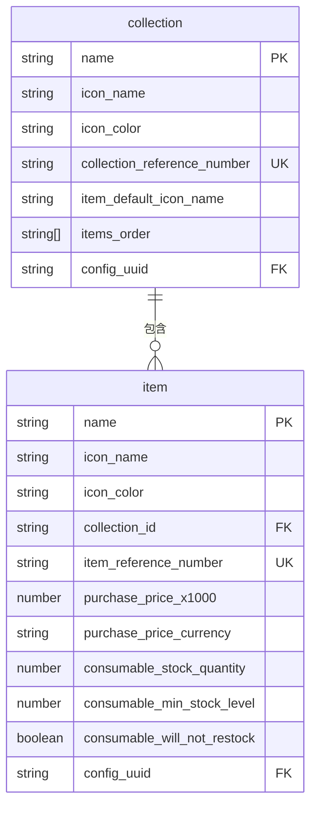
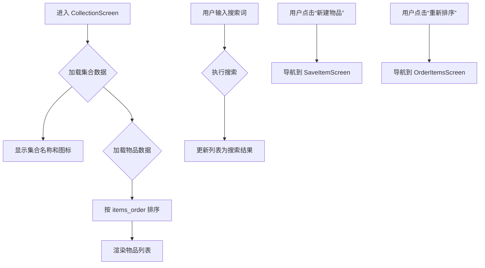

# 集合管理

<cite>
**本文档中引用的文件**  
- [CollectionScreen.tsx](file://App/app/features/inventory/screens/CollectionScreen.tsx)
- [SaveCollectionScreen.tsx](file://App/app/features/inventory/screens/SaveCollectionScreen.tsx)
- [CollectionListItem.tsx](file://App/app/features/inventory/components/CollectionListItem.tsx)
- [ItemListItem.tsx](file://App/app/features/inventory/components/ItemListItem.tsx)
- [generated-schema.ts](file://Data/lib/generated-schema.ts)
- [relations.ts](file://Data/lib/relations.ts)
- [types.ts](file://Data/lib/types.ts)
- [schema.ts](file://Data/lib/schema.ts)
</cite>

## 目录
1. [简介](#简介)
2. [集合数据模型](#集合数据模型)
3. [集合与物品的父子关系](#集合与物品的父子关系)
4. [集合的创建、编辑与删除](#集合的创建、编辑与删除)
5. [集合内物品的管理界面](#集合内物品的管理界面)
6. [数据库中的引用关系实现](#数据库中的引用关系实现)
7. [Redux状态树中的组织结构](#redux状态树中的组织结构)
8. [批量管理集合内物品的Redux操作](#批量管理集合内物品的redux操作)
9. [集合统计信息的实时计算](#集合统计信息的实时计算)
10. [集合嵌套过深的性能优化建议](#集合嵌套过深的性能优化建议)

## 简介
本文档详细阐述库存管理应用中的集合管理功能。集合（Collection）作为组织和管理物品的核心数据结构，提供了层级化、可继承属性和聚合统计等高级功能。本文档将深入解析集合的数据模型、父子关系、操作流程、界面实现、数据库引用机制、Redux状态管理以及性能优化策略。

## 集合数据模型
集合数据模型定义了集合的核心属性和结构。根据数据模式定义，集合（collection）包含以下关键字段：

- **name**: 集合的名称，为必填字符串。
- **icon_name** 和 **icon_color**: 分别定义集合在界面中显示的图标名称和颜色。
- **collection_reference_number**: 集合的参考编号，用于RFID标签生成，格式为2-4位数字。
- **item_default_icon_name**: 为该集合内创建的新物品指定默认图标。
- **items_order**: 一个字符串数组，用于存储集合内物品的自定义排序顺序。
- **config_uuid**: 关联的配置UUID，用于多用户共享场景。

集合数据模型通过Zod库进行类型验证，确保数据的完整性和一致性。

**Section sources**
- [generated-schema.ts](file://Data/lib/generated-schema.ts#L21-L32)

## 集合与物品的父子关系
集合与物品之间通过明确的父子关系进行组织。这种关系在数据模型和关系定义中都有体现。

### 数据模型中的关系
在物品（item）的数据模型中，`collection_id` 字段是关键的外键，它直接指向其所属集合的ID。这建立了物品对集合的“属于”（belongs_to）关系。同时，集合模型通过 `has_many` 关系定义，表明一个集合可以包含多个物品。

### 关系定义实现
关系定义在 `relations.ts` 文件中以常量 `relation_definitions` 明确声明：
- `collection` 类型通过 `has_many: { items: ... }` 声明其拥有多条物品记录。
- `item` 类型通过 `belongs_to: { collection: ... }` 声明其属于一个集合。

这种声明式的关系定义使得应用可以通过通用的 `useRelated` 钩子函数来查询和加载相关数据，例如从一个物品加载其所属集合的信息。



**Diagram sources**
- [generated-schema.ts](file://Data/lib/generated-schema.ts#L21-L32)
- [generated-schema.ts](file://Data/lib/generated-schema.ts#L33-L93)
- [relations.ts](file://Data/lib/relations.ts#L20-L23)

## 集合的创建、编辑与删除
集合的生命周期管理通过 `SaveCollectionScreen` 组件实现。

### 创建与编辑
创建和编辑集合使用同一个界面。当用户点击“新建集合”时，会导航到 `SaveCollectionScreen` 并传入一个空的初始数据对象。当编辑现有集合时，则会传入该集合的完整数据。该组件提供表单输入，允许用户设置集合的名称、参考编号、图标和默认物品图标。

### 参考编号生成
集合的参考编号（`collection_reference_number`）对于RFID功能至关重要。系统提供“生成”按钮，可以自动创建一个符合配置规则的随机编号，简化了用户的输入过程。

### 删除操作
删除集合是一个受保护的操作。`SaveCollectionScreen` 中的删除按钮仅在集合存在ID（即已保存）时才显示。更重要的是，如果集合内包含任何物品，删除按钮将被禁用，以防止数据丢失。这种逻辑通过查询集合内是否存在物品来实现。

**Section sources**
- [SaveCollectionScreen.tsx](file://App/app/features/inventory/screens/SaveCollectionScreen.tsx#L61-L396)

## 集合内物品的管理界面
`CollectionScreen` 组件负责展示特定集合的详细信息及其包含的所有物品。

### 界面布局
该界面采用 `ScreenContent` 组件作为容器，顶部显示集合的名称、图标和参考编号。下方是一个 `FlatList`，用于列出该集合内的所有物品。

### 物品列表
物品列表通过 `useData` 钩子，以 `{ collection_id: id }` 作为查询条件，从数据库中加载所有属于该集合的物品。列表项使用 `ItemListItem` 组件进行渲染，该组件会显示物品的名称、图标、库存状态以及其所属的集合名称。

### 排序与搜索
集合内的物品支持自定义排序。`items_order` 数组存储了物品ID的顺序。用户可以通过点击“重新排序”按钮进入排序模式。此外，界面还集成了搜索功能，允许用户在当前集合内快速查找物品。



**Diagram sources**
- [CollectionScreen.tsx](file://App/app/features/inventory/screens/CollectionScreen.tsx#L53-L609)
- [ItemListItem.tsx](file://App/app/features/inventory/components/ItemListItem.tsx#L32-L560)

## 数据库中的引用关系实现
集合与物品的引用关系在数据库层面通过外键实现。

### 外键关联
物品文档中的 `collection_id` 字段存储了其父集合的ID。这是一个直接的、单向的引用。数据库查询（如PouchDB）利用这个字段来高效地检索属于特定集合的所有物品。

### 反向索引
为了优化性能，系统在 `image` 和 `item_image` 等辅助数据模型中维护了反向索引。例如，`image` 文档中的 `_item_collection_ids` 字段会记录所有引用了该图片的物品所属的集合ID。这使得在删除集合时，可以快速定位并清理相关的图片数据，而无需遍历所有图片。

**Section sources**
- [generated-schema.ts](file://Data/lib/generated-schema.ts#L38)
- [callbacks.ts](file://Data/lib/callbacks.ts#L259-L268)

## Redux状态树中的组织结构
应用的全局状态由Redux管理，集合相关的状态主要分布在两个地方。

### 特征状态 (Feature State)
`inventorySlice` 定义了库存功能的Redux状态。目前，它主要管理用户最近查看的物品ID列表（`recentViewedItemIds`）。虽然它没有直接管理集合状态，但它为库存相关的功能提供了状态基础。

### 数据状态 (Data State)
更核心的数据状态（如集合和物品）并非直接存储在Redux中，而是由一个基于Redux Toolkit的抽象层管理。`useData` 和 `useRelated` 钩子函数封装了与数据库的交互，并将查询结果作为React状态提供给组件。这些钩子的内部实现很可能利用了Redux或类似的全局状态管理机制来缓存和同步数据，从而避免了频繁的数据库查询。

**Section sources**
- [slice.ts](file://App/app/features/inventory/slice.ts#L1-L53)
- [CollectionScreen.tsx](file://App/app/features/inventory/screens/CollectionScreen.tsx#L69-L102)

## 批量管理集合内物品的Redux操作
虽然没有直接的“批量管理”Redux action，但应用通过组合现有操作和钩子来实现类似效果。

### 示例：批量更新物品顺序
`CollectionScreen` 中的 `handleUpdateItemsOrder` 函数是一个典型的例子。它接收一个已排序的物品数组，提取其ID，然后调用 `save` 函数，将这个ID数组更新到集合的 `items_order` 字段中。这本质上是一次对集合文档的批量更新操作。

```typescript
// 伪代码示例：通过Redux操作批量更新
const batchUpdateItemsInCollection = (collectionId, updates) => {
  return async (dispatch, getState) => {
    const items = selectItemsByCollection(getState(), collectionId);
    const updatedItems = items.map(item => {
      const update = updates.find(u => u.id === item.id);
      return update ? { ...item, ...update.changes } : item;
    });
    // 调用 save 函数批量保存所有更新
    await Promise.all(updatedItems.map(save));
  };
};
```

**Section sources**
- [CollectionScreen.tsx](file://App/app/features/inventory/screens/CollectionScreen.tsx#L226-L246)

## 集合统计信息的实时计算
集合的统计信息，如物品总数，是实时计算的，而非预先存储。

### 实时计数
`CollectionListItem` 组件使用 `useDataCount` 钩子来获取集合内物品的数量。该钩子接收数据类型（'item'）和查询条件（`{ collection_id: collection.__id }`）作为参数，直接向数据库发起计数查询。这个计数结果会随着集合内物品的增删而自动更新。

### 统计信息展示
计数结果被格式化为“1 item”或“N items”并显示在集合列表项的详情中。这种设计确保了统计信息的准确性和实时性，但可能会在物品数量巨大时影响性能。

**Section sources**
- [CollectionListItem.tsx](file://App/app/features/inventory/components/CollectionListItem.tsx#L29-L42)

## 集合嵌套过深的性能优化建议
当前模型主要支持集合与物品的直接父子关系，而非集合的深层嵌套。但如果未来需要支持，以下是一些优化建议：

1.  **限制嵌套深度**：在UI和数据验证层面强制限制集合的嵌套层级（例如，最多3层），防止无限递归。
2.  **懒加载**：对于深层嵌套的集合，只在用户展开时才加载其子集合和物品，避免一次性加载整个树结构。
3.  **缓存聚合数据**：对于需要频繁访问的聚合统计（如子集合总数、所有后代物品总数），可以在父集合文档中缓存这些值，并在子项变更时通过数据库触发器或回调函数进行更新，以空间换时间。
4.  **优化查询索引**：确保 `collection_id` 字段在数据库中有高效的索引，以加速层级查询。
5.  **分页加载**：当某个集合包含大量物品时，实现分页加载，避免一次性渲染过多DOM节点导致界面卡顿。