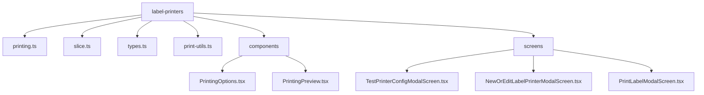
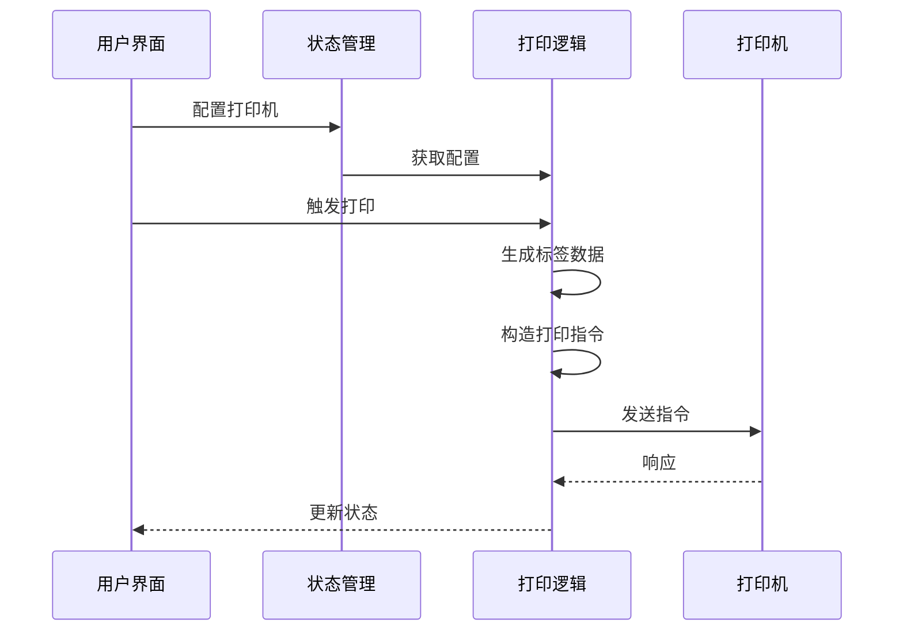
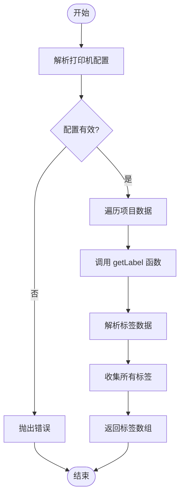
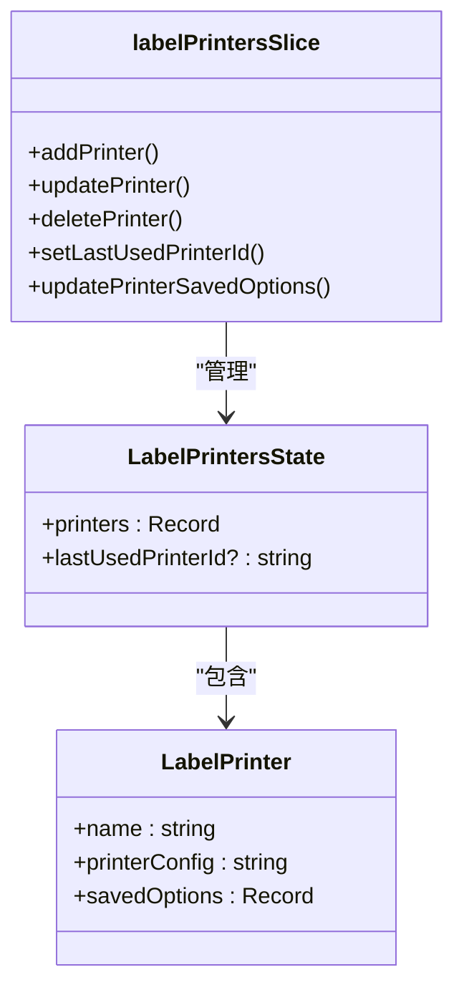
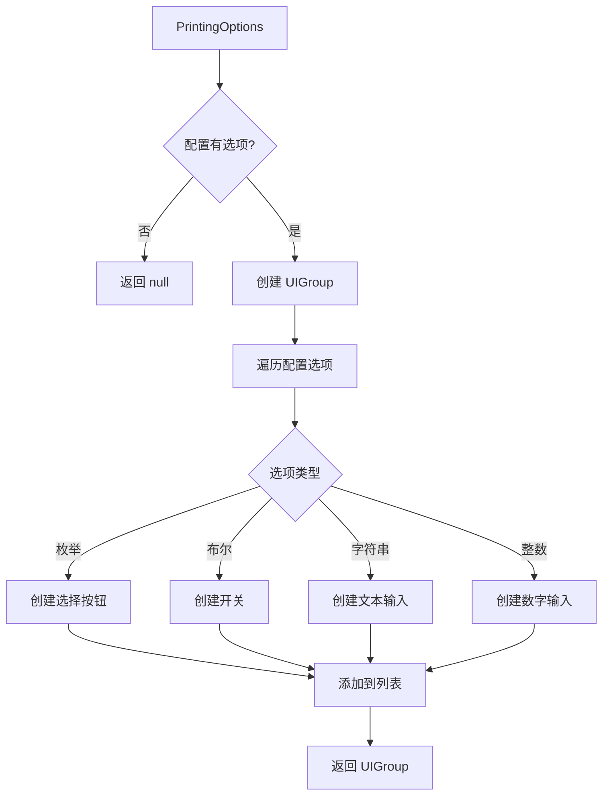
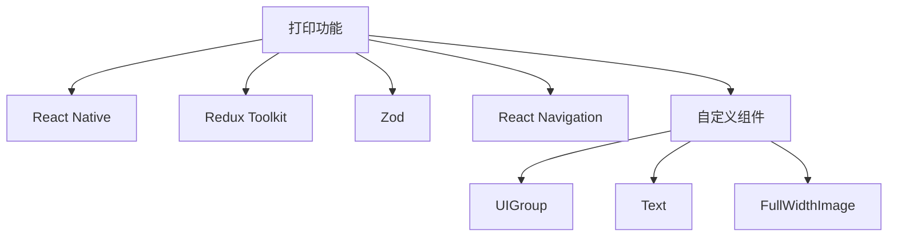

# 打印指令与通信

<cite>
**本文档中引用的文件**  
- [printing.ts](file://App/app/features/label-printers/printing.ts)
- [slice.ts](file://App/app/features/label-printers/slice.ts)
- [types.ts](file://App/app/features/label-printers/types.ts)
- [print-utils.ts](file://App/app/features/label-printers/print-utils.ts)
- [PrintingOptions.tsx](file://App/app/features/label-printers/components/PrintingOptions.tsx)
- [PrintingPreview.tsx](file://App/app/features/label-printers/components/PrintingPreview.tsx)
- [TestPrinterConfigModalScreen.tsx](file://App/app/features/label-printers/screens/TestPrinterConfigModalScreen.tsx)
- [NewOrEditLabelPrinterModalScreen.tsx](file://App/app/features/label-printers/screens/NewOrEditLabelPrinterModalScreen.tsx)
- [PrintLabelModalScreen.tsx](file://App/app/features/label-printers/screens/PrintLabelModalScreen.tsx)
</cite>

## 目录
1. [简介](#简介)
2. [项目结构](#项目结构)
3. [核心组件](#核心组件)
4. [架构概述](#架构概述)
5. [详细组件分析](#详细组件分析)
6. [依赖分析](#依赖分析)
7. [性能考虑](#性能考虑)
8. [故障排除指南](#故障排除指南)
9. [结论](#结论)

## 简介
本文档深入解析库存管理应用中的标签打印指令生成与通信机制。重点阐述如何根据标签模板和数据生成标准打印语言指令（如ZPL），并通过TCP/IP或蓝牙等通信方式将指令发送到目标打印机。文档还结合状态管理，描述打印任务队列的实现机制、任务状态更新以及用户界面的实时反馈。

## 项目结构
标签打印功能主要位于`App/app/features/label-printers/`目录下，包含核心逻辑、状态管理、类型定义和用户界面组件。

**图源**  
- [printing.ts](file://App/app/features/label-printers/printing.ts)
- [slice.ts](file://App/app/features/label-printers/slice.ts)
- [types.ts](file://App/app/features/label-printers/types.ts)
- [print-utils.ts](file://App/app/features/label-printers/print-utils.ts)
- [PrintingOptions.tsx](file://App/app/features/label-printers/components/PrintingOptions.tsx)
- [PrintingPreview.tsx](file://App/app/features/label-printers/components/PrintingPreview.tsx)
- [TestPrinterConfigModalScreen.tsx](file://App/app/features/label-printers/screens/TestPrinterConfigModalScreen.tsx)
- [NewOrEditLabelPrinterModalScreen.tsx](file://App/app/features/label-printers/screens/NewOrEditLabelPrinterModalScreen.tsx)
- [PrintLabelModalScreen.tsx](file://App/app/features/label-printers/screens/PrintLabelModalScreen.tsx)

**节源**  
- [printing.ts](file://App/app/features/label-printers/printing.ts)
- [slice.ts](file://App/app/features/label-printers/slice.ts)

## 核心组件
核心组件包括`printing.ts`中的指令生成与通信逻辑，`slice.ts`中的状态管理，以及`types.ts`中的类型定义。`print-utils.ts`提供了文本处理和布局计算的辅助函数。

**节源**  
- [printing.ts](file://App/app/features/label-printers/printing.ts#L1-L90)
- [slice.ts](file://App/app/features/label-printers/slice.ts#L1-L177)
- [types.ts](file://App/app/features/label-printers/types.ts#L1-L48)
- [print-utils.ts](file://App/app/features/label-printers/print-utils.ts#L1-L142)

## 架构概述
系统采用模块化设计，将打印配置、指令生成、通信和状态管理分离。用户通过界面配置打印机，系统根据模板和数据生成打印指令，并通过异步通信发送到打印机。

**图源**  
- [printing.ts](file://App/app/features/label-printers/printing.ts#L71-L89)
- [slice.ts](file://App/app/features/label-printers/slice.ts#L40-L86)

## 详细组件分析

### 打印指令生成分析
`printing.ts`文件中的`getLabels`函数负责根据打印机配置、选项和项目数据生成标签数据。`print`函数负责将生成的标签数据发送到打印机。

**图源**  
- [printing.ts](file://App/app/features/label-printers/printing.ts#L13-L35)

**节源**  
- [printing.ts](file://App/app/features/label-printers/printing.ts#L13-L35)

### 状态管理分析
`slice.ts`文件使用Redux Toolkit管理标签打印机的状态，包括打印机列表和最后使用的打印机ID。

**图源**  
- [slice.ts](file://App/app/features/label-printers/slice.ts#L31-L86)

**节源**  
- [slice.ts](file://App/app/features/label-printers/slice.ts#L31-L86)

### 用户界面分析
用户界面组件包括`PrintingOptions`用于显示和编辑打印选项，`PrintingPreview`用于显示标签预览。

**图源**  
- [PrintingOptions.tsx](file://App/app/features/label-printers/components/PrintingOptions.tsx#L23-L214)

**节源**  
- [PrintingOptions.tsx](file://App/app/features/label-printers/components/PrintingOptions.tsx#L23-L214)
- [PrintingPreview.tsx](file://App/app/features/label-printers/components/PrintingPreview.tsx#L21-L117)

## 依赖分析
系统依赖于多个外部库和内部模块，包括React Native、Redux Toolkit、Zod等。

**图源**  
- [printing.ts](file://App/app/features/label-printers/printing.ts#L1-L5)
- [slice.ts](file://App/app/features/label-printers/slice.ts#L1-L8)
- [PrintingOptions.tsx](file://App/app/features/label-printers/components/PrintingOptions.tsx#L1-L12)
- [PrintingPreview.tsx](file://App/app/features/label-printers/components/PrintingPreview.tsx#L1-L12)

**节源**  
- [printing.ts](file://App/app/features/label-printers/printing.ts#L1-L5)
- [slice.ts](file://App/app/features/label-printers/slice.ts#L1-L8)

## 性能考虑
为提高性能，系统采用了多种优化策略，包括使用`useMemo`和`useCallback`进行记忆化，以及在文本处理中使用高效的算法。

**节源**  
- [print-utils.ts](file://App/app/features/label-printers/print-utils.ts#L17-L142)
- [PrintingPreview.tsx](file://App/app/features/label-printers/components/PrintingPreview.tsx#L29-L75)
- [TestPrinterConfigModalScreen.tsx](file://App/app/features/label-printers/screens/TestPrinterConfigModalScreen.tsx#L120-L136)

## 故障排除指南
常见问题包括打印机配置无效、标签生成失败和通信错误。系统通过详细的错误处理和日志记录来帮助诊断问题。

**节源**  
- [printing.ts](file://App/app/features/label-printers/printing.ts#L27-L33)
- [printing.ts](file://App/app/features/label-printers/printing.ts#L77-L85)
- [TestPrinterConfigModalScreen.tsx](file://App/app/features/label-printers/screens/TestPrinterConfigModalScreen.tsx#L131-L133)

## 结论
本文档详细解析了库存管理应用中的标签打印指令生成与通信机制。系统通过模块化设计和状态管理，实现了灵活、可靠的打印功能。通过进一步优化和扩展，可以支持更多类型的打印机和更复杂的打印需求。