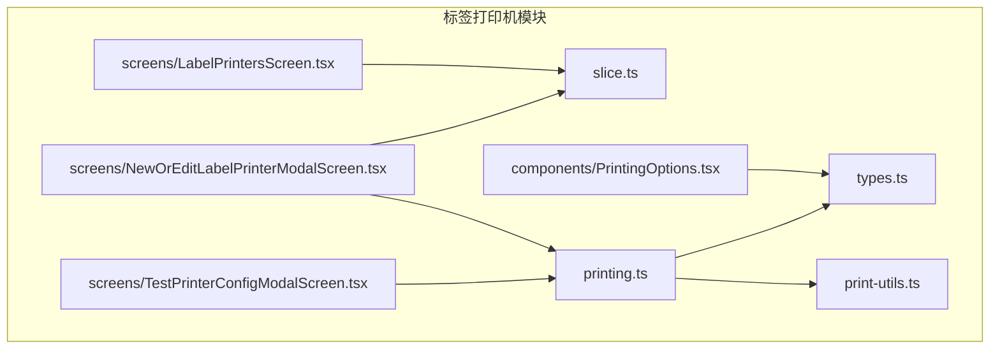
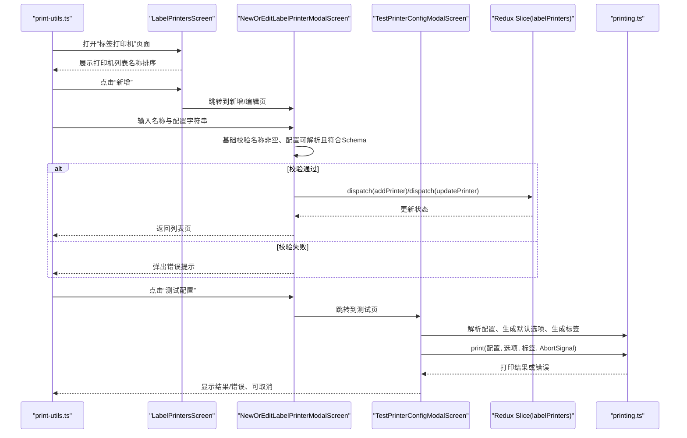
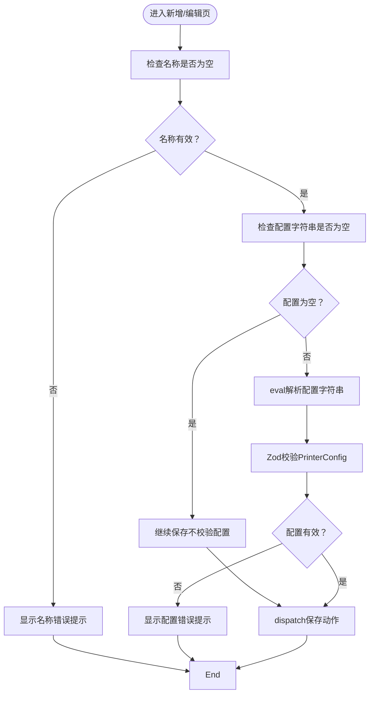
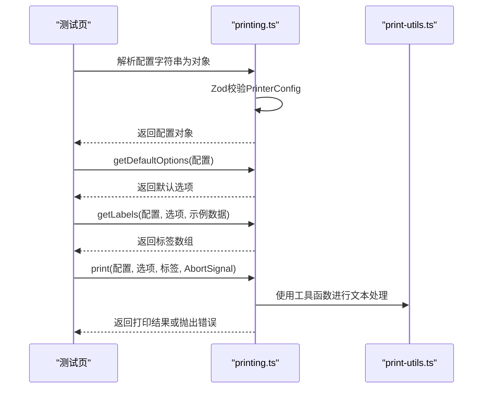
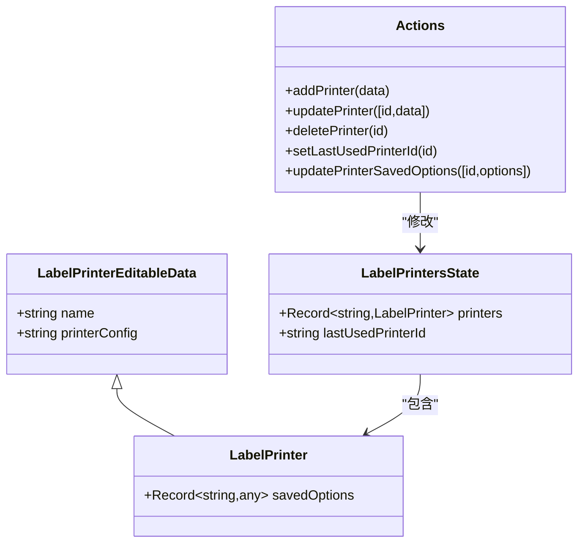
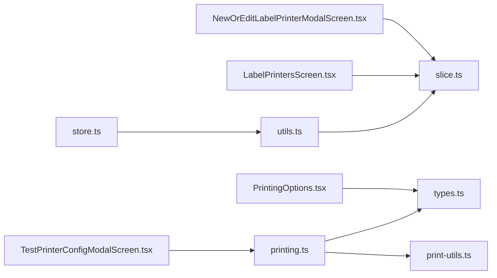

# 打印机管理

<cite>
**本文引用的文件**
- [LabelPrintersScreen.tsx](file://App/app/features/label-printers/screens/LabelPrintersScreen.tsx)
- [NewOrEditLabelPrinterModalScreen.tsx](file://App/app/features/label-printers/screens/NewOrEditLabelPrinterModalScreen.tsx)
- [TestPrinterConfigModalScreen.tsx](file://App/app/features/label-printers/screens/TestPrinterConfigModalScreen.tsx)
- [slice.ts](file://App/app/features/label-printers/slice.ts)
- [types.ts](file://App/app/features/label-printers/types.ts)
- [printing.ts](file://App/app/features/label-printers/printing.ts)
- [print-utils.ts](file://App/app/features/label-printers/print-utils.ts)
- [PrintingOptions.tsx](file://App/app/features/label-printers/components/PrintingOptions.tsx)
- [store.ts](file://App/app/redux/store.ts)
- [utils.ts](file://App/app/redux/utils.ts)
</cite>

## 目录
1. [简介](#简介)
2. [项目结构](#项目结构)
3. [核心组件](#核心组件)
4. [架构总览](#架构总览)
5. [详细组件分析](#详细组件分析)
6. [依赖关系分析](#依赖关系分析)
7. [性能考量](#性能考量)
8. [故障排查指南](#故障排查指南)
9. [结论](#结论)

## 简介
本文件面向“标签打印机管理”功能，围绕以下目标展开：
- 展示已配置的打印机列表，并支持用户新增、编辑与删除。
- 解释Redux Slice中管理打印机状态的逻辑：添加、更新、删除、保存上次使用打印机ID及打印选项。
- 描述打印机配置数据模型（名称、配置字符串、保存的打印选项等），以及其在应用状态中的存储方式。
- 提供通过dispatch操作状态的实际示例路径。
- 介绍错误处理机制：必填项校验、配置有效性校验、测试打印流程与取消、Abort信号控制。

## 项目结构
该功能位于App/app/features/label-printers目录下，包含屏幕、组件、类型定义、打印工具与Redux Slice。

图表来源
- [LabelPrintersScreen.tsx](file://App/app/features/label-printers/screens/LabelPrintersScreen.tsx#L1-L58)
- [NewOrEditLabelPrinterModalScreen.tsx](file://App/app/features/label-printers/screens/NewOrEditLabelPrinterModalScreen.tsx#L1-L345)
- [TestPrinterConfigModalScreen.tsx](file://App/app/features/label-printers/screens/TestPrinterConfigModalScreen.tsx#L1-L274)
- [slice.ts](file://App/app/features/label-printers/slice.ts#L1-L177)
- [types.ts](file://App/app/features/label-printers/types.ts#L1-L48)
- [printing.ts](file://App/app/features/label-printers/printing.ts#L1-L90)
- [print-utils.ts](file://App/app/features/label-printers/print-utils.ts#L1-L142)
- [PrintingOptions.tsx](file://App/app/features/label-printers/components/PrintingOptions.tsx#L1-L214)

章节来源
- [LabelPrintersScreen.tsx](file://App/app/features/label-printers/screens/LabelPrintersScreen.tsx#L1-L58)
- [slice.ts](file://App/app/features/label-printers/slice.ts#L1-L177)

## 核心组件
- 列表页：展示所有已配置的打印机，支持跳转到编辑页或新增页。
- 新增/编辑页：输入打印机名称与配置字符串，进行基础校验与保存；可加载示例配置、从剪贴板粘贴配置、测试配置。
- 测试配置页：解析配置、生成标签数据、预览、执行测试打印并支持取消。
- Redux Slice：管理打印机集合、最后使用的打印机ID、保存的打印选项。
- 类型系统：定义配置结构、选项类型、标签数据结构。
- 打印工具：解析配置字符串、生成默认选项、执行打印、工具函数。

章节来源
- [LabelPrintersScreen.tsx](file://App/app/features/label-printers/screens/LabelPrintersScreen.tsx#L1-L58)
- [NewOrEditLabelPrinterModalScreen.tsx](file://App/app/features/label-printers/screens/NewOrEditLabelPrinterModalScreen.tsx#L1-L345)
- [TestPrinterConfigModalScreen.tsx](file://App/app/features/label-printers/screens/TestPrinterConfigModalScreen.tsx#L1-L274)
- [slice.ts](file://App/app/features/label-printers/slice.ts#L1-L177)
- [types.ts](file://App/app/features/label-printers/types.ts#L1-L48)
- [printing.ts](file://App/app/features/label-printers/printing.ts#L1-L90)
- [print-utils.ts](file://App/app/features/label-printers/print-utils.ts#L1-L142)
- [PrintingOptions.tsx](file://App/app/features/label-printers/components/PrintingOptions.tsx#L1-L214)

## 架构总览
整体采用“屏幕 + 组件 + Redux Slice + 工具函数”的分层设计：
- 屏幕负责导航与UI交互。
- 组件负责渲染与用户输入。
- Redux Slice负责状态持久化与派发动作。
- 工具函数负责配置解析、标签生成、打印执行与辅助计算。

图表来源
- [LabelPrintersScreen.tsx](file://App/app/features/label-printers/screens/LabelPrintersScreen.tsx#L1-L58)
- [NewOrEditLabelPrinterModalScreen.tsx](file://App/app/features/label-printers/screens/NewOrEditLabelPrinterModalScreen.tsx#L1-L345)
- [TestPrinterConfigModalScreen.tsx](file://App/app/features/label-printers/screens/TestPrinterConfigModalScreen.tsx#L1-L274)
- [slice.ts](file://App/app/features/label-printers/slice.ts#L1-L177)
- [printing.ts](file://App/app/features/label-printers/printing.ts#L1-L90)
- [print-utils.ts](file://App/app/features/label-printers/print-utils.ts#L1-L142)

## 详细组件分析

### 列表页：LabelPrintersScreen.tsx
- 功能要点
  - 使用Redux选择器读取所有打印机。
  - 将打印机按名称排序展示为可点击列表项。
  - 提供“新增”入口，跳转到新增/编辑页。
- 关键实现路径
  - 选择器：[selectors.labelPrinters.printers](file://App/app/features/label-printers/slice.ts#L103-L110)
  - 列表渲染与排序：[列表渲染与排序](file://App/app/features/label-printers/screens/LabelPrintersScreen.tsx#L24-L41)
  - 新增入口：[新增按钮](file://App/app/features/label-printers/screens/LabelPrintersScreen.tsx#L44-L51)

章节来源
- [LabelPrintersScreen.tsx](file://App/app/features/label-printers/screens/LabelPrintersScreen.tsx#L1-L58)
- [slice.ts](file://App/app/features/label-printers/slice.ts#L103-L110)

### 新增/编辑页：NewOrEditLabelPrinterModalScreen.tsx
- 功能要点
  - 表单字段：名称、配置字符串。
  - 校验规则：
    - 名称非空。
    - 配置字符串非空时，先eval解析为对象，再用Zod Schema校验是否满足PrinterConfig结构。
  - 保存逻辑：根据是否存在id决定新增或更新。
  - 其他能力：加载示例配置、从剪贴板粘贴配置、跳转测试页。
- 关键实现路径
  - 校验逻辑：[名称校验](file://App/app/features/label-printers/screens/NewOrEditLabelPrinterModalScreen.tsx#L84-L90)、[配置校验](file://App/app/features/label-printers/screens/NewOrEditLabelPrinterModalScreen.tsx#L92-L105)
  - 保存动作：[保存处理](file://App/app/features/label-printers/screens/NewOrEditLabelPrinterModalScreen.tsx#L108-L129)
  - 解析与校验配置：[解析与校验](file://App/app/features/label-printers/screens/NewOrEditLabelPrinterModalScreen.tsx#L97-L100)
  - Redux动作：[addPrinter](file://App/app/features/label-printers/slice.ts#L44-L51)、[updatePrinter](file://App/app/features/label-printers/slice.ts#L53-L65)

图表来源
- [NewOrEditLabelPrinterModalScreen.tsx](file://App/app/features/label-printers/screens/NewOrEditLabelPrinterModalScreen.tsx#L84-L129)
- [slice.ts](file://App/app/features/label-printers/slice.ts#L44-L65)

章节来源
- [NewOrEditLabelPrinterModalScreen.tsx](file://App/app/features/label-printers/screens/NewOrEditLabelPrinterModalScreen.tsx#L1-L345)
- [slice.ts](file://App/app/features/label-printers/slice.ts#L1-L177)

### 测试配置页：TestPrinterConfigModalScreen.tsx
- 功能要点
  - 解析配置字符串为对象并校验。
  - 自动生成默认打印选项。
  - 生成示例标签数据并可预览。
  - 执行测试打印，支持取消（AbortSignal）。
- 关键实现路径
  - 解析与校验：[解析与校验](file://App/app/features/label-printers/screens/TestPrinterConfigModalScreen.tsx#L85-L93)
  - 默认选项生成：[getDefaultOptions](file://App/app/features/label-printers/printing.ts#L38-L69)
  - 标签生成：[getLabels](file://App/app/features/label-printers/printing.ts#L13-L36)
  - 打印执行：[print](file://App/app/features/label-printers/printing.ts#L71-L89)
  - 取消打印：[AbortController](file://App/app/features/label-printers/screens/TestPrinterConfigModalScreen.tsx#L120-L143)

图表来源
- [TestPrinterConfigModalScreen.tsx](file://App/app/features/label-printers/screens/TestPrinterConfigModalScreen.tsx#L80-L143)
- [printing.ts](file://App/app/features/label-printers/printing.ts#L1-L90)
- [print-utils.ts](file://App/app/features/label-printers/print-utils.ts#L1-L142)

章节来源
- [TestPrinterConfigModalScreen.tsx](file://App/app/features/label-printers/screens/TestPrinterConfigModalScreen.tsx#L1-L274)
- [printing.ts](file://App/app/features/label-printers/printing.ts#L1-L90)

### Redux Slice：管理打印机状态
- 数据模型
  - LabelPrinterEditableData：名称、配置字符串。
  - LabelPrinter：在可编辑数据基础上增加“保存的打印选项(savedOptions)”。
  - LabelPrintersState：打印机字典、最后使用的打印机ID。
- 动作与reducer
  - addPrinter：生成唯一ID，合并初始状态与提交数据。
  - updatePrinter：根据ID更新指定字段。
  - deletePrinter：根据ID删除打印机。
  - setLastUsedPrinterId：设置最后使用的打印机ID。
  - updatePrinterSavedOptions：更新某打印机的保存选项。
- 持久化
  - dehydrate/rehydrate：对状态进行序列化/反序列化，确保字段完整性。
- 选择器
  - selectors.labelPrinters.printers：返回所有打印机。
  - selectors.labelPrinters.lastUsedPrinterId：返回最后使用的打印机ID。

图表来源
- [slice.ts](file://App/app/features/label-printers/slice.ts#L14-L110)

章节来源
- [slice.ts](file://App/app/features/label-printers/slice.ts#L1-L177)

### 打印配置数据模型与工具
- 类型定义
  - Options：枚举、布尔、字符串、整数四类选项，支持默认值、可选范围、是否保存上次值等。
  - Label：任意键值对的记录。
  - PrinterConfig：包含options、getLabel、print、可选getPreview。
- 打印工具
  - getPrinterConfigFromString：将配置字符串eval为对象（注意安全风险）。
  - getDefaultOptions：基于PrinterConfig.options生成默认选项。
  - getLabels：调用配置中的getLabel生成标签数据。
  - print：调用配置中的print执行打印，支持AbortSignal。
- 文本处理工具
  - print-utils.ts提供分词、字符计数、换行截断等工具，供getLabel使用。

章节来源
- [types.ts](file://App/app/features/label-printers/types.ts#L1-L48)
- [printing.ts](file://App/app/features/label-printers/printing.ts#L1-L90)
- [print-utils.ts](file://App/app/features/label-printers/print-utils.ts#L1-L142)

### 打印选项UI：PrintingOptions.tsx
- 功能要点
  - 根据PrinterConfig.options动态渲染不同类型的输入控件（枚举、布尔、字符串、整数）。
  - 支持重置为默认值、选择枚举值、开关布尔值、输入字符串/整数。
  - 支持saveLastValue选项，用于持久化用户最近的选择。
- 关键实现路径
  - 渲染逻辑：[动态渲染](file://App/app/features/label-printers/components/PrintingOptions.tsx#L33-L210)
  - 保存最近值：[保存逻辑](file://App/app/features/label-printers/screens/PrintLabelModalScreen.tsx#L166-L194)

章节来源
- [PrintingOptions.tsx](file://App/app/features/label-printers/components/PrintingOptions.tsx#L1-L214)
- [PrintLabelModalScreen.tsx](file://App/app/features/label-printers/screens/PrintLabelModalScreen.tsx#L166-L194)

## 依赖关系分析
- Redux Store与Slice
  - store.ts未直接注册labelPrinters reducer，但slice.ts导出了reducer与actions，供其他模块使用。
  - utils.ts提供combineAndPersistReducers，支持对子reducer进行持久化封装。
- 屏幕与Slice
  - LabelPrintersScreen通过selectors.labelPrinters.printers读取状态。
  - NewOrEditLabelPrinterModalScreen通过actions.labelPrinters.addPrinter/updatePrinter保存状态。
  - TestPrinterConfigModalScreen通过printing.ts与types.ts完成配置解析与打印。
- 组件与工具
  - PrintingOptions.tsx依赖PrinterConfig的options结构。
  - printing.ts依赖types.ts定义的PrinterConfig与Label。

图表来源
- [store.ts](file://App/app/redux/store.ts#L1-L124)
- [utils.ts](file://App/app/redux/utils.ts#L1-L375)
- [slice.ts](file://App/app/features/label-printers/slice.ts#L1-L177)
- [LabelPrintersScreen.tsx](file://App/app/features/label-printers/screens/LabelPrintersScreen.tsx#L1-L58)
- [NewOrEditLabelPrinterModalScreen.tsx](file://App/app/features/label-printers/screens/NewOrEditLabelPrinterModalScreen.tsx#L1-L345)
- [TestPrinterConfigModalScreen.tsx](file://App/app/features/label-printers/screens/TestPrinterConfigModalScreen.tsx#L1-L274)
- [printing.ts](file://App/app/features/label-printers/printing.ts#L1-L90)
- [types.ts](file://App/app/features/label-printers/types.ts#L1-L48)
- [print-utils.ts](file://App/app/features/label-printers/print-utils.ts#L1-L142)
- [PrintingOptions.tsx](file://App/app/features/label-printers/components/PrintingOptions.tsx#L1-L214)

章节来源
- [store.ts](file://App/app/redux/store.ts#L1-L124)
- [utils.ts](file://App/app/redux/utils.ts#L1-L375)
- [slice.ts](file://App/app/features/label-printers/slice.ts#L1-L177)

## 性能考量
- 列表渲染
  - 对打印机列表进行本地排序，建议在数据量较大时考虑虚拟化或分页策略以降低渲染成本。
- 配置解析
  - eval解析配置字符串存在潜在性能与安全风险，建议仅在受信任场景使用，并限制配置大小与复杂度。
- 打印执行
  - 打印过程可能阻塞UI线程，应避免在主线程执行耗时任务；当前通过AbortSignal支持取消，有助于提升交互体验。
- 状态持久化
  - 通过dehydrate/rehydrate保证字段完整性，减少初始化合并成本；注意避免在rehydrate中做昂贵计算。

## 故障排查指南
- 名称校验失败
  - 现象：保存时报错“名称必填”。
  - 处理：确保名称非空后再次保存。
  - 参考路径：[名称校验](file://App/app/features/label-printers/screens/NewOrEditLabelPrinterModalScreen.tsx#L84-L90)
- 配置校验失败
  - 现象：保存时报错“配置无效”。
  - 处理：检查配置字符串是否能被eval解析为对象，且满足PrinterConfig的Schema定义。
  - 参考路径：[配置校验](file://App/app/features/label-printers/screens/NewOrEditLabelPrinterModalScreen.tsx#L92-L105)、[PrinterConfig Schema](file://App/app/features/label-printers/types.ts#L41-L47)
- 测试打印报错
  - 现象：测试打印弹出错误提示。
  - 处理：查看错误信息定位getLabel或print实现问题；必要时在测试页中调整示例数据或选项。
  - 参考路径：[测试页错误处理](file://App/app/features/label-printers/screens/TestPrinterConfigModalScreen.tsx#L120-L136)
- 取消打印
  - 现象：点击“取消”后停止打印。
  - 处理：使用AbortController触发取消，确保print函数正确响应信号。
  - 参考路径：[取消逻辑](file://App/app/features/label-printers/screens/TestPrinterConfigModalScreen.tsx#L137-L143)
- 删除打印机
  - 现象：列表中删除某打印机后不再显示。
  - 处理：确认已dispatch deletePrinter动作。
  - 参考路径：[deletePrinter动作](file://App/app/features/label-printers/slice.ts#L66-L71)

章节来源
- [NewOrEditLabelPrinterModalScreen.tsx](file://App/app/features/label-printers/screens/NewOrEditLabelPrinterModalScreen.tsx#L84-L129)
- [TestPrinterConfigModalScreen.tsx](file://App/app/features/label-printers/screens/TestPrinterConfigModalScreen.tsx#L120-L143)
- [types.ts](file://App/app/features/label-printers/types.ts#L41-L47)
- [slice.ts](file://App/app/features/label-printers/slice.ts#L66-L71)

## 结论
- 该功能通过清晰的屏幕、组件与Redux Slice分工，实现了打印机的增删改查与配置测试。
- 数据模型与类型系统确保了配置的可验证性与可扩展性。
- 错误处理贯穿于表单校验、配置解析与打印执行全流程，配合测试页与取消机制提升了用户体验。
- 建议后续增强点：重复名称校验、网络连接测试反馈、更完善的配置示例与模板、权限与安全加固（避免eval滥用）。