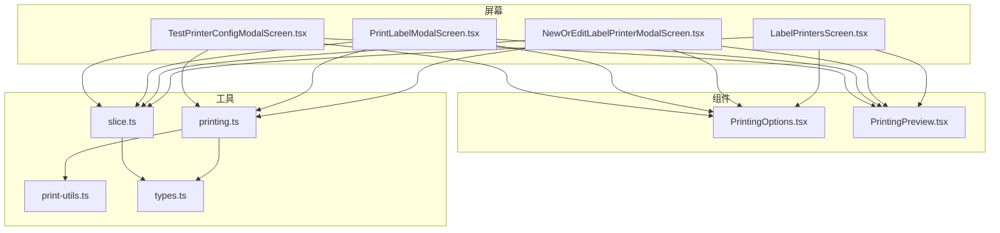
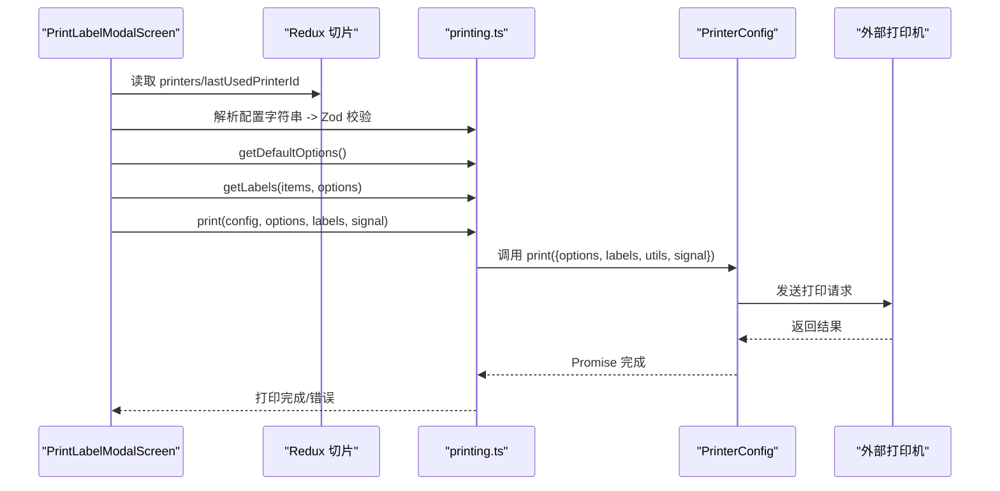
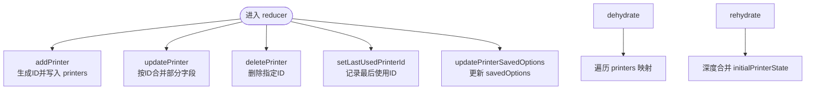
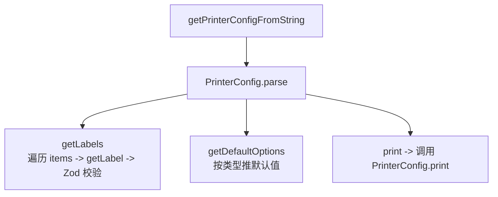
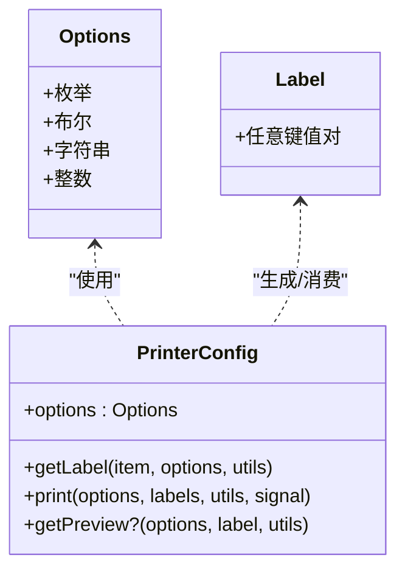
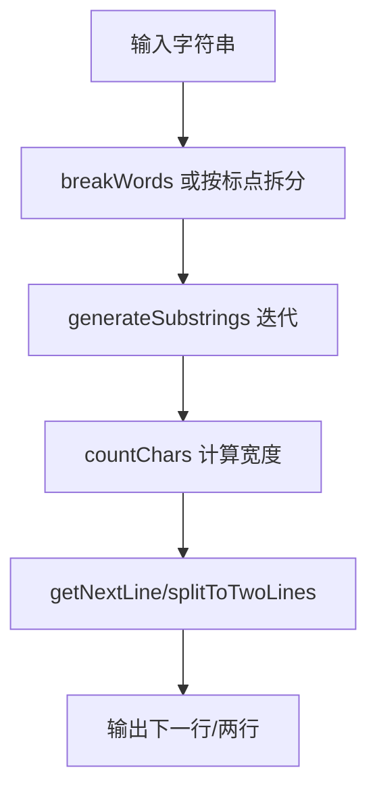
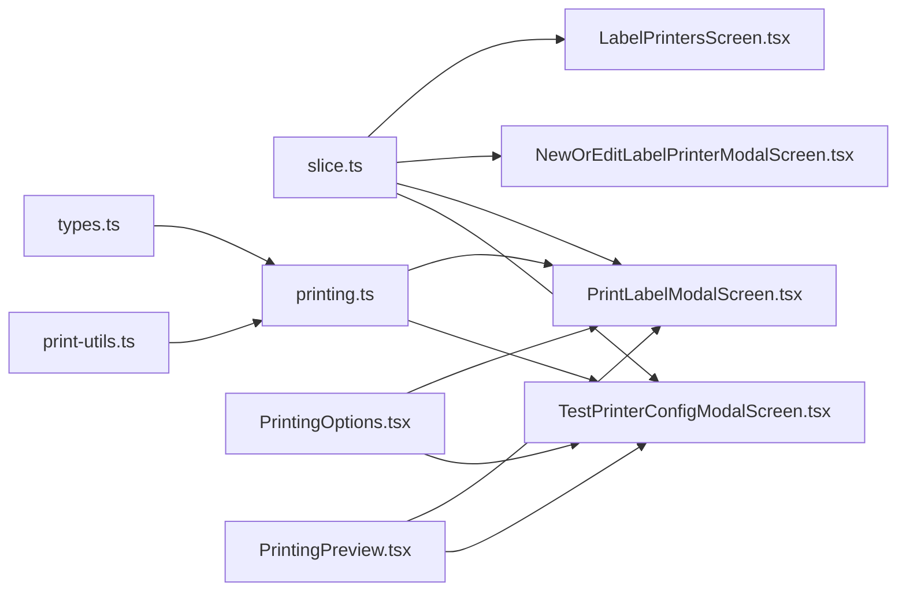

# 打印系统

<cite>
**本文引用的文件列表**
- [App/app/features/label-printers/slice.ts](file://App/app/features/label-printers/slice.ts)
- [App/app/features/label-printers/printing.ts](file://App/app/features/label-printers/printing.ts)
- [App/app/features/label-printers/types.ts](file://App/app/features/label-printers/types.ts)
- [App/app/features/label-printers/print-utils.ts](file://App/app/features/label-printers/print-utils.ts)
- [App/app/features/label-printers/components/PrintingPreview.tsx](file://App/app/features/label-printers/components/PrintingPreview.tsx)
- [App/app/features/label-printers/components/PrintingOptions.tsx](file://App/app/features/label-printers/components/PrintingOptions.tsx)
- [App/app/features/label-printers/screens/LabelPrintersScreen.tsx](file://App/app/features/label-printers/screens/LabelPrintersScreen.tsx)
- [App/app/features/label-printers/screens/NewOrEditLabelPrinterModalScreen.tsx](file://App/app/features/label-printers/screens/NewOrEditLabelPrinterModalScreen.tsx)
- [App/app/features/label-printers/screens/PrintLabelModalScreen.tsx](file://App/app/features/label-printers/screens/PrintLabelModalScreen.tsx)
- [App/app/features/label-printers/screens/TestPrinterConfigModalScreen.tsx](file://App/app/features/label-printers/screens/TestPrinterConfigModalScreen.tsx)
</cite>

## 目录
1. [简介](#简介)
2. [项目结构](#项目结构)
3. [核心组件](#核心组件)
4. [架构总览](#架构总览)
5. [详细组件分析](#详细组件分析)
6. [依赖关系分析](#依赖关系分析)
7. [性能考量](#性能考量)
8. [故障排查指南](#故障排查指南)
9. [结论](#结论)
10. [附录：开发者指南](#附录开发者指南)

## 简介
本文件面向开发者与使用者，系统化梳理“标签打印系统”的设计与实现，覆盖以下关键主题：
- 打印配置（slice.ts）的状态管理与持久化策略
- 打印机的增删改查操作与最后使用记录
- 打印指令生成逻辑（printing.ts）与与打印机的通信协议抽象
- 用户界面组件（如 PrintingPreview.tsx）如何预览标签布局与设置打印选项
- 开发者指南：如何定义新标签模板、处理打印队列、与不同型号打印机进行兼容性适配

## 项目结构
该功能模块位于 App/app/features/label-printers 下，采用“屏幕 + 组件 + 工具函数 + 类型定义 + 状态切片”的分层组织方式：
- 屏幕层：负责业务流程编排与用户交互（如添加/编辑、打印、测试）
- 组件层：可复用 UI 组件（选项输入、预览）
- 工具层：打印配置解析、标签生成、打印执行、文本工具
- 类型层：Zod 定义的配置与选项类型约束
- 状态层：Redux Toolkit 切片，管理打印机集合与最后使用记录

图表来源
- [App/app/features/label-printers/screens/LabelPrintersScreen.tsx](file://App/app/features/label-printers/screens/LabelPrintersScreen.tsx#L1-L59)
- [App/app/features/label-printers/screens/NewOrEditLabelPrinterModalScreen.tsx](file://App/app/features/label-printers/screens/NewOrEditLabelPrinterModalScreen.tsx#L1-L345)
- [App/app/features/label-printers/screens/PrintLabelModalScreen.tsx](file://App/app/features/label-printers/screens/PrintLabelModalScreen.tsx#L1-L421)
- [App/app/features/label-printers/screens/TestPrinterConfigModalScreen.tsx](file://App/app/features/label-printers/screens/TestPrinterConfigModalScreen.tsx#L1-L274)
- [App/app/features/label-printers/components/PrintingOptions.tsx](file://App/app/features/label-printers/components/PrintingOptions.tsx#L1-L214)
- [App/app/features/label-printers/components/PrintingPreview.tsx](file://App/app/features/label-printers/components/PrintingPreview.tsx#L1-L117)
- [App/app/features/label-printers/printing.ts](file://App/app/features/label-printers/printing.ts#L1-L90)
- [App/app/features/label-printers/print-utils.ts](file://App/app/features/label-printers/print-utils.ts#L1-L142)
- [App/app/features/label-printers/types.ts](file://App/app/features/label-printers/types.ts#L1-L48)
- [App/app/features/label-printers/slice.ts](file://App/app/features/label-printers/slice.ts#L1-L177)

章节来源
- [App/app/features/label-printers/slice.ts](file://App/app/features/label-printers/slice.ts#L1-L177)
- [App/app/features/label-printers/printing.ts](file://App/app/features/label-printers/printing.ts#L1-L90)
- [App/app/features/label-printers/types.ts](file://App/app/features/label-printers/types.ts#L1-L48)
- [App/app/features/label-printers/print-utils.ts](file://App/app/features/label-printers/print-utils.ts#L1-L142)
- [App/app/features/label-printers/components/PrintingPreview.tsx](file://App/app/features/label-printers/components/PrintingPreview.tsx#L1-L117)
- [App/app/features/label-printers/components/PrintingOptions.tsx](file://App/app/features/label-printers/components/PrintingOptions.tsx#L1-L214)
- [App/app/features/label-printers/screens/LabelPrintersScreen.tsx](file://App/app/features/label-printers/screens/LabelPrintersScreen.tsx#L1-L59)
- [App/app/features/label-printers/screens/NewOrEditLabelPrinterModalScreen.tsx](file://App/app/features/label-printers/screens/NewOrEditLabelPrinterModalScreen.tsx#L1-L345)
- [App/app/features/label-printers/screens/PrintLabelModalScreen.tsx](file://App/app/features/label-printers/screens/PrintLabelModalScreen.tsx#L1-L421)
- [App/app/features/label-printers/screens/TestPrinterConfigModalScreen.tsx](file://App/app/features/label-printers/screens/TestPrinterConfigModalScreen.tsx#L1-L274)

## 核心组件
- 状态切片（slice.ts）
  - 负责存储打印机集合、最后使用记录、增删改查动作与选择器
  - 提供去水合/再水合逻辑，确保持久化状态的完整性
- 打印配置与执行（printing.ts）
  - 将字符串配置解析为对象，校验 Zod 类型
  - 生成标签数据、计算默认选项、调用配置中的 print 函数
- 类型与选项（types.ts）
  - 定义 PrinterConfig、Label、Options 的 Zod 结构
  - 规范选项类型（枚举、布尔、字符串、整数），支持默认值与保存上次值
- 文本工具（print-utils.ts）
  - 提供按词断句、字符宽度计数、换行截取等文本处理能力
- UI 组件（PrintingOptions.tsx、PrintingPreview.tsx）
  - PrintingOptions：根据 PrinterConfig.options 动态渲染选项输入控件
  - PrintingPreview：调用 getPreview 生成预览图源并展示

章节来源
- [App/app/features/label-printers/slice.ts](file://App/app/features/label-printers/slice.ts#L1-L177)
- [App/app/features/label-printers/printing.ts](file://App/app/features/label-printers/printing.ts#L1-L90)
- [App/app/features/label-printers/types.ts](file://App/app/features/label-printers/types.ts#L1-L48)
- [App/app/features/label-printers/print-utils.ts](file://App/app/features/label-printers/print-utils.ts#L1-L142)
- [App/app/features/label-printers/components/PrintingOptions.tsx](file://App/app/features/label-printers/components/PrintingOptions.tsx#L1-L214)
- [App/app/features/label-printers/components/PrintingPreview.tsx](file://App/app/features/label-printers/components/PrintingPreview.tsx#L1-L117)

## 架构总览
系统围绕“配置即代码”的理念构建：每个打印机由一段可执行的 JavaScript 字符串配置驱动，包含三个核心函数：
- getLabel：从数据项生成标签数据
- print：向打印机发送打印请求
- getPreview（可选）：返回预览图的 URI 与尺寸

图表来源
- [App/app/features/label-printers/screens/PrintLabelModalScreen.tsx](file://App/app/features/label-printers/screens/PrintLabelModalScreen.tsx#L1-L421)
- [App/app/features/label-printers/printing.ts](file://App/app/features/label-printers/printing.ts#L1-L90)
- [App/app/features/label-printers/types.ts](file://App/app/features/label-printers/types.ts#L1-L48)

## 详细组件分析

### 状态管理（slice.ts）
- 数据模型
  - LabelPrinterEditableData：名称与配置字符串
  - LabelPrinter：在可编辑基础上增加 savedOptions
  - LabelPrintersState：包含 printers 记录与 lastUsedPrinterId
- 关键动作
  - addPrinter：生成唯一 ID，合并初始状态与传入数据
  - updatePrinter：按 [printerId, Partial<Data>] 更新
  - deletePrinter：删除指定 ID 的打印机
  - setLastUsedPrinterId：记录最后使用的打印机 ID
  - updatePrinterSavedOptions：更新某打印机的 savedOptions
- 去水合/再水合
  - dehydrate：序列化 printers，移除冗余字段
  - rehydrate：深度合并 initialPrinterState，保证每台打印机有完整初始状态

图表来源
- [App/app/features/label-printers/slice.ts](file://App/app/features/label-printers/slice.ts#L1-L177)

章节来源
- [App/app/features/label-printers/slice.ts](file://App/app/features/label-printers/slice.ts#L1-L177)

### 打印配置与执行（printing.ts）
- getPrinterConfigFromString
  - 使用 eval 将字符串配置转换为对象（注意安全风险）
- getLabels
  - 遍历 items，调用 printerConfig.getLabel 并通过 Zod 校验 Label
  - 捕获错误并抛出带具体 item 信息的异常
- getDefaultOptions
  - Zod 校验 PrinterConfig，基于 options 的类型推导默认值
  - 支持 enum/string/integer 的默认值策略
- print
  - Zod 校验 PrinterConfig，调用其 print 方法，传入 options、labels、utils、signal

图表来源
- [App/app/features/label-printers/printing.ts](file://App/app/features/label-printers/printing.ts#L1-L90)
- [App/app/features/label-printers/types.ts](file://App/app/features/label-printers/types.ts#L1-L48)

章节来源
- [App/app/features/label-printers/printing.ts](file://App/app/features/label-printers/printing.ts#L1-L90)
- [App/app/features/label-printers/types.ts](file://App/app/features/label-printers/types.ts#L1-L48)

### 类型与选项（types.ts）
- Options 定义了四种选项类型：
  - 枚举（enum）：支持默认值与保存上次值
  - 布尔（boolean）：支持默认值与保存上次值
  - 字符串（string）：支持最小/最大长度、默认值、可选 choices、保存上次值
  - 整数（integer）：支持最小/最大、默认值、可选 choices、保存上次值
- Label：任意键值对的对象
- PrinterConfig：必须包含 options、getLabel、print；getPreview 可选

图表来源
- [App/app/features/label-printers/types.ts](file://App/app/features/label-printers/types.ts#L1-L48)

章节来源
- [App/app/features/label-printers/types.ts](file://App/app/features/label-printers/types.ts#L1-L48)

### 文本工具（print-utils.ts）
- breakWords：iOS 使用语言学分词，其他平台按标点正则拆分
- countChars：CJK 全角字符计为 2，其他为 1
- getNextLine/splitToTwoLines：基于子串与标点规则进行智能换行
- generateSubstrings：按词或标点生成子串序列，避免在单位、运算符处断开

图表来源
- [App/app/features/label-printers/print-utils.ts](file://App/app/features/label-printers/print-utils.ts#L1-L142)

章节来源
- [App/app/features/label-printers/print-utils.ts](file://App/app/features/label-printers/print-utils.ts#L1-L142)

### UI 组件

#### PrintingOptions（选项输入）
- 根据 PrinterConfig.options 的类型动态渲染：
  - 枚举：弹出选择器
  - 布尔：开关
  - 字符串：文本输入，支持 choices 与重置默认值按钮
  - 整数：数字键盘，支持 choices 与重置默认值按钮
- 支持 saveLastValue：自动保存用户上次选择

章节来源
- [App/app/features/label-printers/components/PrintingOptions.tsx](file://App/app/features/label-printers/components/PrintingOptions.tsx#L1-L214)

#### PrintingPreview（预览）
- 调用 printerConfig.getPreview 生成预览对象（uri、width、height）
- 校验返回值类型与字段完整性
- 加载失败时显示错误提示并回退占位图

章节来源
- [App/app/features/label-printers/components/PrintingPreview.tsx](file://App/app/features/label-printers/components/PrintingPreview.tsx#L1-L117)

### 屏幕组件

#### LabelPrintersScreen（打印机列表）
- 展示已保存的打印机，支持跳转到编辑页
- 无打印机时引导新增

章节来源
- [App/app/features/label-printers/screens/LabelPrintersScreen.tsx](file://App/app/features/label-printers/screens/LabelPrintersScreen.tsx#L1-L59)

#### NewOrEditLabelPrinterModalScreen（新增/编辑）
- 编辑名称与配置字符串
- 校验配置字符串是否能被解析并符合 Zod 类型
- 提供加载示例配置、从剪贴板粘贴、测试配置入口
- 保存后更新 Redux 状态

章节来源
- [App/app/features/label-printers/screens/NewOrEditLabelPrinterModalScreen.tsx](file://App/app/features/label-printers/screens/NewOrEditLabelPrinterModalScreen.tsx#L1-L345)

#### PrintLabelModalScreen（打印）
- 从数据层加载待打印物品及其集合/容器
- 解析所选打印机配置，计算默认选项并持久化“保存上次值”的选项
- 生成标签数据，支持预览与标签覆盖
- 执行打印，支持取消（AbortSignal）

章节来源
- [App/app/features/label-printers/screens/PrintLabelModalScreen.tsx](file://App/app/features/label-printers/screens/PrintLabelModalScreen.tsx#L1-L421)

#### TestPrinterConfigModalScreen（测试配置）
- 提供示例数据，验证 getLabel 与 getPreview
- 支持测试打印与取消

章节来源
- [App/app/features/label-printers/screens/TestPrinterConfigModalScreen.tsx](file://App/app/features/label-printers/screens/TestPrinterConfigModalScreen.tsx#L1-L274)

## 依赖关系分析
- 屏幕依赖 Redux 切片（selectors/actions）与数据层（useData）
- 打印流程依赖 printing.ts 与 types.ts 的 Zod 校验
- UI 组件依赖 PrintingOptions 与 PrintingPreview
- 打印配置字符串最终由 PrinterConfig.print 实现通信协议

图表来源
- [App/app/features/label-printers/slice.ts](file://App/app/features/label-printers/slice.ts#L1-L177)
- [App/app/features/label-printers/printing.ts](file://App/app/features/label-printers/printing.ts#L1-L90)
- [App/app/features/label-printers/types.ts](file://App/app/features/label-printers/types.ts#L1-L48)
- [App/app/features/label-printers/print-utils.ts](file://App/app/features/label-printers/print-utils.ts#L1-L142)
- [App/app/features/label-printers/components/PrintingOptions.tsx](file://App/app/features/label-printers/components/PrintingOptions.tsx#L1-L214)
- [App/app/features/label-printers/components/PrintingPreview.tsx](file://App/app/features/label-printers/components/PrintingPreview.tsx#L1-L117)
- [App/app/features/label-printers/screens/LabelPrintersScreen.tsx](file://App/app/features/label-printers/screens/LabelPrintersScreen.tsx#L1-L59)
- [App/app/features/label-printers/screens/NewOrEditLabelPrinterModalScreen.tsx](file://App/app/features/label-printers/screens/NewOrEditLabelPrinterModalScreen.tsx#L1-L345)
- [App/app/features/label-printers/screens/PrintLabelModalScreen.tsx](file://App/app/features/label-printers/screens/PrintLabelModalScreen.tsx#L1-L421)
- [App/app/features/label-printers/screens/TestPrinterConfigModalScreen.tsx](file://App/app/features/label-printers/screens/TestPrinterConfigModalScreen.tsx#L1-L274)

## 性能考量
- 打印前的数据准备
  - 使用 useData 并限制查询上限，避免一次性加载过多数据
  - 对集合/容器 ID 去重后再批量拉取，减少重复请求
- 文本处理
  - getNextLine/splitToTwoLines 在长文本上按词迭代，避免频繁正则匹配
  - countChars 仅在必要时计算，尽量减少重复计算
- UI 渲染
  - PrintingOptions 按需渲染不同类型的输入控件，减少不必要的重渲染
  - PrintingPreview 在 getPreview 失败时快速回退，避免长时间等待

[本节为通用建议，不直接分析具体文件]

## 故障排查指南
- 配置字符串无效
  - 现象：编辑页提示“配置无效”
  - 排查：确认字符串可被解析且满足 PrinterConfig 的 Zod 结构
  - 参考路径：[App/app/features/label-printers/screens/NewOrEditLabelPrinterModalScreen.tsx](file://App/app/features/label-printers/screens/NewOrEditLabelPrinterModalScreen.tsx#L92-L105)
- 标签生成失败
  - 现象：打印页提示“生成标签失败”
  - 排查：检查 printerConfig.getLabel 是否抛错；核对 getLabels 的输入数据结构
  - 参考路径：[App/app/features/label-printers/printing.ts](file://App/app/features/label-printers/printing.ts#L13-L36)
- 预览加载失败
  - 现象：预览区域显示错误或占位图
  - 排查：确认 getPreview 返回对象包含 uri、width、height，且类型正确
  - 参考路径：[App/app/features/label-printers/components/PrintingPreview.tsx](file://App/app/features/label-printers/components/PrintingPreview.tsx#L21-L75)
- 打印被中断
  - 现象：点击取消后打印未停止
  - 排查：确保调用 print 时传入 AbortController 的 signal，并在 UI 中正确调用 abort
  - 参考路径：[App/app/features/label-printers/screens/PrintLabelModalScreen.tsx](file://App/app/features/label-printers/screens/PrintLabelModalScreen.tsx#L213-L244)

章节来源
- [App/app/features/label-printers/screens/NewOrEditLabelPrinterModalScreen.tsx](file://App/app/features/label-printers/screens/NewOrEditLabelPrinterModalScreen.tsx#L92-L105)
- [App/app/features/label-printers/printing.ts](file://App/app/features/label-printers/printing.ts#L13-L36)
- [App/app/features/label-printers/components/PrintingPreview.tsx](file://App/app/features/label-printers/components/PrintingPreview.tsx#L21-L75)
- [App/app/features/label-printers/screens/PrintLabelModalScreen.tsx](file://App/app/features/label-printers/screens/PrintLabelModalScreen.tsx#L213-L244)

## 结论
该打印系统以“配置即代码”为核心思想，通过 Zod 类型约束与 Redux 状态管理，实现了灵活、可扩展的标签打印能力。UI 层提供直观的选项输入与预览，工具层提供稳健的文本处理能力，便于开发者快速适配不同型号的标签打印机。建议在生产环境中谨慎使用字符串配置的动态执行，并优先采用 HTTPS 与安全的通信协议。

[本节为总结性内容，不直接分析具体文件]

## 附录：开发者指南

### 如何定义新的标签模板
- 在配置字符串中实现以下函数：
  - getLabel：接收 item、options、utils，返回符合 Label 的对象
  - print：接收 options、labels、utils、signal，返回 Promise
  - getPreview（可选）：返回包含 uri、width、height 的对象
- 使用 PrintingOptions 自动渲染对应选项控件
- 参考路径：
  - [App/app/features/label-printers/screens/NewOrEditLabelPrinterModalScreen.tsx](file://App/app/features/label-printers/screens/NewOrEditLabelPrinterModalScreen.tsx#L25-L49)
  - [App/app/features/label-printers/components/PrintingOptions.tsx](file://App/app/features/label-printers/components/PrintingOptions.tsx#L1-L214)
  - [App/app/features/label-printers/components/PrintingPreview.tsx](file://App/app/features/label-printers/components/PrintingPreview.tsx#L1-L117)

### 如何处理打印队列
- 当前实现逐个标签调用 PrinterConfig.print，内部可自行并发或串行
- 若需要队列控制，可在配置的 print 中引入队列管理（例如 Promise.all 限流或串行）
- 参考路径：
  - [App/app/features/label-printers/printing.ts](file://App/app/features/label-printers/printing.ts#L71-L90)

### 如何与不同型号的标签打印机进行兼容性适配
- 通过 PrinterConfig.print 实现具体的通信协议（如 HTTP API、本地蓝牙/串口）
- 使用 AbortController 的 signal 支持取消
- 使用 getPreview 提供可视化预览，便于调试
- 参考路径：
  - [App/app/features/label-printers/printing.ts](file://App/app/features/label-printers/printing.ts#L71-L90)
  - [App/app/features/label-printers/components/PrintingPreview.tsx](file://App/app/features/label-printers/components/PrintingPreview.tsx#L21-L75)

### 最佳实践
- 严格使用 Zod 校验配置与标签数据，避免运行时崩溃
- 合理使用 saveLastValue 保存用户常用选项
- 在 print 中处理网络异常与超时，提供清晰的错误提示
- 使用 PrintingPreview 快速验证布局与数据映射

[本节为通用指导，不直接分析具体文件]