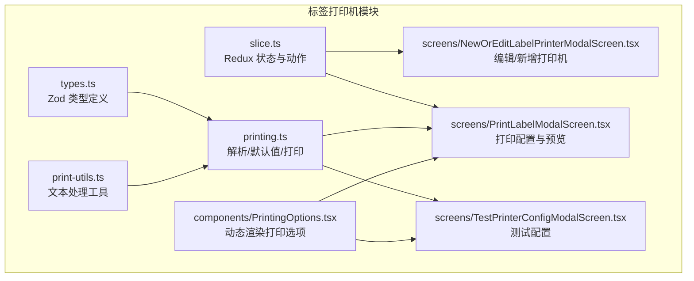
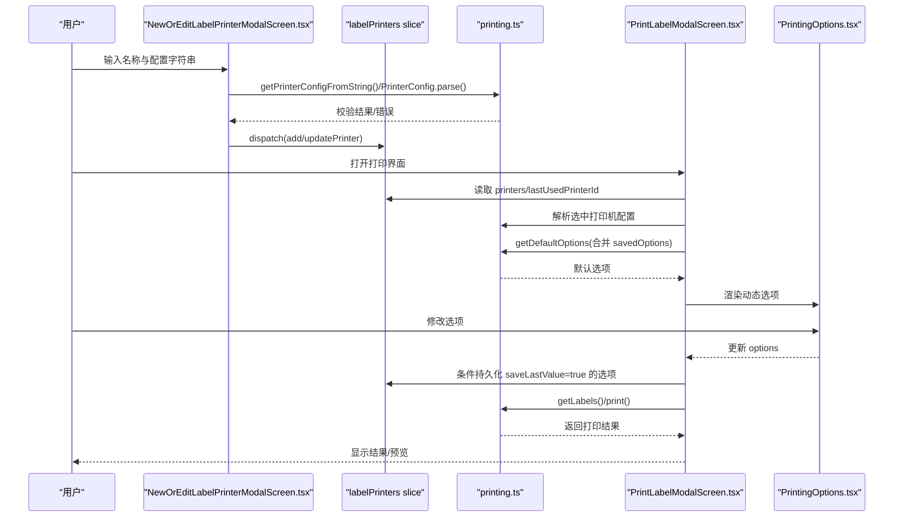
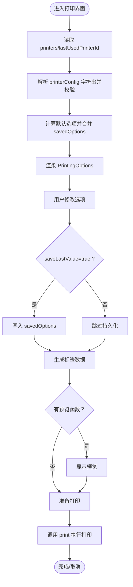
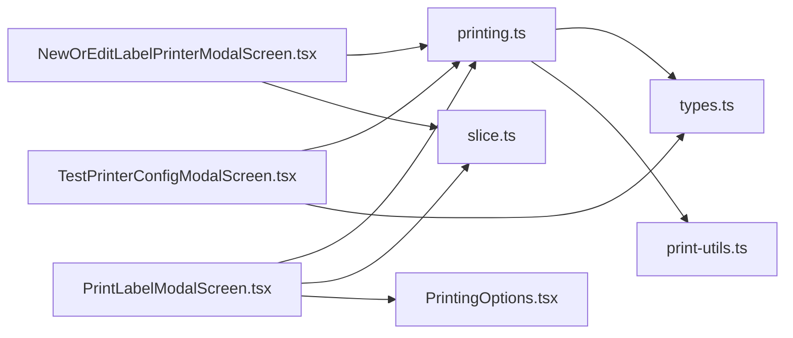

# 打印配置

<cite>
**本文引用的文件列表**
- [slice.ts](file://App/app/features/label-printers/slice.ts)
- [types.ts](file://App/app/features/label-printers/types.ts)
- [printing.ts](file://App/app/features/label-printers/printing.ts)
- [NewOrEditLabelPrinterModalScreen.tsx](file://App/app/features/label-printers/screens/NewOrEditLabelPrinterModalScreen.tsx)
- [LabelPrintersScreen.tsx](file://App/app/features/label-printers/screens/LabelPrintersScreen.tsx)
- [PrintLabelModalScreen.tsx](file://App/app/features/label-printers/screens/PrintLabelModalScreen.tsx)
- [PrintingOptions.tsx](file://App/app/features/label-printers/components/PrintingOptions.tsx)
- [TestPrinterConfigModalScreen.tsx](file://App/app/features/label-printers/screens/TestPrinterConfigModalScreen.tsx)
- [print-utils.ts](file://App/app/features/label-printers/print-utils.ts)
</cite>

## 目录
1. [简介](#简介)
2. [项目结构](#项目结构)
3. [核心组件](#核心组件)
4. [架构总览](#架构总览)
5. [详细组件分析](#详细组件分析)
6. [依赖关系分析](#依赖关系分析)
7. [性能考量](#性能考量)
8. [故障排查指南](#故障排查指南)
9. [结论](#结论)

## 简介
本文件系统性梳理“打印配置”功能，围绕以下目标展开：
- 深入解析 slice.ts 中关于打印选项的状态结构（标签尺寸、打印浓度、速度、份数等参数的定义与管理）
- 说明 NewOrEditLabelPrinterModalScreen.tsx 如何提供表单让用户配置这些参数，并将其保存到对应打印机的配置中
- 描述 PrintingOptions.tsx 组件如何动态渲染可配置项，并与 Redux 状态同步
- 提供配置数据持久化机制说明，以及如何在不同打印机之间切换配置
- 包含默认值设置、输入验证规则和用户交互反馈的实现细节

## 项目结构
打印配置功能主要位于 App/app/features/label-printers 目录下，采用“配置即代码”的设计：每个打印机的配置以字符串形式存储在 Redux 状态中，运行时通过解析该字符串生成可执行的配置对象；UI 层根据配置动态渲染打印选项，支持默认值、枚举、布尔、整数、字符串等类型，并在打印前进行校验与持久化。

图表来源
- [slice.ts](file://App/app/features/label-printers/slice.ts#L1-L177)
- [types.ts](file://App/app/features/label-printers/types.ts#L1-L48)
- [printing.ts](file://App/app/features/label-printers/printing.ts#L1-L90)
- [NewOrEditLabelPrinterModalScreen.tsx](file://App/app/features/label-printers/screens/NewOrEditLabelPrinterModalScreen.tsx#L1-L345)
- [PrintLabelModalScreen.tsx](file://App/app/features/label-printers/screens/PrintLabelModalScreen.tsx#L1-L421)
- [TestPrinterConfigModalScreen.tsx](file://App/app/features/label-printers/screens/TestPrinterConfigModalScreen.tsx#L1-L274)
- [PrintingOptions.tsx](file://App/app/features/label-printers/components/PrintingOptions.tsx#L1-L214)
- [print-utils.ts](file://App/app/features/label-printers/print-utils.ts#L1-L142)

章节来源
- [slice.ts](file://App/app/features/label-printers/slice.ts#L1-L177)
- [types.ts](file://App/app/features/label-printers/types.ts#L1-L48)
- [printing.ts](file://App/app/features/label-printers/printing.ts#L1-L90)

## 核心组件
- Redux 状态与动作（slice.ts）
  - 定义 LabelPrinter 与 LabelPrintersState 结构，提供添加、更新、删除、设置最后使用打印机、更新保存的打印选项等动作
  - 使用 reducer.dehydrate/reducer.rehydrate 实现持久化序列化/反序列化，确保重启后恢复初始状态并合并已保存的打印机数据
- 配置类型与校验（types.ts）
  - 使用 Zod 定义 PrinterConfig、Options、Label 等类型，约束 options 的字段类型、默认值、取值范围、是否保存上次值等
- 运行时解析与默认值（printing.ts）
  - 将字符串配置解析为对象并用 Zod 校验
  - 计算默认选项值，按类型返回合适的默认值或空值
  - 调用配置中的 print 函数执行打印
- 表单与编辑（NewOrEditLabelPrinterModalScreen.tsx）
  - 提供名称与配置字符串输入，支持加载示例配置、从剪贴板粘贴
  - 在保存前对配置字符串进行解析与 Zod 校验，错误时弹窗提示
- 动态选项渲染（PrintingOptions.tsx）
  - 根据 PrinterConfig.options 的键值对动态生成 UI：枚举选择、布尔开关、字符串输入、整数输入
  - 支持 choices 列表、default 默认值、saveLastValue 是否持久化上次值
- 打印流程与持久化（PrintLabelModalScreen.tsx）
  - 选择打印机，解析配置，计算默认选项并与已保存选项合并
  - 将 saveLastValue=true 的选项持久化到 Redux
  - 生成标签数据，支持预览与取消
- 测试配置（TestPrinterConfigModalScreen.tsx）
  - 加载并解析配置，生成示例标签数据，支持预览与测试打印

章节来源
- [slice.ts](file://App/app/features/label-printers/slice.ts#L1-L177)
- [types.ts](file://App/app/features/label-printers/types.ts#L1-L48)
- [printing.ts](file://App/app/features/label-printers/printing.ts#L1-L90)
- [NewOrEditLabelPrinterModalScreen.tsx](file://App/app/features/label-printers/screens/NewOrEditLabelPrinterModalScreen.tsx#L1-L345)
- [PrintingOptions.tsx](file://App/app/features/label-printers/components/PrintingOptions.tsx#L1-L214)
- [PrintLabelModalScreen.tsx](file://App/app/features/label-printers/screens/PrintLabelModalScreen.tsx#L1-L421)
- [TestPrinterConfigModalScreen.tsx](file://App/app/features/label-printers/screens/TestPrinterConfigModalScreen.tsx#L1-L274)

## 架构总览
下面的时序图展示了从“编辑打印机配置”到“打印标签”的完整流程，包括配置解析、选项默认值、持久化与打印调用。

图表来源
- [NewOrEditLabelPrinterModalScreen.tsx](file://App/app/features/label-printers/screens/NewOrEditLabelPrinterModalScreen.tsx#L1-L345)
- [slice.ts](file://App/app/features/label-printers/slice.ts#L1-L177)
- [printing.ts](file://App/app/features/label-printers/printing.ts#L1-L90)
- [PrintLabelModalScreen.tsx](file://App/app/features/label-printers/screens/PrintLabelModalScreen.tsx#L1-L421)
- [PrintingOptions.tsx](file://App/app/features/label-printers/components/PrintingOptions.tsx#L1-L214)

## 详细组件分析

### Redux 状态与持久化（slice.ts）
- 数据结构
  - LabelPrinterEditableData：包含 name 与 printerConfig 字符串
  - LabelPrinter：在可编辑数据基础上增加 savedOptions（用于持久化上次使用的选项）
  - LabelPrintersState：包含 printers 记录与 lastUsedPrinterId
- 初始化与去/复水
  - reducer.dehydrate：将复杂对象扁平化，便于持久化
  - reducer.rehydrate：在应用启动时将持久化的数据与 initialPrinterState 合并，保证每台打印机都有完整初始状态
- 关键动作
  - addPrinter：生成唯一 ID 并写入初始状态
  - updatePrinter：按 ID 更新可编辑字段
  - deletePrinter：删除指定打印机
  - setLastUsedPrinterId：记录最近一次使用的打印机 ID
  - updatePrinterSavedOptions：按打印机 ID 写入 savedOptions

章节来源
- [slice.ts](file://App/app/features/label-printers/slice.ts#L1-L177)

### 配置类型与默认值（types.ts、printing.ts）
- 类型定义
  - Options：键为字符串，值为枚举、布尔、字符串或整数类型的对象
  - PrinterConfig：要求 options 为 Options，getLabel 与 print 为函数，getPreview 可选
  - Label：任意键值对的对象
- 默认值策略（getDefaultOptions）
  - 枚举：优先 default，否则取 enum 第一个
  - 字符串：优先 default，否则取 choices 第一个，否则为空字符串
  - 整数：优先 default，否则为 undefined
  - 其他类型：返回空字符串
- 解析与校验
  - getPrinterConfigFromString：将字符串配置解析为对象（存在安全风险，仅用于内部解析）
  - PrinterConfig.parse：严格校验配置结构与类型

章节来源
- [types.ts](file://App/app/features/label-printers/types.ts#L1-L48)
- [printing.ts](file://App/app/features/label-printers/printing.ts#L1-L90)

### 动态打印选项渲染（PrintingOptions.tsx）
- 渲染逻辑
  - 遍历 printerConfig.options，按类型分支生成 UI：
    - 枚举：显示可选值，点击弹出选择器，支持默认值重置按钮
    - 布尔：使用 Switch 开关
    - 字符串：文本输入，支持 choices 下拉与默认值重置
    - 整数：数字键盘输入，支持 choices 下拉与默认值重置
- 默认值与重置
  - 当存在 default 且当前值不等于默认值时，显示“重置为默认”
- 与 Redux 同步
  - 通过 setOptions 回调更新 options，最终由上层组件持久化到 savedOptions

章节来源
- [PrintingOptions.tsx](file://App/app/features/label-printers/components/PrintingOptions.tsx#L1-L214)
- [types.ts](file://App/app/features/label-printers/types.ts#L1-L48)

### 编辑与保存配置（NewOrEditLabelPrinterModalScreen.tsx）
- 表单字段
  - 名称：必填校验
  - 配置字符串：必填校验；保存前解析并用 Zod 校验
- 交互与反馈
  - 加载示例配置、从剪贴板粘贴
  - 保存前弹窗提示错误；支持离开前确认未保存更改
  - 成功保存后关闭页面
- 与 Redux 的交互
  - 新增：dispatch(actions.labelPrinters.addPrinter)
  - 更新：dispatch(actions.labelPrinters.updatePrinter)

章节来源
- [NewOrEditLabelPrinterModalScreen.tsx](file://App/app/features/label-printers/screens/NewOrEditLabelPrinterModalScreen.tsx#L1-L345)
- [slice.ts](file://App/app/features/label-printers/slice.ts#L1-L177)

### 打印流程与持久化（PrintLabelModalScreen.tsx）
- 选择打印机
  - 从 Redux 读取 printers 与 lastUsedPrinterId
  - 通过 ActionSheet 选择打印机，变更后立即保存为 lastUsedPrinterId
- 解析与默认值
  - 解析选中打印机的 printerConfig 字符串并校验
  - 计算默认选项，并与 savedOptions 合并
- 选项持久化
  - 仅当某选项声明 saveLastValue=true 时，才将该选项的最新值写回 savedOptions
- 标签生成与打印
  - 使用 getLabels 生成标签数据，支持预览
  - 调用 print 执行打印，支持取消
- 错误处理
  - 配置解析失败、getLabel 抛错、打印异常均弹窗提示

图表来源
- [PrintLabelModalScreen.tsx](file://App/app/features/label-printers/screens/PrintLabelModalScreen.tsx#L1-L421)
- [printing.ts](file://App/app/features/label-printers/printing.ts#L1-L90)
- [slice.ts](file://App/app/features/label-printers/slice.ts#L1-L177)

章节来源
- [PrintLabelModalScreen.tsx](file://App/app/features/label-printers/screens/PrintLabelModalScreen.tsx#L1-L421)
- [printing.ts](file://App/app/features/label-printers/printing.ts#L1-L90)
- [slice.ts](file://App/app/features/label-printers/slice.ts#L1-L177)

### 测试配置（TestPrinterConfigModalScreen.tsx）
- 功能概述
  - 接收外部传入的 printerConfig 字符串，解析并校验
  - 生成示例数据，渲染 PrintingOptions，支持预览与测试打印
- 适用场景
  - 在保存前验证配置正确性与输出效果
  - 快速调试 getLabel 与 print 的行为

章节来源
- [TestPrinterConfigModalScreen.tsx](file://App/app/features/label-printers/screens/TestPrinterConfigModalScreen.tsx#L1-L274)
- [printing.ts](file://App/app/features/label-printers/printing.ts#L1-L90)

### 文本处理工具（print-utils.ts）
- 作用
  - 提供分词、字符计数、换行截断等工具函数，供配置中的 getLabel 使用
- 影响
  - 间接影响标签布局与内容长度控制，从而影响打印质量与排版

章节来源
- [print-utils.ts](file://App/app/features/label-printers/print-utils.ts#L1-L142)

## 依赖关系分析
- 组件耦合
  - PrintLabelModalScreen.tsx 依赖 PrintingOptions.tsx、printing.ts、slice.ts
  - NewOrEditLabelPrinterModalScreen.tsx 依赖 printing.ts、slice.ts
  - TestPrinterConfigModalScreen.tsx 依赖 printing.ts、types.ts
- 外部依赖
  - Zod：类型校验
  - deep-object-diff：检测 savedOptions 变更
  - react-native：UI 组件与交互
- 循环依赖
  - 未发现循环依赖；各模块职责清晰，通过 Redux 与 printing.ts 协作

图表来源
- [NewOrEditLabelPrinterModalScreen.tsx](file://App/app/features/label-printers/screens/NewOrEditLabelPrinterModalScreen.tsx#L1-L345)
- [PrintLabelModalScreen.tsx](file://App/app/features/label-printers/screens/PrintLabelModalScreen.tsx#L1-L421)
- [PrintingOptions.tsx](file://App/app/features/label-printers/components/PrintingOptions.tsx#L1-L214)
- [TestPrinterConfigModalScreen.tsx](file://App/app/features/label-printers/screens/TestPrinterConfigModalScreen.tsx#L1-L274)
- [printing.ts](file://App/app/features/label-printers/printing.ts#L1-L90)
- [types.ts](file://App/app/features/label-printers/types.ts#L1-L48)
- [slice.ts](file://App/app/features/label-printers/slice.ts#L1-L177)
- [print-utils.ts](file://App/app/features/label-printers/print-utils.ts#L1-L142)

章节来源
- [printing.ts](file://App/app/features/label-printers/printing.ts#L1-L90)
- [types.ts](file://App/app/features/label-printers/types.ts#L1-L48)
- [slice.ts](file://App/app/features/label-printers/slice.ts#L1-L177)

## 性能考量
- 解析与校验
  - 配置解析与 Zod 校验发生在编辑与打印入口，建议在后台线程或异步任务中进行，避免阻塞 UI
- 选项渲染
  - PrintingOptions.tsx 对 options 的渲染为 O(n)，其中 n 为配置项数量；可通过虚拟化列表优化长列表
- 数据持久化
  - 仅对 saveLastValue=true 的选项进行持久化，减少写入频率
- 预览与标签生成
  - 预览与 getLabel 可能涉及网络请求或本地计算，建议缓存中间结果并限制并发

## 故障排查指南
- 配置字符串无效
  - 现象：编辑页保存时报错，或打印页提示“配置无效”
  - 排查：检查字符串语法、函数签名与返回值是否符合 PrinterConfig 规范
  - 参考路径
    - [NewOrEditLabelPrinterModalScreen.tsx](file://App/app/features/label-printers/screens/NewOrEditLabelPrinterModalScreen.tsx#L92-L105)
    - [PrintLabelModalScreen.tsx](file://App/app/features/label-printers/screens/PrintLabelModalScreen.tsx#L149-L158)
- getLabel 抛错
  - 现象：生成标签时报错
  - 排查：检查 getLabel 的输入数据结构与返回值是否满足 Label 的键值对要求
  - 参考路径
    - [printing.ts](file://App/app/features/label-printers/printing.ts#L13-L36)
- 打印异常
  - 现象：print 调用失败
  - 排查：检查网络连接、目标设备可用性、print 函数实现
  - 参考路径
    - [printing.ts](file://App/app/features/label-printers/printing.ts#L71-L89)
- 选项未持久化
  - 现象：切换打印机后上次选项未恢复
  - 排查：确认选项声明了 saveLastValue=true
  - 参考路径
    - [types.ts](file://App/app/features/label-printers/types.ts#L1-L48)
    - [PrintLabelModalScreen.tsx](file://App/app/features/label-printers/screens/PrintLabelModalScreen.tsx#L171-L194)

章节来源
- [NewOrEditLabelPrinterModalScreen.tsx](file://App/app/features/label-printers/screens/NewOrEditLabelPrinterModalScreen.tsx#L92-L105)
- [PrintLabelModalScreen.tsx](file://App/app/features/label-printers/screens/PrintLabelModalScreen.tsx#L149-L158)
- [printing.ts](file://App/app/features/label-printers/printing.ts#L13-L36)
- [types.ts](file://App/app/features/label-printers/types.ts#L1-L48)

## 结论
本功能通过“配置即代码”的方式，将打印选项的定义、校验、默认值、持久化与 UI 渲染解耦，形成清晰的职责边界：
- 配置类型与解析：由 types.ts 与 printing.ts 负责
- 状态与持久化：由 slice.ts 负责
- UI 与交互：由各屏幕与组件负责
- 工具函数：由 print-utils.ts 提供文本处理能力

在实际使用中，建议：
- 在保存前使用 TestPrinterConfigModalScreen.tsx 进行验证
- 为常用选项设置 saveLastValue=true，提升用户体验
- 对配置字符串进行最小权限原则的编写，避免不必要的副作用