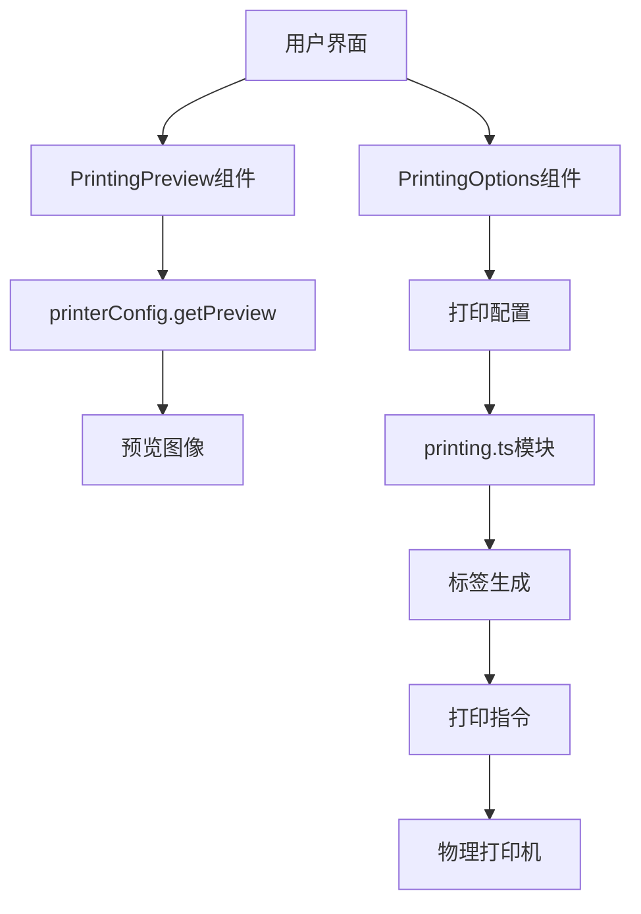
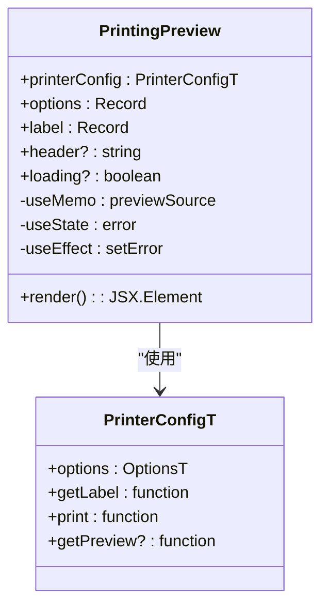
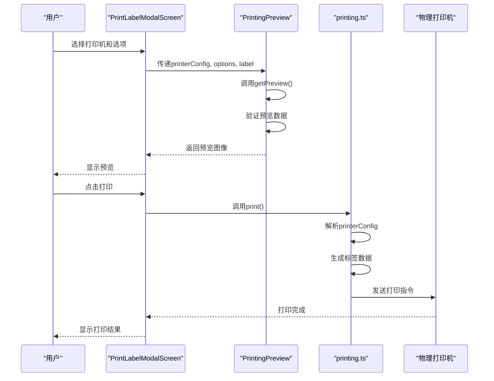
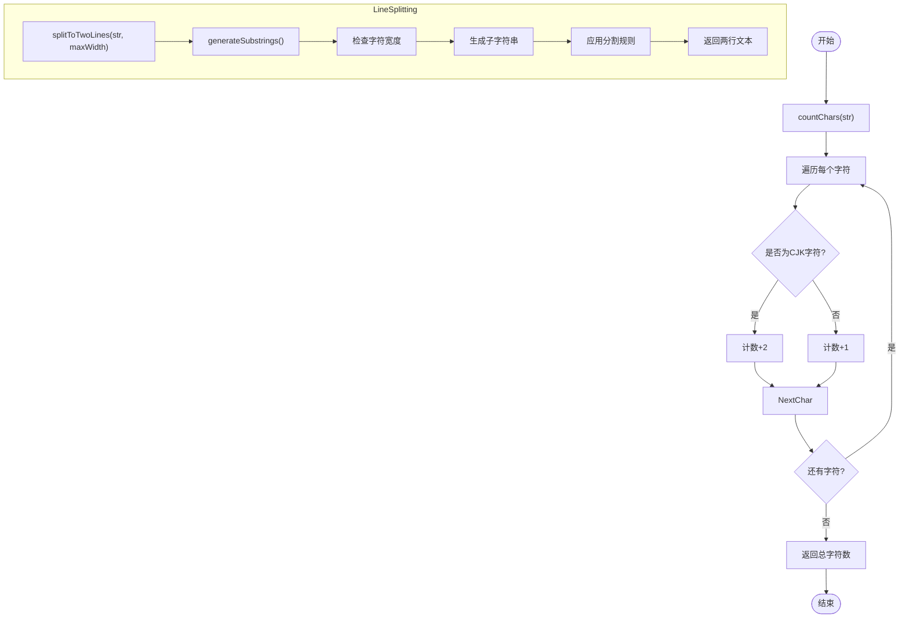
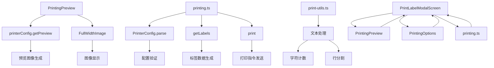

# 打印预览

<cite>
**本文档引用的文件**   
- [PrintingPreview.tsx](file://App/app/features/label-printers/components/PrintingPreview.tsx)
- [printing.ts](file://App/app/features/label-printers/printing.ts)
- [print-utils.ts](file://App/app/features/label-printers/print-utils.ts)
- [types.ts](file://App/app/features/label-printers/types.ts)
- [PrintLabelModalScreen.tsx](file://App/app/features/label-printers/screens/PrintLabelModalScreen.tsx)
- [PrintingOptions.tsx](file://App/app/features/label-printers/components/PrintingOptions.tsx)
- [chars.ts](file://App/app/consts/chars.ts)
- [print-utils.test.ts](file://App/app/features/label-printers/print-utils.test.ts)
</cite>

## 目录
1. [简介](#简介)
2. [核心组件](#核心组件)
3. [架构概览](#架构概览)
4. [详细组件分析](#详细组件分析)
5. [依赖关系分析](#依赖关系分析)
6. [性能考虑](#性能考虑)
7. [故障排除指南](#故障排除指南)
8. [结论](#结论)

## 简介
本文档详细说明了库存管理应用中的打印预览功能实现。该功能允许用户在实际打印前预览标签的布局效果，确保打印输出符合预期。系统通过`PrintingPreview`组件生成可视化预览，并与`printing.ts`模块协作，将预览数据转换为打印机可识别的指令格式（如ZPL或EPL）。文档涵盖预览区域的样式适配、缩放控制、动态内容渲染（如条形码、二维码、文本字段）的实现方式，以及如何扩展支持新标签模板的开发指南。

## 核心组件
打印预览功能由多个核心组件构成，主要包括`PrintingPreview`组件用于显示预览图像，`printing.ts`模块负责标签生成和打印逻辑，以及`print-utils.ts`提供的文本处理工具。这些组件协同工作，实现了从数据到可视化预览再到实际打印的完整流程。

**Section sources**
- [PrintingPreview.tsx](file://App/app/features/label-printers/components/PrintingPreview.tsx#L1-L117)
- [printing.ts](file://App/app/features/label-printers/printing.ts#L1-L90)
- [print-utils.ts](file://App/app/features/label-printers/print-utils.ts#L1-L142)

## 架构概览
打印预览系统的架构采用分层设计，上层为UI组件，中层为业务逻辑处理，底层为数据转换和打印指令生成。用户通过界面选择打印机和配置选项，系统根据当前标签模板和输入数据生成预览，最终通过打印模块将数据转换为打印机可识别的格式。

**Diagram sources **
- [PrintingPreview.tsx](file://App/app/features/label-printers/components/PrintingPreview.tsx#L1-L117)
- [printing.ts](file://App/app/features/label-printers/printing.ts#L1-L90)
- [PrintLabelModalScreen.tsx](file://App/app/features/label-printers/screens/PrintLabelModalScreen.tsx#L1-L421)

## 详细组件分析

### PrintingPreview组件分析
`PrintingPreview`组件是打印预览功能的核心UI组件，负责根据打印机配置和标签数据生成并显示预览图像。

#### 组件实现

**Diagram sources **
- [PrintingPreview.tsx](file://App/app/features/label-printers/components/PrintingPreview.tsx#L1-L117)
- [types.ts](file://App/app/features/label-printers/types.ts#L1-L48)

**Section sources**
- [PrintingPreview.tsx](file://App/app/features/label-printers/components/PrintingPreview.tsx#L1-L117)

### 打印流程分析
该系统实现了从用户输入到实际打印的完整工作流程，包括配置解析、标签生成和打印执行。

#### 流程实现

**Diagram sources **
- [PrintLabelModalScreen.tsx](file://App/app/features/label-printers/screens/PrintLabelModalScreen.tsx#L1-L421)
- [printing.ts](file://App/app/features/label-printers/printing.ts#L1-L90)
- [PrintingPreview.tsx](file://App/app/features/label-printers/components/PrintingPreview.tsx#L1-L117)

**Section sources**
- [PrintLabelModalScreen.tsx](file://App/app/features/label-printers/screens/PrintLabelModalScreen.tsx#L1-L421)
- [printing.ts](file://App/app/features/label-printers/printing.ts#L1-L90)

### 文本处理工具分析
`print-utils.ts`模块提供了关键的文本处理功能，用于处理多语言文本的字符计数和行分割，确保标签内容在不同语言环境下正确显示。

#### 工具实现

**Diagram sources **
- [print-utils.ts](file://App/app/features/label-printers/print-utils.ts#L1-L142)
- [chars.ts](file://App/app/consts/chars.ts#L1-L62)
- [print-utils.test.ts](file://App/app/features/label-printers/print-utils.test.ts#L1-L114)

**Section sources**
- [print-utils.ts](file://App/app/features/label-printers/print-utils.ts#L1-L142)
- [chars.ts](file://App/app/consts/chars.ts#L1-L62)

## 依赖关系分析
打印预览功能依赖于多个模块和组件的协同工作，形成了清晰的依赖关系网络。

**Diagram sources **
- [PrintingPreview.tsx](file://App/app/features/label-printers/components/PrintingPreview.tsx#L1-L117)
- [printing.ts](file://App/app/features/label-printers/printing.ts#L1-L90)
- [print-utils.ts](file://App/app/features/label-printers/print-utils.ts#L1-L142)
- [PrintLabelModalScreen.tsx](file://App/app/features/label-printers/screens/PrintLabelModalScreen.tsx#L1-L421)

**Section sources**
- [PrintingPreview.tsx](file://App/app/features/label-printers/components/PrintingPreview.tsx#L1-L117)
- [printing.ts](file://App/app/features/label-printers/printing.ts#L1-L90)
- [print-utils.ts](file://App/app/features/label-printers/print-utils.ts#L1-L142)

## 性能考虑
打印预览功能在性能方面进行了多项优化，确保在不同设备上都能流畅运行。系统使用`useMemo`来缓存预览结果，避免不必要的重复计算。同时，通过延迟加载机制，在界面初始化时提供平滑的用户体验。文本处理函数经过优化，能够高效处理多语言文本的字符计数和行分割操作。

## 故障排除指南
当打印预览功能出现问题时，可以按照以下步骤进行排查：

1. **预览不显示**：检查`printerConfig.getPreview`函数是否正确实现并返回有效的预览对象，包含`uri`、`width`和`height`属性。
2. **图像加载失败**：验证预览图像的URI是否有效，确保图像服务器正常运行。
3. **文本显示异常**：检查`print-utils.ts`中的字符计数和行分割逻辑，确保正确处理多语言文本。
4. **打印失败**：确认`printerConfig.print`函数正确实现，能够生成有效的打印指令。
5. **配置解析错误**：使用`zod`验证确保打印机配置符合预期的结构和类型。

**Section sources**
- [PrintingPreview.tsx](file://App/app/features/label-printers/components/PrintingPreview.tsx#L1-L117)
- [printing.ts](file://App/app/features/label-printers/printing.ts#L1-L90)
- [print-utils.ts](file://App/app/features/label-printers/print-utils.ts#L1-L142)

## 结论
本文档详细介绍了库存管理应用中打印预览功能的实现机制。通过`PrintingPreview`组件与`printing.ts`模块的紧密协作，系统实现了从数据到可视化预览再到实际打印的完整流程。该设计具有良好的扩展性，开发者可以通过实现新的`printerConfig`对象来支持不同类型的打印机和标签模板。为了确保预览与实际打印输出的一致性，建议在开发新模板时进行充分的测试验证，包括不同语言环境下的文本渲染效果和实际打印输出的对比。