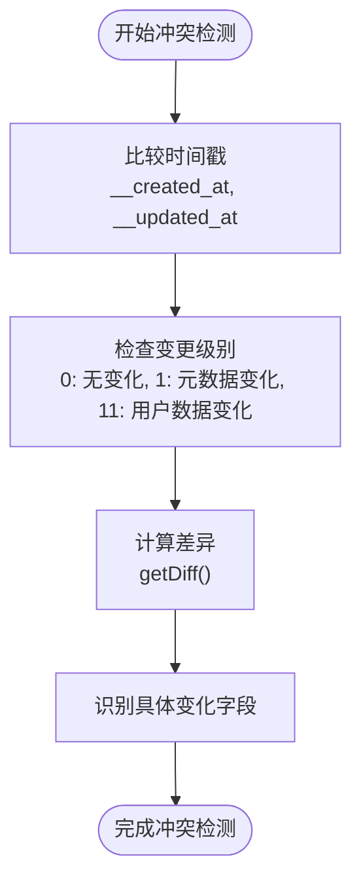
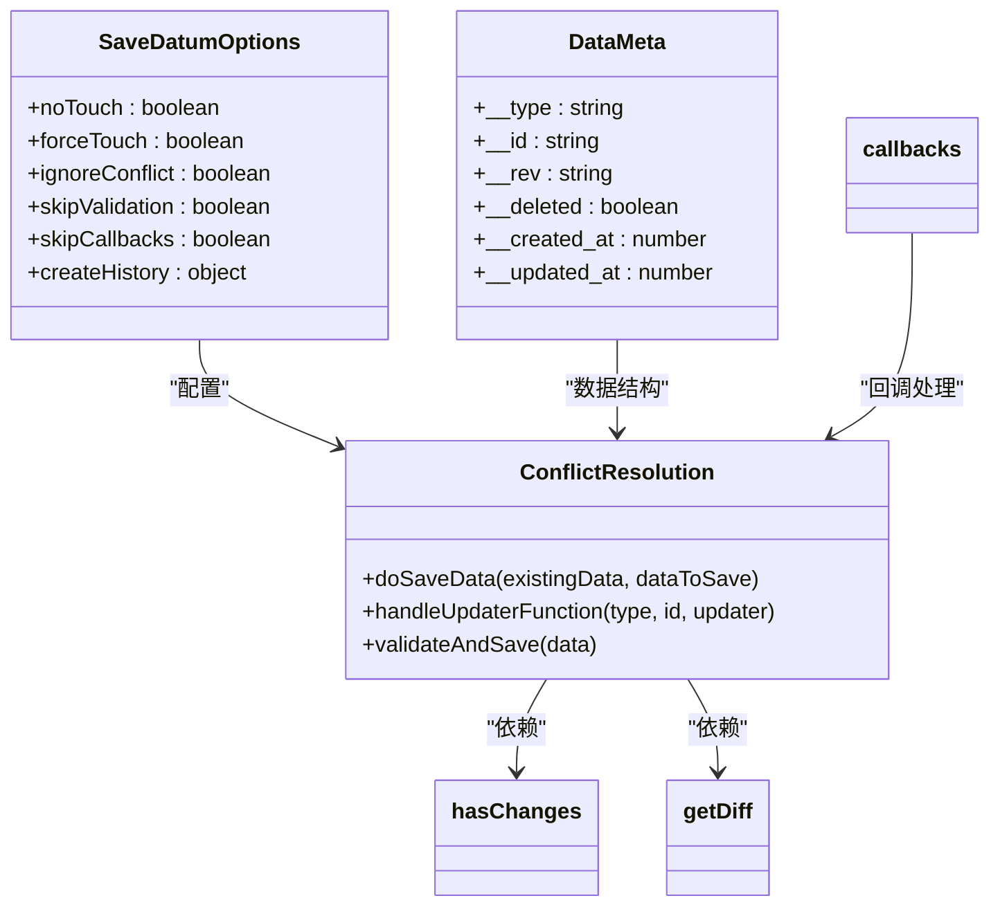
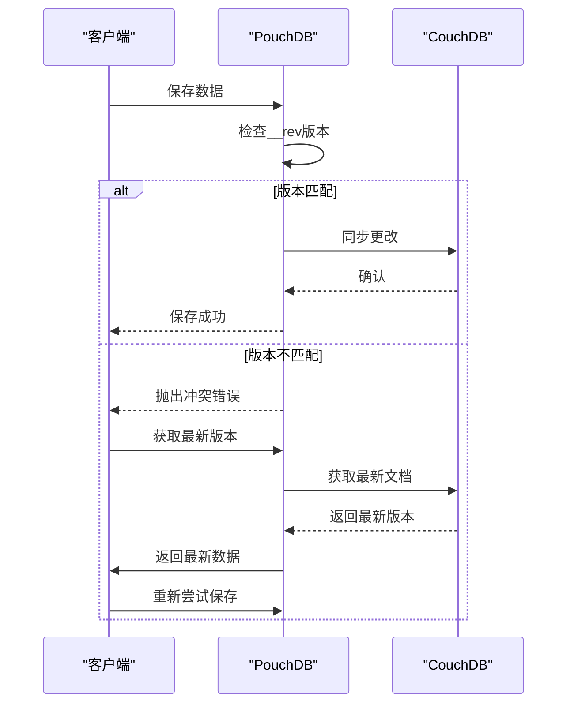
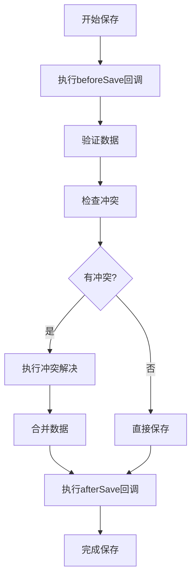

# 冲突解决

<cite>
**本文档引用的文件**  
- [DBSyncManager.tsx](file://App/app/features/db-sync/DBSyncManager.tsx)
- [CouchDBData.ts](file://packages/data-storage-couchdb/lib/CouchDBData.ts)
- [getSaveDatum.ts](file://Data/lib/functions/getSaveDatum.ts)
- [hasChanges.ts](file://Data/lib/utils/hasChanges.ts)
- [getDiff.ts](file://Data/lib/utils/getDiff.ts)
- [callbacks.ts](file://Data/lib/callbacks.ts)
- [insertTimestampIdRecord.ts](file://App/app/utils/insertTimestampIdRecord.ts)
</cite>

## 目录
1. [简介](#简介)
2. [冲突场景分析](#冲突场景分析)
3. [冲突检测机制](#冲突检测机制)
4. [冲突解决策略](#冲突解决策略)
5. [PouchDB内置冲突处理](#pouchdb内置冲突处理)
6. [自定义冲突解决策略开发指南](#自定义冲突解决策略开发指南)
7. [实际案例演示](#实际案例演示)
8. [总结](#总结)

## 简介
本项目采用PouchDB与CouchDB实现双向同步，通过DBSyncManager.tsx和CouchDBData.ts等核心文件构建了完整的冲突解决机制。系统在数据同步过程中可能遇到同时修改、删除冲突和版本冲突等多种场景，通过时间戳比较、版本向量和业务规则驱动的合并逻辑来解决这些冲突。PouchDB的内置冲突处理机制与应用层逻辑协同工作，确保数据一致性。本文档详细分析这些机制并提供自定义冲突解决策略的开发指南。

## 冲突场景分析
在双向同步过程中，可能出现以下几种主要的数据冲突场景：

### 同时修改冲突
当多个客户端同时修改同一数据记录时，会产生同时修改冲突。例如，两个用户在同一时间修改库存物品的名称或数量，系统需要决定采用哪个版本的修改。

### 删除冲突
删除冲突发生在当一个客户端删除数据而另一个客户端同时修改该数据时。系统需要判断是保留修改后的数据还是执行删除操作。

### 版本冲突
版本冲突是由于网络延迟或离线操作导致的数据版本不一致。当客户端重新连接时，其本地版本可能已落后于服务器版本，需要进行版本协调。

**Section sources**
- [DBSyncManager.tsx](file://App/app/features/db-sync/DBSyncManager.tsx#L1-L743)
- [CouchDBData.ts](file://packages/data-storage-couchdb/lib/CouchDBData.ts#L1-L97)

## 冲突检测机制
系统通过多种机制来检测数据冲突，确保在同步过程中能够及时发现并处理不一致的情况。

### 时间戳比较
系统使用时间戳来比较数据的更新时间。在getSaveDatum.ts中，通过`__created_at`和`__updated_at`字段记录数据的创建和更新时间，用于判断数据的新旧程度。

### 变更级别检测
在hasChanges.ts中实现了变更级别检测机制，通过比较现有数据和新数据的差异来确定变更级别：
- 0：无变化
- 1：元数据变化
- 11：用户数据变化

该机制通过遍历所有键值对，比较数据类型、对象结构和值的变化来确定变更级别。

### 差异计算
getDiff.ts文件实现了差异计算功能，能够识别出原始数据和新数据之间的具体变化字段。该函数返回包含原始值和新值的对象，便于后续的合并操作。

**Diagram sources**
- [getSaveDatum.ts](file://Data/lib/functions/getSaveDatum.ts#L84-L91)
- [hasChanges.ts](file://Data/lib/utils/hasChanges.ts#L8-L52)
- [getDiff.ts](file://Data/lib/utils/getDiff.ts#L1-L30)

**Section sources**
- [getSaveDatum.ts](file://Data/lib/functions/getSaveDatum.ts#L84-L91)
- [hasChanges.ts](file://Data/lib/utils/hasChanges.ts#L8-L52)
- [getDiff.ts](file://Data/lib/utils/getDiff.ts#L1-L30)

## 冲突解决策略
系统实现了多层次的冲突解决策略，结合了技术机制和业务规则来处理各种冲突场景。

### 乐观锁机制
系统采用乐观锁机制，通过`__rev`字段实现版本控制。在保存数据时，如果提供的`__rev`与当前版本不匹配，则会抛出冲突异常，需要客户端重新获取最新版本并重试操作。

### 业务规则驱动的合并
在callbacks.ts中定义了业务规则驱动的合并逻辑。例如，在保存物品数据时，会自动更新相关联的图片数据，确保数据的一致性。这种基于业务规则的合并策略能够处理复杂的关联数据冲突。

### 更新函数模式
系统支持使用更新函数模式来处理冲突。在getSaveDatum.ts中，当传入数组参数时，会采用更新函数模式，在循环中不断尝试获取最新数据并应用更新，直到成功或达到重试上限。

**Diagram sources**
- [getSaveDatum.ts](file://Data/lib/functions/getSaveDatum.ts#L66-L334)
- [callbacks.ts](file://Data/lib/callbacks.ts#L35-L363)
- [hasChanges.ts](file://Data/lib/utils/hasChanges.ts#L4-L52)

**Section sources**
- [getSaveDatum.ts](file://Data/lib/functions/getSaveDatum.ts#L66-L334)
- [callbacks.ts](file://Data/lib/callbacks.ts#L35-L363)

## PouchDB内置冲突处理
PouchDB提供了内置的冲突处理机制，与应用层逻辑协同工作，形成完整的冲突解决方案。

### 自动冲突检测
PouchDB在同步过程中自动检测冲突，当发现文档版本冲突时会抛出特定的冲突错误。在DBSyncManager.tsx中，同步处理器会监听这些错误并进行相应处理。

### 重试机制
系统配置了重试机制，在遇到冲突时会自动重试操作。在_getSaveDatum函数中，当使用更新函数模式时，会进入无限循环直到成功保存或达到最大重试次数（25次）。

### 序列号管理
PouchDB使用序列号（seq）来跟踪数据库的更新状态。在DBSyncManager.tsx中，通过监控`update_seq`来确定同步进度，并在同步完成后更新本地和远程的序列号。

**Diagram sources**
- [DBSyncManager.tsx](file://App/app/features/db-sync/DBSyncManager.tsx#L279-L407)
- [getSaveDatum.ts](file://Data/lib/functions/getSaveDatum.ts#L248-L287)

**Section sources**
- [DBSyncManager.tsx](file://App/app/features/db-sync/DBSyncManager.tsx#L279-L407)

## 自定义冲突解决策略开发指南
开发者可以基于现有框架实现自定义的冲突解决策略，以满足特定的业务需求。

### 实现合并函数
要实现自定义合并函数，可以参考getSaveDatum.ts中的`doSaveData`模式：

1. 创建一个处理函数，接收现有数据和新数据作为参数
2. 实现业务特定的合并逻辑
3. 返回合并后的数据

### 触发冲突回调
系统提供了beforeSave和afterSave回调，可以在数据保存前后执行自定义逻辑：

### 记录冲突日志
在insertTimestampIdRecord.ts中展示了如何处理冲突并记录日志的模式：

1. 捕获冲突异常
2. 记录冲突详情
3. 尝试解决冲突（如增加时间戳偏移）
4. 重试操作

**Section sources**
- [getSaveDatum.ts](file://Data/lib/functions/getSaveDatum.ts#L79-L238)
- [callbacks.ts](file://Data/lib/callbacks.ts#L35-L363)
- [insertTimestampIdRecord.ts](file://App/app/utils/insertTimestampIdRecord.ts#L1-L34)

## 实际案例演示
以下是一些常见冲突场景及其解决方案的实际案例。

### 案例1：同时修改物品名称
**场景**：两个用户同时修改同一物品的名称。
**解决方案**：
1. 系统检测到`__rev`版本冲突
2. 后提交的客户端获取最新版本
3. 应用业务规则决定采用哪个名称（如采用最后修改的名称）
4. 保存合并后的结果

### 案例2：删除与修改冲突
**场景**：用户A删除物品，用户B同时修改同一物品。
**解决方案**：
1. 系统优先处理删除操作
2. 在afterSave回调中，将修改的数据标记为已删除
3. 记录操作历史以便追溯

### 案例3：离线编辑冲突
**场景**：用户在离线状态下编辑数据，重新连接后发现版本冲突。
**解决方案**：
1. 获取服务器最新版本
2. 比较本地和服务器版本的变更
3. 合并有效变更
4. 提交合并后的结果

**Section sources**
- [getSaveDatum.ts](file://Data/lib/functions/getSaveDatum.ts#L248-L287)
- [callbacks.ts](file://Data/lib/callbacks.ts#L304-L316)
- [DBSyncManager.tsx](file://App/app/features/db-sync/DBSyncManager.tsx#L335-L369)

## 总结
本项目的冲突解决机制通过PouchDB的内置功能和应用层的自定义逻辑相结合，形成了完整的解决方案。系统采用时间戳比较、版本向量和业务规则驱动的合并策略来处理各种冲突场景。通过乐观锁机制、更新函数模式和回调系统，确保了数据的一致性和完整性。开发者可以基于现有框架实现自定义的冲突解决策略，以满足特定的业务需求。整体架构既保证了技术上的可靠性，又提供了足够的灵活性来应对复杂的业务场景。