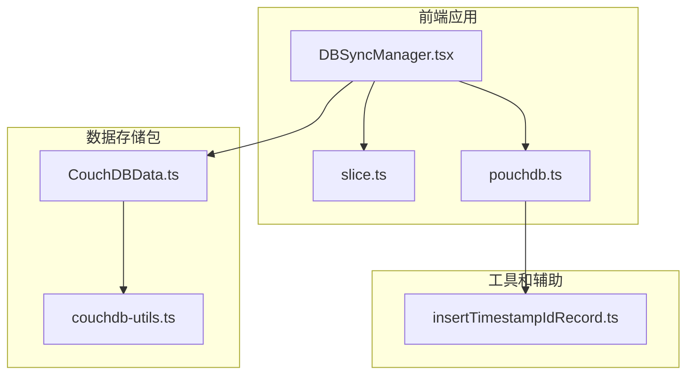
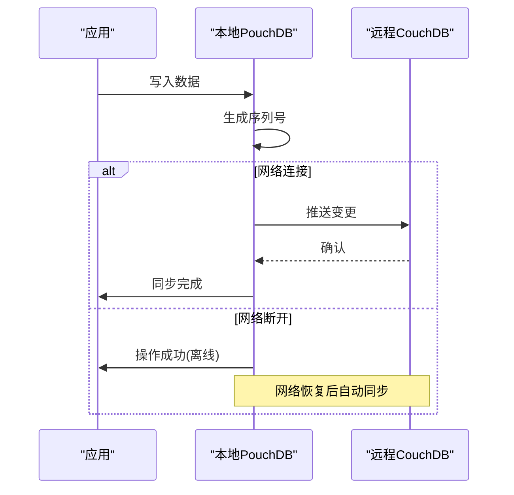
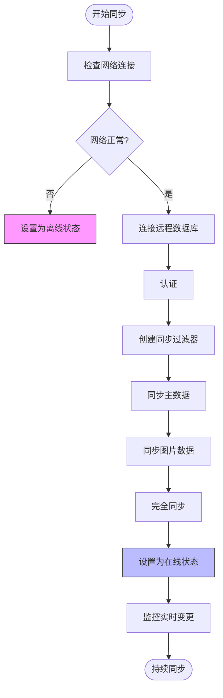
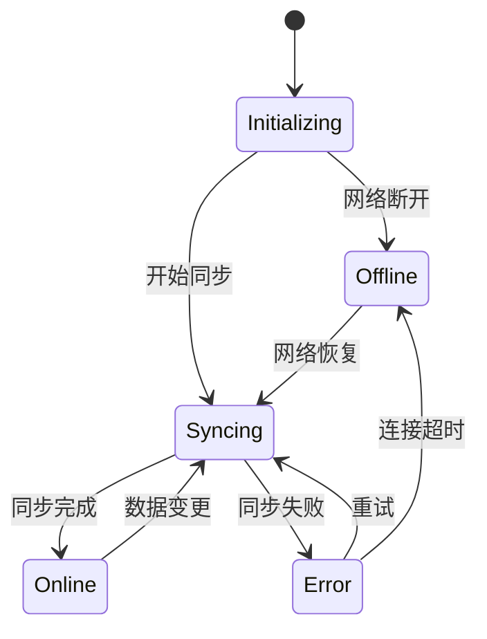
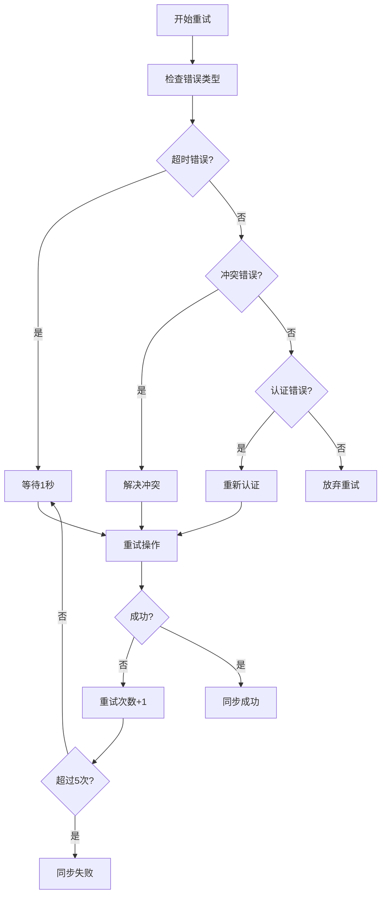
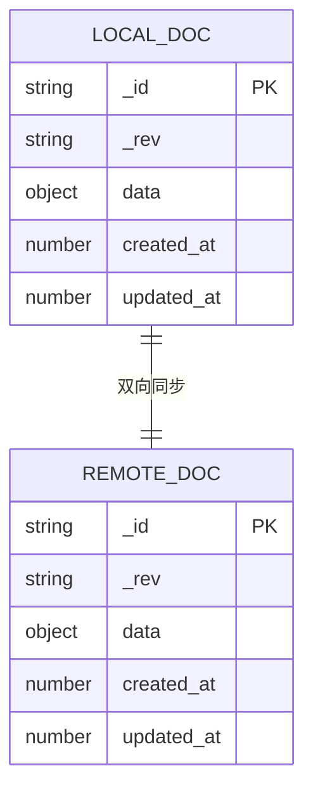
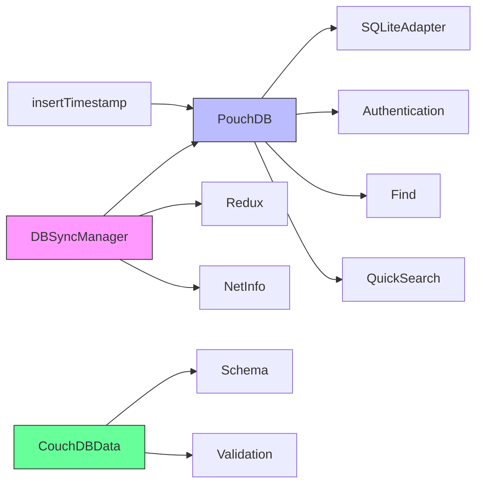

# 同步机制

<cite>
**本文档引用的文件**   
- [DBSyncManager.tsx](file://App/app/features/db-sync/DBSyncManager.tsx)
- [pouchdb.ts](file://App/app/db/pouchdb.ts)
- [slice.ts](file://App/app/features/db-sync/slice.ts)
- [CouchDBData.ts](file://packages/data-storage-couchdb/lib/CouchDBData.ts)
- [couchdb-utils.ts](file://packages/data-storage-couchdb/lib/functions/couchdb-utils.ts)
- [insertTimestampIdRecord.ts](file://App/app/utils/insertTimestampIdRecord.ts)
</cite>

## 目录
1. [简介](#简介)
2. [项目结构](#项目结构)
3. [核心组件](#核心组件)
4. [架构概述](#架构概述)
5. [详细组件分析](#详细组件分析)
6. [依赖分析](#依赖分析)
7. [性能考虑](#性能考虑)
8. [故障排除指南](#故障排除指南)
9. [结论](#结论)

## 简介
本文档详细阐述了基于PouchDB和CouchDB的双向数据同步机制。该机制为库存管理应用提供了离线优先的数据同步能力，支持实时同步、批量同步和增量同步。文档深入分析了同步流程控制、连接状态管理、重试机制以及本地PouchDB数据库与远程CouchDB服务器之间的数据映射规则。同时，文档还提供了性能优化建议和错误处理恢复机制的详细说明。

## 项目结构
该库存管理应用采用模块化架构，数据同步功能主要集中在`App/app/features/db-sync`目录下。系统使用PouchDB作为本地数据库，与远程CouchDB服务器进行双向同步。数据模型和同步逻辑在`packages/data-storage-couchdb`包中定义，而本地数据库的配置和初始化在`App/app/db`目录中完成。

**图表来源**
- [DBSyncManager.tsx](file://App/app/features/db-sync/DBSyncManager.tsx)
- [slice.ts](file://App/app/features/db-sync/slice.ts)
- [pouchdb.ts](file://App/app/db/pouchdb.ts)
- [CouchDBData.ts](file://packages/data-storage-couchdb/lib/CouchDBData.ts)
- [couchdb-utils.ts](file://packages/data-storage-couchdb/lib/functions/couchdb-utils.ts)
- [insertTimestampIdRecord.ts](file://App/app/utils/insertTimestampIdRecord.ts)

**章节来源**
- [DBSyncManager.tsx](file://App/app/features/db-sync/DBSyncManager.tsx)
- [pouchdb.ts](file://App/app/db/pouchdb.ts)

## 核心组件
数据同步机制的核心是`DBSyncManager.tsx`组件，它负责管理与远程CouchDB服务器的连接、同步流程和状态更新。该组件使用Redux进行状态管理，通过`slice.ts`定义了同步服务器的配置和状态。本地PouchDB数据库通过`pouchdb.ts`进行初始化和配置，支持SQLite适配器以确保移动端性能。

**章节来源**
- [DBSyncManager.tsx](file://App/app/features/db-sync/DBSyncManager.tsx)
- [slice.ts](file://App/app/features/db-sync/slice.ts)
- [pouchdb.ts](file://App/app/db/pouchdb.ts)

## 架构概述
系统采用PouchDB-CouchDB双向同步架构，实现了离线优先的应用模式。当设备在线时，本地PouchDB数据库会与远程CouchDB服务器进行实时同步；当设备离线时，所有数据操作都记录在本地，待网络恢复后自动同步到服务器。

**图表来源**
- [DBSyncManager.tsx](file://App/app/features/db-sync/DBSyncManager.tsx)
- [pouchdb.ts](file://App/app/db/pouchdb.ts)

## 详细组件分析

### DBSyncManager 分析
`DBSyncManager`是数据同步的核心控制器，负责管理多个同步服务器的连接和同步流程。

#### 同步流程控制

**图表来源**
- [DBSyncManager.tsx](file://App/app/features/db-sync/DBSyncManager.tsx#L412-L637)

#### 连接状态管理

**图表来源**
- [DBSyncManager.tsx](file://App/app/features/db-sync/DBSyncManager.tsx#L47-L73)
- [slice.ts](file://App/app/features/db-sync/slice.ts#L24-L31)

#### 重试机制

**图表来源**
- [DBSyncManager.tsx](file://App/app/features/db-sync/DBSyncManager.tsx#L155-L170)
- [DBSyncManager.tsx](file://App/app/features/db-sync/DBSyncManager.tsx#L174-L201)

**章节来源**
- [DBSyncManager.tsx](file://App/app/features/db-sync/DBSyncManager.tsx#L43-L723)

### 数据映射与转换
系统在本地PouchDB和远程CouchDB之间进行数据映射和转换，确保数据的一致性和完整性。

#### 数据映射规则

**图表来源**
- [couchdb-utils.ts](file://packages/data-storage-couchdb/lib/functions/couchdb-utils.ts#L15-L18)
- [couchdb-utils.ts](file://packages/data-storage-couchdb/lib/functions/couchdb-utils.ts#L280-L311)

#### 序列化规则

**图表来源**
- [couchdb-utils.ts](file://packages/data-storage-couchdb/lib/functions/couchdb-utils.ts#L15-L18)
- [couchdb-utils.ts](file://packages/data-storage-couchdb/lib/functions/couchdb-utils.ts#L333-L350)

**章节来源**
- [CouchDBData.ts](file://packages/data-storage-couchdb/lib/CouchDBData.ts#L42-L96)
- [couchdb-utils.ts](file://packages/data-storage-couchdb/lib/functions/couchdb-utils.ts#L15-L351)

## 依赖分析
数据同步机制依赖于多个关键组件和库，形成了一个完整的依赖链。

**图表来源**
- [DBSyncManager.tsx](file://App/app/features/db-sync/DBSyncManager.tsx)
- [pouchdb.ts](file://App/app/db/pouchdb.ts)
- [CouchDBData.ts](file://packages/data-storage-couchdb/lib/CouchDBData.ts)
- [yarn.lock](file://App/yarn.lock)

**章节来源**
- [DBSyncManager.tsx](file://App/app/features/db-sync/DBSyncManager.tsx)
- [pouchdb.ts](file://App/app/db/pouchdb.ts)
- [CouchDBData.ts](file://packages/data-storage-couchdb/lib/CouchDBData.ts)

## 性能考虑
为了优化同步性能，系统采用了多种策略：

1. **批量处理**: 使用`batch_size`和`batches_limit`参数控制每次同步的数据量
2. **网络压缩**: 通过HTTP压缩减少传输数据量
3. **断点续传**: 利用序列号（seq）实现断点续传，避免重复传输
4. **智能过滤**: 使用设计文档过滤器只同步必要数据
5. **分阶段同步**: 先同步主数据，再同步大文件（如图片）

**章节来源**
- [DBSyncManager.tsx](file://App/app/features/db-sync/DBSyncManager.tsx#L32-L33)
- [DBSyncManager.tsx](file://App/app/features/db-sync/DBSyncManager.tsx#L469-L471)

## 故障排除指南
当同步出现问题时，可以按照以下步骤进行诊断：

1. **检查网络连接**: 确认设备已连接到网络
2. **验证服务器配置**: 检查服务器URL、用户名和密码是否正确
3. **查看日志**: 通过应用日志查看详细的错误信息
4. **检查认证状态**: 确认用户有权限访问目标数据库
5. **验证数据完整性**: 确保本地和远程数据库的配置有效

**章节来源**
- [DBSyncManager.tsx](file://App/app/features/db-sync/DBSyncManager.tsx#L174-L201)
- [DBSyncManager.tsx](file://App/app/features/db-sync/DBSyncManager.tsx#L393-L405)

## 结论
该数据同步机制基于PouchDB和CouchDB构建，提供了可靠的双向同步能力。通过精心设计的同步流程、连接状态管理和重试机制，系统能够在各种网络条件下稳定运行。数据映射和转换规则确保了本地和远程数据的一致性，而性能优化策略则提升了用户体验。整体架构灵活可扩展，为库存管理应用提供了坚实的数据基础。