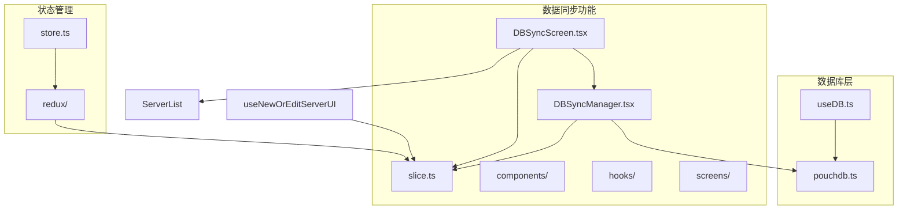
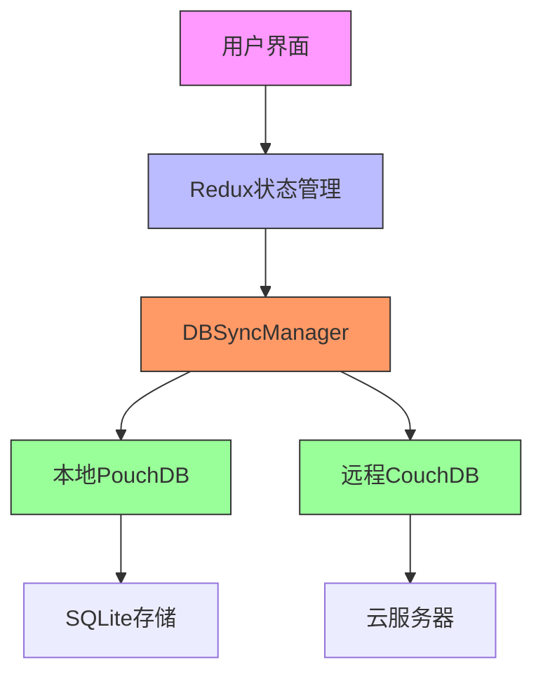
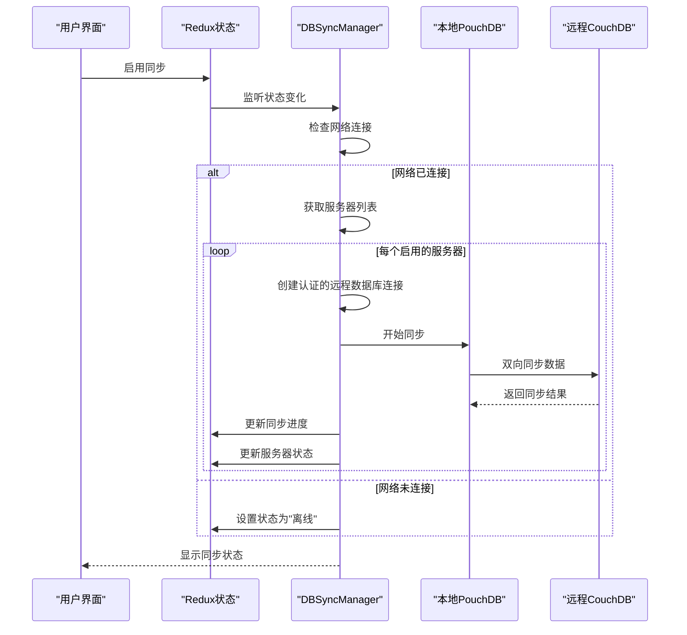
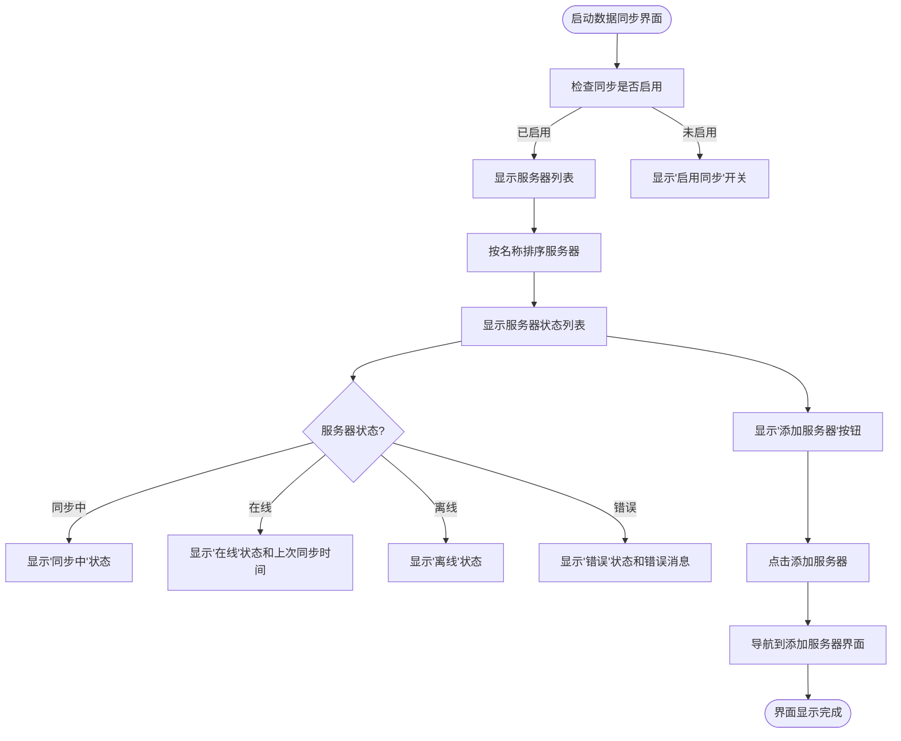
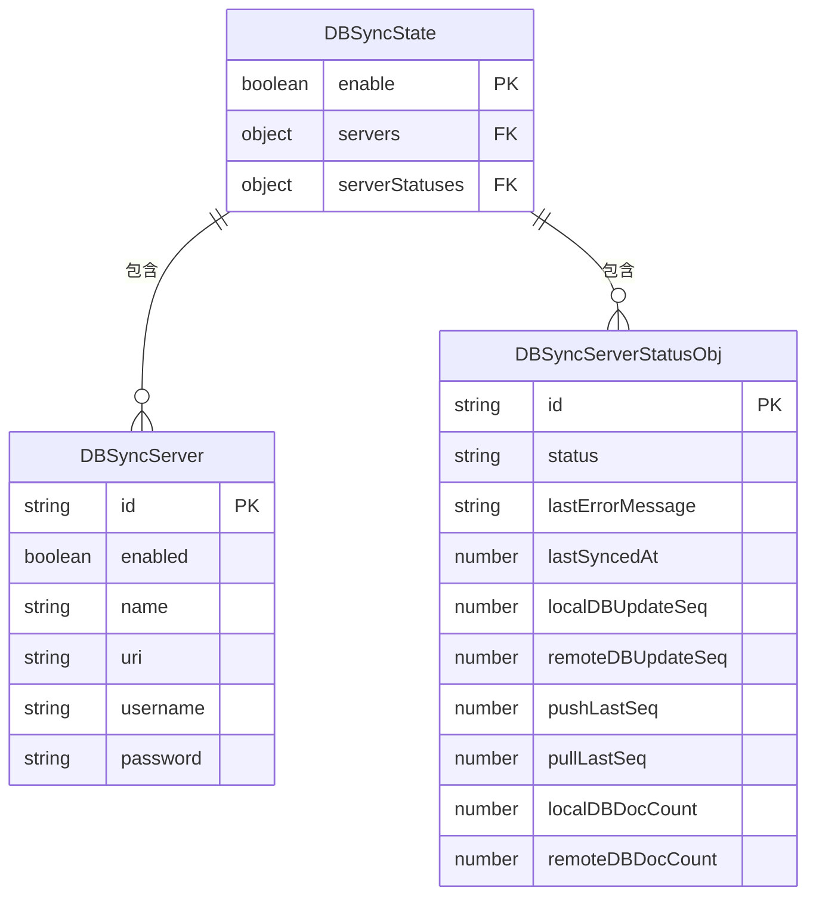
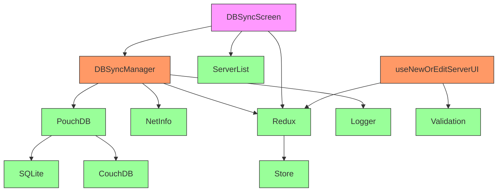

# 数据同步

<cite>
**本文档中引用的文件**   
- [DBSyncManager.tsx](file://App/App/features/db-sync/DBSyncManager.tsx)
- [DBSyncScreen.tsx](file://App/App/features/db-sync/screens/DBSyncScreen.tsx)
- [pouchdb.ts](file://App/App/db/pouchdb.ts)
- [slice.ts](file://App/App/features/db-sync/slice.ts)
- [ServerList.tsx](file://App/App/features/db-sync/components/ServerList.tsx)
- [useNewOrEditServerUI.tsx](file://App/App/features/db-sync/hooks/useNewOrEditServerUI.tsx)
- [DBSyncNewOrEditServerModalScreen.tsx](file://App/App/features/db-sync/screens/DBSyncNewOrEditServerModalScreen.tsx)
- [DBSyncServerDetailScreen.tsx](file://App/App/features/db-sync/screens/DBSyncServerDetailScreen.tsx)
</cite>

## 目录
1. [简介](#简介)
2. [项目结构](#项目结构)
3. [核心组件](#核心组件)
4. [架构概述](#架构概述)
5. [详细组件分析](#详细组件分析)
6. [依赖分析](#依赖分析)
7. [性能考虑](#性能考虑)
8. [故障排除指南](#故障排除指南)
9. [结论](#结论)

## 简介
本文档详细阐述了基于PouchDB和CouchDB的双向数据同步功能的架构设计与实现原理。该功能允许库存管理应用在本地设备和远程服务器之间同步数据，确保数据的一致性和可用性。系统采用React Native框架开发，利用PouchDB作为本地数据库，与远程CouchDB服务器进行双向同步。

## 项目结构
数据同步功能的代码组织遵循模块化设计原则，主要分布在`App/features/db-sync`目录下。该功能包含管理器、用户界面、状态管理等多个组件，通过Redux进行状态管理，并与本地PouchDB数据库和远程CouchDB服务器进行交互。



**Diagram sources**
- [DBSyncManager.tsx](file://App/App/features/db-sync/DBSyncManager.tsx)
- [DBSyncScreen.tsx](file://App/App/features/db-sync/screens/DBSyncScreen.tsx)
- [slice.ts](file://App/App/features/db-sync/slice.ts)
- [pouchdb.ts](file://App/App/db/pouchdb.ts)
- [useDB.ts](file://App/App/db/hooks/useDB.ts)

**Section sources**
- [DBSyncManager.tsx](file://App/App/features/db-sync/DBSyncManager.tsx)
- [DBSyncScreen.tsx](file://App/App/features/db-sync/screens/DBSyncScreen.tsx)
- [slice.ts](file://App/App/features/db-sync/slice.ts)
- [pouchdb.ts](file://App/App/db/pouchdb.ts)

## 核心组件

数据同步功能的核心组件包括同步管理器(DBSyncManager)、用户界面(DBSyncScreen)、状态管理(slice)和数据库接口(pouchdb)。这些组件协同工作，实现了完整的双向同步功能。

**Section sources**
- [DBSyncManager.tsx](file://App/App/features/db-sync/DBSyncManager.tsx)
- [DBSyncScreen.tsx](file://App/App/features/db-sync/screens/DBSyncScreen.tsx)
- [slice.ts](file://App/App/features/db-sync/slice.ts)
- [pouchdb.ts](file://App/App/db/pouchdb.ts)

## 架构概述

系统采用分层架构设计，前端用户界面与后端数据同步逻辑分离。用户界面通过Redux与同步管理器通信，同步管理器负责与本地PouchDB数据库和远程CouchDB服务器进行交互。状态管理使用Redux Toolkit，确保状态的一致性和可预测性。



**Diagram sources**
- [DBSyncManager.tsx](file://App/App/features/db-sync/DBSyncManager.tsx)
- [DBSyncScreen.tsx](file://App/App/features/db-sync/screens/DBSyncScreen.tsx)
- [slice.ts](file://App/App/features/db-sync/slice.ts)
- [pouchdb.ts](file://App/App/db/pouchdb.ts)

## 详细组件分析

### DBSyncManager分析
DBSyncManager是数据同步功能的核心逻辑组件，负责管理与远程服务器的连接、执行同步操作和处理同步状态。

#### 同步管理器类图
```mermaid
classDiagram
class DBSyncManager {
+logger : Logger
+dispatch : AppDispatch
+dbSyncEnabled : boolean
+servers : Record~string, DBSyncServer~
+isNetworkConnected : boolean | null
+networkConnectionType : string
+isNetworkConnectionExpensive : boolean | undefined
+getAuthenticatedRemoteDB(server : ServerData) : Promise~PouchDB.Database | null~
+updateSyncProgress(...args : Parameters~typeof actions.dbSync.updateSyncProgress~) : void
+_startSync(localDB : PouchDB.Database, remoteDB : PouchDB.Database, params : PouchDB.Replication.SyncOptions, server : ServerData, {filter, onChange, onComplete} : {filter? : string, onChange? : (arg : {localDBUpdateSeq? : number | undefined, remoteDBUpdateSeq? : number | undefined, pushLastSeq? : number, pullLastSeq? : number}) => void, onComplete? : (arg : {localDBUpdateSeq : number | undefined, remoteDBUpdateSeq : number | undefined, pushLastSeq : number | undefined, pullLastSeq : number | undefined}) => void}) : PouchDB.Replication.Sync~{}~
+startSync(localDB : PouchDB.Database, server : ServerData) : StartSyncReturnObj
}
class NetInfo {
+addEventListener(callback : (state : NetInfoState) => void) : () => void
}
class PouchDB {
+sync(remoteDB : PouchDB.Database, options : PouchDB.Replication.SyncOptions) : PouchDB.Replication.Sync~{}~
+info() : Promise~PouchDB.DatabaseInfo~
+logIn(username : string, password : string) : Promise~any~
}
DBSyncManager --> NetInfo : "使用"
DBSyncManager --> PouchDB : "使用"
DBSyncManager --> Logger : "使用"
DBSyncManager --> Redux : "使用"
```

**Diagram sources**
- [DBSyncManager.tsx](file://App/App/features/db-sync/DBSyncManager.tsx)

#### 同步流程序列图


**Diagram sources**
- [DBSyncManager.tsx](file://App/App/features/db-sync/DBSyncManager.tsx)

### 用户界面分析
用户界面组件提供了配置同步服务器和监控同步状态的交互界面。

#### 用户界面流程图


**Diagram sources**
- [DBSyncScreen.tsx](file://App/App/features/db-sync/screens/DBSyncScreen.tsx)
- [ServerList.tsx](file://App/App/features/db-sync/components/ServerList.tsx)

### 状态管理分析
状态管理使用Redux Toolkit实现，定义了数据同步相关的状态、动作和选择器。

#### 状态管理数据模型


**Diagram sources**
- [slice.ts](file://App/App/features/db-sync/slice.ts)

## 依赖分析

数据同步功能依赖于多个外部库和内部模块，形成了复杂的依赖关系网络。



**Diagram sources**
- [DBSyncManager.tsx](file://App/App/features/db-sync/DBSyncManager.tsx)
- [DBSyncScreen.tsx](file://App/App/features/db-sync/screens/DBSyncScreen.tsx)
- [slice.ts](file://App/App/features/db-sync/slice.ts)
- [pouchdb.ts](file://App/App/db/pouchdb.ts)

## 性能考虑

数据同步功能在设计时考虑了多种性能优化策略，包括批量处理、连接管理、状态更新节流等。同步操作采用分批处理方式，设置批量大小为16，批量限制为4，以平衡性能和内存使用。状态更新通过节流机制实现，确保每秒最多更新一次，避免频繁的状态更新导致的性能问题。

## 故障排除指南

当数据同步出现问题时，可以按照以下步骤进行排查：

1. 检查网络连接状态，确保设备已连接到互联网
2. 验证服务器配置，包括URI、用户名和密码
3. 查看同步日志，获取详细的错误信息
4. 检查本地数据库状态，确保数据库文件完整
5. 验证远程CouchDB服务器状态，确保服务正常运行

**Section sources**
- [DBSyncManager.tsx](file://App/App/features/db-sync/DBSyncManager.tsx)
- [DBSyncScreen.tsx](file://App/App/features/db-sync/screens/DBSyncScreen.tsx)
- [slice.ts](file://App/App/features/db-sync/slice.ts)

## 结论

基于PouchDB和CouchDB的双向数据同步功能为库存管理应用提供了可靠的数据一致性保障。通过合理的架构设计和状态管理，实现了高效、稳定的同步机制。该功能支持多服务器配置、网络状态检测、错误处理等特性，为用户提供了一致的数据访问体验。未来可以进一步优化同步算法，支持更多类型的数据过滤和冲突解决策略。