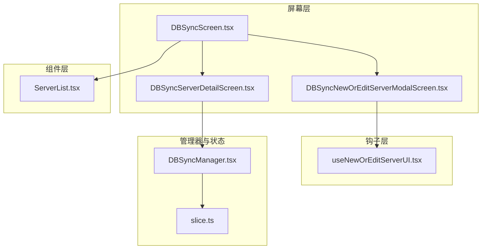
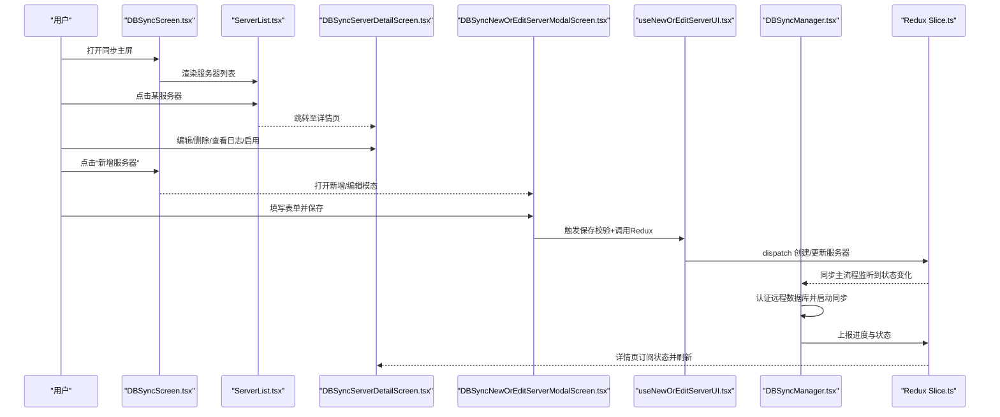
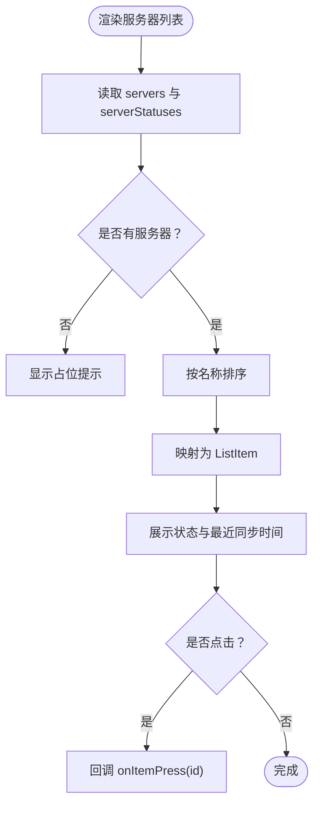
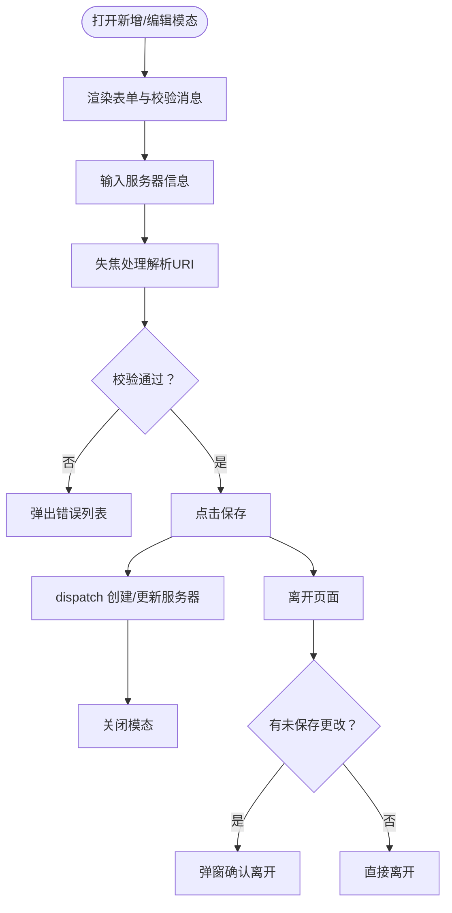
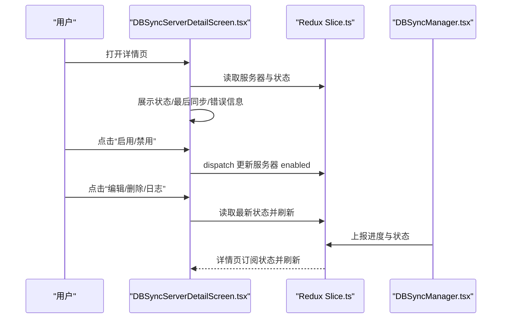
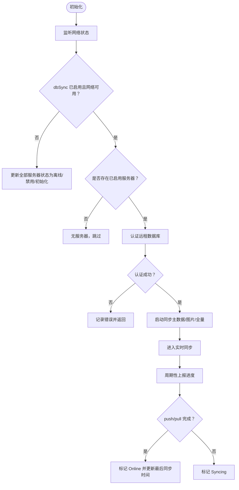
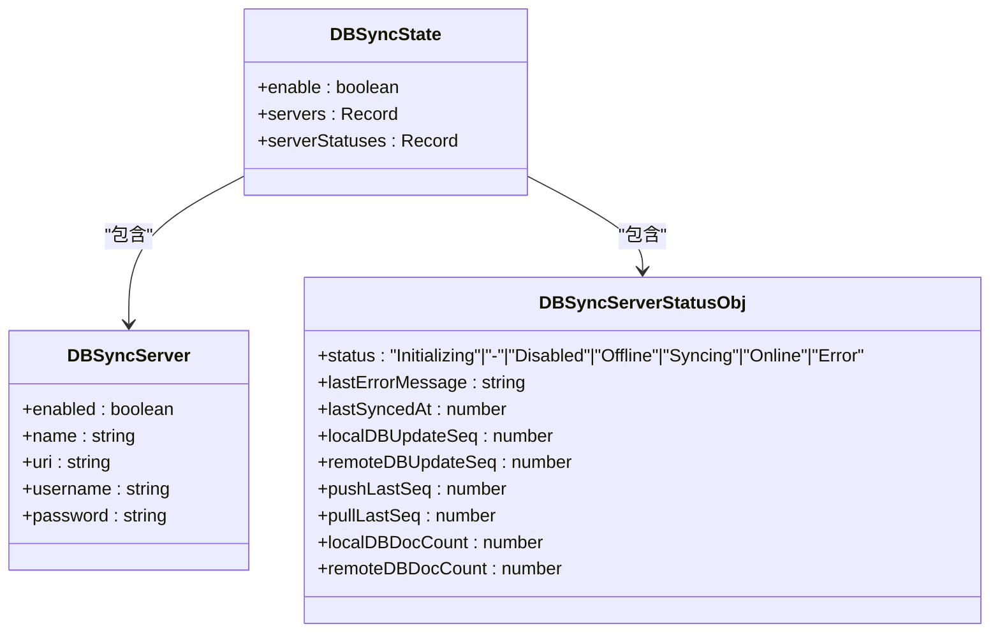
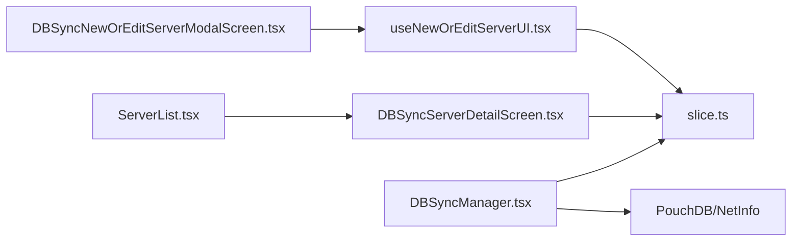

# 服务器管理

<cite>
**本文引用的文件**
- [DBSyncScreen.tsx](file://App/app/features/db-sync/screens/DBSyncScreen.tsx)
- [DBSyncNewOrEditServerModalScreen.tsx](file://App/app/features/db-sync/screens/DBSyncNewOrEditServerModalScreen.tsx)
- [DBSyncServerDetailScreen.tsx](file://App/app/features/db-sync/screens/DBSyncServerDetailScreen.tsx)
- [ServerList.tsx](file://App/app/features/db-sync/components/ServerList.tsx)
- [useNewOrEditServerUI.tsx](file://App/app/features/db-sync/hooks/useNewOrEditServerUI.tsx)
- [DBSyncManager.tsx](file://App/app/features/db-sync/DBSyncManager.tsx)
- [slice.ts](file://App/app/features/db-sync/slice.ts)
</cite>

## 目录
1. [简介](#简介)
2. [项目结构](#项目结构)
3. [核心组件](#核心组件)
4. [架构总览](#架构总览)
5. [详细组件分析](#详细组件分析)
6. [依赖关系分析](#依赖关系分析)
7. [性能与可用性考量](#性能与可用性考量)
8. [故障排查指南](#故障排查指南)
9. [结论](#结论)
10. [附录：服务器配置API使用指南](#附录服务器配置api使用指南)

## 简介
本文件面向开发者，系统化梳理 Inventory 应用中“数据库同步（DB Sync）”模块的服务器管理能力，覆盖以下目标：
- 展示与管理同步服务器的用户界面：服务器列表、新增/编辑服务器、服务器详情页
- 新增/编辑服务器表单的字段与校验：名称、URI、用户名、密码、连接测试
- 服务器详情页的功能：状态展示、最后同步时间、错误信息、启用/禁用、删除、日志查看、高级状态（推送/拉取序列）
- 后端同步管理器：网络状态感知、认证远程数据库、启动/轮询同步、进度上报与状态更新
- 服务器配置API：Redux Slice 提供的创建、更新、删除、状态维护等接口与数据模型

## 项目结构
围绕“服务器管理”的关键文件组织如下：
- 屏幕层
  - DBSyncScreen.tsx：同步主屏，包含开关、服务器列表、新增按钮、日志入口
  - DBSyncNewOrEditServerModalScreen.tsx：新增/编辑服务器模态屏，集成表单与保存逻辑
  - DBSyncServerDetailScreen.tsx：服务器详情页，展示状态、最后同步、错误、启用/禁用、删除、日志入口、高级状态
- 组件层
  - ServerList.tsx：按名称排序的服务器列表，支持点击跳转详情
- 钩子层
  - useNewOrEditServerUI.tsx：封装表单状态、校验、保存、离开确认、连接测试
- 管理器与状态
  - DBSyncManager.tsx：监听网络状态、认证远程数据库、启动/轮询同步、事件处理与状态上报
  - slice.ts：定义服务器数据模型、状态枚举、Redux Actions/Selectors、敏感信息脱敏策略

图表来源
- [DBSyncScreen.tsx](file://App/app/features/db-sync/screens/DBSyncScreen.tsx#L1-L92)
- [DBSyncNewOrEditServerModalScreen.tsx](file://App/app/features/db-sync/screens/DBSyncNewOrEditServerModalScreen.tsx#L1-L61)
- [DBSyncServerDetailScreen.tsx](file://App/app/features/db-sync/screens/DBSyncServerDetailScreen.tsx#L1-L290)
- [ServerList.tsx](file://App/app/features/db-sync/components/ServerList.tsx#L1-L82)
- [useNewOrEditServerUI.tsx](file://App/app/features/db-sync/hooks/useNewOrEditServerUI.tsx#L1-L337)
- [DBSyncManager.tsx](file://App/app/features/db-sync/DBSyncManager.tsx#L1-L743)
- [slice.ts](file://App/app/features/db-sync/slice.ts#L1-L348)

章节来源
- [DBSyncScreen.tsx](file://App/app/features/db-sync/screens/DBSyncScreen.tsx#L1-L92)
- [DBSyncNewOrEditServerModalScreen.tsx](file://App/app/features/db-sync/screens/DBSyncNewOrEditServerModalScreen.tsx#L1-L61)
- [DBSyncServerDetailScreen.tsx](file://App/app/features/db-sync/screens/DBSyncServerDetailScreen.tsx#L1-L290)
- [ServerList.tsx](file://App/app/features/db-sync/components/ServerList.tsx#L1-L82)
- [useNewOrEditServerUI.tsx](file://App/app/features/db-sync/hooks/useNewOrEditServerUI.tsx#L1-L337)
- [DBSyncManager.tsx](file://App/app/features/db-sync/DBSyncManager.tsx#L1-L743)
- [slice.ts](file://App/app/features/db-sync/slice.ts#L1-L348)

## 核心组件
- 服务器列表组件：按名称排序显示服务器，展示状态与最近同步时间，支持点击进入详情
- 新增/编辑服务器表单：包含服务器名称、URI、用户名、密码；支持连接测试；保存时进行必填与格式校验
- 服务器详情页：展示状态、最后同步时间（可切换“相对时间/本地时间/Unix”）、错误信息、启用/禁用、删除、日志入口、高级状态（推送/拉取序列）
- 同步管理器：根据网络状态与服务器启用状态，认证远程数据库并启动同步；在同步过程中持续上报进度与状态
- Redux Slice：定义服务器数据模型、状态枚举、Actions/Selectors，并对敏感信息进行脱敏持久化

章节来源
- [ServerList.tsx](file://App/app/features/db-sync/components/ServerList.tsx#L1-L82)
- [useNewOrEditServerUI.tsx](file://App/app/features/db-sync/hooks/useNewOrEditServerUI.tsx#L1-L337)
- [DBSyncServerDetailScreen.tsx](file://App/app/features/db-sync/screens/DBSyncServerDetailScreen.tsx#L1-L290)
- [DBSyncManager.tsx](file://App/app/features/db-sync/DBSyncManager.tsx#L1-L743)
- [slice.ts](file://App/app/features/db-sync/slice.ts#L1-L348)

## 架构总览
下图展示从用户操作到状态更新与同步执行的关键路径。

图表来源
- [DBSyncScreen.tsx](file://App/app/features/db-sync/screens/DBSyncScreen.tsx#L1-L92)
- [ServerList.tsx](file://App/app/features/db-sync/components/ServerList.tsx#L1-L82)
- [DBSyncServerDetailScreen.tsx](file://App/app/features/db-sync/screens/DBSyncServerDetailScreen.tsx#L1-L290)
- [DBSyncNewOrEditServerModalScreen.tsx](file://App/app/features/db-sync/screens/DBSyncNewOrEditServerModalScreen.tsx#L1-L61)
- [useNewOrEditServerUI.tsx](file://App/app/features/db-sync/hooks/useNewOrEditServerUI.tsx#L1-L337)
- [DBSyncManager.tsx](file://App/app/features/db-sync/DBSyncManager.tsx#L1-L743)
- [slice.ts](file://App/app/features/db-sync/slice.ts#L1-L348)

## 详细组件分析

### 服务器列表展示与交互（ServerList.tsx）
- 功能要点
  - 读取 Redux 中的服务器集合与状态集合
  - 按名称排序渲染列表项
  - 列表项右侧显示状态与“最近同步”时间（使用相对时间组件）
  - 支持点击进入详情页（通过回调传递 serverId）

图表来源
- [ServerList.tsx](file://App/app/features/db-sync/components/ServerList.tsx#L1-L82)

章节来源
- [ServerList.tsx](file://App/app/features/db-sync/components/ServerList.tsx#L1-L82)

### 新增/编辑服务器表单（DBSyncNewOrEditServerModalScreen.tsx + useNewOrEditServerUI.tsx）
- 表单字段与行为
  - 字段：服务器名称、URI、用户名、密码
  - 校验规则（前端即时校验）
    - 名称必填
    - URI 必须以 http:// 或 https:// 开头
    - 用户名必填
    - 密码必填
  - 连接测试
    - 使用 PouchDB 与 pouchdb-authentication 插件
    - 登录后尝试访问远程数据库的 allDocs 接口进行连通性验证
    - 测试期间禁用“测试连接”按钮，避免并发
  - 保存逻辑
    - 新增：dispatch 创建服务器
    - 编辑：dispatch 更新服务器
    - 保存成功后关闭模态
  - 离开确认
    - 若存在未保存更改，弹窗确认是否放弃

图表来源
- [DBSyncNewOrEditServerModalScreen.tsx](file://App/app/features/db-sync/screens/DBSyncNewOrEditServerModalScreen.tsx#L1-L61)
- [useNewOrEditServerUI.tsx](file://App/app/features/db-sync/hooks/useNewOrEditServerUI.tsx#L1-L337)

章节来源
- [DBSyncNewOrEditServerModalScreen.tsx](file://App/app/features/db-sync/screens/DBSyncNewOrEditServerModalScreen.tsx#L1-L61)
- [useNewOrEditServerUI.tsx](file://App/app/features/db-sync/hooks/useNewOrEditServerUI.tsx#L1-L337)

### 服务器详情页（DBSyncServerDetailScreen.tsx）
- 展示内容
  - 状态、最后同步时间（支持三种显示模式切换）
  - 最后错误信息（若存在）
  - 服务器信息：URI、用户名
  - 启用/禁用开关
  - 编辑/删除按钮（删除前二次确认）
  - 日志入口（按模块与函数过滤）
  - 高级状态：显示推送/拉取序列与本地/远端文档计数
- 交互
  - 点击最后同步时间可循环切换显示类型
  - 点击“显示高级状态”展开更多技术指标

图表来源
- [DBSyncServerDetailScreen.tsx](file://App/app/features/db-sync/screens/DBSyncServerDetailScreen.tsx#L1-L290)
- [DBSyncManager.tsx](file://App/app/features/db-sync/DBSyncManager.tsx#L1-L743)
- [slice.ts](file://App/app/features/db-sync/slice.ts#L1-L348)

章节来源
- [DBSyncServerDetailScreen.tsx](file://App/app/features/db-sync/screens/DBSyncServerDetailScreen.tsx#L1-L290)

### 同步管理器（DBSyncManager.tsx）
- 网络状态监听：NetInfo 获取连接状态、类型与是否昂贵网络
- 远程数据库认证与连通性检查：基于 PouchDB 的认证与 info 查询
- 同步流程
  - 启动阶段：先同步主数据，再同步图片，最后进入实时双向同步
  - 实时同步：根据 push/pull 的 last_seq 与本地/远端 update_seq 判断是否完成
  - 进度上报：每秒最多一次地批量上报进度，避免频繁更新
  - 错误处理：捕获 HTTP 错误与网络异常，更新状态与错误消息
- 状态机
  - 初始化、离线、禁用、同步中、在线、错误
  - 依据网络状态与服务器启用状态动态调整

图表来源
- [DBSyncManager.tsx](file://App/app/features/db-sync/DBSyncManager.tsx#L1-L743)

章节来源
- [DBSyncManager.tsx](file://App/app/features/db-sync/DBSyncManager.tsx#L1-L743)

### Redux 数据模型与API（slice.ts）
- 数据模型
  - 服务器：enabled、name、uri、username、password
  - 服务器状态对象：status、lastErrorMessage、lastSyncedAt、localDBUpdateSeq、remoteDBUpdateSeq、pushLastSeq、pullLastSeq、localDBDocCount、remoteDBDocCount
- 关键 Actions
  - 创建/更新/删除服务器
  - 设置/更新服务器状态、最后错误消息
  - 更新同步进度、更新最后同步时间
  - 全局更新所有服务器状态
- 脱敏与重水合
  - 持久化时仅保留必要字段，敏感字段（如密码）参与脱敏
  - 重水合时确保每个服务器具备初始完整状态

图表来源
- [slice.ts](file://App/app/features/db-sync/slice.ts#L1-L348)

章节来源
- [slice.ts](file://App/app/features/db-sync/slice.ts#L1-L348)

## 依赖关系分析
- 屏幕层依赖组件层与钩子层
  - DBSyncScreen.tsx 依赖 ServerList.tsx
  - DBSyncNewOrEditServerModalScreen.tsx 依赖 useNewOrEditServerUI.tsx
  - DBSyncServerDetailScreen.tsx 依赖 Redux 状态与日志导航
- 管理器依赖 Redux 状态与数据库上下文
  - DBSyncManager.tsx 依赖 selectors 读取服务器与状态，dispatch 更新状态
- 表单与管理器共同依赖 Redux Slice 的 Actions
  - useNewOrEditServerUI.tsx 通过 dispatch 创建/更新服务器
  - DBSyncManager.tsx 通过 dispatch 更新状态与进度

图表来源
- [ServerList.tsx](file://App/app/features/db-sync/components/ServerList.tsx#L1-L82)
- [DBSyncServerDetailScreen.tsx](file://App/app/features/db-sync/screens/DBSyncServerDetailScreen.tsx#L1-L290)
- [DBSyncNewOrEditServerModalScreen.tsx](file://App/app/features/db-sync/screens/DBSyncNewOrEditServerModalScreen.tsx#L1-L61)
- [useNewOrEditServerUI.tsx](file://App/app/features/db-sync/hooks/useNewOrEditServerUI.tsx#L1-L337)
- [DBSyncManager.tsx](file://App/app/features/db-sync/DBSyncManager.tsx#L1-L743)
- [slice.ts](file://App/app/features/db-sync/slice.ts#L1-L348)

章节来源
- [DBSyncScreen.tsx](file://App/app/features/db-sync/screens/DBSyncScreen.tsx#L1-L92)
- [DBSyncNewOrEditServerModalScreen.tsx](file://App/app/features/db-sync/screens/DBSyncNewOrEditServerModalScreen.tsx#L1-L61)
- [DBSyncServerDetailScreen.tsx](file://App/app/features/db-sync/screens/DBSyncServerDetailScreen.tsx#L1-L290)
- [ServerList.tsx](file://App/app/features/db-sync/components/ServerList.tsx#L1-L82)
- [useNewOrEditServerUI.tsx](file://App/app/features/db-sync/hooks/useNewOrEditServerUI.tsx#L1-L337)
- [DBSyncManager.tsx](file://App/app/features/db-sync/DBSyncManager.tsx#L1-L743)
- [slice.ts](file://App/app/features/db-sync/slice.ts#L1-L348)

## 性能与可用性考量
- 连接测试
  - 使用 PouchDB 与认证插件进行最小化连通性验证，避免阻塞主线程
  - 测试期间禁用按钮，防止重复触发
- 同步进度节流
  - 每秒最多一次上报进度，减少 UI 与 Redux 的更新频率
- 网络感知
  - 监听 NetInfo 变化，自动调整服务器状态（离线/初始化/在线）
- UI 体验
  - 服务器列表按名称排序，便于查找
  - 详情页支持最后同步时间多种显示方式，满足不同用户偏好
  - 删除前二次确认，降低误操作风险

[本节为通用建议，不直接分析具体文件]

## 故障排查指南
- 连接测试失败
  - 检查 URI 是否以 http:// 或 https:// 开头
  - 确认用户名与密码正确
  - 查看“最后错误消息”或“日志”定位具体错误
- 同步状态长时间停留在“同步中”
  - 检查网络是否稳定
  - 查看推送/拉取序列与本地/远端文档计数，判断是否卡在某个批次
- 服务器被标记为“错误”
  - 查看错误消息，常见原因包括认证失败、HTTP 错误、网络超时
  - 在“日志”中筛选模块为 DBSyncManager，按 function 过滤具体服务器 ID
- 删除服务器后仍显示
  - 确认 Redux 中已移除对应服务器与状态条目
  - 刷新详情页或重启应用后再次确认

章节来源
- [DBSyncServerDetailScreen.tsx](file://App/app/features/db-sync/screens/DBSyncServerDetailScreen.tsx#L1-L290)
- [DBSyncManager.tsx](file://App/app/features/db-sync/DBSyncManager.tsx#L1-L743)

## 结论
该模块通过清晰的屏幕/组件/钩子/管理器/状态分层，提供了完整的服务器管理能力：从列表浏览、表单校验与连接测试，到详情页的状态监控与日志查看，再到后台的网络感知与同步流程控制。Redux Slice 明确的数据模型与脱敏策略保证了安全性与一致性。整体设计易于扩展，后续可在 SSL 配置、多协议支持、更细粒度的错误分类等方面继续完善。

[本节为总结，不直接分析具体文件]

## 附录：服务器配置API使用指南

- 数据模型
  - 服务器对象：包含 enabled、name、uri、username、password
  - 服务器状态对象：包含 status、lastErrorMessage、lastSyncedAt、localDBUpdateSeq、remoteDBUpdateSeq、pushLastSeq、pullLastSeq、localDBDocCount、remoteDBDocCount

- 关键 Actions（Redux）
  - 创建服务器：dispatch 创建服务器（传入服务器可编辑数据）
  - 更新服务器：dispatch 更新服务器（传入 [id, 部分数据]）
  - 删除服务器：dispatch 删除服务器（传入 id）
  - 设置/更新服务器状态：dispatch 更新服务器状态（传入 [id, 状态值]）
  - 设置最后错误消息：dispatch 设置服务器最后错误消息（传入 [id, message]）
  - 更新同步进度：dispatch 更新同步进度（传入 [id, 进度对象]）
  - 更新最后同步时间：dispatch 更新最后同步时间（传入 [id, 时间戳]）
  - 全局更新所有服务器状态：dispatch 更新全部服务器状态（传入 状态值）

- 安全存储与脱敏
  - 持久化时仅保留必要字段，密码等敏感信息参与脱敏
  - 重水合时确保每个服务器具备初始完整状态，避免缺失字段导致异常

- 连接测试实现
  - 使用 PouchDB 与认证插件登录远程数据库
  - 登录后调用 allDocs 进行最小化连通性验证
  - 失败时设置错误消息并提示用户

- 验证规则（前端）
  - 名称必填
  - URI 必须以 http:// 或 https:// 开头
  - 用户名必填
  - 密码必填

- 状态机与日志
  - 状态包括：初始化、禁用、离线、同步中、在线、错误
  - 日志按模块（DBSyncManager）与函数（服务器 id）过滤，便于定位问题

章节来源
- [slice.ts](file://App/app/features/db-sync/slice.ts#L1-L348)
- [useNewOrEditServerUI.tsx](file://App/app/features/db-sync/hooks/useNewOrEditServerUI.tsx#L1-L337)
- [DBSyncManager.tsx](file://App/app/features/db-sync/DBSyncManager.tsx#L1-L743)