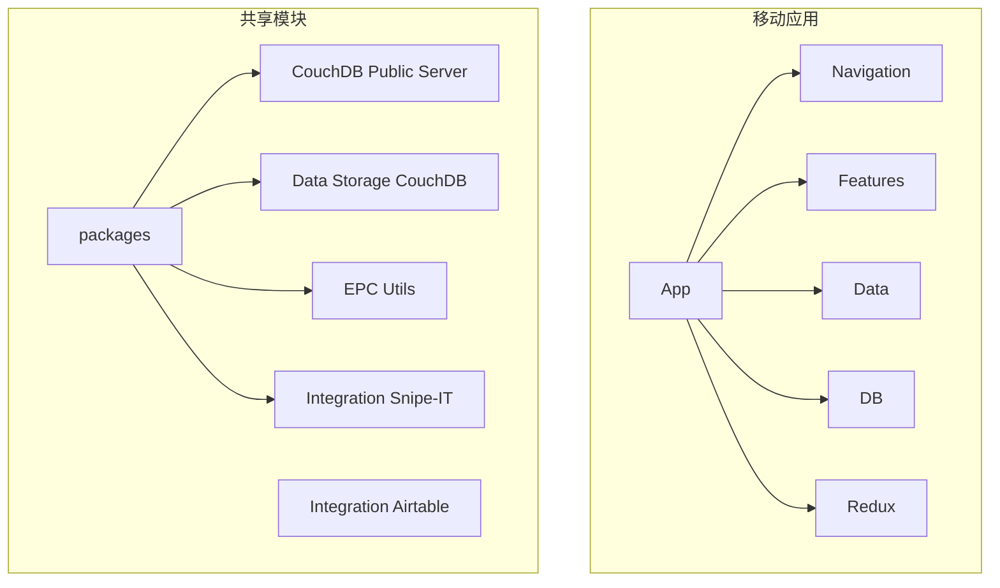
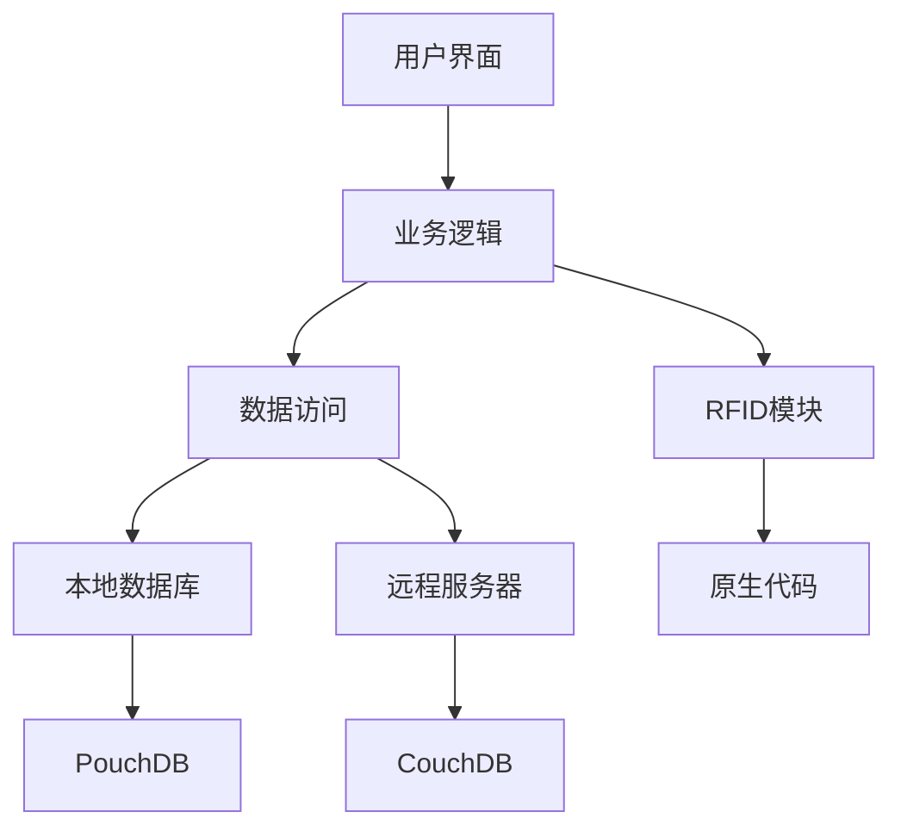
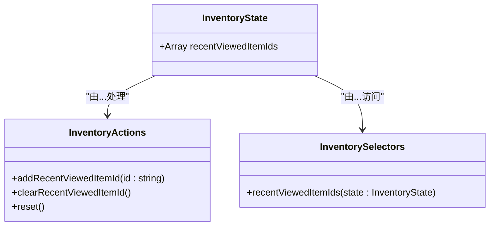
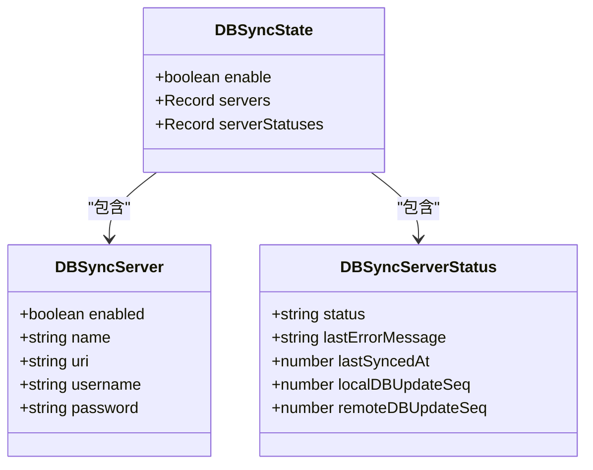
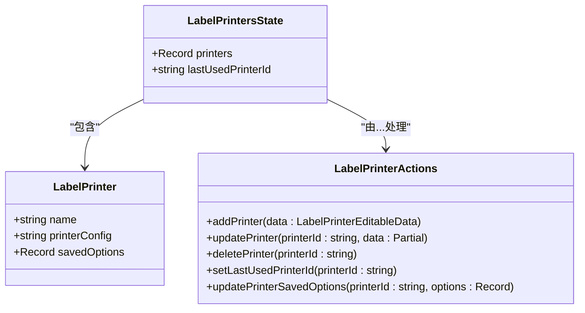
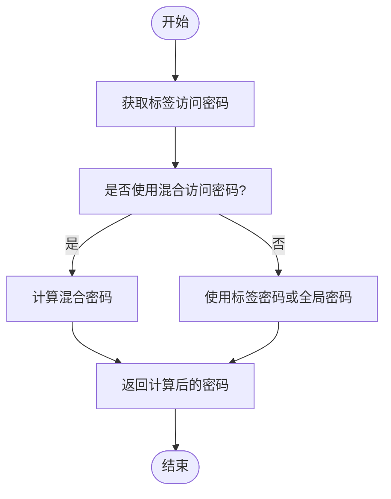
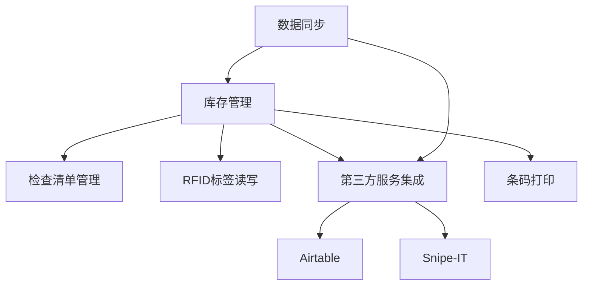

# 核心功能模块

<cite>
**本文档中引用的文件**  
- [App.tsx](file://App/app/App.tsx)
- [MainStack.tsx](file://App/app/navigation/MainStack.tsx)
- [schema.ts](file://App/app/data/schema.ts)
- [inventory/slice.ts](file://App/app/features/inventory/slice.ts)
- [db-sync/slice.ts](file://App/app/features/db-sync/slice.ts)
- [integrations/slice.ts](file://App/app/features/integrations/slice.ts)
- [label-printers/slice.ts](file://App/app/features/label-printers/slice.ts)
- [rfid/utils.ts](file://App/app/features/rfid/utils.ts)
</cite>

## 目录
1. [简介](#简介)
2. [项目结构](#项目结构)
3. [核心功能模块](#核心功能模块)
4. [架构概览](#架构概览)
5. [详细组件分析](#详细组件分析)
6. [依赖关系分析](#依赖关系分析)
7. [性能考虑](#性能考虑)
8. [故障排除指南](#故障排除指南)
9. [结论](#结论)

## 简介
本文件旨在为库存管理应用的核心功能模块提供全面的文档。该应用是一个基于RFID技术的资产管理系统，适用于家庭和企业环境。通过RFID技术，用户可以轻松跟踪物品可用性、防止丢失，并在需要时快速定位物品。应用的核心功能包括库存管理（物品和集合）、检查清单管理、RFID标签读写、数据同步（CouchDB）、第三方服务集成（Airtable、Snipe-IT）以及条码打印。这些功能共同构成了一个完整的资产追踪和管理解决方案。

## 项目结构
该项目采用模块化架构，主要分为以下几个部分：
- `App/`：React Native构建的iOS/Android移动应用
- `Data/`：数据模式和数据逻辑
- `packages/`：共享模块，包括CouchDB公共服务器、数据存储CouchDB、EPC工具、Airtable集成和Snipe-IT集成

移动应用部分采用React Native框架开发，结合TypeScript语言，实现了跨平台兼容性。应用使用Redux进行状态管理，PouchDB作为本地数据库，支持离线操作和数据同步。RFID功能通过原生模块（Java和Objective-C）实现，处理与RFID设备的UART/蓝牙通信。



**图示来源**  
- [App.tsx](file://App/app/App.tsx)
- [MainStack.tsx](file://App/app/navigation/MainStack.tsx)

**本节来源**  
- [App.tsx](file://App/app/App.tsx)
- [MainStack.tsx](file://App/app/navigation/MainStack.tsx)

## 核心功能模块
本应用提供了多个核心功能模块，每个模块都针对特定的资产管理需求设计。这些模块包括库存管理、检查清单管理、RFID标签读写、数据同步、第三方服务集成和条码打印。这些功能相互关联，共同构成了一个完整的资产管理系统。

**本节来源**  
- [App.tsx](file://App/app/App.tsx)
- [MainStack.tsx](file://App/app/navigation/MainStack.tsx)

## 架构概览
应用的整体架构采用分层设计，从用户界面到数据存储形成了清晰的层次结构。最上层是用户界面，通过React Native组件实现跨平台UI。中间层是业务逻辑层，包含各种功能模块的实现。底层是数据访问层，负责与本地数据库和远程服务器的交互。



**图示来源**  
- [App.tsx](file://App/app/App.tsx)
- [db-sync/slice.ts](file://App/app/features/db-sync/slice.ts)

## 详细组件分析
### 库存管理组件分析
库存管理是应用的核心功能之一，允许用户创建和管理物品及其集合。用户可以添加物品的详细信息，如名称、描述、数量、位置等，并将相关物品组织成集合。该功能通过Redux状态管理，确保数据的一致性和可预测性。



**图示来源**  
- [inventory/slice.ts](file://App/app/features/inventory/slice.ts)

**本节来源**  
- [inventory/slice.ts](file://App/app/features/inventory/slice.ts)

### 数据同步组件分析
数据同步功能允许用户将本地数据与远程CouchDB服务器同步，确保数据在不同设备间保持一致。用户可以配置多个同步服务器，每个服务器都有独立的连接设置和同步状态。



**图示来源**  
- [db-sync/slice.ts](file://App/app/features/db-sync/slice.ts)

**本节来源**  
- [db-sync/slice.ts](file://App/app/features/db-sync/slice.ts)

### 集成组件分析
集成功能允许应用与第三方服务（如Airtable和Snipe-IT）进行数据交换。用户可以配置集成设置，包括API密钥和其他认证信息，实现数据的双向同步。

```mermaid
classDiagram
class Integration {
+{ [key : string] : string } secrets
}
class IntegrationsState {
+Record<string, Integration> integrations
}
class IntegrationActions {
+updateSecrets(integrationId : string, data : { [key : string] : string })
+deleteIntegrationData(integrationId : string)
}
IntegrationsState --> Integration : "包含"
IntegrationsState --> IntegrationActions : "由...处理"
```

**图示来源**  
- [integrations/slice.ts](file://App/app/features/integrations/slice.ts)

**本节来源**  
- [integrations/slice.ts](file://App/app/features/integrations/slice.ts)

### 标签打印机组件分析
标签打印机功能允许用户配置和使用标签打印机，为物品打印条码或RFID标签。用户可以保存打印机配置和打印选项，方便重复使用。



**图示来源**  
- [label-printers/slice.ts](file://App/app/features/label-printers/slice.ts)

**本节来源**  
- [label-printers/slice.ts](file://App/app/features/label-printers/slice.ts)

### RFID组件分析
RFID功能通过原生模块实现，支持与RFID UHF读写器的通信。该功能允许用户读取和写入RFID标签，实现快速的资产盘点和定位。



**图示来源**  
- [rfid/utils.ts](file://App/app/features/rfid/utils.ts)

**本节来源**  
- [rfid/utils.ts](file://App/app/features/rfid/utils.ts)

## 依赖关系分析
各功能模块之间存在紧密的依赖关系。库存数据是其他功能的基础，检查清单、RFID操作和第三方集成都依赖于库存数据。数据同步模块为所有数据操作提供远程备份和多设备同步能力。第三方集成模块扩展了应用的功能，使其能够与其他系统无缝协作。



**图示来源**  
- [MainStack.tsx](file://App/app/navigation/MainStack.tsx)
- [schema.ts](file://App/app/data/schema.ts)

**本节来源**  
- [MainStack.tsx](file://App/app/navigation/MainStack.tsx)
- [schema.ts](file://App/app/data/schema.ts)

## 性能考虑
应用在设计时充分考虑了性能因素。使用PouchDB作为本地数据库，支持离线操作和快速数据访问。数据同步采用增量同步策略，只传输变化的数据，减少网络流量和同步时间。RFID操作通过原生代码实现，确保与硬件设备的高效通信。Redux状态管理采用模块化设计，避免不必要的状态更新，提高UI渲染性能。

## 故障排除指南
当遇到问题时，用户可以检查以下方面：
1. 确认RFID设备已正确连接并开启
2. 检查数据同步配置是否正确，包括服务器地址、用户名和密码
3. 验证第三方集成的API密钥是否有效
4. 确认标签打印机配置正确且设备在线

开发者可以使用应用内置的开发者工具查看日志、检查数据库状态和测试RFID功能，帮助诊断和解决问题。

**本节来源**  
- [App.tsx](file://App/app/App.tsx)
- [db-sync/slice.ts](file://App/app/features/db-sync/slice.ts)

## 结论
本应用通过整合库存管理、检查清单、RFID技术、数据同步和第三方集成等多个功能模块，为用户提供了一个全面的资产管理系统。各模块之间紧密协作，形成了一个高效、可靠的解决方案。未来可以进一步优化用户界面，增加更多第三方服务集成，并改进RFID读写的准确性和速度。