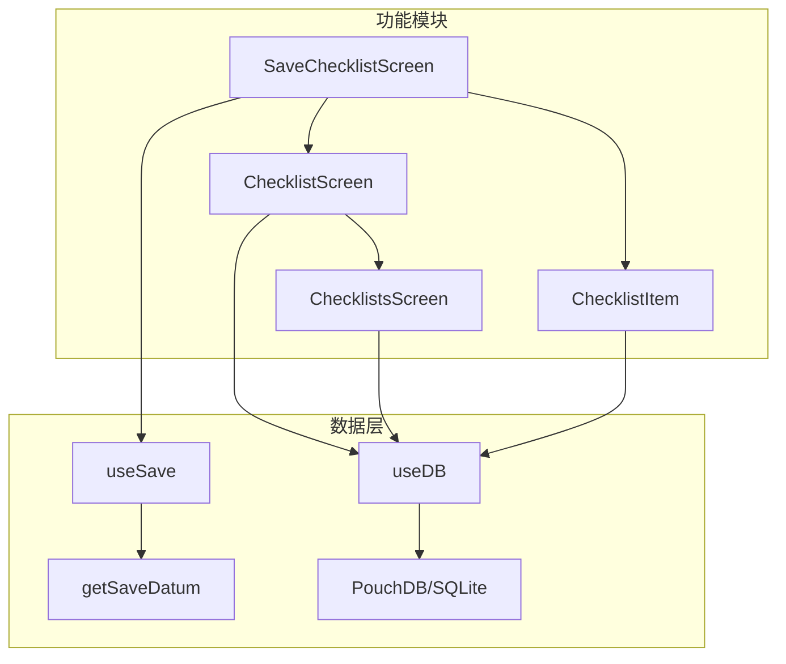
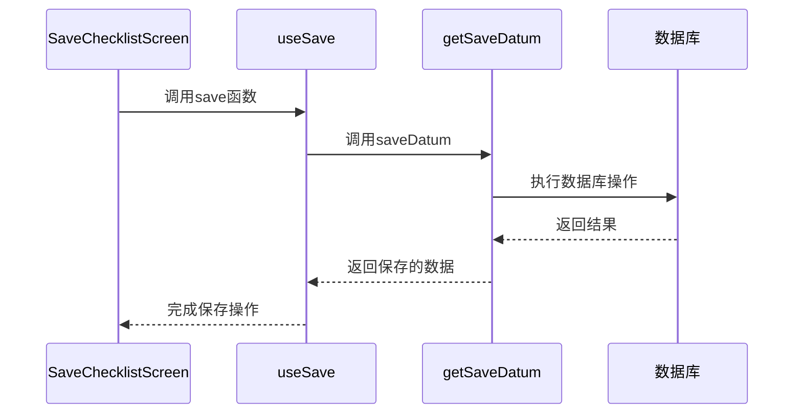
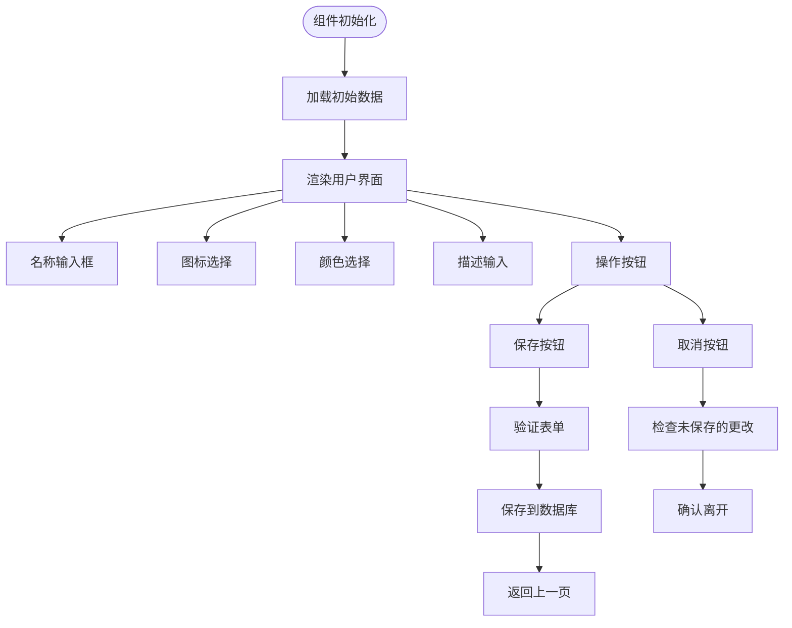
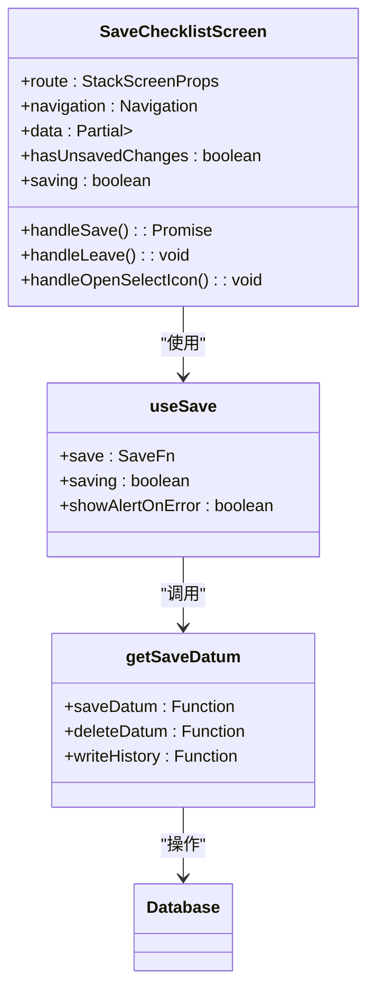
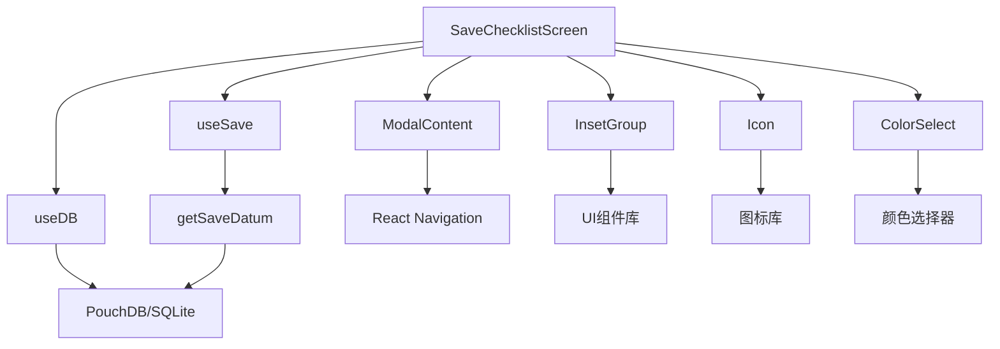

# 创建与编辑检查清单

<cite>
**本文档引用的文件**  
- [SaveChecklistScreen.tsx](file://App/app/features/inventory/screens/SaveChecklistScreen.tsx)
- [ChecklistScreen.tsx](file://App/app/features/inventory/screens/ChecklistScreen.tsx)
- [ChecklistsScreen.tsx](file://App/app/features/inventory/screens/ChecklistsScreen.tsx)
- [useSave.ts](file://App/app/data/hooks/useSave.ts)
- [getSaveDatum.ts](file://packages/data-storage-couchdb/lib/functions/getSaveDatum.ts)
- [useDB.ts](file://App/app/db/hooks/useDB.ts)
- [ChecklistItem.tsx](file://App/app/features/inventory/components/ChecklistItem.tsx)
</cite>

## 目录
1. [简介](#简介)
2. [项目结构](#项目结构)
3. [核心组件](#核心组件)
4. [架构概述](#架构概述)
5. [详细组件分析](#详细组件分析)
6. [依赖分析](#依赖分析)
7. [性能考虑](#性能考虑)
8. [故障排除指南](#故障排除指南)
9. [结论](#结论)

## 简介
本文档详细说明了库存管理系统中创建与编辑检查清单功能的实现机制。重点分析了`SaveChecklistScreen.tsx`组件的用户界面布局、交互逻辑、表单验证机制以及数据持久化流程。文档还解释了如何通过Redux action调度器处理保存操作，并说明了与库存物品的关联方式。

## 项目结构
检查清单功能主要位于`App/app/features/inventory/`目录下，包含屏幕组件、业务逻辑和状态管理。该功能依赖于数据存储库和Redux状态管理，实现了完整的CRUD操作。

**图示来源**  
- [SaveChecklistScreen.tsx](file://App/app/features/inventory/screens/SaveChecklistScreen.tsx)
- [useSave.ts](file://App/app/data/hooks/useSave.ts)
- [useDB.ts](file://App/app/db/hooks/useDB.ts)

**章节来源**  
- [SaveChecklistScreen.tsx](file://App/app/features/inventory/screens/SaveChecklistScreen.tsx)

## 核心组件
`SaveChecklistScreen`组件是创建和编辑检查清单的核心界面，提供了名称、描述、图标和颜色的配置功能。该组件通过模态对话框形式呈现，支持新建和编辑两种模式。

**章节来源**  
- [SaveChecklistScreen.tsx](file://App/app/features/inventory/screens/SaveChecklistScreen.tsx#L5-L246)

## 架构概述
检查清单功能采用分层架构，前端组件通过hooks与数据层交互，数据层通过统一接口与本地数据库通信。状态管理采用Redux Toolkit，确保状态的一致性和可预测性。

**图示来源**  
- [useSave.ts](file://App/app/data/hooks/useSave.ts#L43-L113)
- [getSaveDatum.ts](file://packages/data-storage-couchdb/lib/functions/getSaveDatum.ts#L78-L125)

## 详细组件分析

### SaveChecklistScreen分析
`SaveChecklistScreen`组件提供了完整的检查清单创建和编辑界面，包含以下主要功能：

#### 用户界面布局
组件采用模态对话框布局，包含标题栏、滚动视图和多个输入区域。界面分为基本信息区（名称、图标）和描述区，通过InsetGroup组件实现美观的分组效果。

**图示来源**  
- [SaveChecklistScreen.tsx](file://App/app/features/inventory/screens/SaveChecklistScreen.tsx#L77-L242)

#### 交互逻辑
组件实现了丰富的交互逻辑，包括：
- 未保存更改的提示
- 图标选择的导航
- 表单数据的实时更新
- 删除现有清单的确认对话框

当用户尝试离开未保存的页面时，系统会弹出确认对话框，防止意外丢失数据。

**章节来源**  
- [SaveChecklistScreen.tsx](file://App/app/features/inventory/screens/SaveChecklistScreen.tsx#L49-L72)

### 数据持久化流程
检查清单的数据持久化通过一系列函数调用完成，从UI层到数据库层形成完整的调用链。

#### 保存操作处理
保存操作通过`useSave` hook处理，该hook封装了错误处理和加载状态管理。当用户点击保存按钮时，系统会：

1. 设置加载状态
2. 调用`saveDatum`函数
3. 处理成功或错误状态
4. 更新UI反馈

**图示来源**  
- [SaveChecklistScreen.tsx](file://App/app/features/inventory/screens/SaveChecklistScreen.tsx)
- [useSave.ts](file://App/app/data/hooks/useSave.ts)
- [getSaveDatum.ts](file://packages/data-storage-couchdb/lib/functions/getSaveDatum.ts)

**章节来源**  
- [SaveChecklistScreen.tsx](file://App/app/features/inventory/screens/SaveChecklistScreen.tsx#L36-L47)
- [useSave.ts](file://App/app/data/hooks/useSave.ts#L54-L108)

### 表单验证机制
虽然当前代码中未显式实现表单验证，但系统通过`useSave` hook中的错误处理机制提供了基本的验证功能。当数据保存失败时，系统会显示相应的错误信息。

#### 错误状态反馈
系统通过Alert组件提供用户反馈，区分不同类型的错误：
- 验证错误：显示具体的验证消息
- 数据库错误：记录日志并可选择显示警告
- 其他错误：记录错误日志

**章节来源**  
- [useSave.ts](file://App/app/data/hooks/useSave.ts#L63-L102)

## 依赖分析
检查清单功能依赖于多个核心模块，形成了复杂的依赖关系网络。

**图示来源**  
- [SaveChecklistScreen.tsx](file://App/app/features/inventory/screens/SaveChecklistScreen.tsx)
- [useDB.ts](file://App/app/db/hooks/useDB.ts)
- [useSave.ts](file://App/app/data/hooks/useSave.ts)

**章节来源**  
- [SaveChecklistScreen.tsx](file://App/app/features/inventory/screens/SaveChecklistScreen.tsx#L1-L8)
- [useDB.ts](file://App/app/db/hooks/useDB.ts)
- [useSave.ts](file://App/app/data/hooks/useSave.ts)

## 性能考虑
检查清单功能在性能方面考虑了以下因素：
- 使用useCallback优化函数引用
- 通过useRef避免不必要的重新渲染
- 采用异步操作避免UI阻塞
- 实现加载状态提示用户体验

## 故障排除指南
当检查清单功能出现问题时，可参考以下排查步骤：

1. **保存失败**：检查数据库连接状态和数据格式
2. **界面无响应**：确认useDB hook是否正确初始化
3. **数据不一致**：检查Redux状态和数据库状态是否同步
4. **图标不显示**：验证图标名称和颜色值是否正确

**章节来源**  
- [SaveChecklistScreen.tsx](file://App/app/features/inventory/screens/SaveChecklistScreen.tsx#L42-L44)
- [useSave.ts](file://App/app/data/hooks/useSave.ts#L79-L82)

## 结论
检查清单功能通过清晰的组件分离和分层架构，实现了可靠的创建和编辑功能。系统通过Redux状态管理和本地数据库持久化，确保了数据的一致性和可靠性。未来可考虑增强表单验证机制和优化用户体验。