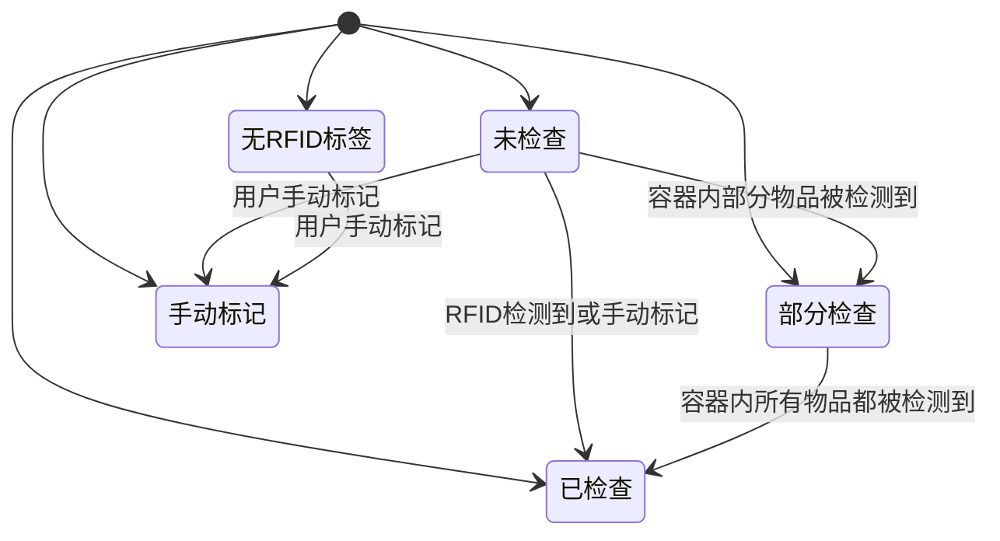
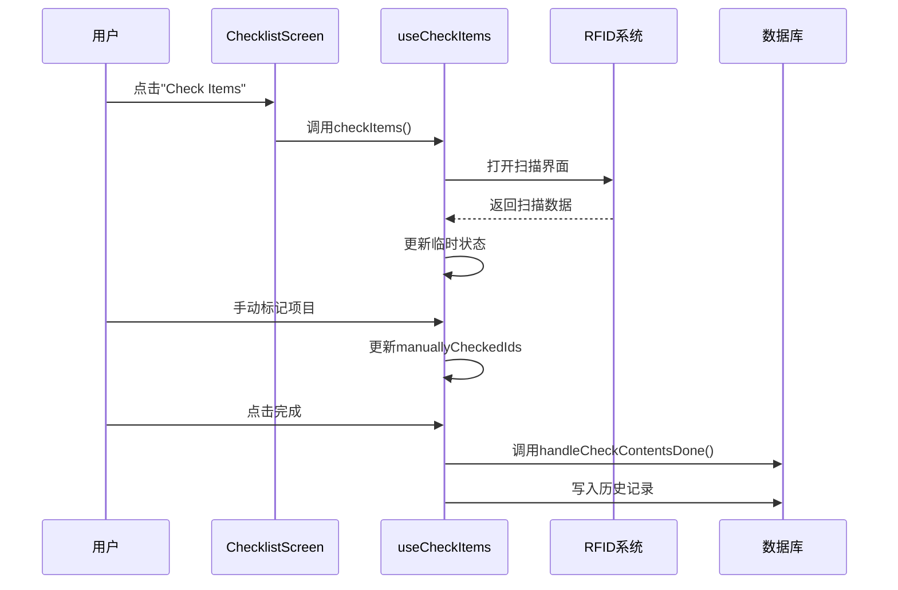
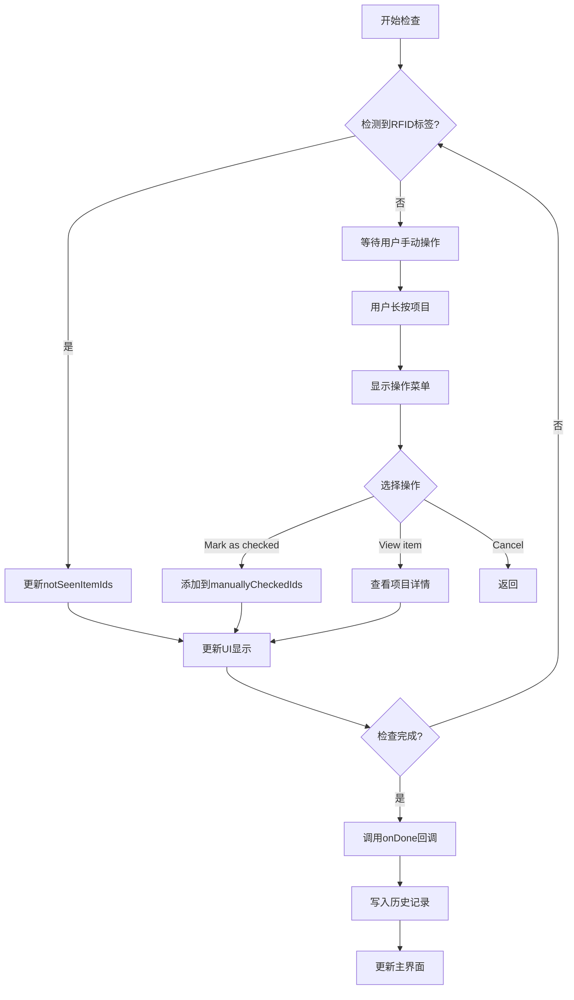

# 执行检查清单与进度管理

<cite>
**本文档引用的文件**  
- [ChecklistScreen.tsx](file://App/app/features/inventory/screens/ChecklistScreen.tsx)
- [CheckItems.tsx](file://App/app/features/inventory/components/CheckItems.tsx)
- [useCheckItems.tsx](file://App/app/features/inventory/hooks/useCheckItems.tsx)
- [ItemListItem.tsx](file://App/app/features/inventory/components/ItemListItem.tsx)
- [getChildrenItemIds.ts](file://App/app/features/inventory/utils/getChildrenItemIds.ts)
- [getSaveDatum.ts](file://Data/lib/functions/getSaveDatum.ts)
</cite>

## 目录
1. [简介](#简介)
2. [用户交互流程](#用户交互流程)
3. [状态管理与视觉反馈](#状态管理与视觉反馈)
4. [临时执行状态管理](#临时执行状态管理)
5. [进度计算与恢复功能](#进度计算与恢复功能)
6. [开发者指南](#开发者指南)

## 简介
本系统实现了完整的检查清单执行与进度管理功能，支持通过RFID扫描或手动操作来跟踪检查项的完成状态。系统采用分层架构，通过自定义Hook管理状态，组件化实现UI展示，并与数据库系统集成实现数据持久化。

## 用户交互流程

`ChecklistScreen.tsx` 是检查清单执行的主要界面，用户可以通过点击"Check Items"按钮启动检查流程。该按钮调用 `useCheckItems` Hook 中的 `handleCheckItems` 函数，打开RFID扫描界面。

在扫描界面中，用户可以通过以下方式与检查项进行交互：
1. **勾选完成状态**：长按检查项会弹出操作菜单，选择"Mark as checked"可手动标记为已完成
2. **查看项目详情**：选择"View item"可查看项目详细信息
3. **展开/收起子项目**：对于包含子项目的容器，可选择"Show contents"或"Hide contents"来展开或收起子项目列表

RFID扫描会自动检测在场的物品，并实时更新检查状态。当物品被检测到时，系统会自动将其标记为已检查。

**Section sources**
- [ChecklistScreen.tsx](file://App/app/features/inventory/screens/ChecklistScreen.tsx#L147-L151)
- [useCheckItems.tsx](file://App/app/features/inventory/hooks/useCheckItems.tsx#L67-L145)

## 状态管理与视觉反馈

`CheckItems.tsx` 组件负责管理检查项的状态和视觉反馈，采用多种状态来表示不同的完成情况：



**视觉反馈机制：**
- **复选框动画**：使用SFSymbol或MaterialCommunityIcon显示不同状态的图标
  - 已检查：绿色对勾圆圈
  - 部分检查：黄色省略号圆圈
  - 未检查：灰色问号圆圈
  - 无RFID标签：灰色信号斜杠图标
- **进度条更新**：顶部显示"X/Y Items Checked"的进度统计
- **UI重排动画**：使用LayoutAnimation实现项目重排的平滑过渡效果

状态管理采用多个useState Hook来跟踪：
- `notSeenItemIds`：记录尚未检查的项目ID集合
- `manuallyCheckedIds`：记录手动标记为已检查的项目ID集合
- `seenEpcs`：记录已检测到的EPC标签集合

**Diagram sources**
- [CheckItems.tsx](file://App/app/features/inventory/components/CheckItems.tsx#L145-L150)
- [CheckItems.tsx](file://App/app/features/inventory/components/CheckItems.tsx#L524-L557)

**Section sources**
- [CheckItems.tsx](file://App/app/features/inventory/components/CheckItems.tsx#L145-L242)
- [ItemListItem.tsx](file://App/app/features/inventory/components/ItemListItem.tsx#L390-L515)

## 临时执行状态管理

`useCheckItems.tsx` Hook 是检查流程的核心，负责管理临时执行状态并在用户保存时将结果写入历史记录。



**临时状态管理特点：**
1. **引用对象管理**：使用useRef来持久化状态引用，确保在组件重新渲染时保持状态一致性
2. **层级关系处理**：通过`dedicatedIdsMapRef`管理容器与其内容物的层级关系
3. **结果暂存**：使用`checkContentsResultSeenIdsRef`和`checkContentsResultManuallyCheckedIdsRef`暂存检查结果
4. **防重复保存**：使用`checkContentsResultSaved`标记来防止重复保存

当用户完成检查时，`handleCheckContentsDone`函数会将结果记录到控制台，并准备写入数据库。

**Diagram sources**
- [useCheckItems.tsx](file://App/app/features/inventory/hooks/useCheckItems.tsx#L45-L65)
- [useCheckItems.tsx](file://App/app/features/inventory/hooks/useCheckItems.tsx#L105-L113)

**Section sources**
- [useCheckItems.tsx](file://App/app/features/inventory/hooks/useCheckItems.tsx#L18-L179)

## 进度计算与恢复功能

系统提供了完整的进度计算和中途退出后恢复的功能。

**进度计算：**
- 通过`checkedTopLevelItemsCount` useMemo计算已检查的顶级项目数量
- 进度百分比 = 已检查项目数 / 总项目数
- 实时更新进度显示

**恢复功能：**
1. **状态重置**：当`clearScannedDataCounter`变化时，系统会重置所有状态
2. **数据持久化**：检查结果最终通过`getSaveDatum.ts`写入数据库
3. **历史记录**：系统会创建历史记录文档，包含检查时间、操作者等元数据



**Diagram sources**
- [CheckItems.tsx](file://App/app/features/inventory/components/CheckItems.tsx#L349-L364)
- [getSaveDatum.ts](file://Data/lib/functions/getSaveDatum.ts#L98-L116)

**Section sources**
- [CheckItems.tsx](file://App/app/features/inventory/components/CheckItems.tsx#L349-L364)
- [getSaveDatum.ts](file://Data/lib/functions/getSaveDatum.ts#L98-L116)

## 开发者指南

### 读取当前执行进度
```typescript
// 获取已检查项目数量
const checkedCount = useMemo(() => {
  return items.filter(item => 
    !notSeenItemIds.has(item.__id || '') &&
    !notSeenItemIds.has(`${item.__id}-some`)
  ).length;
}, [items, notSeenItemIds]);
```

### 计算完成百分比
```typescript
const completionPercentage = useMemo(() => {
  if (!items || items.length === 0) return 0;
  return (checkedCount / items.length) * 100;
}, [checkedCount, items.length]);
```

### 处理中途退出后恢复
```typescript
// 使用clearScannedDataCounter来重置状态
useEffect(() => {
  if (prevClearScannedDataCounter.current === clearScannedDataCounter) return;
  
  // 重置所有状态
  setSeenEpcs(new Set());
  setNotSeenItemIds(new Set(allIds));
  setManuallyCheckedIds({ value: new Set() });
  // ...其他状态重置
  
}, [clearScannedDataCounter, allIds]);
```

### 集成到新界面
```typescript
// 在新界面中使用useCheckItems Hook
const [handleCheckItems] = useCheckItems({
  scanName: `your-scan-name`,
  items: yourItemsArray,
  navigation: yourNavigationProp
});
```

**Section sources**
- [CheckItems.tsx](file://App/app/features/inventory/components/CheckItems.tsx#L418-L425)
- [useCheckItems.tsx](file://App/app/features/inventory/hooks/useCheckItems.tsx#L157-L177)
- [getSaveDatum.ts](file://Data/lib/functions/getSaveDatum.ts#L98-L116)