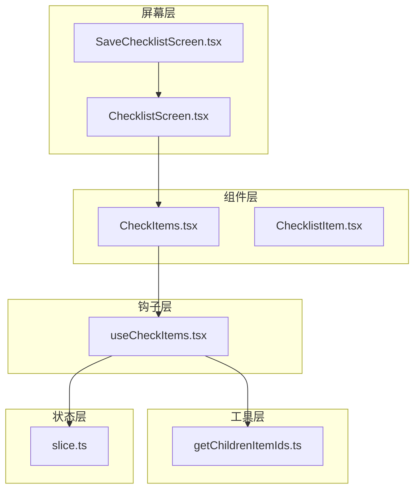
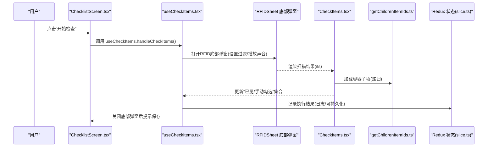
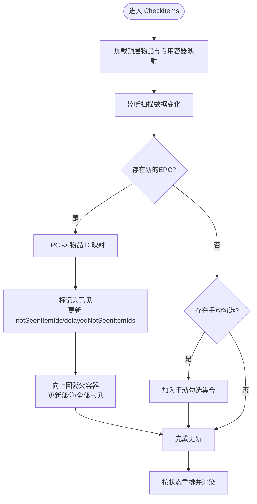
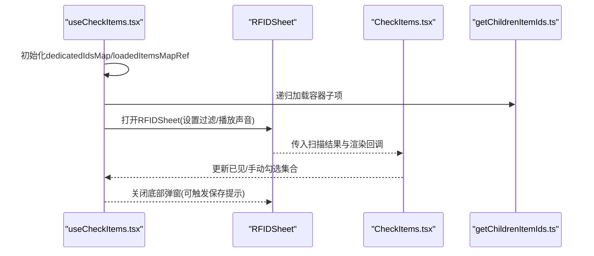
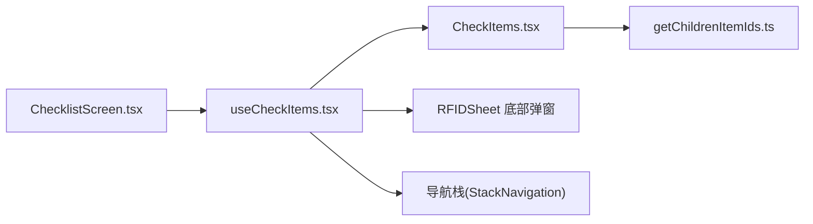

# 检查清单

<cite>
**本文引用的文件**
- [SaveChecklistScreen.tsx](file://App/app/features/inventory/screens/SaveChecklistScreen.tsx)
- [ChecklistScreen.tsx](file://App/app/features/inventory/screens/ChecklistScreen.tsx)
- [CheckItems.tsx](file://App/app/features/inventory/components/CheckItems.tsx)
- [useCheckItems.tsx](file://App/app/features/inventory/hooks/useCheckItems.tsx)
- [getChildrenItemIds.ts](file://App/app/features/inventory/utils/getChildrenItemIds.ts)
- [slice.ts](file://App/app/features/inventory/slice.ts)
- [ChecklistItem.tsx](file://App/app/features/inventory/components/ChecklistItem.tsx)
- [generated-schema.ts](file://Data/lib/generated-schema.ts)
</cite>

## 目录
1. [简介](#简介)
2. [项目结构](#项目结构)
3. [核心组件](#核心组件)
4. [架构总览](#架构总览)
5. [详细组件分析](#详细组件分析)
6. [依赖分析](#依赖分析)
7. [性能考量](#性能考量)
8. [故障排查指南](#故障排查指南)
9. [结论](#结论)
10. [附录](#附录)

## 简介
本文件系统性梳理“检查清单”功能的完整生命周期：从创建与编辑（SaveChecklistScreen.tsx），到清单项列表与执行（ChecklistScreen.tsx、CheckItems.tsx），再到进度跟踪与历史记录保存（useCheckItems.tsx）。文档还解释了清单与库存物品的关联机制（通过清单项关系），以及如何通过RFID扫描与手动勾选来跟踪进度；最后提供开发者指南，说明如何使用useCheckItems.ts钩子在代码中操作检查清单数据并与全局Redux状态交互。

## 项目结构
检查清单相关代码主要位于 App/app/features/inventory 目录下，包含屏幕、组件、钩子与工具函数：
- 屏幕层：SaveChecklistScreen.tsx（创建/编辑）、ChecklistScreen.tsx（清单执行）
- 组件层：CheckItems.tsx（执行界面与进度跟踪）、ChecklistItem.tsx（清单列表项）
- 钩子层：useCheckItems.tsx（RFID执行流程与结果收集）
- 工具层：getChildrenItemIds.ts（递归加载容器内子项）
- 状态层：slice.ts（库存模块Redux状态）

图表来源
- [SaveChecklistScreen.tsx](file://App/app/features/inventory/screens/SaveChecklistScreen.tsx#L1-L247)
- [ChecklistScreen.tsx](file://App/app/features/inventory/screens/ChecklistScreen.tsx#L1-L314)
- [CheckItems.tsx](file://App/app/features/inventory/components/CheckItems.tsx#L1-L851)
- [useCheckItems.tsx](file://App/app/features/inventory/hooks/useCheckItems.tsx#L1-L192)
- [getChildrenItemIds.ts](file://App/app/features/inventory/utils/getChildrenItemIds.ts#L1-L98)
- [slice.ts](file://App/app/features/inventory/slice.ts#L1-L53)

章节来源
- [SaveChecklistScreen.tsx](file://App/app/features/inventory/screens/SaveChecklistScreen.tsx#L1-L247)
- [ChecklistScreen.tsx](file://App/app/features/inventory/screens/ChecklistScreen.tsx#L1-L314)
- [CheckItems.tsx](file://App/app/features/inventory/components/CheckItems.tsx#L1-L851)
- [useCheckItems.tsx](file://App/app/features/inventory/hooks/useCheckItems.tsx#L1-L192)
- [getChildrenItemIds.ts](file://App/app/features/inventory/utils/getChildrenItemIds.ts#L1-L98)
- [slice.ts](file://App/app/features/inventory/slice.ts#L1-L53)

## 核心组件
- SaveChecklistScreen.tsx：用于创建或编辑“检查清单”元数据（名称、图标、颜色、描述等），当前实现为占位，未启用实际保存逻辑。
- ChecklistScreen.tsx：展示清单详情与清单项列表，提供添加/删除清单项、排序、进入执行模式等功能，当前实现为占位，未启用实际数据加载与交互。
- CheckItems.tsx：执行界面的核心组件，基于RFID扫描与手动勾选跟踪进度，支持容器展开、部分已见标记、动画重排等。
- useCheckItems.tsx：钩子封装执行流程，负责打开RFID底部弹窗、收集扫描结果、维护“已见/手动勾选”的集合、处理关闭回调与保存提示。
- getChildrenItemIds.ts：递归加载容器内子项，构建“专用容器映射”，用于执行时对容器内容进行分组与进度统计。
- slice.ts：库存模块Redux状态，提供最近查看物品ID等状态，供其他功能复用。
- ChecklistItem.tsx：清单列表项组件（旧实现），用于在清单列表中展示清单条目与简要信息。

章节来源
- [SaveChecklistScreen.tsx](file://App/app/features/inventory/screens/SaveChecklistScreen.tsx#L1-L247)
- [ChecklistScreen.tsx](file://App/app/features/inventory/screens/ChecklistScreen.tsx#L1-L314)
- [CheckItems.tsx](file://App/app/features/inventory/components/CheckItems.tsx#L1-L851)
- [useCheckItems.tsx](file://App/app/features/inventory/hooks/useCheckItems.tsx#L1-L192)
- [getChildrenItemIds.ts](file://App/app/features/inventory/utils/getChildrenItemIds.ts#L1-L98)
- [slice.ts](file://App/app/features/inventory/slice.ts#L1-L53)
- [ChecklistItem.tsx](file://App/app/features/inventory/components/ChecklistItem.tsx#L1-L82)

## 架构总览
检查清单的执行流程由屏幕层触发，通过useCheckItems钩子打开RFID底部弹窗，渲染CheckItems组件以展示扫描结果与进度，最终将“已见”和“手动勾选”的结果汇总并可选择保存。

图表来源
- [ChecklistScreen.tsx](file://App/app/features/inventory/screens/ChecklistScreen.tsx#L1-L314)
- [useCheckItems.tsx](file://App/app/features/inventory/hooks/useCheckItems.tsx#L1-L192)
- [CheckItems.tsx](file://App/app/features/inventory/components/CheckItems.tsx#L1-L851)
- [getChildrenItemIds.ts](file://App/app/features/inventory/utils/getChildrenItemIds.ts#L1-L98)
- [slice.ts](file://App/app/features/inventory/slice.ts#L1-L53)

## 详细组件分析

### 创建与编辑：SaveChecklistScreen.tsx
- 当前实现为占位，注释展示了典型字段（名称、图标、颜色、描述）与保存流程（调用数据库保存、导航返回、离开确认、删除等）。
- 开发者指南：若启用该屏幕，应使用数据库钩子与数据保存函数，结合导航参数传递初始数据与回调。

章节来源
- [SaveChecklistScreen.tsx](file://App/app/features/inventory/screens/SaveChecklistScreen.tsx#L1-L247)

### 清单执行入口：ChecklistScreen.tsx
- 当前实现为占位，注释展示了清单数据加载、清单项列表（checklistItems）加载、容器子项映射、排序、添加/删除清单项、长按移除、进入执行模式等。
- 开发者指南：启用时需使用关系数据钩子加载清单与其关联的checklistItems，再根据checklistItems映射到具体item文档，构建执行所需的数据结构。

章节来源
- [ChecklistScreen.tsx](file://App/app/features/inventory/screens/ChecklistScreen.tsx#L1-L314)

### 执行界面：CheckItems.tsx
- 功能要点
  - 基于RFID扫描结果与手动勾选更新“已见”集合（Set），并同步更新“部分已见/全部已见”的标记。
  - 支持容器展开/折叠，显示专用容器内的子项，按“部分已见/未见/已见”顺序重排。
  - 使用延迟更新与LayoutAnimation实现UI重排的平滑过渡。
  - 提供“查看物品”、“标记为已见”、“展开/收起”等操作选项。
- 数据结构与算法
  - epcItemIdMap：将EPC映射到物品ID，用于扫描命中后的状态更新。
  - notSeenItemIds/delayedNotSeenItemIds：分别用于即时与延时重排的状态集合。
  - dedicatedIdsMap：容器与其专用子项的映射，用于“部分已见/全部已见”的层级计算。
  - manuallyCheckedIds：手动勾选的ID集合，避免重复处理。
- 复杂度分析
  - 扫描处理：对新EPC进行O(1)查找与集合更新，整体O(k)（k为新增EPC数量）。
  - 容器层级更新：每次扫描可能向上回溯父容器，最坏O(h)（h为容器层级深度）。
  - 重排：按状态分组O(n)，布局动画一次更新O(n)。

图表来源
- [CheckItems.tsx](file://App/app/features/inventory/components/CheckItems.tsx#L1-L851)

章节来源
- [CheckItems.tsx](file://App/app/features/inventory/components/CheckItems.tsx#L1-L851)

### 执行钩子：useCheckItems.tsx
- 功能要点
  - 在焦点变化时重置内部缓存（已加载物品Map、专用容器映射）。
  - 收集扫描结果：通过RFIDSheet渲染扫描结果，传入CheckItems组件。
  - 维护“已见”和“手动勾选”两个Set，作为执行结果的临时存储。
  - 保存提示：关闭底部弹窗时，若存在结果则弹出保存提示（当前注释保留）。
  - 视图跳转：点击“查看物品”时关闭RFIDSheet并跳转到Item详情。
- 关键流程
  - 初始化：构建dedicatedIdsMap与loadedItemsMapRef。
  - 过滤：基于所有物品与子项的EPC生成共享前缀过滤，减少误读。
  - 结果：onDone输出“已见/手动勾选”集合，可进一步持久化。

图表来源
- [useCheckItems.tsx](file://App/app/features/inventory/hooks/useCheckItems.tsx#L1-L192)
- [CheckItems.tsx](file://App/app/features/inventory/components/CheckItems.tsx#L1-L851)
- [getChildrenItemIds.ts](file://App/app/features/inventory/utils/getChildrenItemIds.ts#L1-L98)

章节来源
- [useCheckItems.tsx](file://App/app/features/inventory/hooks/useCheckItems.tsx#L1-L192)

### 容器子项加载：getChildrenItemIds.ts
- 功能要点
  - 递归加载容器内子项，支持显式顺序（contents_order）与层级深度限制。
  - 将加载的物品写入loadedItemsMapRef，供后续执行阶段复用。
  - 返回“容器ID -> 子项ID数组”的映射，用于执行时的展开与进度统计。
- 复杂度分析
  - 单次查询：O(m)（m为容器数量）。
  - 递归深度：最多maxDepth层，整体O(maxDepth × n)。

章节来源
- [getChildrenItemIds.ts](file://App/app/features/inventory/utils/getChildrenItemIds.ts#L1-L98)

### 清单列表项：ChecklistItem.tsx（旧实现）
- 功能要点
  - 展示清单名称、图标与简要详情（如“N items”）。
  - 通过onPress跳转至ChecklistScreen。
- 注意：当前清单列表页面（ChecklistsScreen）也存在类似占位实现，建议统一采用此组件或迁移其逻辑。

章节来源
- [ChecklistItem.tsx](file://App/app/features/inventory/components/ChecklistItem.tsx#L1-L82)

### 数据模型与类型约束
- 数据类型与字段
  - item：包含名称、图标、容器属性、RFID相关字段、购买/过期等业务字段。
  - generated-schema.ts 中定义了完整的Zod Schema，用于运行时校验与类型推断。
- 与检查清单的关系
  - 清单与物品通过“checklistItem”关系关联（当前清单执行页面注释展示了该关系的使用方式）。
  - 执行时通过EPC与物品ID映射，实现RFID驱动的进度跟踪。

章节来源
- [generated-schema.ts](file://Data/lib/generated-schema.ts#L1-L133)

## 依赖分析
- 组件耦合
  - ChecklistScreen.tsx 依赖 useCheckItems.tsx 以进入执行模式。
  - useCheckItems.tsx 依赖 CheckItems.tsx 渲染扫描结果。
  - CheckItems.tsx 依赖 getChildrenItemIds.ts 递归加载容器子项。
  - useCheckItems.tsx 与 slice.ts 无直接耦合，但可通过日志或外部持久化策略间接交互。
- 外部依赖
  - RFIDSheet 底部弹窗（通过上下文打开）。
  - 导航栈（StackNavigation）用于跳转至Item详情与选择物品等。

图表来源
- [ChecklistScreen.tsx](file://App/app/features/inventory/screens/ChecklistScreen.tsx#L1-L314)
- [useCheckItems.tsx](file://App/app/features/inventory/hooks/useCheckItems.tsx#L1-L192)
- [CheckItems.tsx](file://App/app/features/inventory/components/CheckItems.tsx#L1-L851)
- [getChildrenItemIds.ts](file://App/app/features/inventory/utils/getChildrenItemIds.ts#L1-L98)

章节来源
- [ChecklistScreen.tsx](file://App/app/features/inventory/screens/ChecklistScreen.tsx#L1-L314)
- [useCheckItems.tsx](file://App/app/features/inventory/hooks/useCheckItems.tsx#L1-L192)
- [CheckItems.tsx](file://App/app/features/inventory/components/CheckItems.tsx#L1-L851)
- [getChildrenItemIds.ts](file://App/app/features/inventory/utils/getChildrenItemIds.ts#L1-L98)

## 性能考量
- 扫描处理
  - 使用Set进行O(1)查找与去重，避免重复处理同一EPC。
  - 对notSeenItemIds/delayedNotSeenItemIds采用“计数器+延迟更新”策略，减少不必要的重渲染。
- 递归加载
  - 通过loadedItemsMapRef缓存已加载物品，避免重复查询。
  - 限制递归深度（maxDepth）防止深层级导致的性能问题。
- UI动画
  - LayoutAnimation仅在必要时配置，避免频繁动画影响性能。
- 建议
  - 对大量容器场景，可考虑分页或懒加载子项。
  - 扫描过滤（共享前缀）可显著降低误读，提升用户体验与性能。

[本节为通用指导，无需特定文件来源]

## 故障排查指南
- 扫描无响应
  - 检查RFIDSheet是否正确打开，过滤参数是否合理（共享前缀）。
  - 确认设备权限与硬件状态正常。
- EPC无法识别
  - 检查item.rfid_tag_epc_memory_bank_contents与actual_rfid_tag_epc_memory_bank_contents是否正确设置。
  - 确认EPC格式符合正则约束。
- 执行结果未保存
  - useCheckItems.tsx 的onDone会输出结果日志，可在控制台查看。
  - 若需要持久化，可在onDone中扩展保存逻辑（当前为注释保留）。
- 容器展开异常
  - 检查dedicatedIdsMap构建是否正确，确保容器与子项映射一致。
  - 确认contents_order与实际顺序一致，避免视觉错乱。

章节来源
- [useCheckItems.tsx](file://App/app/features/inventory/hooks/useCheckItems.tsx#L1-L192)
- [CheckItems.tsx](file://App/app/features/inventory/components/CheckItems.tsx#L1-L851)
- [generated-schema.ts](file://Data/lib/generated-schema.ts#L1-L133)

## 结论
检查清单功能当前处于占位实现阶段，但其执行链路清晰：屏幕层触发执行，useCheckItems钩子负责打开RFID弹窗与收集结果，CheckItems组件完成UI渲染与进度跟踪，getChildrenItemIds提供容器子项加载能力。开发者可在此基础上逐步启用清单创建/编辑、清单项管理与历史保存逻辑，同时利用Zod Schema与Redux状态完善数据一致性与用户体验。

[本节为总结，无需特定文件来源]

## 附录

### 开发者指南：如何在代码中使用useCheckItems.ts钩子
- 步骤
  - 在ChecklistScreen.tsx中调用useCheckItems({ scanName, items, navigation })，获得handleCheckItems函数。
  - 将handleCheckItems绑定到按钮或导航动作，触发RFID执行。
  - 在onDone中处理“已见/手动勾选”集合，按需持久化或上报。
- 关键点
  - scanName：用于区分不同清单的扫描上下文。
  - items：待检查的顶层物品集合。
  - navigation：用于“查看物品”时跳转。
  - dedicatedIdsMap/loadedItemsMapRef：由钩子内部初始化，无需手动管理。
- Redux交互
  - 当前钩子不直接操作Redux；如需记录最近查看物品，可使用inventorySlice的recentViewedItemIds字段（参考slice.ts）。

章节来源
- [useCheckItems.tsx](file://App/app/features/inventory/hooks/useCheckItems.tsx#L1-L192)
- [ChecklistScreen.tsx](file://App/app/features/inventory/screens/ChecklistScreen.tsx#L1-L314)
- [slice.ts](file://App/app/features/inventory/slice.ts#L1-L53)