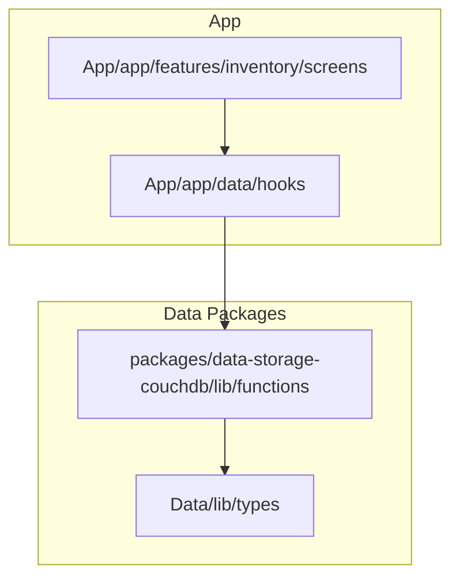
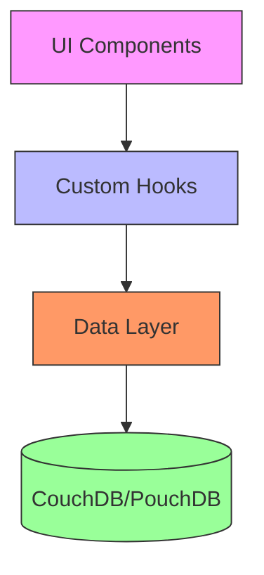
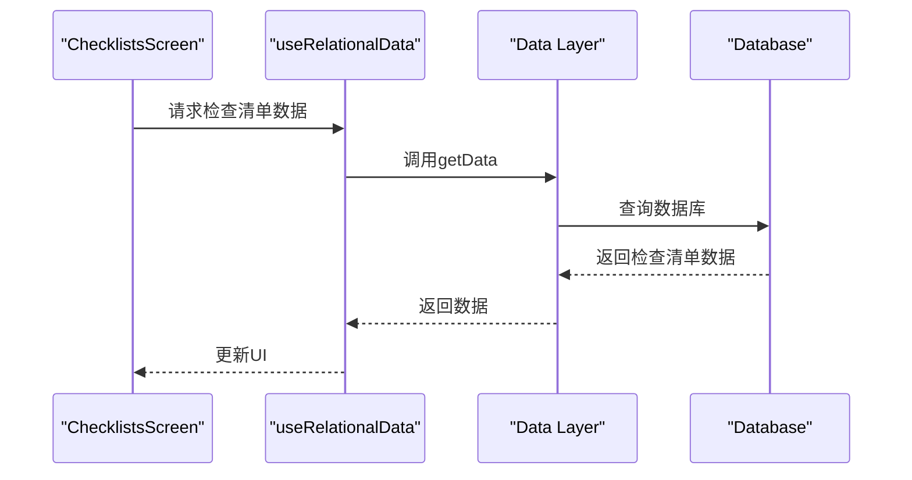
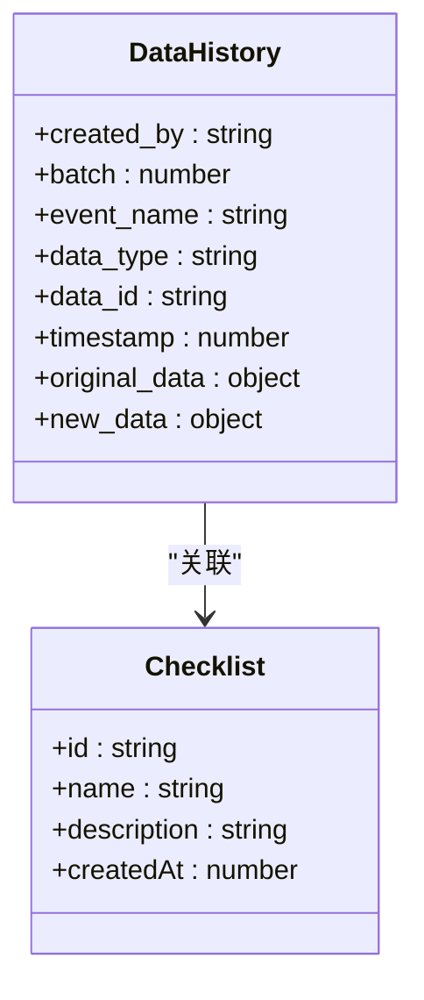
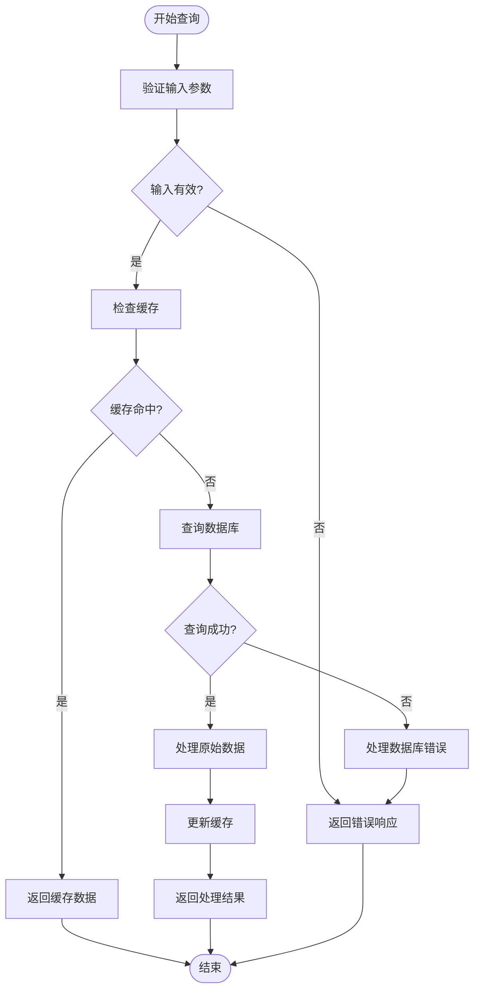
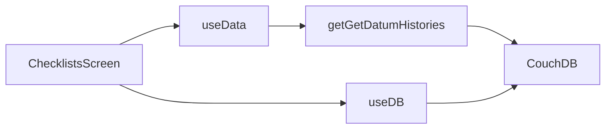

# 检查清单历史记录与恢复机制

<cite>
**本文档引用的文件**   
- [ChecklistsScreen.tsx](file://App/app/features/inventory/screens/ChecklistsScreen.tsx)
- [ChecklistScreen.tsx](file://App/app/features/inventory/screens/ChecklistScreen.tsx)
- [useData.ts](file://App/app/data/hooks/useData.ts)
- [getGetDatumHistories.ts](file://packages/data-storage-couchdb/lib/functions/getGetDatumHistories.ts)
- [getRestoreHistory.ts](file://packages/data-storage-couchdb/lib/functions/getRestoreHistory.ts)
- [getGetHistoriesInBatch.ts](file://packages/data-storage-couchdb/lib/functions/getGetHistoriesInBatch.ts)
- [getListHistoryBatchesCreatedBy.ts](file://packages/data-storage-couchdb/lib/functions/getListHistoryBatchesCreatedBy.ts)
- [types.ts](file://Data/lib/types.ts)
- [HistoryBatchesModalScreen.tsx](file://App/app/screens/data-history/HistoryBatchesModalScreen.tsx)
- [HistoryBatchModalScreen.tsx](file://App/app/screens/data-history/HistoryBatchModalScreen.tsx)
</cite>

## 目录
1. [简介](#简介)
2. [项目结构](#项目结构)
3. [核心组件](#核心组件)
4. [架构概述](#架构概述)
5. [详细组件分析](#详细组件分析)
6. [依赖关系分析](#依赖关系分析)
7. [性能考虑](#性能考虑)
8. [故障排除指南](#故障排除指南)
9. [结论](#结论)

## 简介
本文档详细阐述了库存管理应用中检查清单历史记录与恢复功能的实现机制。系统在每次完成检查清单后会自动生成执行历史记录，并将其与原始清单模板关联存储。文档将深入分析`ChecklistsScreen.tsx`中历史记录列表的展示逻辑，包括按时间排序、筛选和查看详情等功能。同时，将解释数据模型中清单与历史记录的关系结构，以及如何通过`useData.ts`钩子查询历史数据。最后，提供开发者指南，展示如何实现历史记录的删除、导出和基于历史记录重新启动检查流程的功能。

## 项目结构
该库存管理应用采用模块化架构，将功能划分为不同的特性模块。检查清单功能位于`App/app/features/inventory/`目录下，包含屏幕组件、业务逻辑和UI组件。数据持久化和查询逻辑则分布在`packages/data-storage-couchdb/`和`Data/lib/`目录中，提供了统一的数据访问接口。

**图表来源**
- [ChecklistsScreen.tsx](file://App/app/features/inventory/screens/ChecklistsScreen.tsx)
- [useData.ts](file://App/app/data/hooks/useData.ts)
- [getGetDatumHistories.ts](file://packages/data-storage-couchdb/lib/functions/getGetDatumHistories.ts)
- [types.ts](file://Data/lib/types.ts)

**章节来源**
- [ChecklistsScreen.tsx](file://App/app/features/inventory/screens/ChecklistsScreen.tsx)
- [useData.ts](file://App/app/data/hooks/useData.ts)

## 核心组件
核心组件包括`ChecklistsScreen.tsx`用于展示检查清单列表和历史记录，`useData.ts`钩子用于数据查询，以及`getGetDatumHistories.ts`和`getRestoreHistory.ts`函数用于历史记录的获取和恢复。这些组件共同构成了检查清单历史记录与恢复功能的基础。

**章节来源**
- [ChecklistsScreen.tsx](file://App/app/features/inventory/screens/ChecklistsScreen.tsx)
- [useData.ts](file://App/app/data/hooks/useData.ts)
- [getGetDatumHistories.ts](file://packages/data-storage-couchdb/lib/functions/getGetDatumHistories.ts)
- [getRestoreHistory.ts](file://packages/data-storage-couchdb/lib/functions/getRestoreHistory.ts)

## 架构概述
系统采用分层架构，上层UI组件通过钩子函数与底层数据存储进行交互。当用户完成检查清单时，系统会创建一个历史记录文档，包含原始数据和新数据的快照。这些历史记录通过CouchDB的视图和索引进行高效查询，并通过`useData`钩子暴露给UI层。

**图表来源**
- [ChecklistsScreen.tsx](file://App/app/features/inventory/screens/ChecklistsScreen.tsx)
- [useData.ts](file://App/app/data/hooks/useData.ts)
- [getGetDatumHistories.ts](file://packages/data-storage-couchdb/lib/functions/getGetDatumHistories.ts)

## 详细组件分析

### 检查清单屏幕分析
`ChecklistsScreen.tsx`是检查清单功能的主要入口点。它负责展示所有检查清单及其历史记录。屏幕使用`useRelationalData`钩子查询检查清单数据，并通过`useOrderedData`钩子管理清单的排序状态。

#### 对于API/服务组件：

**图表来源**
- [ChecklistsScreen.tsx](file://App/app/features/inventory/screens/ChecklistsScreen.tsx)
- [useData.ts](file://App/app/data/hooks/useData.ts)

### 历史记录数据模型分析
数据模型中，历史记录以特殊文档类型`_history`存储，包含`data_type`、`data_id`、`timestamp`等关键字段。这种设计使得可以高效地查询特定数据项的历史记录。

#### 对于对象导向组件：

**图表来源**
- [types.ts](file://Data/lib/types.ts)
- [getGetDatumHistories.ts](file://packages/data-storage-couchdb/lib/functions/getGetDatumHistories.ts)

### 历史记录查询分析
`useData.ts`钩子是查询历史记录的核心。它封装了数据查询的复杂性，提供了一致的API供UI组件使用。钩子处理缓存、加载状态和错误处理，使UI组件可以专注于展示逻辑。

#### 对于复杂逻辑组件：

**图表来源**
- [useData.ts](file://App/app/data/hooks/useData.ts)
- [getGetDatumHistories.ts](file://packages/data-storage-couchdb/lib/functions/getGetDatumHistories.ts)

**章节来源**
- [useData.ts](file://App/app/data/hooks/useData.ts)

## 依赖关系分析
系统各组件之间存在清晰的依赖关系。UI组件依赖于数据钩子，数据钩子又依赖于底层数据存储函数。这种分层依赖确保了代码的可维护性和可测试性。

**图表来源**
- [ChecklistsScreen.tsx](file://App/app/features/inventory/screens/ChecklistsScreen.tsx)
- [useData.ts](file://App/app/data/hooks/useData.ts)
- [getGetDatumHistories.ts](file://packages/data-storage-couchdb/lib/functions/getGetDatumHistories.ts)
- [useDB.ts](file://App/app/db/hooks/useDB.ts)

**章节来源**
- [ChecklistsScreen.tsx](file://App/app/features/inventory/screens/ChecklistsScreen.tsx)
- [useData.ts](file://App/app/data/hooks/useData.ts)

## 性能考虑
系统在性能方面进行了多项优化。通过使用数据库索引（如`get_datum_histories_v0`）来加速历史记录查询，避免了全表扫描。同时，`useData`钩子实现了智能缓存机制，减少了不必要的数据库查询。对于大量历史记录的展示，系统采用分页加载策略，避免一次性加载过多数据导致内存问题。

## 故障排除指南
当遇到历史记录相关问题时，可以按照以下步骤进行排查：
1. 检查数据库连接是否正常
2. 验证历史记录索引是否已正确创建
3. 确认数据模型定义是否正确
4. 检查时间戳格式是否一致
5. 验证用户权限是否足够

**章节来源**
- [getGetDatumHistories.ts](file://packages/data-storage-couchdb/lib/functions/getGetDatumHistories.ts)
- [useData.ts](file://App/app/data/hooks/useData.ts)

## 结论
检查清单历史记录与恢复功能通过分层架构和模块化设计实现了高内聚低耦合。系统能够高效地生成、存储和查询历史记录，并提供灵活的恢复机制。未来可以考虑增加历史记录的搜索功能和更精细的权限控制，以进一步提升用户体验和数据安全性。