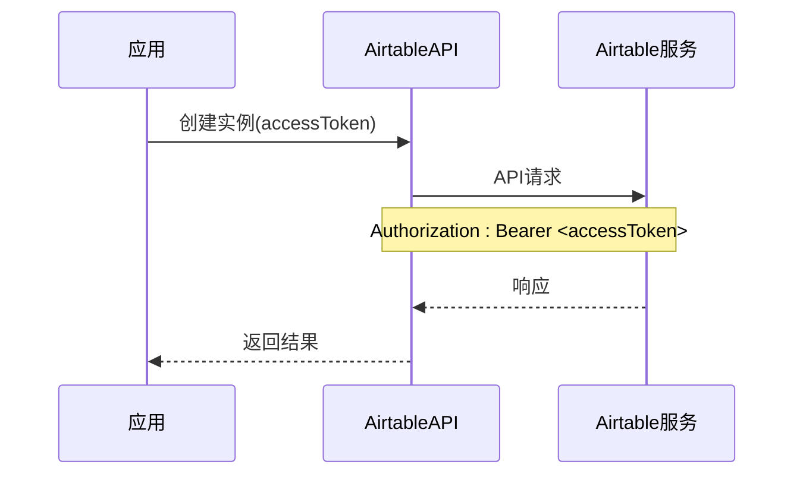
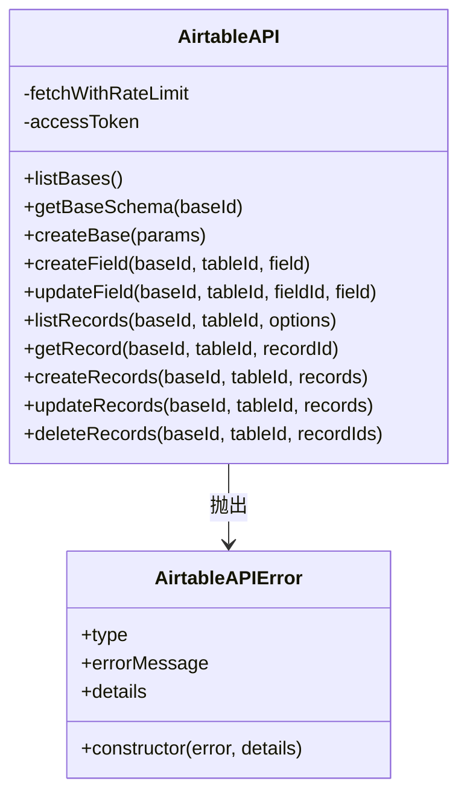
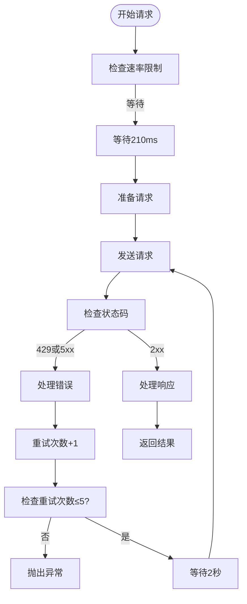
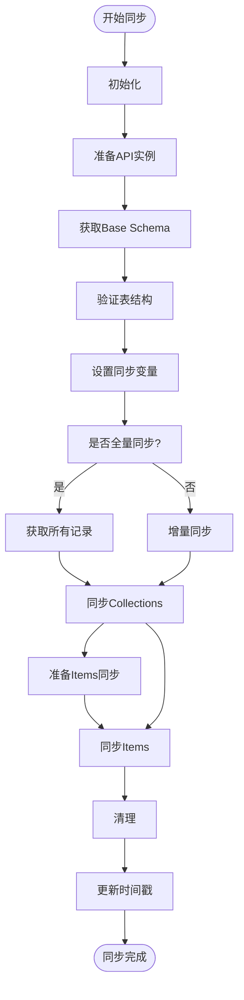
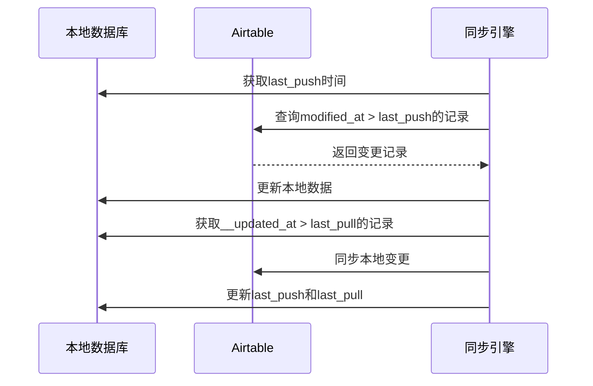
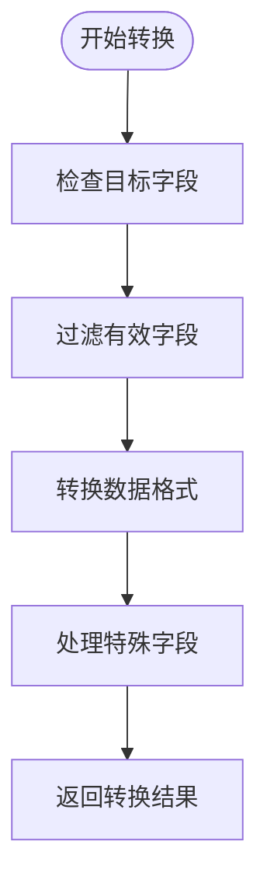
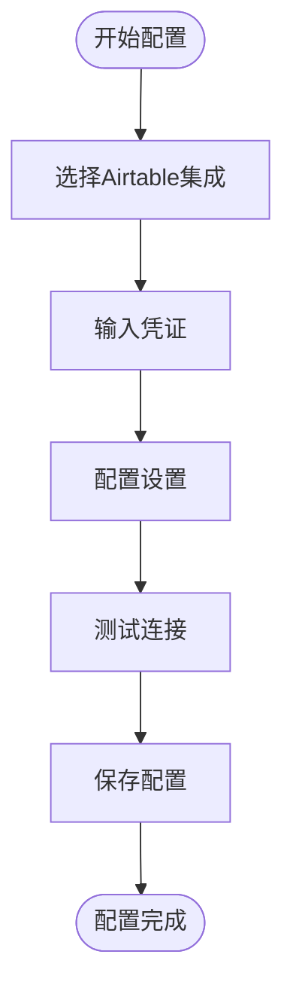

# Airtable 集成

<cite>
**本文档中引用的文件**   
- [AirtableAPI.ts](file://packages/integration-airtable/lib/AirtableAPI.ts)
- [syncWithAirtable.ts](file://packages/integration-airtable/lib/syncWithAirtable.ts)
- [conversions.ts](file://packages/integration-airtable/lib/conversions.ts)
- [AirtableIntegrationScreen.tsx](file://App/app/features/integrations/screens/AirtableIntegrationScreen.tsx)
- [NewOrEditAirtableIntegrationScreen.tsx](file://App/app/features/integrations/screens/NewOrEditAirtableIntegrationScreen.tsx)
- [schema.ts](file://packages/integration-airtable/lib/schema.ts)
</cite>

## 目录
1. [简介](#简介)
2. [认证机制](#认证机制)
3. [REST API 封装](#rest-api-封装)
4. [错误重试策略](#错误重试策略)
5. [双向同步逻辑](#双向同步逻辑)
6. [数据格式转换](#数据格式转换)
7. [界面使用指南](#界面使用指南)
8. [扩展示例](#扩展示例)
9. [结论](#结论)

## 简介
本文档详细介绍了Inventory应用中Airtable集成的技术实现。该集成允许用户将本地库存数据与Airtable数据库进行双向同步，支持集合（Collections）和物品（Items）的数据同步。系统通过API密钥进行身份验证，实现了完整的REST API封装，并包含错误重试和冲突解决机制。集成还包括数据格式转换功能，将应用内部数据模型转换为Airtable兼容的格式，并提供用户友好的界面进行配置和监控。

## 认证机制
Airtable集成使用API密钥进行身份验证，这是一种简单而安全的认证方式。在`AirtableAPI`类的构造函数中，需要提供`accessToken`参数，该参数在所有API请求中作为Bearer令牌包含在Authorization头中。



**认证流程**
1. 用户在应用界面输入Airtable API密钥
2. 密钥通过安全存储机制保存
3. 创建`AirtableAPI`实例时使用该密钥
4. 所有后续API请求自动包含认证头

API密钥管理遵循安全最佳实践，密钥不会硬编码在源代码中，而是通过用户输入和安全存储机制管理。在`NewOrEditAirtableIntegrationScreen.tsx`中，用户可以输入和管理API密钥，系统将其作为机密信息存储。

**认证机制特点**
- 使用标准的Bearer令牌认证
- 密钥在客户端安全存储
- 每个请求都独立验证
- 支持Airtable API的完整权限模型

**代码路径**
- `AirtableAPI`类构造函数处理认证
- `NewOrEditAirtableIntegrationScreen.tsx`处理用户输入

**本节来源**
- [AirtableAPI.ts](file://packages/integration-airtable/lib/AirtableAPI.ts#L183-L195)
- [NewOrEditAirtableIntegrationScreen.tsx](file://App/app/features/integrations/screens/NewOrEditAirtableIntegrationScreen.tsx)

## REST API 封装
AirtableAPI类提供了对Airtable REST API的完整封装，将底层HTTP请求抽象为易于使用的JavaScript方法。封装遵循Airtable API v0规范，支持所有主要操作。

### API 方法概览
| 方法 | 描述 | HTTP 方法 | 端点 |
|------|------|----------|-------|
| listBases | 列出用户的所有bases | GET | /v0/meta/bases |
| getBaseSchema | 获取base的表结构 | GET | /v0/meta/bases/{baseId}/tables |
| createBase | 创建新的base | POST | /v0/meta/bases |
| createField | 在表中创建字段 | POST | /v0/meta/bases/{baseId}/tables/{tableId}/fields |
| updateField | 更新表字段 | PATCH | /v0/meta/bases/{baseId}/tables/{tableId}/fields/{fieldId} |
| listRecords | 列出记录 | POST | /v0/{baseId}/{tableId}/listRecords |
| getRecord | 获取单个记录 | GET | /v0/{baseId}/{tableId}/{recordId} |
| createRecords | 创建记录 | POST | /v0/{baseId}/{tableId} |
| updateRecords | 更新记录 | PATCH | /v0/{baseId}/{tableId} |
| deleteRecords | 删除记录 | DELETE | /v0/{baseId}/{tableId}?records={id} |

### 封装设计模式
API封装采用了门面模式（Facade Pattern），为复杂的Airtable API提供了一个简化的接口。`AirtableAPI`类作为门面，隐藏了底层HTTP请求的复杂性。



**封装特点**
- 统一的错误处理机制
- 自动的请求速率限制
- 类型安全的接口定义
- 详细的错误信息包含

**请求处理流程**
1. 方法调用转换为HTTP请求
2. 添加认证头和内容类型
3. 通过`fetchWithRateLimit`执行请求
4. 解析响应JSON
5. 错误检查和异常抛出
6. 返回标准化结果

**本节来源**
- [AirtableAPI.ts](file://packages/integration-airtable/lib/AirtableAPI.ts#L108-L452)

## 错误重试策略
AirtableAPI实现了稳健的错误重试策略，确保在网络不稳定或服务暂时不可用时仍能成功完成操作。

### 重试机制实现
在`fetchWithRateLimit`方法中实现了重试逻辑，当遇到特定HTTP状态码时会自动重试。



### 重试条件
系统在以下情况下会触发重试：
- HTTP状态码为429（请求过多）
- HTTP状态码为5xx系列（服务器错误）
- 网络连接错误

### 重试参数
- 最大重试次数：5次
- 重试间隔：2秒
- 总最大等待时间：约10秒

### 错误处理
当所有重试都失败后，系统会抛出`AirtableAPIError`异常，该异常包含：
- 错误类型（type）
- 错误消息（errorMessage）
- 详细信息（details）
- 原始错误信息

```typescript
class AirtableAPIError extends Error {
  type: string;
  errorMessage: string;
  details?: string;
  
  constructor(error: unknown, details?: string) {
    // 错误处理逻辑
  }
}
```

这种重试策略确保了系统的可靠性，同时避免了对Airtable服务的过度请求。

**本节来源**
- [AirtableAPI.ts](file://packages/integration-airtable/lib/AirtableAPI.ts#L198-L235)

## 双向同步逻辑
`syncWithAirtable.ts`文件实现了完整的双向同步逻辑，支持增量同步和全量同步两种模式。

### 同步流程概览


### 同步阶段
同步过程分为三个主要阶段：

1. **初始化阶段**
   - 创建AirtableAPI实例
   - 验证集成配置
   - 获取Base Schema
   - 验证表结构完整性

2. **数据同步阶段**
   - 处理待删除数据
   - 准备本地数据同步
   - 执行创建、更新、删除操作

3. **完成阶段**
   - 更新最后同步时间戳
   - 保存统计信息
   - 清理资源

### 冲突解决机制
系统实现了智能的冲突解决策略：

**本地优先原则**
- 当本地数据更新时间晚于Airtable时，优先同步本地更改
- 使用`__updated_at`时间戳进行比较

**双向同步规则**
- 本地创建 → Airtable创建
- 本地更新 → Airtable更新  
- 本地删除 → Airtable标记删除
- Airtable创建 → 本地创建
- Airtable更新 → 本地更新（无冲突时）
- Airtable删除 → 本地删除

### 增量同步机制
系统通过时间戳实现增量同步：



**同步进度跟踪**
系统通过`SyncWithAirtableProgress`接口跟踪同步进度，包含：
- `toPush`: 待推送的记录数
- `toPull`: 待拉取的记录数
- `pushed`: 已推送的记录数
- `pulled`: 已拉取的记录数
- `status`: 同步状态

**本节来源**
- [syncWithAirtable.ts](file://packages/integration-airtable/lib/syncWithAirtable.ts#L100-L1387)

## 数据格式转换
`conversions.ts`文件实现了应用内部数据模型与Airtable格式之间的双向转换。

### 转换函数概览
系统提供了四个主要的转换函数：

| 函数 | 方向 | 描述 |
|------|------|------|
| collectionToAirtableRecord | 本地 → Airtable | 将集合转换为Airtable记录 |
| itemToAirtableRecord | 本地 → Airtable | 将物品转换为Airtable记录 |
| airtableRecordToCollection | Airtable → 本地 | 将Airtable记录转换为集合 |
| airtableRecordToItem | Airtable → 本地 | 将Airtable记录转换为物品 |

### 数据映射规则
#### 集合数据映射
```mermaid
classDiagram
class Collection {
+name : string
+collection_reference_number : string
+__id : string
}
class AirtableRecord {
+fields : {
+Name : string
+ID : string
+'Ref. No.' : string
}
}
Collection --> AirtableRecord : 转换
```

#### 物品数据映射
```mermaid
classDiagram
class Item {
+name : string
+item_reference_number : string
+collection_id : string
+container_id : string
+__id : string
}
class AirtableRecord {
+fields : {
+Name : string
+ID : string
+'Ref. No.' : string
+Collection : string[]
+Container : string[]
}
}
Item --> AirtableRecord : 转换
```

### 转换流程


### 字段转换细节
**类型转换**
- 数字：直接映射
- 字符串：直接映射
- 布尔值：直接映射
- 日期：转换为ISO字符串
- 数组：保持数组结构

**特殊字段处理**
- `ID`字段：使用`__id`作为唯一标识
- `Modified At`：使用Airtable的lastModifiedTime字段
- 关联字段：转换为Record Link格式
- 图像字段：处理为Attachment格式

**字段过滤机制**
系统实现了智能的字段过滤，只同步目标表中存在的字段：

```typescript
const filteredFields = Object.keys(fields)
  .filter(key => key in airtableFields)
  .reduce((obj, key) => {
    obj[key] = fields[key];
    return obj;
  }, {});
```

这种设计确保了系统的灵活性，即使Airtable表结构发生变化，系统也能自动适应。

**本节来源**
- [conversions.ts](file://packages/integration-airtable/lib/conversions.ts#L13-L564)

## 界面使用指南
Airtable集成提供了用户友好的界面，包括配置流程、字段映射和同步状态监控。

### 配置流程


**配置参数**
- **Airtable Base ID**: 目标Base的唯一标识符
- **API密钥**: Airtable API访问密钥
- **同步范围**: 选择同步collections或containers
- **图像公共端点**: 图像同步的URL前缀
- **禁用图像上传**: 可选的图像同步控制

### 字段映射界面
系统提供了直观的字段映射界面，用户可以：

1. **查看映射关系**
   - 显示本地字段与Airtable字段的对应关系
   - 标识必填字段和可选字段

2. **自定义映射**
   - 添加新的字段映射规则
   - 修改现有映射
   - 删除不需要的映射

3. **验证映射**
   - 实时验证字段类型匹配
   - 检查必填字段完整性
   - 预览同步效果

### 同步状态监控
`AirtableIntegrationScreen.tsx`提供了全面的同步状态监控功能：

**状态显示**
- 当前同步状态（初始化、同步中、完成）
- 进度百分比
- 已处理记录数
- 错误计数

**详细统计**
- 推送的记录数
- 拉取的记录数
- 创建的记录数
- 更新的记录数
- 删除的记录数

**历史记录**
- 上次同步时间
- API调用统计
- 错误日志

### 用户操作
用户可以通过界面执行以下操作：
- 手动触发同步
- 查看同步详情
- 重新配置集成
- 查看错误信息
- 清除同步历史

**本节来源**
- [AirtableIntegrationScreen.tsx](file://App/app/features/integrations/screens/AirtableIntegrationScreen.tsx)
- [NewOrEditAirtableIntegrationScreen.tsx](file://App/app/features/integrations/screens/NewOrEditAirtableIntegrationScreen.tsx)

## 扩展示例
本节提供开发者扩展示例，展示如何添加新的Airtable基表支持和自定义字段映射规则。

### 添加新的基表支持
要添加对新基表的支持，需要修改`schema.ts`文件：

```typescript
export const schema = {
  config: z.object({
    airtable_base_id: z.string().min(1),
    scope_type: z.enum(['collections', 'containers']),
    collection_ids_to_sync: z.array(z.string()).optional(),
    container_ids_to_sync: z.array(z.string()).optional(),
    images_public_endpoint: z.string().optional(),
    disable_uploading_item_images: z.boolean().optional(),
    // 添加新字段
    custom_table_name: z.string().optional(),
    custom_field_mapping: z.record(z.string()).optional()
  }).catchall(z.unknown()),
};
```

### 自定义字段映射规则
创建自定义转换函数：

```typescript
// customConversions.ts
export async function customItemToAirtableRecord(
  item: DataTypeWithID<'item'>,
  options: {
    airtableItemsTableFields: { [name: string]: unknown };
    customFieldMapper: (value: any) => any;
  }
) {
  const baseRecord = await itemToAirtableRecord(item, options);
  
  // 添加自定义字段转换
  if (options.airtableItemsTableFields['Custom Field']) {
    baseRecord.fields['Custom Field'] = 
      options.customFieldMapper(item.custom_property);
  }
  
  return baseRecord;
}
```

### 扩展同步逻辑
修改`syncWithAirtable.ts`以支持新功能：

```typescript
async function* syncDataWithCustomLogic(
  type: 'collection' | 'item',
  scope: GetDataConditions<T>,
  airtableTableNameOrId: string,
  options: {
    // ...原有选项
    customPreSyncHook?: () => Promise<void>;
    customPostSyncHook?: () => Promise<void>;
  }
) {
  // 执行自定义预同步钩子
  if (options.customPreSyncHook) {
    await options.customPreSyncHook();
  }
  
  // 执行标准同步逻辑
  const result = await syncData(type, scope, airtableTableNameOrId, options);
  
  // 执行自定义后同步钩子
  if (options.customPostSyncHook) {
    await options.customPostSyncHook();
  }
  
  return result;
}
```

### 添加新的数据类型支持
要支持新的数据类型，如"locations"：

1. **更新数据模式**
```typescript
// schema.ts
scope_type: z.enum(['collections', 'containers', 'locations'])
```

2. **创建转换函数**
```typescript
// conversions.ts
export async function locationToAirtableRecord(location: Location) {
  // 实现转换逻辑
}

export async function airtableRecordToLocation(record: AirtableRecord) {
  // 实现转换逻辑
}
```

3. **扩展同步逻辑**
```typescript
// syncWithAirtable.ts
if (config.scope_type === 'locations') {
  // 添加locations同步逻辑
}
```

这些扩展示例展示了系统的模块化设计，开发者可以轻松地根据特定需求定制Airtable集成。

**本节来源**
- [schema.ts](file://packages/integration-airtable/lib/schema.ts#L3-L17)
- [conversions.ts](file://packages/integration-airtable/lib/conversions.ts)
- [syncWithAirtable.ts](file://packages/integration-airtable/lib/syncWithAirtable.ts)

## 结论
Airtable集成提供了一个完整、可靠且可扩展的解决方案，用于将Inventory应用与Airtable数据库进行双向同步。系统通过API密钥实现了安全的身份验证，提供了完整的REST API封装，并包含智能的错误重试策略。

双向同步逻辑设计精巧，支持增量同步和全量同步，通过时间戳机制有效解决了数据冲突问题。数据格式转换模块实现了应用内部数据模型与Airtable格式之间的无缝转换，确保了数据的一致性和完整性。

用户界面友好，提供了清晰的配置流程、直观的字段映射和全面的同步状态监控。系统设计具有良好的扩展性，开发者可以轻松地添加新的基表支持和自定义字段映射规则。

整体而言，该集成遵循了最佳实践，代码结构清晰，错误处理完善，为用户提供了稳定可靠的同步体验，同时为开发者提供了灵活的扩展能力。