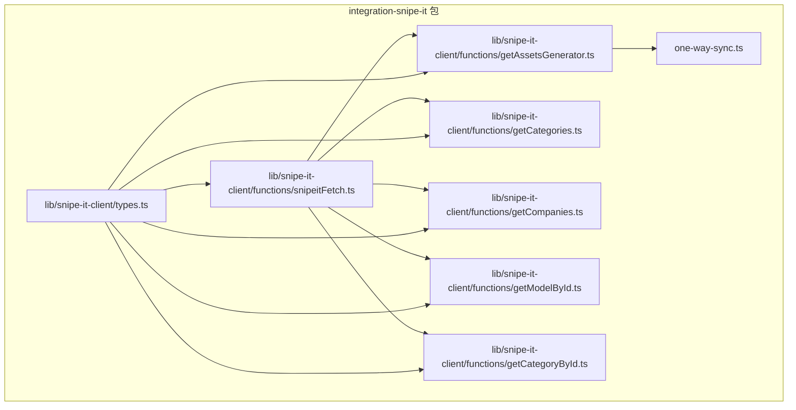
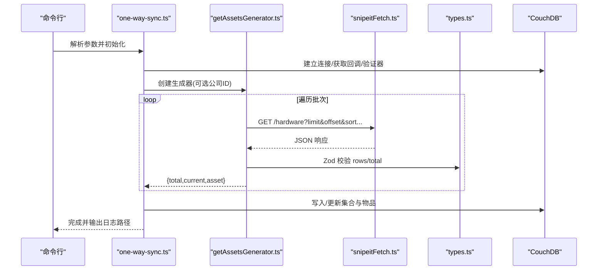
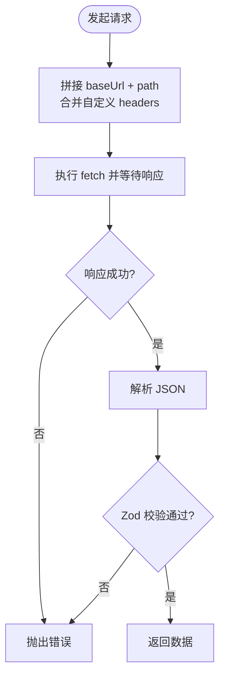
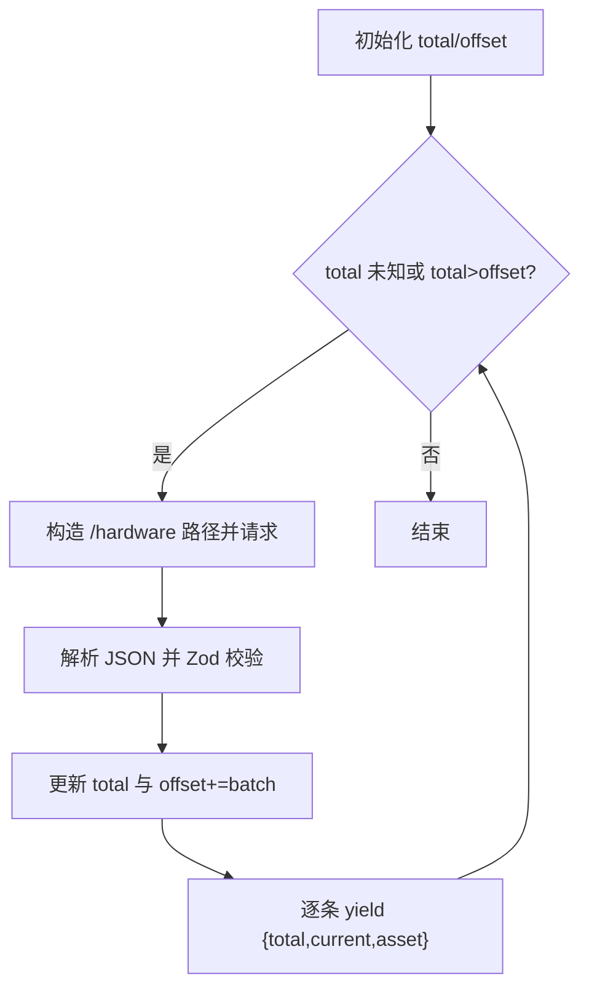
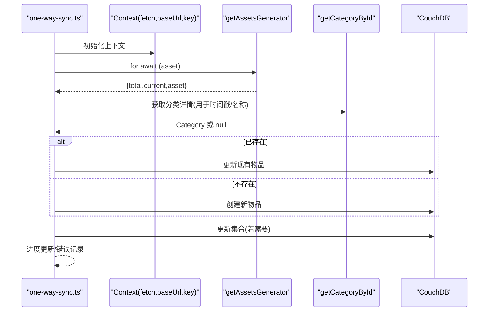
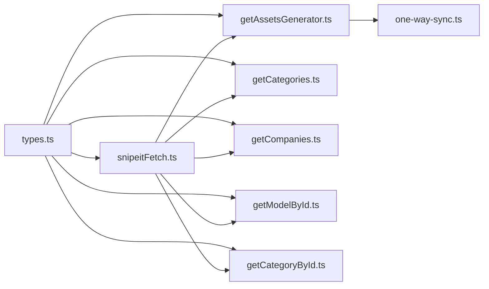

# Snipe-IT 集成

<cite>
**本文引用的文件**
- [snipeitFetch.ts](file://packages/integration-snipe-it/lib/snipe-it-client/functions/snipeitFetch.ts)
- [getAssetsGenerator.ts](file://packages/integration-snipe-it/lib/snipe-it-client/functions/getAssetsGenerator.ts)
- [one-way-sync.ts](file://packages/integration-snipe-it/one-way-sync.ts)
- [types.ts](file://packages/integration-snipe-it/lib/snipe-it-client/types.ts)
- [getCategories.ts](file://packages/integration-snipe-it/lib/snipe-it-client/functions/getCategories.ts)
- [getCompanies.ts](file://packages/integration-snipe-it/lib/snipe-it-client/functions/getCompanies.ts)
- [getModelById.ts](file://packages/integration-snipe-it/lib/snipe-it-client/functions/getModelById.ts)
- [getCategoryById.ts](file://packages/integration-snipe-it/lib/snipe-it-client/functions/getCategoryById.ts)
- [README.md](file://packages/integration-snipe-it/README.md)
- [NewOrEditAirtableIntegrationScreen.tsx](file://App/App/features/integrations/screens/NewOrEditAirtableIntegrationScreen.tsx)
</cite>

## 目录
1. [简介](#简介)
2. [项目结构](#项目结构)
3. [核心组件](#核心组件)
4. [架构总览](#架构总览)
5. [详细组件分析](#详细组件分析)
6. [依赖关系分析](#依赖关系分析)
7. [性能考量](#性能考量)
8. [故障排查指南](#故障排查指南)
9. [结论](#结论)
10. [附录：开发者指南与扩展建议](#附录开发者指南与扩展建议)

## 简介
本文件面向开发者，系统性解析 Snipe-IT 集成模块，重点覆盖：
- HTTP 客户端实现（认证、请求头、错误处理）
- 分页与流式数据获取（异步生成器）
- 单向同步流程（从 Snipe-IT 导入到本地数据库）
- UI 模式复用（Airtable 配置界面可作为 Snipe-IT 配置界面的参考）
- 扩展支持其他 Snipe-IT API 端点的实践建议

## 项目结构
该集成位于独立包中，包含一个轻量的 Snipe-IT 客户端与一次性单向同步脚本，以及类型定义与工具函数。

图表来源
- [snipeitFetch.ts](file://packages/integration-snipe-it/lib/snipe-it-client/functions/snipeitFetch.ts#L1-L21)
- [getAssetsGenerator.ts](file://packages/integration-snipe-it/lib/snipe-it-client/functions/getAssetsGenerator.ts#L1-L50)
- [getCategories.ts](file://packages/integration-snipe-it/lib/snipe-it-client/functions/getCategories.ts#L1-L39)
- [getCompanies.ts](file://packages/integration-snipe-it/lib/snipe-it-client/functions/getCompanies.ts#L1-L38)
- [getModelById.ts](file://packages/integration-snipe-it/lib/snipe-it-client/functions/getModelById.ts#L1-L25)
- [getCategoryById.ts](file://packages/integration-snipe-it/lib/snipe-it-client/functions/getCategoryById.ts#L1-L25)
- [types.ts](file://packages/integration-snipe-it/lib/snipe-it-client/types.ts#L1-L68)
- [one-way-sync.ts](file://packages/integration-snipe-it/one-way-sync.ts#L1-L443)

章节来源
- [README.md](file://packages/integration-snipe-it/README.md#L1-L58)

## 核心组件
- HTTP 客户端：统一注入 Bearer Token、Accept/Content-Type，并透传自定义请求头。
- 异步生成器：按批次拉取资产列表，逐条产出进度与数据，避免一次性加载全部数据。
- 同步脚本：解析命令行参数，建立 CouchDB 连接，调用生成器进行导入，同时维护集合映射与去重。
- 类型系统：使用 Zod 对响应进行严格校验，确保后续处理安全可靠。
- 工具函数：按需封装常用端点（公司、分类、模型等），保持一致的分页与错误处理模式。

章节来源
- [snipeitFetch.ts](file://packages/integration-snipe-it/lib/snipe-it-client/functions/snipeitFetch.ts#L1-L21)
- [getAssetsGenerator.ts](file://packages/integration-snipe-it/lib/snipe-it-client/functions/getAssetsGenerator.ts#L1-L50)
- [one-way-sync.ts](file://packages/integration-snipe-it/one-way-sync.ts#L1-L443)
- [types.ts](file://packages/integration-snipe-it/lib/snipe-it-client/types.ts#L1-L68)
- [getCategories.ts](file://packages/integration-snipe-it/lib/snipe-it-client/functions/getCategories.ts#L1-L39)
- [getCompanies.ts](file://packages/integration-snipe-it/lib/snipe-it-client/functions/getCompanies.ts#L1-L38)
- [getModelById.ts](file://packages/integration-snipe-it/lib/snipe-it-client/functions/getModelById.ts#L1-L25)
- [getCategoryById.ts](file://packages/integration-snipe-it/lib/snipe-it-client/functions/getCategoryById.ts#L1-L25)

## 架构总览
下图展示从命令行触发到数据入库的整体流程，以及各模块间的依赖关系。

图表来源
- [one-way-sync.ts](file://packages/integration-snipe-it/one-way-sync.ts#L1-L443)
- [getAssetsGenerator.ts](file://packages/integration-snipe-it/lib/snipe-it-client/functions/getAssetsGenerator.ts#L1-L50)
- [snipeitFetch.ts](file://packages/integration-snipe-it/lib/snipe-it-client/functions/snipeitFetch.ts#L1-L21)
- [types.ts](file://packages/integration-snipe-it/lib/snipe-it-client/types.ts#L1-L68)

## 详细组件分析

### HTTP 客户端：认证、请求拦截与错误处理
- 认证方式：在请求头注入 Bearer Token，统一设置 Accept 与 Content-Type。
- 请求拦截：通过 Context 注入 fetch 实例，便于替换为代理或测试替身。
- 错误处理：对模型与分类查询返回的错误状态进行分支处理；资产详情与模型详情在“未找到”时返回空值或抛出明确异常，便于上层逻辑区分。

图表来源
- [snipeitFetch.ts](file://packages/integration-snipe-it/lib/snipe-it-client/functions/snipeitFetch.ts#L1-L21)
- [getModelById.ts](file://packages/integration-snipe-it/lib/snipe-it-client/functions/getModelById.ts#L1-L25)
- [getCategoryById.ts](file://packages/integration-snipe-it/lib/snipe-it-client/functions/getCategoryById.ts#L1-L25)

章节来源
- [snipeitFetch.ts](file://packages/integration-snipe-it/lib/snipe-it-client/functions/snipeitFetch.ts#L1-L21)
- [getModelById.ts](file://packages/integration-snipe-it/lib/snipe-it-client/functions/getModelById.ts#L1-L25)
- [getCategoryById.ts](file://packages/integration-snipe-it/lib/snipe-it-client/functions/getCategoryById.ts#L1-L25)

### 分页与流式数据获取：getAssetsGenerator
- 分批策略：固定批次大小，基于 offset 与 limit 迭代，直到 total 不再大于 offset。
- 流式产出：使用 AsyncGenerator 逐条产出当前进度与资产，便于前端或脚本实时展示与处理。
- 数据校验：使用 Zod 对 total 与 rows 结构进行强类型校验，保证后续处理稳定。

图表来源
- [getAssetsGenerator.ts](file://packages/integration-snipe-it/lib/snipe-it-client/functions/getAssetsGenerator.ts#L1-L50)
- [types.ts](file://packages/integration-snipe-it/lib/snipe-it-client/types.ts#L1-L68)

章节来源
- [getAssetsGenerator.ts](file://packages/integration-snipe-it/lib/snipe-it-client/functions/getAssetsGenerator.ts#L1-L50)
- [types.ts](file://packages/integration-snipe-it/lib/snipe-it-client/types.ts#L1-L68)

### 单向同步流程：one-way-sync
- 参数解析：支持同步 ID、API 基础地址、API Key、时区、公司 ID、数据库 URI、用户名与密码等。
- 数据库连接：使用 nano 连接 CouchDB，初始化回调与验证器。
- 集合映射：按 Snipe-IT 分类 ID 维护集合缓存，优先匹配已存在的集合，否则创建新集合。
- 资产导入：遍历生成器，按集合映射创建或更新物品记录，写入 CouchDB。
- 日志与进度：使用 cli-progress 展示进度，错误写入日志文件。

图表来源
- [one-way-sync.ts](file://packages/integration-snipe-it/one-way-sync.ts#L1-L443)
- [getAssetsGenerator.ts](file://packages/integration-snipe-it/lib/snipe-it-client/functions/getAssetsGenerator.ts#L1-L50)
- [getCategoryById.ts](file://packages/integration-snipe-it/lib/snipe-it-client/functions/getCategoryById.ts#L1-L25)

章节来源
- [one-way-sync.ts](file://packages/integration-snipe-it/one-way-sync.ts#L1-L443)

### UI 模式复用：NewOrEditAirtableIntegrationScreen.tsx 的参考价值
尽管该界面用于 Airtable，但其表单结构、字段组织、校验与保存流程可直接迁移到 Snipe-IT 配置界面：
- 表单分组与标题：如“名称”、“作用域选择”、“目标基/表”、“图片公共端点”等。
- 选择器与多选：集合/容器选择、删除确认、离开前确认保存等交互。
- 校验与提示：使用 Zod schema 校验配置，错误聚合提示，外部链接指引。
- 保存与删除：统一的保存与删除流程，支持导航返回与回调。

章节来源
- [NewOrEditAirtableIntegrationScreen.tsx](file://App/App/features/integrations/screens/NewOrEditAirtableIntegrationScreen.tsx#L1-L620)

## 依赖关系分析
- 模块内聚：snipeitFetch 作为唯一 HTTP 出口，被所有端点函数复用，降低重复与耦合。
- 类型一致性：types.ts 提供统一的 Zod Schema，确保各函数返回值结构一致。
- 外部依赖：node-fetch、zod、cli-progress、commander、dayjs、nano 等。
- 循环依赖：当前文件间无循环依赖迹象。

图表来源
- [types.ts](file://packages/integration-snipe-it/lib/snipe-it-client/types.ts#L1-L68)
- [snipeitFetch.ts](file://packages/integration-snipe-it/lib/snipe-it-client/functions/snipeitFetch.ts#L1-L21)
- [getAssetsGenerator.ts](file://packages/integration-snipe-it/lib/snipe-it-client/functions/getAssetsGenerator.ts#L1-L50)
- [getCategories.ts](file://packages/integration-snipe-it/lib/snipe-it-client/functions/getCategories.ts#L1-L39)
- [getCompanies.ts](file://packages/integration-snipe-it/lib/snipe-it-client/functions/getCompanies.ts#L1-L38)
- [getModelById.ts](file://packages/integration-snipe-it/lib/snipe-it-client/functions/getModelById.ts#L1-L25)
- [getCategoryById.ts](file://packages/integration-snipe-it/lib/snipe-it-client/functions/getCategoryById.ts#L1-L25)
- [one-way-sync.ts](file://packages/integration-snipe-it/one-way-sync.ts#L1-L443)

章节来源
- [types.ts](file://packages/integration-snipe-it/lib/snipe-it-client/types.ts#L1-L68)
- [snipeitFetch.ts](file://packages/integration-snipe-it/lib/snipe-it-client/functions/snipeitFetch.ts#L1-L21)
- [getAssetsGenerator.ts](file://packages/integration-snipe-it/lib/snipe-it-client/functions/getAssetsGenerator.ts#L1-L50)
- [one-way-sync.ts](file://packages/integration-snipe-it/one-way-sync.ts#L1-L443)

## 性能考量
- 分页与内存：固定批次大小避免一次性加载大量数据，适合高并发与大数据量场景。
- 流式处理：AsyncGenerator 逐条产出，前端或脚本可边接收边处理，降低峰值内存占用。
- I/O 优化：CouchDB 批量写入建议结合批量 API（如 bulk docs）进一步优化，当前脚本逐条插入，适合一次性同步场景。
- 网络与超时：建议在 fetch 层增加超时与重试策略，避免长时间阻塞。
- 时间解析：使用 dayjs 时区解析，注意时区字符串与服务器一致，避免时间错位导致的重复更新。

## 故障排查指南
- 认证失败：检查 API 基础地址与 Bearer Token 是否正确，确认网络可达。
- 响应格式不符：Zod 校验失败通常意味着 API 返回结构变化，需更新 Schema。
- 未找到资源：模型/分类接口对“未找到”有特殊返回，需按函数分支处理。
- 同步中断：查看日志文件定位错误行，修复后可重新运行脚本（注意同步 ID 与去重逻辑）。
- 数据库连接：确认数据库 URI、用户名与密码，以及数据库存在与权限。

章节来源
- [snipeitFetch.ts](file://packages/integration-snipe-it/lib/snipe-it-client/functions/snipeitFetch.ts#L1-L21)
- [getAssetsGenerator.ts](file://packages/integration-snipe-it/lib/snipe-it-client/functions/getAssetsGenerator.ts#L1-L50)
- [one-way-sync.ts](file://packages/integration-snipe-it/one-way-sync.ts#L1-L443)

## 结论
该集成以轻量的 HTTP 客户端为核心，配合严格的类型校验与分页/流式处理，构建了稳健的一次性单向同步方案。通过复用 Airtable 配置界面的 UI 模式，可快速落地 Snipe-IT 的配置界面。未来可在现有基础上扩展更多端点与批量写入能力，进一步提升吞吐与稳定性。

## 附录：开发者指南与扩展建议
- 新增端点步骤
  1) 在 types.ts 中新增 Zod Schema 与类型别名。
  2) 在对应函数中复用 snipeitFetch，遵循固定分页参数命名与错误分支处理。
  3) 在 one-way-sync.ts 中按需调用新函数，注意与现有集合/物品映射策略保持一致。
- 错误处理最佳实践
  - 明确区分“未找到”与“业务错误”，前者返回空值或默认值，后者抛出带上下文的错误。
  - 使用统一的日志记录与进度反馈，便于问题定位。
- UI 配置界面复用
  - 参考 Airtable 配置界面的分组、校验、选择器与保存流程，迁移至 Snipe-IT 配置界面。
  - 将 API 基础地址、Bearer Token、时区、目标集合/公司等作为配置项，提供占位符与帮助链接。
- 批量优化
  - 若后续需要高频同步，建议引入批量写入与增量同步策略，减少往返次数与冲突概率。

章节来源
- [README.md](file://packages/integration-snipe-it/README.md#L1-L58)
- [types.ts](file://packages/integration-snipe-it/lib/snipe-it-client/types.ts#L1-L68)
- [snipeitFetch.ts](file://packages/integration-snipe-it/lib/snipe-it-client/functions/snipeitFetch.ts#L1-L21)
- [getAssetsGenerator.ts](file://packages/integration-snipe-it/lib/snipe-it-client/functions/getAssetsGenerator.ts#L1-L50)
- [one-way-sync.ts](file://packages/integration-snipe-it/one-way-sync.ts#L1-L443)
- [NewOrEditAirtableIntegrationScreen.tsx](file://App/App/features/integrations/screens/NewOrEditAirtableIntegrationScreen.tsx#L1-L620)