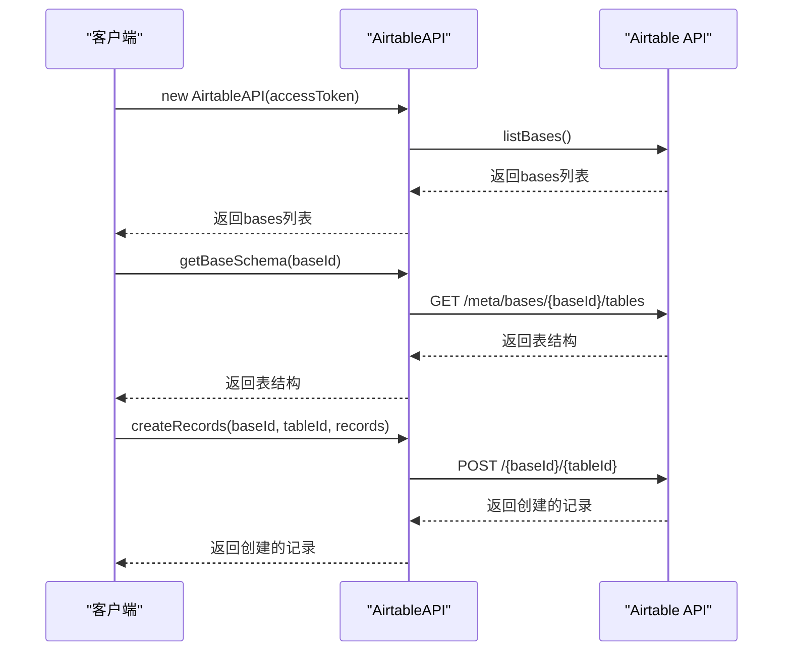
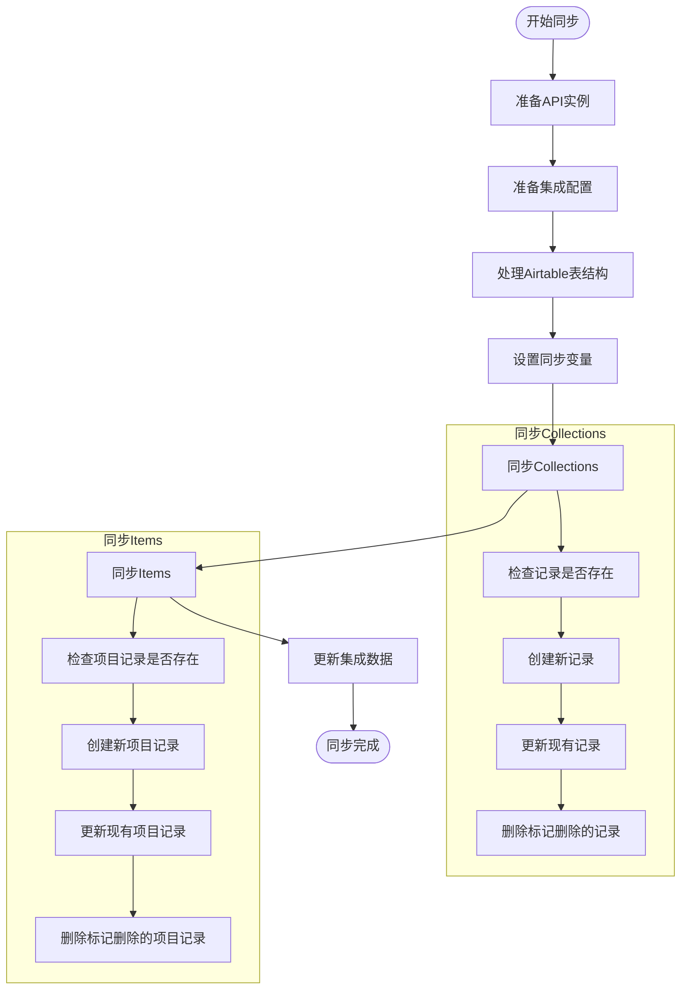
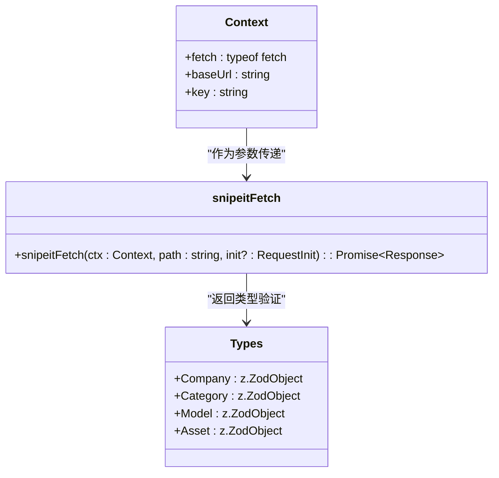
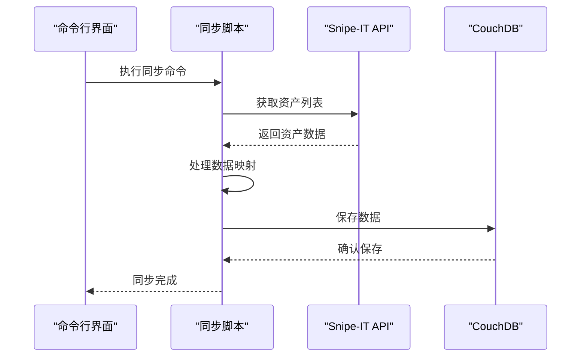
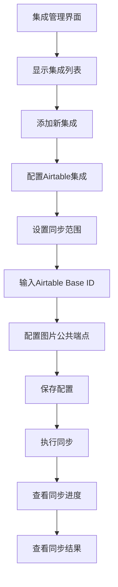

# 集成系统

<cite>
**本文档引用的文件**   
- [AirtableAPI.ts](file://packages/integration-airtable/lib/AirtableAPI.ts)
- [syncWithAirtable.ts](file://packages/integration-airtable/lib/syncWithAirtable.ts)
- [snipeitFetch.ts](file://packages/integration-snipe-it/lib/snipe-it-client/functions/snipeitFetch.ts)
- [IntegrationsScreen.tsx](file://App/app/features/integrations/screens/IntegrationsScreen.tsx)
- [AirtableIntegrationScreen.tsx](file://App/app/features/integrations/screens/AirtableIntegrationScreen.tsx)
- [NewOrEditAirtableIntegrationScreen.tsx](file://App/app/features/integrations/screens/NewOrEditAirtableIntegrationScreen.tsx)
- [conversions.ts](file://packages/integration-airtable/lib/conversions.ts)
- [schema.ts](file://packages/integration-airtable/lib/schema.ts)
- [types.ts](file://packages/integration-snipe-it/lib/snipe-it-client/types.ts)
- [one-way-sync.ts](file://packages/integration-snipe-it/one-way-sync.ts)
</cite>

## 目录
1. [Airtable集成](#airtable集成)
2. [Snipe-IT集成](#snipe-it集成)
3. [集成管理界面](#集成管理界面)
4. [扩展指南](#扩展指南)

## Airtable集成

Airtable集成系统通过AirtableAPI.ts和syncWithAirtable.ts两个核心文件实现。AirtableAPI.ts封装了Airtable REST API的认证和调用，而syncWithAirtable.ts实现了双向数据同步逻辑。

### 认证流程和REST API调用

AirtableAPI类实现了Airtable API的认证和调用机制。该类通过构造函数接收访问令牌(accessToken)和fetch函数，使用Bearer Token认证方式与Airtable API进行通信。

**Diagram sources**
- [AirtableAPI.ts](file://packages/integration-airtable/lib/AirtableAPI.ts#L108-L452)

**Section sources**
- [AirtableAPI.ts](file://packages/integration-airtable/lib/AirtableAPI.ts#L1-L452)

### 数据同步逻辑

syncWithAirtable.ts实现了与Airtable的数据同步逻辑，采用双向同步策略，确保本地数据和Airtable数据保持一致。同步过程包括推送本地变更到Airtable和从Airtable拉取更新。

**Diagram sources**
- [syncWithAirtable.ts](file://packages/integration-airtable/lib/syncWithAirtable.ts#L100-L1452)
- [conversions.ts](file://packages/integration-airtable/lib/conversions.ts#L1-L564)

**Section sources**
- [syncWithAirtable.ts](file://packages/integration-airtable/lib/syncWithAirtable.ts#L1-L1452)

## Snipe-IT集成

Snipe-IT集成通过snipeitFetch.ts文件实现HTTP客户端和API端点封装，提供了一种单向同步机制，将Snipe-IT资产数据同步到本地库存系统。

### HTTP客户端实现和API端点封装

snipeitFetch.ts文件实现了Snipe-IT API的HTTP客户端，通过Context对象封装了基础URL和认证密钥，确保所有请求都包含正确的认证头信息。

**Diagram sources**
- [snipeitFetch.ts](file://packages/integration-snipe-it/lib/snipe-it-client/functions/snipeitFetch.ts#L1-L21)
- [types.ts](file://packages/integration-snipe-it/lib/snipe-it-client/types.ts#L1-L68)

**Section sources**
- [snipeitFetch.ts](file://packages/integration-snipe-it/lib/snipe-it-client/functions/snipeitFetch.ts#L1-L21)
- [types.ts](file://packages/integration-snipe-it/lib/snipe-it-client/types.ts#L1-L68)

### 单向同步实现

one-way-sync.ts实现了从Snipe-IT到本地库存系统的单向同步，通过命令行工具执行，支持增量同步和数据映射。

**Diagram sources**
- [one-way-sync.ts](file://packages/integration-snipe-it/one-way-sync.ts#L1-L248)

**Section sources**
- [one-way-sync.ts](file://packages/integration-snipe-it/one-way-sync.ts#L1-L248)

## 集成管理界面

应用内集成了管理界面(IntegrationsScreen.tsx)，提供配置和管理第三方集成服务的功能。

### 功能和配置选项

集成管理界面允许用户添加、编辑和删除集成配置，查看同步状态，并执行同步操作。界面通过Redux状态管理集成数据，提供直观的操作体验。

**Diagram sources**
- [IntegrationsScreen.tsx](file://App/app/features/integrations/screens/IntegrationsScreen.tsx#L1-L96)
- [AirtableIntegrationScreen.tsx](file://App/app/features/integrations/screens/AirtableIntegrationScreen.tsx#L1-L774)
- [NewOrEditAirtableIntegrationScreen.tsx](file://App/app/features/integrations/screens/NewOrEditAirtableIntegrationScreen.tsx#L1-L620)

**Section sources**
- [IntegrationsScreen.tsx](file://App/app/features/integrations/screens/IntegrationsScreen.tsx#L1-L96)
- [AirtableIntegrationScreen.tsx](file://App/app/features/integrations/screens/AirtableIntegrationScreen.tsx#L1-L774)
- [NewOrEditAirtableIntegrationScreen.tsx](file://App/app/features/integrations/screens/NewOrEditAirtableIntegrationScreen.tsx#L1-L620)

## 扩展指南

为开发者提供扩展新集成服务的指南，包括认证模式、数据映射和错误处理的最佳实践。

### 认证模式

新集成服务应遵循统一的认证模式，使用安全的凭证存储机制，如React Native敏感信息存储。认证信息应在运行时动态获取，避免硬编码。

### 数据映射

数据映射应遵循以下原则：
- 使用类型安全的转换函数
- 处理空值和缺失字段
- 支持双向数据转换
- 验证数据完整性

### 错误处理

错误处理应包括：
- 详细的错误日志记录
- 用户友好的错误消息
- 重试机制
- 断点续传支持

**Section sources**
- [AirtableAPI.ts](file://packages/integration-airtable/lib/AirtableAPI.ts#L78-L106)
- [syncWithAirtable.ts](file://packages/integration-airtable/lib/syncWithAirtable.ts#L132-L137)
- [snipeitFetch.ts](file://packages/integration-snipe-it/lib/snipe-it-client/functions/snipeitFetch.ts#L5-L21)