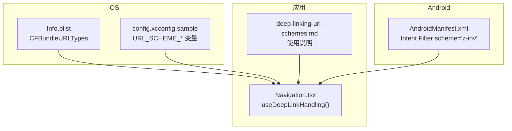
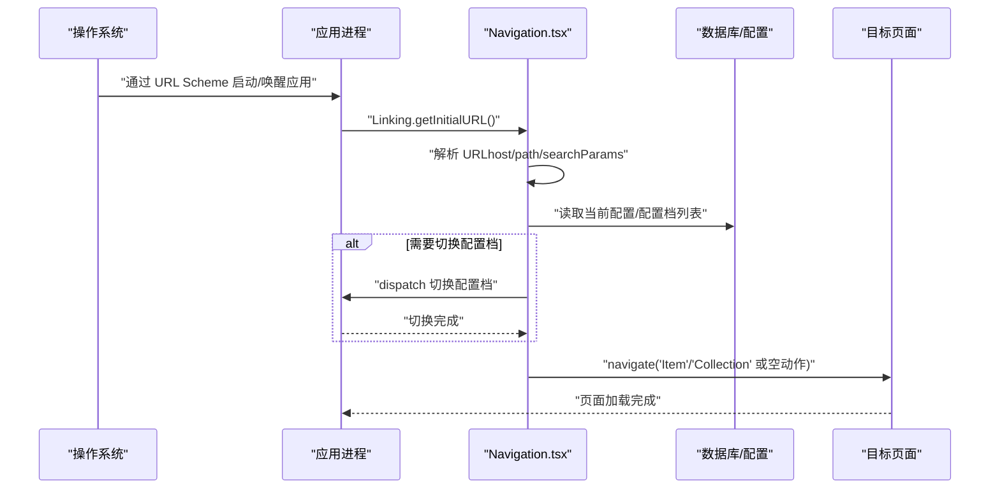
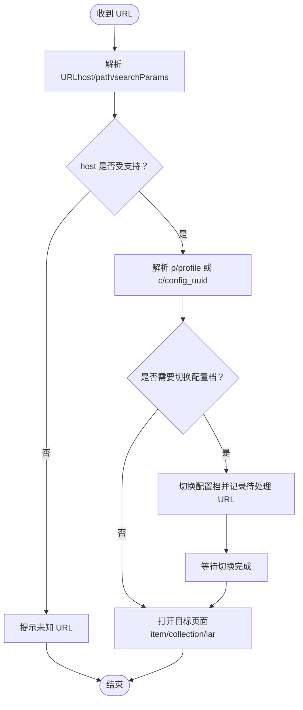
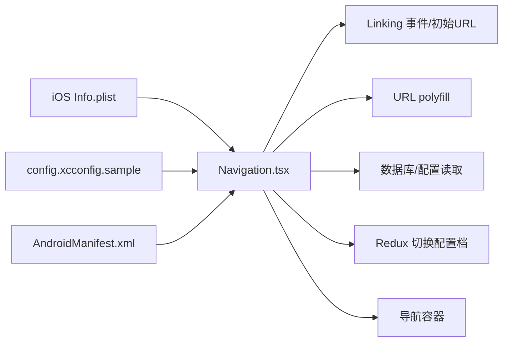

# 深度链接

<cite>
**本文引用的文件**
- [App/ios/Inventory/Info.plist](file://App/ios/Inventory/Info.plist)
- [App/ios/config.xcconfig.sample](file://App/ios/config.xcconfig.sample)
- [App/android/app/src/main/AndroidManifest.xml](file://App/android/app/src/main/AndroidManifest.xml)
- [App/app/navigation/Navigation.tsx](file://App/app/navigation/Navigation.tsx)
- [Inventory-Docs/app/deep-linking-url-schemes.md](file://Inventory-Docs/app/deep-linking-url-schemes.md)
- [App/app/features/db-sync/hooks/useNewOrEditServerUI.tsx](file://App/app/features/db-sync/hooks/useNewOrEditServerUI.tsx)
</cite>

## 目录
1. [简介](#简介)
2. [项目结构](#项目结构)
3. [核心组件](#核心组件)
4. [架构总览](#架构总览)
5. [详细组件分析](#详细组件分析)
6. [依赖关系分析](#依赖关系分析)
7. [性能考虑](#性能考虑)
8. [故障排查指南](#故障排查指南)
9. [结论](#结论)
10. [附录](#附录)

## 简介
本文件系统性梳理了 Inventory 应用的“深度链接（URL Scheme）”能力，覆盖 iOS 和 Android 平台的配置、解析与导航流程，并给出使用说明与最佳实践。读者无需深入源码即可理解如何通过自定义 URL 打开应用内的特定页面或数据项，例如直接跳转到某个物品详情页、集合页，或在多配置档场景下切换到指定配置档后打开目标页面。

## 项目结构
围绕深度链接的关键位置如下：
- iOS 配置：Info.plist 中声明 URL Scheme；config.xcconfig.sample 提供不同构建变体的 URL Scheme 示例。
- Android 配置：AndroidManifest.xml 声明 Intent Filter 的 scheme。
- 应用层处理：Navigation.tsx 中对初始 URL 与后续 URL 进行监听与解析，按路径与查询参数执行导航。
- 文档：deep-linking-url-schemes.md 提供 URL 格式与使用示例。

图表来源
- [App/ios/Inventory/Info.plist](file://App/ios/Inventory/Info.plist#L23-L36)
- [App/ios/config.xcconfig.sample](file://App/ios/config.xcconfig.sample#L25-L30)
- [App/android/app/src/main/AndroidManifest.xml](file://App/android/app/src/main/AndroidManifest.xml#L34-L39)
- [App/app/navigation/Navigation.tsx](file://App/app/navigation/Navigation.tsx#L733-L1022)
- [Inventory-Docs/app/deep-linking-url-schemes.md](file://Inventory-Docs/app/deep-linking-url-schemes.md#L1-L57)

章节来源
- [App/ios/Inventory/Info.plist](file://App/ios/Inventory/Info.plist#L23-L36)
- [App/ios/config.xcconfig.sample](file://App/ios/config.xcconfig.sample#L25-L30)
- [App/android/app/src/main/AndroidManifest.xml](file://App/android/app/src/main/AndroidManifest.xml#L34-L39)
- [App/app/navigation/Navigation.tsx](file://App/app/navigation/Navigation.tsx#L733-L1022)
- [Inventory-Docs/app/deep-linking-url-schemes.md](file://Inventory-Docs/app/deep-linking-url-schemes.md#L1-L57)

## 核心组件
- iOS URL Scheme 声明
  - 在 Info.plist 的 CFBundleURLTypes 中声明 URL Scheme 名称与方案数组，支持主方案与备用方案。
  - config.xcconfig.sample 中为 Debug/Nightly/Release 构建变体提供不同的 URL_SCHEME_* 值，便于区分版本。
- Android URL Scheme 声明
  - 在 AndroidManifest.xml 的 MainActivity 中添加 Intent Filter，scheme 指定为 z-inv。
- 深度链接处理逻辑
  - Navigation.tsx 中 useDeepLinkHandling 负责：
    - 监听 Linking 的 url 事件与应用启动时的初始 URL。
    - 解析 URL 的 host 与 pathname，识别 iar/item/collection 等目标类型。
    - 支持查询参数 p/profile 切换配置档，或 c/config_uuid 匹配配置档。
    - 对 IAR（Individual Asset Reference）进行格式容错处理（自动补全点号分隔）。
    - 导航到对应页面并预加载标题信息。
- 使用文档
  - deep-linking-url-schemes.md 提供 URL 格式、参数说明与示例，以及如何获取 ID、配置 UUID 等操作指引。

章节来源
- [App/ios/Inventory/Info.plist](file://App/ios/Inventory/Info.plist#L23-L36)
- [App/ios/config.xcconfig.sample](file://App/ios/config.xcconfig.sample#L25-L30)
- [App/android/app/src/main/AndroidManifest.xml](file://App/android/app/src/main/AndroidManifest.xml#L34-L39)
- [App/app/navigation/Navigation.tsx](file://App/app/navigation/Navigation.tsx#L733-L1022)
- [Inventory-Docs/app/deep-linking-url-schemes.md](file://Inventory-Docs/app/deep-linking-url-schemes.md#L1-L57)

## 架构总览
深度链接从系统层到应用层的调用链如下：

图表来源
- [App/app/navigation/Navigation.tsx](file://App/app/navigation/Navigation.tsx#L962-L1008)
- [App/android/app/src/main/AndroidManifest.xml](file://App/android/app/src/main/AndroidManifest.xml#L34-L39)
- [App/ios/Inventory/Info.plist](file://App/ios/Inventory/Info.plist#L23-L36)

## 详细组件分析

### iOS 平台配置与变体
- Info.plist
  - CFBundleURLTypes 定义了 URL Scheme 的名称与方案数组，支持主方案与备用方案，确保兼容不同来源的唤起。
- config.xcconfig.sample
  - 为 Debug/Nightly/Release 提供不同的 URL_SCHEME_* 变量，便于区分开发、夜间版与正式版的 URL Scheme。
- 实际生效的 URL Scheme
  - 由于 Info.plist 中的 CFBundleURLSchemes 使用 $(URL_SCHEME)/$(URL_SCHEME_2)，最终以实际构建配置为准。

章节来源
- [App/ios/Inventory/Info.plist](file://App/ios/Inventory/Info.plist#L23-L36)
- [App/ios/config.xcconfig.sample](file://App/ios/config.xcconfig.sample#L25-L30)

### Android 平台配置
- AndroidManifest.xml
  - MainActivity 的 Intent Filter 声明 scheme 为 z-inv，使系统能将匹配该 scheme 的 URL 转发给应用。
  - launchMode 设置为 singleTask，有助于避免重复实例化并正确处理外部唤起。

章节来源
- [App/android/app/src/main/AndroidManifest.xml](file://App/android/app/src/main/AndroidManifest.xml#L23-L41)

### 深度链接处理逻辑（Navigation.tsx）
- 监听与初始化
  - 订阅 Linking.url 事件，接收系统传递的 URL。
  - 应用启动时通过 Linking.getInitialURL 获取初始 URL 并处理。
- URL 解析与路由
  - 使用 react-native-url-polyfill 的 URL 对象解析 host、pathname、searchParams。
  - 支持以下 host：
    - iar：按 IAR 查找物品并跳转。
    - items/item：按物品 ID 跳转。
    - collections/collection：按集合 ID 跳转。
    - _/null/nothing：仅启动应用但不跳转。
  - 不支持的 host 将弹出“未知 URL”提示。
- 配置档切换
  - 支持查询参数 p/profile 指定目标配置档 ID；若当前配置档 UUID 与 c/config_uuid 前缀不匹配，会尝试在所有配置档中查找匹配前缀的配置档并切换。
  - 若目标配置档不存在，弹出“未找到配置档”的提示。
- IAR 容错
  - 当 IAR 缺少点号分隔符时，根据当前配置的公司前缀与 IAR 前缀推导分段长度，自动补全后再查询。
- 导航与错误处理
  - 成功定位目标后调用导航到对应页面并预加载标题。
  - 未找到目标或解析异常时弹出相应提示，并记录日志。

图表来源
- [App/app/navigation/Navigation.tsx](file://App/app/navigation/Navigation.tsx#L752-L951)

章节来源
- [App/app/navigation/Navigation.tsx](file://App/app/navigation/Navigation.tsx#L733-L1022)

### 使用文档与示例
- URL 格式与示例
  - 物品：iar、item
  - 集合：collection
  - 无动作：nothing
- 多配置档使用
  - 通过 ?p=<profile_id> 或 ?c=<config_uuid> 指定目标配置档。
- 获取 ID 与 UUID
  - 文档提供了如何复制物品 ID、配置 UUID 的步骤说明。

章节来源
- [Inventory-Docs/app/deep-linking-url-schemes.md](file://Inventory-Docs/app/deep-linking-url-schemes.md#L1-L57)

## 依赖关系分析
- 平台层依赖
  - iOS：Info.plist 的 CFBundleURLTypes 与 config.xcconfig.sample 的 URL_SCHEME_*。
  - Android：AndroidManifest.xml 的 Intent Filter scheme。
- 应用层依赖
  - Navigation.tsx 依赖 Linking 事件、URL polyfill、数据库/配置读取、Redux 切换配置档、导航容器。
- 其他模块
  - db-sync/useNewOrEditServerUI.tsx 展示了 URL polyfill 的另一种用法（解析 CouchDB URI），体现项目对 URL 解析工具的统一使用。

图表来源
- [App/ios/Inventory/Info.plist](file://App/ios/Inventory/Info.plist#L23-L36)
- [App/ios/config.xcconfig.sample](file://App/ios/config.xcconfig.sample#L25-L30)
- [App/android/app/src/main/AndroidManifest.xml](file://App/android/app/src/main/AndroidManifest.xml#L34-L39)
- [App/app/navigation/Navigation.tsx](file://App/app/navigation/Navigation.tsx#L962-L1008)
- [App/app/features/db-sync/hooks/useNewOrEditServerUI.tsx](file://App/app/features/db-sync/hooks/useNewOrEditServerUI.tsx#L1-L20)

章节来源
- [App/app/navigation/Navigation.tsx](file://App/app/navigation/Navigation.tsx#L733-L1022)
- [App/app/features/db-sync/hooks/useNewOrEditServerUI.tsx](file://App/app/features/db-sync/hooks/useNewOrEditServerUI.tsx#L1-L20)

## 性能考虑
- URL 解析与导航
  - 解析 URL 与查询数据库的操作在主线程执行，建议保持 URL 结构简单，避免过长的查询参数。
- 切换配置档
  - 切换配置档涉及状态重置与页面刷新，应尽量减少不必要的切换。
- IAR 容错
  - 自动补全 IAR 分段可能触发一次额外查询，建议在生成 URL 时尽量使用标准格式（含点号分隔）。

## 故障排查指南
- 应用无法被 URL 唤起
  - iOS：确认 Info.plist 的 CFBundleURLTypes 已包含所需 scheme；检查 config.xcconfig.sample 的 URL_SCHEME_* 是否与构建配置一致。
  - Android：确认 AndroidManifest.xml 的 Intent Filter scheme 为 z-inv。
- 打开后无跳转
  - 检查 URL 的 host 是否为 iar/items/collections/null/nothing 等受支持值。
  - 检查查询参数 p/profile 或 c/config_uuid 是否正确。
- 未找到目标
  - 物品：确认 IAR 是否存在于当前配置档的数据中；如缺少点号分隔，系统会尝试自动补全。
  - 集合：确认集合 ID 是否存在。
- 切换配置档失败
  - 确认目标配置档 ID 或配置 UUID 前缀是否存在；若不存在会弹出“未找到配置档”。

章节来源
- [App/ios/Inventory/Info.plist](file://App/ios/Inventory/Info.plist#L23-L36)
- [App/ios/config.xcconfig.sample](file://App/ios/config.xcconfig.sample#L25-L30)
- [App/android/app/src/main/AndroidManifest.xml](file://App/android/app/src/main/AndroidManifest.xml#L34-L39)
- [App/app/navigation/Navigation.tsx](file://App/app/navigation/Navigation.tsx#L752-L951)

## 结论
Inventory 的深度链接能力在 iOS 与 Android 上均通过平台层的 URL Scheme 配置与应用层的统一解析逻辑实现。用户可通过标准 URL 直接打开应用内的物品、集合等页面，并在多配置档场景下通过查询参数切换到目标配置档。建议在集成第三方系统或制作二维码时，遵循官方文档中的 URL 格式与参数约定，以获得最佳体验。

## 附录
- 使用示例与参数说明请参考官方文档：[Deep Linking（URL Schemes）](file://Inventory-Docs/app/deep-linking-url-schemes.md#L1-L57)
- iOS URL Scheme 配置参考：[Info.plist](file://App/ios/Inventory/Info.plist#L23-L36)、[config.xcconfig.sample](file://App/ios/config.xcconfig.sample#L25-L30)
- Android URL Scheme 配置参考：[AndroidManifest.xml](file://App/android/app/src/main/AndroidManifest.xml#L34-L39)
- 深度链接处理逻辑参考：[Navigation.tsx](file://App/app/navigation/Navigation.tsx#L733-L1022)