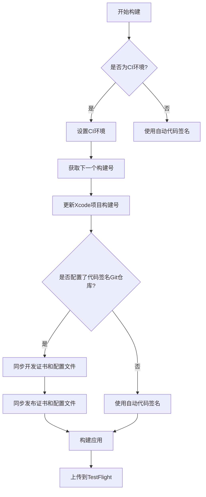

# 部署与发布

<cite>
**本文档引用的文件**  
- [build.gradle](file://App/android/app/build.gradle)
- [gradle.properties](file://App/android/gradle.properties)
- [proguard-rules.pro](file://App/android/app/proguard-rules.pro)
- [Fastfile](file://App/ios/fastlane/Fastfile)
- [Appfile](file://App/ios/fastlane/Appfile)
- [config.xcconfig.sample](file://App/ios/config.xcconfig.sample)
- [Podfile](file://App/ios/Podfile)
- [package.json](file://App/package.json)
</cite>

## 目录
1. [简介](#简介)
2. [Android 构建与发布](#android-构建与发布)
3. [iOS 构建与发布](#ios-构建与发布)
4. [版本号管理](#版本号管理)
5. [应用商店提交流程](#应用商店提交流程)
6. [CI/CD 集成建议](#cicd-集成建议)

## 简介
本文档详细说明了 Inventory 应用在 Android 和 iOS 平台上的生产版本构建与发布流程。文档涵盖了构建配置、自动化工具使用、版本管理以及应用商店提交等关键环节，旨在为开发团队提供完整的部署指导。

## Android 构建与发布

### 构建变体与签名配置
Inventory 应用的 Android 构建配置在 `build.gradle` 文件中定义，支持多种构建变体。项目配置了 `debug` 和 `release` 两种构建类型，其中 `debug` 类型用于开发和测试，`release` 类型用于生产环境发布。

在 `debug` 构建类型中，应用 ID 后缀为 `.dev`，应用名称显示为 "Inventory (Dev)"，并使用独立的调试图标资源。这种配置允许开发版本与生产版本共存于同一设备上，便于测试和调试。

`release` 构建类型配置了代码混淆（ProGuard），通过 `minifyEnabled` 属性启用，并指定了默认的混淆规则文件。代码混淆有助于减小应用体积并提高安全性，防止反向工程。

**Section sources**
- [build.gradle](file://App/android/app/build.gradle#L141-L160)
- [gradle.properties](file://App/android/gradle.properties#L43-L44)

### 签名配置
应用的签名配置在 `signingConfigs` 块中定义。项目使用环境变量来管理签名密钥，确保敏感信息不会硬编码在配置文件中。`debug` 和 `release` 构建类型都支持通过 `INVENTORY_APP_UPLOAD_STORE_FILE` 等环境变量指定自定义的密钥库文件、密码、密钥别名和密钥密码。

这种配置方式提高了安全性，允许在 CI/CD 环境中动态注入签名信息，而无需修改代码库。在本地开发环境中，可以使用默认的调试密钥库进行构建。

**Section sources**
- [build.gradle](file://App/android/app/build.gradle#L119-L139)

### 架构分割
项目配置了 ABI（Application Binary Interface）分割，支持为不同的 CPU 架构生成独立的 APK 文件。通过 `splits.abi` 配置，可以为 armeabi-v7a、x86、arm64-v8a 和 x86_64 架构生成不同的构建产物。每个架构的 APK 文件都有唯一的版本代码，通过在基础版本号上乘以 1000 并加上架构代码来生成。

这种配置可以减小单个 APK 的体积，提高下载效率，但需要在 Google Play 控制台上传多个文件。项目默认禁用此功能，推荐使用 Android App Bundle 格式进行发布。

**Section sources**
- [build.gradle](file://App/android/app/build.gradle#L111-L117)

## iOS 构建与发布

### Fastlane 自动化
Inventory 应用使用 Fastlane 实现 iOS 构建和发布的自动化。Fastlane 配置文件位于 `ios/fastlane` 目录下，包括 `Fastfile` 和 `Appfile`。项目通过 `Gemfile` 管理 Fastlane 依赖，确保团队成员使用相同版本的工具。

Fastlane 配置了两个主要的发布流水线：`nightly` 用于夜间构建，`release` 用于正式版本发布。这两个流水线共享相似的构建逻辑，但针对不同的应用标识符和构建配置。

**Section sources**
- [Fastfile](file://App/ios/fastlane/Fastfile#L37-L235)
- [Gemfile](file://App/ios/Gemfile#L1-L4)

### 构建流程
iOS 的构建流程从读取 `config.xcconfig` 配置文件开始，该文件包含了应用的版本号、应用标识符等关键信息。构建过程首先检查是否存在变更日志文件，并在控制台输出，给开发者机会审查变更内容。

对于 CI 环境，构建流程会自动获取下一个可用的构建号，并更新 Xcode 项目中的构建号。这确保了每个构建都有唯一的标识，便于追踪和管理。项目使用 App Store Connect API 密钥进行身份验证，避免了手动输入 Apple ID 和密码的需求。

**Section sources**
- [Fastfile](file://App/ios/fastlane/Fastfile#L48-L65)
- [config.xcconfig.sample](file://App/ios/config.xcconfig.sample#L33-L34)

### 代码签名管理
Fastlane 配置支持手动和自动代码签名两种模式。当 `SYNC_CODE_SIGNING_GIT_URL` 环境变量存在时，使用手动代码签名，从指定的 Git 仓库同步证书和配置文件。这种模式适合团队协作，确保所有开发者使用相同的签名配置。

在手动代码签名模式下，Fastlane 会同步开发和发布两种类型的配置文件，并相应地更新 Xcode 项目的代码签名设置。对于 CI 环境，配置文件以只读模式同步，确保构建过程的稳定性。



**Diagram sources**
- [Fastfile](file://App/ios/fastlane/Fastfile#L68-L98)
- [Fastfile](file://App/ios/fastlane/Fastfile#L166-L186)

### Appfile 配置
`Appfile` 用于配置 Fastlane 与 App Store Connect 的集成。文件中为不同的发布流水线指定了对应的应用标识符。`nightly` 流水线使用 `PRODUCT_BUNDLE_IDENTIFIER_NIGHTLY`，而 `release` 流水线使用 `PRODUCT_BUNDLE_IDENTIFIER_RELEASE`。

这种配置确保了夜间构建和正式发布使用不同的应用标识符，可以在同一设备上同时安装两个版本，便于测试新功能而不影响生产环境。

**Section sources**
- [Appfile](file://App/ios/fastlane/Appfile#L4-L10)

## 版本号管理

### 版本号结构
Inventory 应用采用语义化版本号（Semantic Versioning）管理版本。版本号由 `MAJOR.MINOR.PATCH` 三部分组成，定义在 `config.xcconfig` 文件的 `MARKETING_VERSION` 属性中。当前版本号为 0.1.2。

除了营销版本号，项目还使用 `CURRENT_PROJECT_VERSION` 作为构建号，这是一个递增的整数，用于标识每次构建。构建号在 CI 环境中自动递增，确保每个构建都有唯一的标识。

**Section sources**
- [config.xcconfig.sample](file://App/ios/config.xcconfig.sample#L33-L34)
- [Fastfile](file://App/ios/fastlane/Fastfile#L48)

### 版本号同步
项目通过脚本和 Fastlane 动作确保 Android 和 iOS 平台的版本号保持同步。在 `build.gradle` 文件中，`versionName` 和 `versionCode` 分别对应版本号和构建号。虽然当前配置中版本号是硬编码的，但建议通过环境变量或配置文件统一管理，确保跨平台一致性。

在发布流程中，应首先更新 `config.xcconfig` 中的版本号，然后触发构建过程。Fastlane 会自动读取这些值并应用于构建过程，确保所有元数据的一致性。

**Section sources**
- [build.gradle](file://App/android/app/build.gradle#L101-L102)

## 应用商店提交流程

### Google Play 提交
对于 Android 平台，推荐使用 Android App Bundle (.aab) 格式提交到 Google Play。可以通过以下命令生成发布版本的 App Bundle：

```bash
cd android && ./gradlew bundleRelease
```

生成的文件位于 `android/app/build/outputs/bundle/release/` 目录下。在 Google Play 控制台中，上传此文件并填写相应的发布信息，包括变更日志、屏幕截图等。

建议使用内部测试或封闭式测试轨道进行初步验证，然后逐步扩大到开放式测试和生产环境。Google Play 的分阶段发布功能允许逐步向用户推送更新，降低风险。

**Section sources**
- [build.gradle](file://App/android/app/build.gradle#L141-L160)

### App Store 提交
对于 iOS 平台，使用 Fastlane 自动化提交到 App Store Connect。`nightly` 和 `release` 两个流水线都包含 `upload_to_testflight` 动作，可以将构建产物上传到 TestFlight 进行测试。

在本地执行发布命令：
```bash
cd ios && fastlane release
```

在 CI 环境中，可以通过设置环境变量来控制构建行为，例如跳过上传到 TestFlight 或指定不同的构建配置。上传成功后，可以在 App Store Connect 中管理测试组，邀请测试人员进行验证。

**Section sources**
- [Fastfile](file://App/ios/fastlane/Fastfile#L137-L233)

## CI/CD 集成建议

### 环境变量管理
项目使用环境变量管理敏感信息和配置选项，如签名密钥、API 密钥等。建议在 CI/CD 系统中安全地存储这些变量，并在构建过程中注入。避免将敏感信息提交到版本控制系统中。

对于代码签名，建议使用 Fastlane Match 或类似的工具集中管理证书和配置文件，确保团队成员和 CI 系统使用相同的签名配置。

**Section sources**
- [build.gradle](file://App/android/app/build.gradle#L125-L138)
- [Fastfile](file://App/ios/fastlane/Fastfile#L68)

### 自动化构建
建议在 CI/CD 系统中配置自动化构建流水线，当代码推送到特定分支（如 `main` 或 `release`）时自动触发构建。流水线应包括以下步骤：
1. 安装依赖
2. 更新版本号和构建号
3. 执行代码质量检查
4. 构建发布版本
5. 运行自动化测试
6. 上传到应用分发平台

通过自动化流水线，可以确保每次发布的构建过程一致，减少人为错误。

**Section sources**
- [Fastfile](file://App/ios/fastlane/Fastfile#L48-L65)
- [package.json](file://App/package.json#L9)

### 构建缓存
为了提高构建效率，建议在 CI/CD 系统中配置构建缓存。对于 iOS 构建，可以缓存 CocoaPods 依赖；对于 Android 构建，可以缓存 Gradle 依赖。Fastlane 支持与 buildcache 等工具集成，进一步优化编译速度。

在 `Podfile` 中，项目已经配置了 bitcode 剥离，这可以减小最终应用的体积，提高构建和分发效率。

**Section sources**
- [Podfile](file://App/ios/Podfile#L78-L89)
- [Podfile](file://App/ios/Podfile#L91-L113)