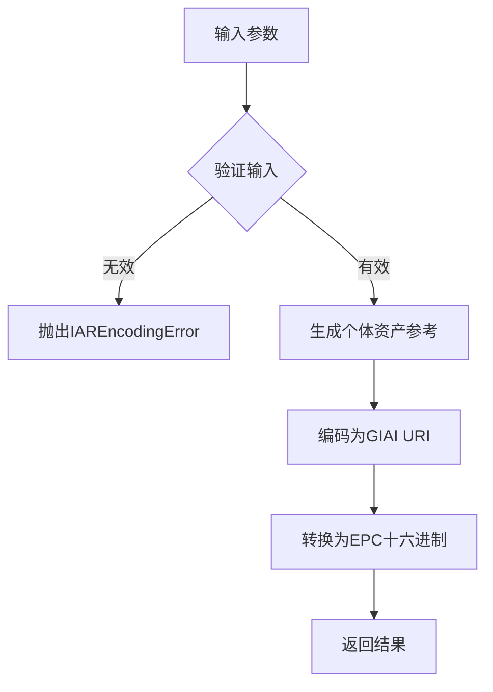

# 术语表

<cite>
**本文档中引用的文件**  
- [App.tsx](file://App/app/App.tsx)
- [store.ts](file://App/app/redux/store.ts)
- [pouchdb.ts](file://App/app/db/pouchdb.ts)
- [sqlite.ts](file://App/app/db/sqlite.ts)
- [EPCUtils.ts](file://packages/epc-utils/lib/EPCUtils.ts)
- [epc-tds.d.ts](file://packages/epc-utils/types/epc-tds.d.ts)
</cite>

## 目录
1. [PouchDB与CouchDB](#pouchdb与couchdb)
2. [RFID技术](#rfid技术)
3. [EPC与TDS标准](#epc与tds标准)
4. [Redux状态管理](#redux状态管理)
5. [SQLite本地存储](#sqlite本地存储)

## PouchDB与CouchDB

PouchDB和CouchDB是本项目中用于数据存储和同步的核心技术。PouchDB是一个运行在客户端的JavaScript数据库，能够与远程CouchDB服务器进行双向同步，确保离线功能和数据一致性。

在本项目中，PouchDB通过SQLite适配器在移动设备上持久化数据，利用`pouchdb-adapter-react-native-sqlite`插件与本地SQLite数据库交互。这种架构允许应用在无网络连接时继续工作，并在网络恢复时自动同步变更。

CouchDB作为远程服务器端数据库，接收来自多个客户端的同步请求。项目中的`data-storage-couchdb`包提供了与CouchDB交互的工具函数，支持数据获取、保存和视图查询等功能。

**Section sources**
- [pouchdb.ts](file://App/app/db/pouchdb.ts#L1-L102)
- [couchdb-utils.ts](file://packages/data-storage-couchdb/lib/functions/couchdb-utils.ts)

## RFID技术

射频识别（RFID）技术是本项目实现库存自动化的关键组件。系统通过UHF RFID读写器扫描标签，获取物品的唯一标识信息。项目集成了原生模块`RFIDWithUHFBLEModule`和`RFIDWithUHFUARTModule`，支持蓝牙和串口连接的RFID设备。

RFID功能主要在`App/features/rfid`模块中实现，包括标签扫描界面、数据解析和状态管理。当设备扫描到RFID标签时，系统会解析其EPC（电子产品代码）并匹配本地数据库中的物品记录，实现快速盘点和定位。

**Section sources**
- [RFIDSheet.tsx](file://App/app/features/rfid/RFIDSheet.tsx)
- [RFIDWithUHFBLEModule.ts](file://App/app/modules/RFIDWithUHFBLEModule.ts)

## EPC与TDS标准

电子产品代码（EPC）是RFID标签的核心标识，遵循GS1标准。本项目主要使用GIAI-96格式的EPC，编码结构为`urn:epc:tag:giai-96:0.<公司前缀>.<资产参考>`。TDS（Tag Data Standard）是由`epc-tds`库实现的EPC编码/解码标准。

项目中的`EPCUtils`工具类提供了完整的EPC处理能力，包括：
- 将个体资产参考（IAR）编码为GIAI URI
- 在EPC十六进制和URI格式之间转换
- 验证编码范围和格式正确性
- 计算过滤器前缀用于批量操作

这些功能在`packages/epc-utils`包中实现，被RFID扫描和标签生成功能广泛使用。

**Diagram sources**
- [EPCUtils.ts](file://packages/epc-utils/lib/EPCUtils.ts#L133-L208)

**Section sources**
- [EPCUtils.ts](file://packages/epc-utils/lib/EPCUtils.ts#L1-L433)
- [epc-tds.d.ts](file://packages/epc-utils/types/epc-tds.d.ts#L1-L8)

## Redux状态管理

Redux是本项目的核心状态管理方案，采用Redux Toolkit和redux-persist实现。状态管理分为多个slice，每个feature目录下的slice.ts文件定义了该功能模块的状态结构、actions和reducers。

关键概念包括：
- **Slice**：将reducer逻辑、actions和初始状态封装在一起的独立单元，如`inventory/slice.ts`
- **Action**：描述状态变化的普通对象，通过dispatch触发，如`profiles/newProfile`
- **Reducer**：纯函数，接收当前状态和action，返回新状态，如`profilesReducer`

状态持久化通过redux-persist实现，确保应用重启后能恢复用户配置和同步状态。

**Section sources**
- [store.ts](file://App/app/redux/store.ts#L1-L124)
- [slice.ts](file://App/app/features/profiles/slice.ts)

## SQLite本地存储

SQLite作为本地持久化存储引擎，为PouchDB提供底层数据支持。在React Native环境中，通过`react-native-quick-websql`库访问SQLite，确保跨平台一致性。

`sqlite.ts`文件提供了管理SQLite数据库的工具函数：
- `getSqliteDbNames`：列出所有数据库文件
- `deleteSqliteDb`：安全删除数据库及其相关索引文件

这些功能支持数据库清理、迁移和调试操作，在应用设置和开发者工具中被调用。

**Section sources**
- [sqlite.ts](file://App/app/db/sqlite.ts#L1-L46)
- [pouchdb.ts](file://App/app/db/pouchdb.ts#L12)